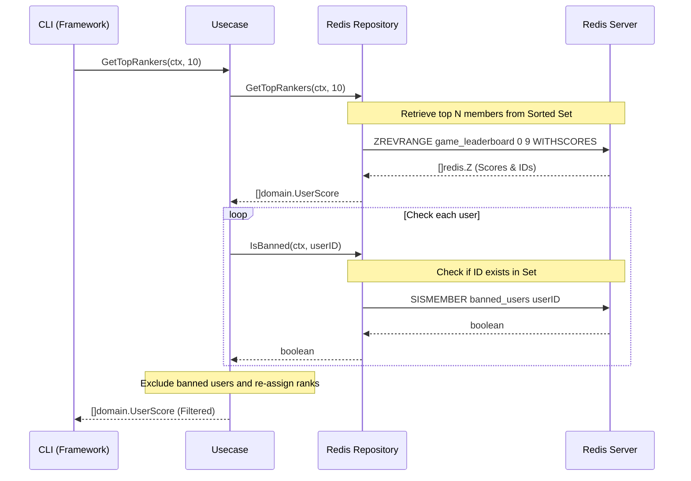

# Redis Workshop: Real-time Game Leaderboard with Sorted Sets

In this workshop, you will build a "Real-time Game Leaderboard System" capable of handling millions of users using Redis's powerful data structure, **Sorted Sets (ZSET)**.

## Goal

Build a leaderboard system with the following features based on **Clean Architecture**.



**What you will learn in this workshop:**

1. **Sorted Sets (ZSET)**: Leveraging automatic sorting based on scores.
2. **Sets**: Efficient management of unique collections (e.g., Ban lists).
3. **Clean Architecture**: Isolating external storage (Redis) details from the domain layer.

---

## Challenges in Real-time Aggregation

Traditionally, managing millions of users' ranks in an RDBMS (SQL) presents significant performance hurdles.

### ❌ Challenges

- **Sorting Cost**: Sorting millions of rows by score is extremely heavy if performed on every write.
- **Lock Contention**: High-frequency score updates lead to lock waits, reducing throughput.
- **Redundant Calculation**: Every time a user checks their rank, a near-full table scan is required.

### ✅ Redis Sorted Sets Solutions

- **In-memory Sorting**: Maintains a sorted state in $O(\log N)$ time upon write, making reads instantaneous.
- **Rich Command Set**: Native commands like "Get Top N" and "Get Rank of Member" are provided.

---

## Architecture

The Go application isolates business logic from the details of Redis.

### Directory Structure

```text
infra/assets/redis_leaderboard/
├── domain/         # Entities and Interfaces
├── usecase/        # Ranking and Ban logic
├── infra/          # Redis Adapter
├── cmd/            # CLI Entry points
├── main.go         # Dependency Injection
└── go.mod
```

---

## Preparation

### 1. Start Redis (Podman/Docker)

```bash
podman run -d --name redis-leaderboard -p 6379:6379 redis:latest
```

### 2. Project Setup

```bash
cd infra/assets/redis_leaderboard
go mod tidy
```

---

## Workshop Steps

### STEP 1: Register Scores (ZADD)

Register or update user scores. Redis automatically re-orders them internally.

```bash
go run main.go add user1 100
go run main.go add user2 250
go run main.go add user3 180
```

### STEP 2: Display Top Rankers (ZREVRANGE)

Retrieve the top N members instantly.

```bash
go run main.go top 3
# Expected output: user2(250), user3(180), user1(100)
```

### STEP 3: Ban Fraudulent Users (Sets)

Add specific users to a Ban list and exclude them from rankings.

```bash
go run main.go ban user2
go run main.go top 3
# Expected result: user2 disappears, and user3 is promoted to 1st place.
```

---

## Clean Architecture Highlights

Business rules (UseCase layer) only know the rule: **"Banned users must not appear in the rankings."**

- **Domain**: Defines the `LeaderboardRepository` interface.
- **Infra**: Implements the interface using `go-redis`.

This configuration ensures that even if you change the storage from Redis to another high-speed database in the future, the core business logic (UseCase) remains untouched.

---

## Cleanup

```bash
podman rm -f redis-leaderboard
```

---

## References

- [Redis Documentation: Sorted Sets](https://redis.io/docs/data-types/sorted-sets/)
- [go-redis Guide](https://redis.uptrace.dev/)
