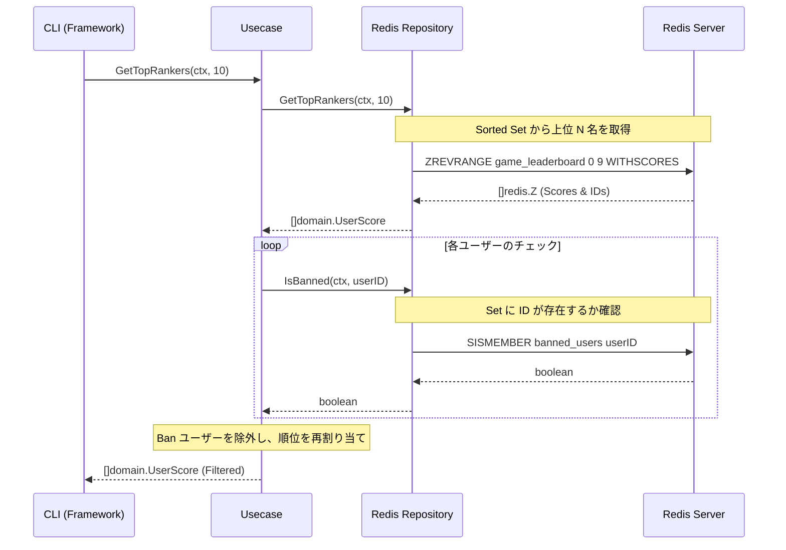

# Redis 実習：Sorted Sets で作るリアルタイム・ゲームランキング

この実習では、Redis の強力なデータ構造である **Sorted Sets (ZSET)** を使用して、数百万人のユーザーにも対応可能な「リアルタイム・ゲームランキングシステム」を構築します。

## ゴール

以下の機能を備えたランキングシステムを **Clean Architecture** に基づいて構築します。



**この実習で習得すること:**

1. **Sorted Sets (ZSET)**: スコアに基づいた自動ソート機能の活用。
2. **Sets**: 重複のない集合（Ban リスト等）の効率的な管理。
3. **Clean Architecture**: 外部ストレージ（Redis）の詳細をドメイン層から分離。

---

## リアルタイム集計の課題

従来、数百万人のユーザーの順位を RDBMS (SQL) で管理しようとすると、パフォーマンスが大きな壁となります。

### ❌ 課題

- **ソートコスト**: 数百万行のデータをスコア順に並び替える処理は、書き込みのたびに行うと極めて重い。
- **ロック競合**: 高頻度なスコア更新が発生すると、DB のロック待ちが発生しスループットが低下する。
- **計算の重複**: 各ユーザーが自分の順位を知るために、毎回全件スキャンに近い処理が必要になる。

### ✅ Redis Sorted Sets の解決策

- **インメモリ・ソート**: 書き込み時に $O(\log N)$ でソート済みの状態を維持するため、読み取りは一瞬。
- **豊富なコマンド**: 「上位 N 名の取得」や「特定ユーザーの順位取得」が専用コマンドで提供されている。

---

## アーキテクチャ

Go アプリケーションは、ビジネスロジックを Redis の詳細から独立させています。

### 想定ディレクトリ構造

```text
infra/assets/redis_leaderboard/
├── domain/         # エンティティとインターフェース
├── usecase/        # ランキング・Banロジック
├── infra/          # Redis アダプター
├── cmd/            # CLI エントリーポイント
├── main.go         # 依存注入
└── go.mod
```

---

## 準備

### 1. Redis の起動 (Podman/Docker)

```bash
podman run -d --name redis-leaderboard -p 6379:6379 redis:latest
```

### 2. プロジェクトのセットアップ

```bash
cd infra/assets/redis_leaderboard
go mod tidy
```

---

## 実習ステップ

### STEP 1: スコアの登録 (ZADD)

ユーザーのスコアを登録・更新します。Redis 内部で自動的に順序が入れ替わります。

```bash
go run main.go add user1 100
go run main.go add user2 250
go run main.go add user3 180
```

### STEP 2: トップランカーの表示 (ZREVRANGE)

上位 N 名を即座に取得します。

```bash
go run main.go top 3
# 期待される結果: user2(250), user3(180), user1(100)
```

### STEP 3: 不正ユーザーの Ban (Sets)

特定のユーザーを Ban リストに追加し、ランキングから除外します。

```bash
go run main.go ban user2
go run main.go top 3
# 期待される結果: user2 が消え、user3 が 1 位に繰り上がる
```

---

## Clean Architecture のポイント

ビジネスルール（Usecase 層）は、**「Ban されているユーザーはランキングに表示しない」**というルールのみを知っています。

- **Domain**: `LeaderboardRepository` インターフェースを定義。
- **Infra**: `go-redis` を使ってインターフェースを実装。

この構成により、将来的にランキングの保存先を Redis から別の高速な DB に変更しても、ビジネスロジック（Usecase）を一切修正せずに済みます。

---

## 片付け

```bash
podman rm -f redis-leaderboard
```

---

## 参考文献

- [Redis Documentation: Sorted Sets](https://redis.io/docs/data-types/sorted-sets/)
- [go-redis Guide](https://redis.uptrace.dev/)
