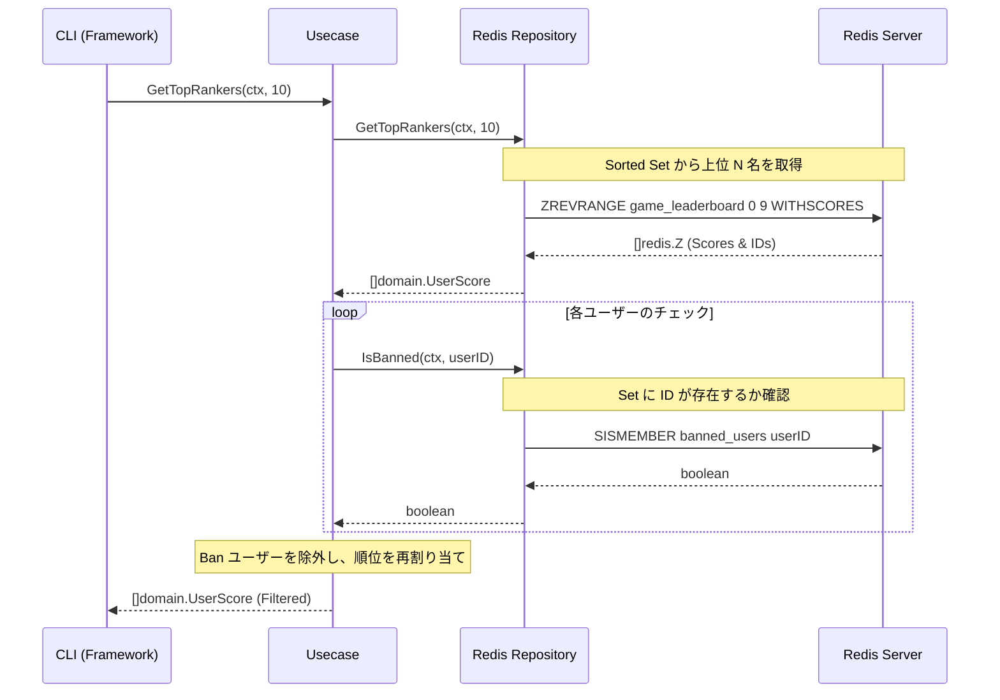

# Redis 実習：Sorted Sets で作るリアルタイム・ゲームランキング

この実習では、Redis の強力なデータ構造である **Sorted Sets (ZSET)** を使用して、数百万人のユーザーにも対応可能な「リアルタイム・ゲームランキングシステム」を構築します。

> **💡 用語集**: この実習で登場する[Sorted Set (ZSET)](glossary_ja.md#cache)や[Sets](glossary_ja.md#cache)などの専門用語は [用語集](glossary_ja.md) を参照してください。

## ゴール

以下の機能を備えたランキングシステムを **クリーンアーキテクチャ** に基づいて構築します。



**この実習で習得すること:**

1. **Sorted Sets (ZSET)**: スコアに基づいた自動ソート機能の活用。
2. **Sets**: 重複のない集合（Ban リスト等）の効率的な管理。
3. **Clean Architecture**: 外部ストレージ（Redis）の詳細をドメイン層から分離。

---

## リアルタイム集計の課題

従来、数百万人のユーザーの順位を RDBMS (SQL) で管理しようとすると、パフォーマンスが大きな壁となります。

### ❌ 課題

- **ソートコスト**: 数百万行のデータをスコア順に並び替える処理は、書き込みのたびに行うと極めて重い。
- **ロック競合**: 高頻度なスコア更新が発生すると、DB のロック待ちが発生しスループットが低下する。
- **計算の重複**: 各ユーザーが自分の順位を知るために、毎回全件スキャンに近い処理が必要になる。

### ✅ Redis Sorted Sets の解決策

- **インメモリ・ソート**: 書き込み時に $O(\log N)$ でソート済みの状態を維持するため、読み取りは一瞬。
- **豊富なコマンド**: 「上位 N 名の取得」や「特定ユーザーの順位取得」が専用コマンドで提供されている。

---

## アーキテクチャ

Go アプリケーションは、ビジネスロジックを Redis の詳細から独立させています。

### 想定ディレクトリ構造

```text
infra/assets/redis_leaderboard/
├── domain/         # エンティティとインターフェース
├── usecase/        # ランキング・Banロジック
├── infra/          # Redis アダプター
├── main.go         # エントリーポイント & 依存注入
└── go.mod
```

---

## 準備

### 1. Redis の起動 (Podman)

Makefile を使用する場合（推奨）:

```bash
make redis-up
```

podman を直接使用する場合:

```bash
podman run -d --name workshop-redis -p 6379:6379 docker.io/library/redis:alpine
```

### 2. プロジェクトのセットアップ

```bash
cd infra/assets/redis_leaderboard
go mod tidy
```

### ✅ チェックポイント

- [ ] `podman ps` で `workshop-redis` が `Up` 状態であることを確認した
- [ ] `redis-cli ping`（インストール済みの場合）または `podman exec workshop-redis redis-cli ping` で `PONG` が返ることを確認した

---

## 実習ステップ

### STEP 1: スコアの登録 (ZADD)

ユーザーのスコアを登録・更新します。Redis 内部で自動的に順序が入れ替わります。

```bash
go run main.go -action add -user user1 -score 100
go run main.go -action add -user user2 -score 250
go run main.go -action add -user user3 -score 180
```

### STEP 2: トップランカーの表示 (ZREVRANGE)

上位 N 名を即座に取得します。

```bash
go run main.go -action top -n 3
# 期待される結果: user2(250), user3(180), user1(100)
```

### STEP 3: 不正ユーザーの Ban (Sets)

特定のユーザーを Ban リストに追加し、ランキングから除外します。

```bash
go run main.go -action ban -user user2
go run main.go -action top -n 3
# 期待される結果: user2 が消え、user3 が 1 位に繰り上がる
```

---

## クリーンアーキテクチャのポイント

ビジネスルール（Usecase 層）は、**「Ban されているユーザーはランキングに表示しない」**というルールのみを知っています。

- **Domain**: `LeaderboardRepository` インターフェースを定義。
- **Infra**: `go-redis` を使ってインターフェースを実装。

この構成により、将来的にランキングの保存先を Redis から別の高速な DB に変更しても、ビジネスロジック（Usecase）を一切修正せずに済みます。

---

## 片付け

Makefile を使用する場合（推奨）:

```bash
make redis-down
```

podman を直接使用する場合:

```bash
podman stop workshop-redis
podman rm workshop-redis
```

---

## 参考文献

- [Redis Documentation: Sorted Sets](https://redis.io/docs/data-types/sorted-sets/)
- [go-redis Guide](https://redis.uptrace.dev/)

---

## トラブルシューティング

### Redis に接続できない

**症状**: `dial tcp: connection refused`

**原因と対処**:

- Redis コンテナが起動しているか確認

    ```bash
    podman ps | grep redis
    # または
    make redis-status  # Makefile に定義されている場合
    ```

- ポート 6379 が正しく公開されているか確認

    ```bash
    podman port workshop-redis
    # 6379/tcp -> 0.0.0.0:6379 と表示されるはず
    ```

### プログラムがパニックになる

**症状**: `runtime error: invalid memory address`

**原因と対処**:

- Redis サーバーが起動していない状態でプログラムを実行

    ```bash
    # 先に Redis を起動
    make redis-up
    # または
    podman start workshop-redis
    ```

### スコアが正しく反映されない

**症状**: ランキングに追加したユーザーが表示されない

**原因と対処**:

- Redis 内のデータを直接確認

    ```bash
    podman exec -it workshop-redis redis-cli
    > ZREVRANGE game_leaderboard 0 -1 WITHSCORES
    ```

- Ban リストを確認

    ```bash
    > SMEMBERS banned_users
    ```

---

## 環境別注意事項

### macOS の場合

Podman は動作しますが、Homebrew で Redis を直接インストールすることも可能です。

```bash
brew install redis
brew services start redis
```

この場合、コード内の接続先を `localhost:6379` に変更してください。

### Windows の場合

- WSL2 上の Ubuntu で Podman を使用することを推奨
- または Docker Desktop for Windows でも同じコマンドが動作します（`podman` → `docker` に置き換え）
