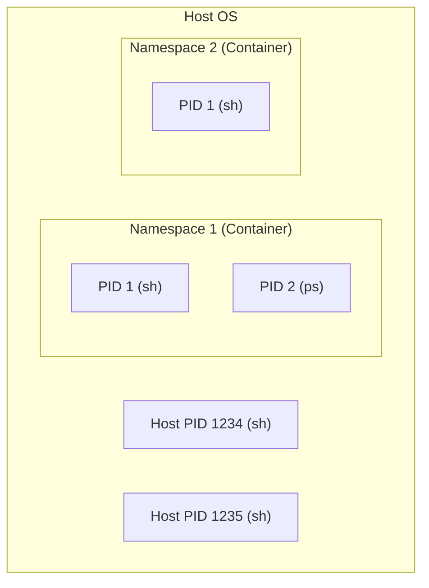

# Container Runtime Workshop: Understanding Containers through Namespaces and Cgroups

In this workshop, you will learn how containers are built and restricted by manually manipulating Linux's standard features: **namespaces** and **cgroups**. Finally, you will create your own container runtime using the Go language.

## Goal

Demystify the "magic" of containers and implement process isolation by combining low-layer technologies (namespaces, resource limits, and virtual networking).



**What you will learn in this workshop:**

1. **Isolation via Namespaces**: Separating PID, Mount, and Network spaces.
2. **Resource Control via Cgroups**: Limiting CPU and memory usage.
3. **Networking via veth**: Establishing communication between an isolated space and the host.
4. **Implementation in Go**: Coding the container startup process using system calls.

---

## Challenges in Process Isolation

Traditionally, running multiple applications on a single OS led to interference between them.

### ❌ Challenges

- **Resource Contention**: One app exhausting memory can crash the entire system.
- **Security Risks**: Apps could peek into other processes or files.
- **Dependency Conflicts**: App A needing library v1 and App B needing v2 could not easily coexist.

### ✅ Container (Namespace & Cgroup) Solutions

- **Namespace**: Makes a process feel like it has its own dedicated OS by isolating its view.
- **Cgroup**: Physically limits the maximum resources a process can consume.
- **rootfs**: Provides a unique filesystem for each process, encapsulating dependencies.

---

## Architecture

We will directly call Linux kernel features to dynamically reconstruct the execution environment of a process.

### Directory Structure

```text
~/container-handson/
├── rootfs/           # Container root directory (Alpine)
├── rootfs.tar        # Exported image before extraction
├── main.go           # Source code for your custom runtime
└── mycontainer       # Compiled binary
```

---

## Preparation

### 1. Prerequisites

- **OS:** Linux (Ubuntu 24.04 recommended)
- **Permissions:** `sudo` privileges
- **Tools:** Podman (for rootfs extraction), Go

```bash
sudo apt update && sudo apt install -y podman golang-go iproute2
```

---

## Workshop Steps

### STEP 1: Prepare the Root Filesystem (rootfs)

Prepare the "insides" of the container.

```bash
mkdir -p ~/container-handson && cd ~/container-handson
podman pull alpine:latest
podman create --name tmp-alpine alpine:latest
podman export tmp-alpine > rootfs.tar
podman rm tmp-alpine
mkdir -p rootfs && tar -xf rootfs.tar -C rootfs
cp /etc/resolv.conf rootfs/etc/resolv.conf
```

### STEP 2: Isolation with Namespaces

Experience manual isolation using the `unshare` command.

1. **PID Namespace**: `sudo unshare --pid --fork /bin/sh`
   - Verify that `echo $$` outputs PID 1.
2. **Mount Namespace and chroot**:

   ```bash
   sudo unshare --pid --fork --mount /bin/sh
   chroot rootfs /bin/sh
   mount -t proc proc /proc
   ps # Only processes inside the container are visible
   ```

### STEP 3: Apply Resource Control (Cgroups v2)

Limit memory to 50MB and confirm that the process is killed when exceeded.

```bash
# Create cgroup
sudo mkdir -p /sys/fs/cgroup/workshop
echo 52428800 | sudo tee /sys/fs/cgroup/workshop/memory.max
echo 0 | sudo tee /sys/fs/cgroup/workshop/memory.swap.max

# Register process (Write the PID identified in another terminal)
echo $TARGET_PID | sudo tee /sys/fs/cgroup/workshop/cgroup.procs
```

### STEP 4: Network Connection via Virtual Ethernet (veth)

Connect the host and the namespace with a virtual LAN cable.

```bash
sudo ip netns add container1
sudo ip link add veth-host type veth peer name veth-child
sudo ip link set veth-child netns container1
# Host side IP setup
sudo ip addr add 10.0.0.1/24 dev veth-host
sudo ip link set veth-host up
```

### STEP 5: Implement Container in Go

Automate the previous operations using the `syscall` package (see `main.go` for details).

```go
cmd.SysProcAttr = &syscall.SysProcAttr{
    Cloneflags: syscall.CLONE_NEWUTS | syscall.CLONE_NEWPID | syscall.CLONE_NEWNS | syscall.CLONE_NEWNET,
}
```

---

## Summary

1. Containers are "restricted processes" realized through a combination of Linux kernel features.
2. **Namespaces** control the "view" and **Cgroups** control the "resources."
3. Understanding low-layer mechanisms leads to a deeper grasp of Docker and Kubernetes behavior.

---

## References

- [Linux manual page: namespaces(7)](https://man7.org/linux/man-pages/man7/namespaces.7.html)
- [Control Groups v2 (Official Kernel Docs)](https://www.kernel.org/doc/html/latest/admin-guide/cgroup-v2.html)
