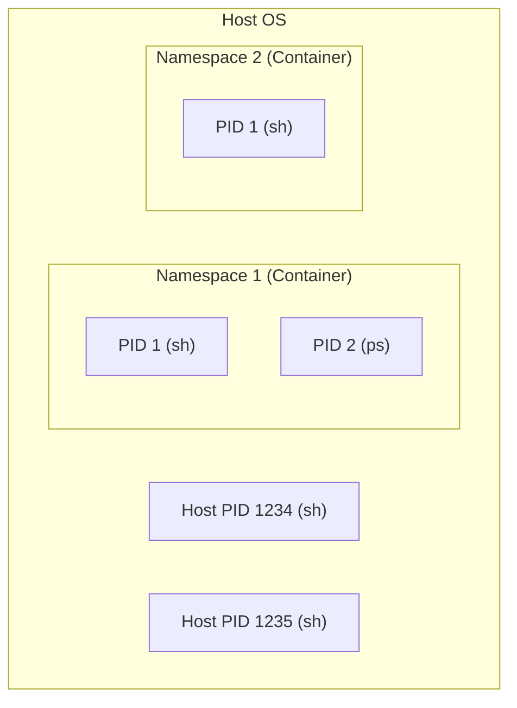

# コンテナランタイム実習：namespaces と cgroups で理解するコンテナの正体

このワークショップでは、Linux の標準機能である **namespaces** と **cgroups** を手動で操作し、コンテナがどのように構築・制限されているかを学びます。最終的に、Go 言語を使用して独自のコンテナランタイムを作成します。

## ゴール

コンテナの「魔法」を解き明かし、低レイヤー技術（名前空間、リソース制限、仮想ネットワーク）の組み合わせによるプロセス隔離を実装・理解します。



**この実習で習得すること:**

1. **namespaces による隔離**: PID, Mount, Network 空間の分離。
2. **cgroups によるリソース制御**: CPU やメモリ使用量の制限。
3. **veth によるネットワーク接続**: 隔離空間とホスト間の通信確立。
4. **Go による実装**: システムコールを用いたコンテナ起動プロセスのコード化。

---

## プロセス隔離の課題

従来、1 つの OS 上で複数のアプリケーションを動かす際、それらが互いに干渉し合うことが問題でした。

### ❌ 課題

- **リソースの奪い合い**: 1 つのアプリがメモリを使い果たすと、システム全体が停止する。
- **セキュリティ**: あるアプリが別のアプリのファイルやプロセスを覗き見ることができてしまう。
- **依存関係の衝突**: アプリ A はライブラリ v1 を、アプリ B は v2 を必要とする場合、共存が難しい。

### ✅ コンテナ（Namespace & Cgroup）の解決策

- **Namespace**: プロセスごとに「専用の OS」があるかのように見せかけ、視界を隔離。
- **Cgroup**: プロセスが使えるリソースの上限を物理的に制限。
- **rootfs**: プロセスごとに独自のファイルシステムを提供し、依存関係を完結。

---

## アーキテクチャ

Linux カーネルの機能を直接呼び出し、プロセスの実行環境を動的に作り替えます。

### 想定ディレクトリ構造

```text
~/container-handson/
├── rootfs/           # コンテナのルートディレクトリ (Alpine)
├── rootfs.tar        # 展開前のイメージ
├── main.go           # 自作ランタイムのソースコード
└── mycontainer       # ビルドされたバイナリ
```

---

## 準備

### 1. 前提条件

- **OS:** Linux (Ubuntu 24.04 推奨)
- **権限:** `sudo` 権限
- **ツール:** Podman (rootfs 抽出用), Go

```bash
sudo apt update && sudo apt install -y podman golang-go iproute2
```

---

## 実習ステップ

### STEP 1: ルートファイルシステム (rootfs) の準備

コンテナの「中身」を用意します。

```bash
mkdir -p ~/container-handson && cd ~/container-handson
podman pull alpine:latest
podman create --name tmp-alpine alpine:latest
podman export tmp-alpine > rootfs.tar
podman rm tmp-alpine
mkdir -p rootfs && tar -xf rootfs.tar -C rootfs
cp /etc/resolv.conf rootfs/etc/resolv.conf
```

### STEP 2: 名前空間 (Namespaces) による隔離

`unshare` コマンドで手動隔離を体験します。

1. **PID 名前空間**: `sudo unshare --pid --fork /bin/sh`
   - `echo $$` で PID が 1 になることを確認。
2. **Mount 名前空間と chroot**:

   ```bash
   sudo unshare --pid --fork --mount /bin/sh
   chroot rootfs /bin/sh
   mount -t proc proc /proc
   ps # コンテナ内のプロセスだけが見える
   ```

### STEP 3: リソース制限 (Cgroups v2) の適用

メモリを 50MB に制限し、超過時にプロセスが Kill されることを確認します。

```bash
# cgroup 作成
sudo mkdir -p /sys/fs/cgroup/workshop
echo 52428800 | sudo tee /sys/fs/cgroup/workshop/memory.max
echo 0 | sudo tee /sys/fs/cgroup/workshop/memory.swap.max

# プロセスの登録 (別ターミナルで特定した PID を書き込む)
echo $TARGET_PID | sudo tee /sys/fs/cgroup/workshop/cgroup.procs
```

### STEP 4: 仮想イーサネット (veth) による通信

ホストと名前空間を仮想 LAN ケーブルで繋ぎます。

```bash
sudo ip netns add container1
sudo ip link add veth-host type veth peer name veth-child
sudo ip link set veth-child netns container1
# ホスト側 IP 設定
sudo ip addr add 10.0.0.1/24 dev veth-host
sudo ip link set veth-host up
```

### STEP 5: Go 言語によるランタイムの実装

`syscall` パッケージを使用して、これまでの操作をプログラム化します（詳細は `main.go` 参照）。

```go
cmd.SysProcAttr = &syscall.SysProcAttr{
    Cloneflags: syscall.CLONE_NEWUTS | syscall.CLONE_NEWPID | syscall.CLONE_NEWNS | syscall.CLONE_NEWNET,
}
```

---

## まとめ

1. コンテナは Linux カーネル機能の組み合わせでできた「制限されたプロセス」です。
2. **Namespace** で「視界」を、**Cgroup** で「資源」を制御します。
3. 低レイヤーの仕組みを知ることで、Docker や K8s の挙動を深く理解できます。

---

## 参考文献

- [Linux manual page: namespaces(7)](https://man7.org/linux/man-pages/man7/namespaces.7.html)
- [Control Groups v2 (Official Kernel Docs)](https://www.kernel.org/doc/html/latest/admin-guide/cgroup-v2.html)
