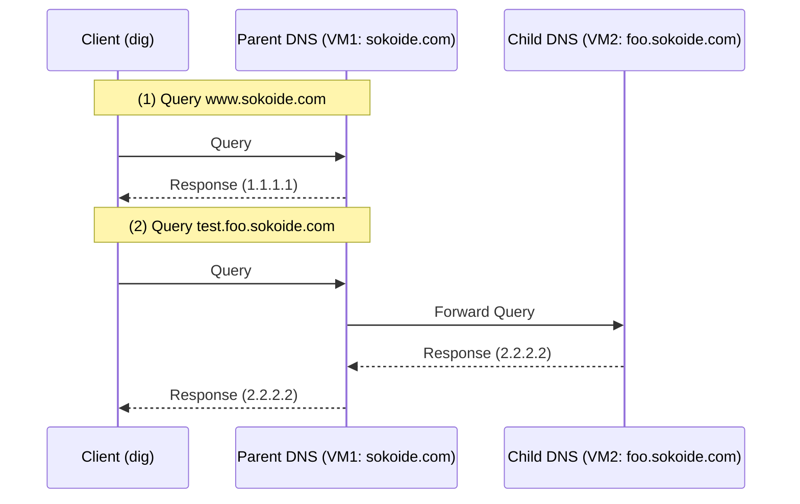

# CoreDNS Workshop: Understanding Name Resolution by Building Parent-Child DNS Servers

This workshop is for software engineers to learn the basic mechanisms of DNS (Authoritative Servers, Forwarding, Delegation) by actually building them using **CoreDNS**.

## Goal

Build the following DNS configuration with a parent-child relationship and understand the flow of name resolution.



**What you will learn in this workshop:**

1. **Authoritative DNS Server:** Building a server that knows the correct answer for a specific domain (zone).
2. **Forwarding:** A mechanism to forward queries for domains you do not manage to another server.
3. **Building Zone Hierarchy:** Coordination between parent and subdomains.

---

## Why CoreDNS?

Traditional DNS servers (like BIND) were complex to configure and difficult to adapt to dynamic environments.

- **Plugin-based**: Extend functionality by simply listing plugins in a configuration file (Corefile).
- **Cloud Native**: Adopted as the standard DNS for Kubernetes; lightweight and fast.
- **Single Binary**: Written in Go, making installation extremely simple.

---

## Architecture

Using two VMs, we will build the parent and child zones physically separated.

### Layer Structure and Directory

```text
~/
├── coredns_parent/ (VM1)
│   ├── Corefile          # Parent DNS configuration
│   └── db.sokoide.com    # Record definitions for sokoide.com
└── coredns_child/  (VM2)
    ├── Corefile          # Child DNS configuration
    └── db.foo.sokoide.com # Record definitions for foo.sokoide.com
```

---

## Preparation

### 1. VM Provisioning

- **VM1 (Parent):** IP `192.168.100.10` (Assumed)
- **VM2 (Child):** IP `192.168.100.20` (Assumed)
- *Note:* If your IP addresses are different, please replace them accordingly.

### 2. Tool Installation (Both VMs)

```bash
sudo apt update && sudo apt install -y curl tar dnsutils
```

---

## Workshop Steps

### STEP 1: Install CoreDNS

**Execute on both VM1 and VM2:**

```bash
# Download CoreDNS
CORE_VERSION="1.13.2"
curl -L "https://github.com/coredns/coredns/releases/download/v${CORE_VERSION}/coredns_${CORE_VERSION}_linux_amd64.tgz" -o coredns.tgz

# Extract and place
tar -xzvf coredns.tgz
sudo mv coredns /usr/local/bin/

# Verify operation
coredns -version
```

### STEP 2: Build VM1 (Parent): sokoide.com

VM1 manages the parent domain `sokoide.com` and forwards queries for `foo.sokoide.com` to VM2.

**Execute on VM1:**

1. Create configuration file

    ```bash
    mkdir -p ~/coredns_parent && cd ~/coredns_parent
    cat <<'EOF' > Corefile
    sokoide.com:10053 {
        file db.sokoide.com
        log
        errors
    }

    foo.sokoide.com:10053 {
        # Forward child domain queries to VM2
        forward . 192.168.100.20:10053
        log
        errors
    }
    EOF
    ```

2. Create zone file

    ```bash
    cat <<'EOF' > db.sokoide.com
    $ORIGIN sokoide.com.
    $TTL 3600
    @   IN  SOA  ns.sokoide.com. root.sokoide.com. (
            2024010101 7200 3600 1209600 3600 )

    @   IN  NS   ns.sokoide.com.
    ns  IN  A    192.168.100.10
    www IN  A    1.1.1.1
    EOF
    ```

### STEP 3: Build VM2 (Child): foo.sokoide.com

VM2 holds the authoritative data for the subdomain `foo.sokoide.com`.

**Execute on VM2:**

1. Create configuration file

    ```bash
    mkdir -p ~/coredns_child && cd ~/coredns_child
    cat <<'EOF' > Corefile
    foo.sokoide.com:10053 {
        file db.foo.sokoide.com
        log
        errors
    }
    EOF
    ```

2. Create zone file

    ```bash
    cat <<'EOF' > db.foo.sokoide.com
    $ORIGIN foo.sokoide.com.
    $TTL 3600
    @   IN  SOA  ns1.foo.sokoide.com. root.foo.sokoide.com. (
            2024010101 7200 3600 1209600 3600 )

    @   IN  NS   ns1.foo.sokoide.com.
    ns1  IN  A    192.168.100.20
    test IN  A    2.2.2.2
    EOF
    ```

### STEP 4: Start DNS Servers

**Execute on both VM1 and VM2:**

```bash
# Navigate to each directory and start
# sudo may not be required for port 10053
coredns -conf Corefile
```

*Note: Keep it running to check the logs.*

### STEP 5: Verify Operation (dig)

Query from another terminal.

1. **Direct Resolution**: Query `www.sokoide.com` to the parent server

   ```bash
   dig @192.168.100.10 -p 10053 www.sokoide.com +short
   # -> 1.1.1.1
   ```

2. **Forwarded Resolution**: Query `test.foo.sokoide.com` to the parent server

   ```bash
   dig @192.168.100.10 -p 10053 test.foo.sokoide.com
   ```

   **Result Check**: If `2.2.2.2` appears in the `ANSWER SECTION` and the `SERVER` is `192.168.100.10`, it confirms the parent "proxy-fetched" the answer from the child.

---

## Cleanup

1. Stop CoreDNS with `Ctrl+C`.
2. Delete working directories.

   ```bash
   rm -rf ~/coredns_parent ~/coredns_child
   ```

---

## Next Steps

We used **Forwarding** this time, but the basis of DNS on the Internet is **Delegation**.
In delegation, the parent does not fetch the answer on behalf of the client but instead gives an instruction (returning NS records) to the client: "Ask that server next."

You can test delegation behavior by adding the child's NS records to the parent's `db.sokoide.com` and removing the `forward` plugin from the Corefile.

---

## References

- [CoreDNS Official Documentation](https://coredns.io/docs/)
- [RFC 1034 - Domain Names - Concepts and Facilities](https://tools.ietf.org/html/rfc1034)
