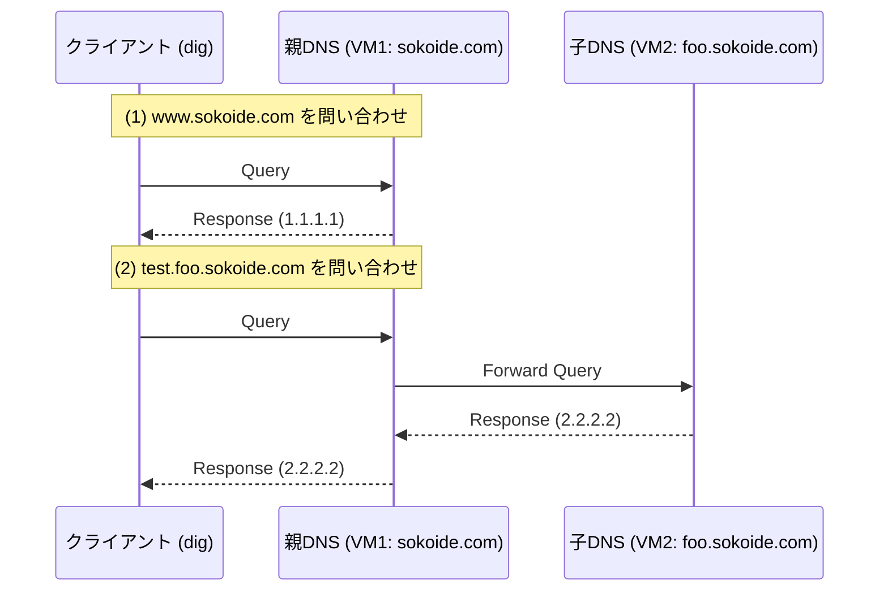

# CoreDNS 実習：親子 DNS サーバーを構築して名前解決を理解する

ソフトウェアエンジニア向けに、DNS の基本的な仕組み（権威サーバー、フォワーディング、委譲）を、**CoreDNS** を使って実際に構築しながら学びます。

## ゴール

以下の親子関係を持つ DNS 構成を構築し、名前解決の流れを理解します。



**この実習で習得すること:**

1. **権威 DNS サーバー (Authoritative Server):** 特定のドメイン（ゾーン）の正解を知っているサーバーの構築。
2. **フォワーディング (Forwarding):** 自分が管理していないドメインの問い合わせを他者へ転送する仕組み。
3. **ゾーン階層の構築:** 親ドメインとサブドメインの連携。

---

## なぜ CoreDNS なのか？

従来の DNS サーバー（BIND など）は設定が複雑で、動的な環境への対応が困難でした。

- **プラグイン方式**: 設定ファイル（Corefile）にプラグインを並べるだけで機能を拡張可能。
- **クラウドネイティブ**: Kubernetes の標準 DNS としても採用されており、軽量かつ高速。
- **単一バイナリ**: Go 言語で書かれており、インストールが非常に簡単。

---

## アーキテクチャ

2 台の VM を使用し、親ゾーンと子ゾーンを物理的に分けて構築します。

### レイヤー構造とディレクトリ

```text
~/
├── coredns_parent/ (VM1)
│   ├── Corefile          # 親DNSの設定
│   └── db.sokoide.com    # sokoide.com のレコード定義
└── coredns_child/  (VM2)
    ├── Corefile          # 子DNSの設定
    └── db.foo.sokoide.com # foo.sokoide.com のレコード定義
```

---

## 準備

### 1. VM の用意

- **VM1 (Parent):** IP `192.168.100.10` (想定)
- **VM2 (Child):** IP `192.168.100.20` (想定)
- ※ IP アドレスが異なる場合は、適宜読み替えてください。

### 2. ツールインストール (両方の VM)

```bash
sudo apt update && sudo apt install -y curl tar dnsutils
```

---

## 実習ステップ

### STEP 1: CoreDNS のインストール

**VM1, VM2 両方で実行:**

```bash
# CoreDNS のダウンロード
CORE_VERSION="1.13.2"
curl -L "https://github.com/coredns/coredns/releases/download/v${CORE_VERSION}/coredns_${CORE_VERSION}_linux_amd64.tgz" -o coredns.tgz

# 展開と配置
tar -xzvf coredns.tgz
sudo mv coredns /usr/local/bin/

# 動作確認
coredns -version
```

### STEP 2: VM1 (親) の構築: sokoide.com

VM1 は親ドメイン `sokoide.com` を管理し、`foo.sokoide.com` 宛の問い合わせを VM2 へ転送します。

**VM1 で実行:**

1. 設定ファイルの作成

    ```bash
    mkdir -p ~/coredns_parent && cd ~/coredns_parent
    cat <<'EOF' > Corefile
    sokoide.com:10053 {
        file db.sokoide.com
        log
        errors
    }

    foo.sokoide.com:10053 {
        # 子ドメインの問い合わせを VM2 へ転送
        forward . 192.168.100.20:10053
        log
        errors
    }
    EOF
    ```

2. ゾーンファイルの作成

    ```bash
    cat <<'EOF' > db.sokoide.com
    $ORIGIN sokoide.com.
    $TTL 3600
    @   IN  SOA  ns.sokoide.com. root.sokoide.com. (
            2024010101 7200 3600 1209600 3600 )

    @   IN  NS   ns.sokoide.com.
    ns  IN  A    192.168.100.10
    www IN  A    1.1.1.1
    EOF
    ```

### STEP 3: VM2 (子) の構築: foo.sokoide.com

VM2 はサブドメイン `foo.sokoide.com` の正解データを持ちます。

**VM2 で実行:**

1. 設定ファイルの作成

    ```bash
    mkdir -p ~/coredns_child && cd ~/coredns_child
    cat <<'EOF' > Corefile
    foo.sokoide.com:10053 {
        file db.foo.sokoide.com
        log
        errors
    }
    EOF
    ```

2. ゾーンファイルの作成

    ```bash
    cat <<'EOF' > db.foo.sokoide.com
    $ORIGIN foo.sokoide.com.
    $TTL 3600
    @   IN  SOA  ns1.foo.sokoide.com. root.foo.sokoide.com. (
            2024010101 7200 3600 1209600 3600 )

    @   IN  NS   ns1.foo.sokoide.com.
    ns1  IN  A    192.168.100.20
    test IN  A    2.2.2.2
    EOF
    ```

### STEP 4: DNS サーバーの起動

**VM1, VM2 それぞれで実行:**

```bash
# 各ディレクトリに移動して起動
# ポート10053を使用するため sudo は不要な場合があります
coredns -conf Corefile
```

※ 起動したままにしてログを確認してください。

### STEP 5: 動作確認 (dig)

別の端末から問い合わせを投げます。

1. **直接解決**: 親サーバーに `www.sokoide.com` を聞く

   ```bash
   dig @192.168.100.10 -p 10053 www.sokoide.com +short
   # -> 1.1.1.1
   ```

2. **転送解決**: 親サーバーに `test.foo.sokoide.com` を聞く

   ```bash
   dig @192.168.100.10 -p 10053 test.foo.sokoide.com
   ```

   **結果の確認**: `ANSWER SECTION` に `2.2.2.2` が表示され、`SERVER` が `192.168.100.10` になっていれば、親が子から答えを「代行取得」したことがわかります。

---

## 片付け

1. `Ctrl+C` で CoreDNS を停止します。
2. 作業ディレクトリを削除します。

   ```bash
   rm -rf ~/coredns_parent ~/coredns_child
   ```

---

## 次のステップ

今回は **フォワーディング (Forwarding)** を使いましたが、インターネットの基本は **委譲 (Delegation)** です。
委譲では、親が答えを代行取得するのではなく、「次はあいつに聞いてくれ」とクライアントに指示（NS レコードの返却）を出します。

親の `db.sokoide.com` に子の NS レコードを記述し、Corefile の `forward` プラグインを外すことで、委譲の挙動を試すことができます。

---

## 参考文献

- [CoreDNS Official Documentation](https://coredns.io/docs/)
- [RFC 1034 - Domain Names - Concepts and Facilities](https://tools.ietf.org/html/rfc1034)
