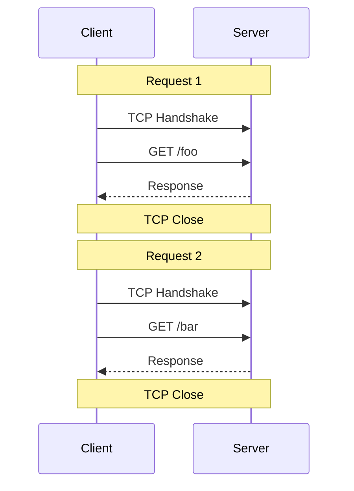
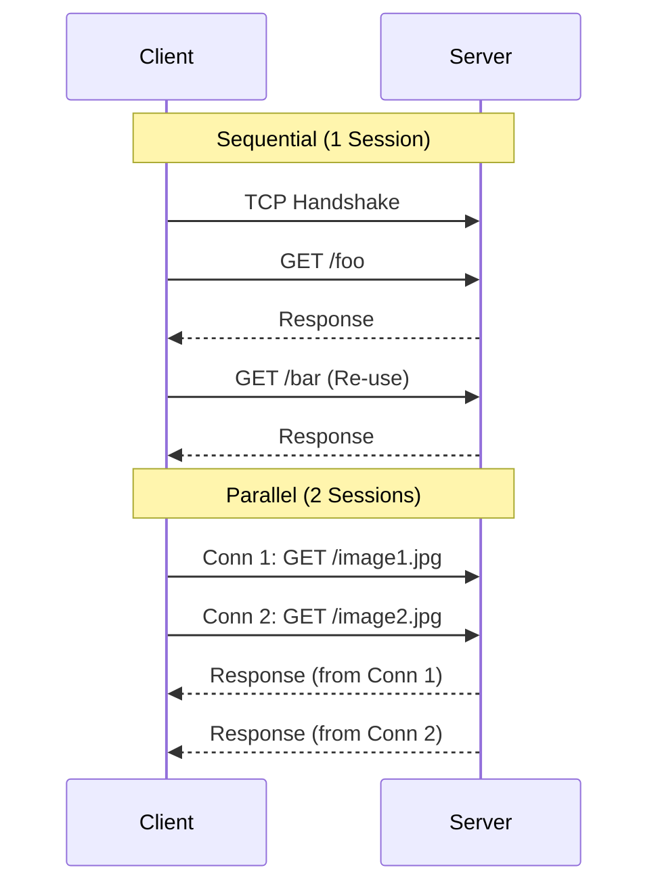
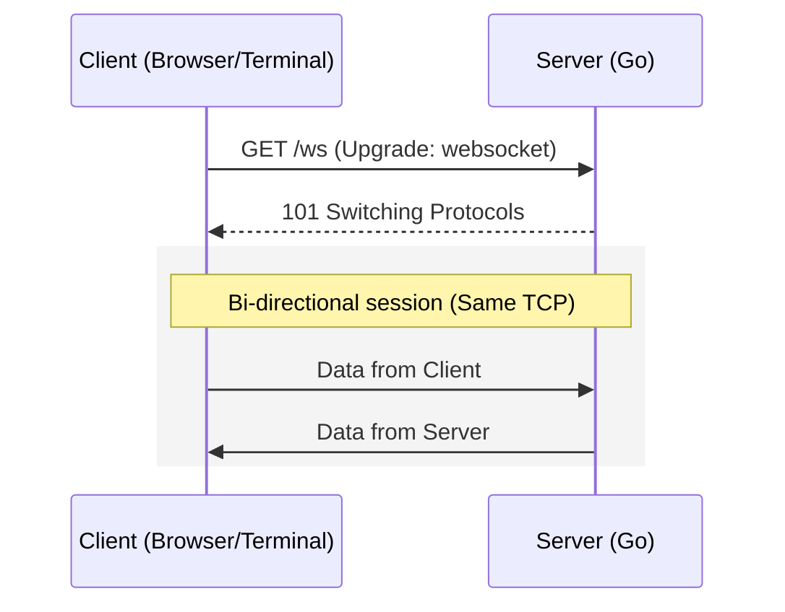
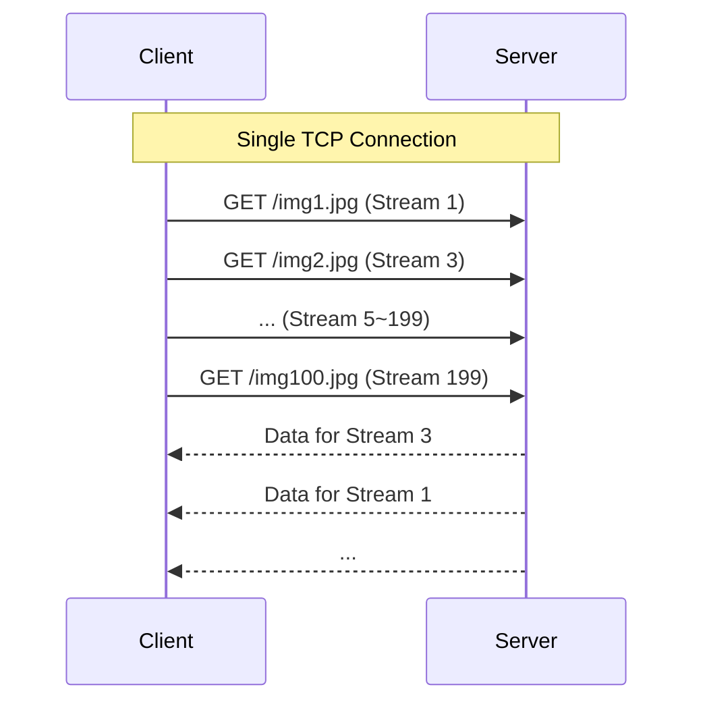
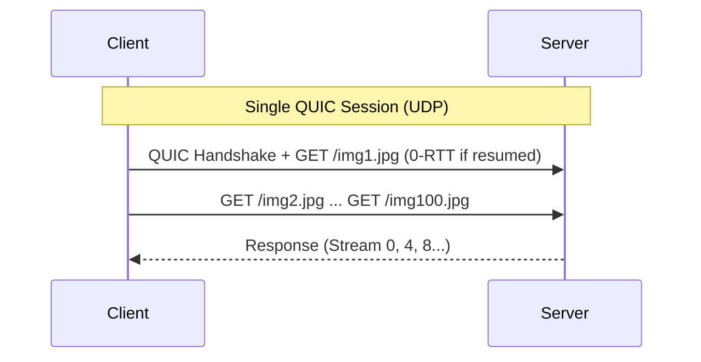
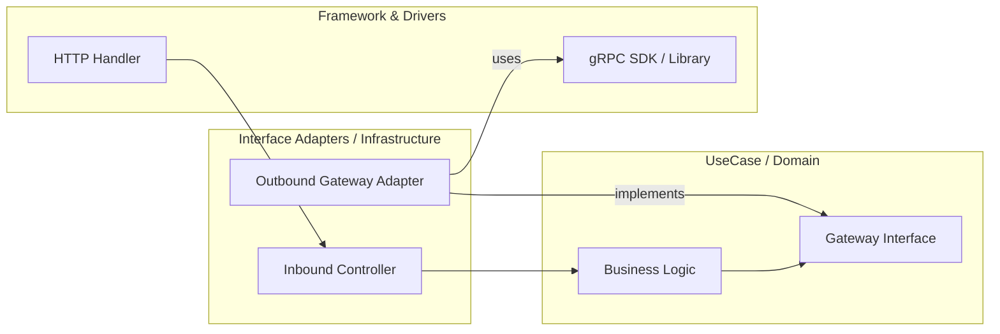

# HTTP Persistent Connection Workshop: Keep-Alive, WebSocket, HTTP/2, gRPC, HTTP/3

> **Note on Terminology**: The term "Persistent Connection" used in this workshop refers to the definition in HTTP specifications (such as RFC 7230). It differs from "Data Persistence" in databases; it refers to maintaining a single TCP connection or a logical connection provided by QUIC to reuse it for multiple requests.

In this workshop, you will learn about **connection reuse and streaming**, which are the foundations of modern web applications. You will understand how connections are optimized from HTTP/1.1 to the latest HTTP/3 through hands-on exercises.

## Goals

- Understand the effect of connection reuse with HTTP/1.1 **Keep-Alive**.
- Experience bi-directional, full-duplex communication with **WebSocket**.
- Understand the efficiency of resource acquisition through **HTTP/2** multiplexing.
- Understand the difference between Unary and Streaming in **gRPC** (based on HTTP/2).

---

## Why are "Persistent Connections" Necessary?

Re-establishing TCP connections (3-way handshake) and TLS connections (handshake) for every communication causes significant overhead, especially in high-latency environments.

| Protocol | Connection Handling | Features |
| :--- | :--- | :--- |
| **HTTP/1.0** | Short-lived | Disconnect after each request. High overhead. |
| **HTTP/1.1** | Persistent (Keep-Alive) | Reuse connections. In practice, requests are processed serially, leading to **HoL Blocking** due to response waiting. |
| **WebSocket** | Bi-directional | Upgraded from HTTP. Allows bi-directional sending, but **TCP-level HoL Blocking** remains. |
| **SSE** | Server-Sent Events | Unidirectional stream from server to client over HTTP. Lightweight for notifications. **TCP-level HoL Blocking** remains. |
| **HTTP/2** | Multiplexed | Multiple "streams" within one connection. Allows parallel processing within server limits, but **TCP-level HoL Blocking** remains. |
| **gRPC** | Streaming | Based on HTTP/2, utilizes streams and flow control for efficient bi-directional communication. |
| **HTTP/3** | QUIC/UDP | Reduces TCP and TLS overhead. Rebuilds reliability over UDP, **resolving TCP-level HoL Blocking**. |

> **HoL Blocking (Head-of-Line Blocking)**:
> A phenomenon where the first request or packet in a queue blocks all subsequent requests or packets from being processed, even if they have arrived normally.
>
> - **HTTP/1.1 Level**: A "wait-in-line" at the application layer where the next request cannot be sent on the same connection until the previous response is received.
> - **TCP Level (WebSocket/SSE/HTTP/2)**:
>   TCP guarantees "ordered delivery." When data for "Image A" and "Image B" are mixed in one connection, if **even one packet of Image A is lost**, the OS holds back subsequent normal packets of Image B in the buffer (waiting for Image A's retransmission).
>   Consequently, Image B's display is blocked due to Image A's trouble. This is the essence of "pipe clogging."
>
> **Relationship between HTTP/3 and QUIC**:
> Often confused, but accurately, **the "HTTP/3 application layer" sits on top of the "QUIC transport layer protocol (replacing TCP)."**
>
> - **QUIC**: A new "communication foundation" based on UDP, featuring encryption via TLS 1.3, mobility resilience via Connection IDs, and packet loss resilience.
> - **HTTP/3**: A "convention" for sending HTTP requests by directly utilizing QUIC's multiplexing capabilities.
> - **2026 Current Supplement**: **gRPC over HTTP/3** has become a common option for implementation and operation, especially in unstable mobile networks where QUIC's robustness supports gRPC's reliability.

---

## Guide to Choosing Update Notifications (Event Delivery) (2026 Edition)

There are multiple ways to immediately inform a client that "a state has changed on the server." Here is a quick guide based on use cases:

1. **Bi-directional communication needed in browser** (Chat, Games) → **WebSocket**
2. **Unidirectional notification to browser is sufficient** (News feeds, Stock updates) → **SSE (Server-Sent Events)**
    - Implementation is very simple (`text/event-stream`), and automatic reconnection is supported by standard browsers.
3. **High network fluctuation / Modern low-latency requirements** → **WebTransport (HTTP/3)**
4. **Backend-to-Backend communication** → **gRPC Streaming**
    - Type-safe (IDL/proto) with support for server, client, and bi-directional streaming.

---

## Architecture

We will start one Go server and observe the differences in communication across different paths and protocols.

### HTTP/1.0 (Short-lived Connections)

**Estimated Sessions: 2** (for 2 requests)
Establishes a TCP connection for each request and disconnects immediately after the response. This is the most inefficient method.



### HTTP/1.1 (Keep-Alive / Connection Pooling)

HTTP/1.1 introduced "connection reuse."

- **Sequential Sending: Estimated Sessions 1**
  Reuses the same connection to process requests one by one.
- **Parallel Sending: Estimated Sessions 2+ (Max ~6)**
  Most browser implementations (Chrome/Firefox, etc.) limit the number of simultaneous connections to **around 6 per domain** to speed up processing through parallelism.

> **About Pipelining**:
> While HTTP Pipelining exists in the specification to send the next request without waiting for a response, it is effectively disabled in major browsers due to the difficulty of guaranteeing response order and compatibility issues with middleboxes. In practice, it results in serial processing of one request per connection.



### WebSocket (Upgrade)

**Estimated Sessions: 1**
Starts with an HTTP connection and then exclusively uses the same TCP session for bi-directional communication.



### HTTP/2 (Multiplexing)

**Estimated Sessions: 1**
Multiple streams can be multiplexed within a single connection, allowing parallel processing within the server's limit (`SETTINGS_MAX_CONCURRENT_STREAMS`: typically 100–256).

- **Downloading 100 Images**:
  Requests can be sent without the browser's 6-connection limit. However, since the underlying layer is TCP, **a single packet loss will stall the progress of all streams on that connection** (TCP-level HoL Blocking).

> **About Server Push**:
> While Server Push using even-numbered IDs exists in the specification, it is currently rarely used.
>
> - **Original Purpose**: An optimization to "pre-push" CSS/JS that will definitely be needed after the HTML, without waiting for a client request.
> - **Caution**: It is not a general-purpose push notification mechanism like WebSocket; it is a technology for static resource delivery optimization within the same origin and cache context.
> - **2026 Trend**: **103 Early Hints** is recommended for resource preloading, while **WebSocket** or **gRPC Streaming** should be chosen for real-time notifications.



### HTTP/3 (QUIC / 0-RTT)

**Estimated Sessions: 1** (Logical connection via UDP/QUIC)
Based on UDP, but QUIC ensures reliability. While the initial connection requires 1-RTT, **session resumption** allows 0-RTT, where requests can be sent before the handshake completes.

- **Downloading 100 Images**:
  In addition to HTTP/2's benefits, QUIC performs order guarantee on a "per-stream" basis. Packet loss only causes the specific image data to wait for retransmission, while **other images (streams) continue to be transferred without interruption**. This completely resolves TCP-level HoL Blocking.
  *Note: Application-layer or single-stream HoL Blocking due to ordering dependencies may still occur.*



---

## Preparation

1. **Navigate to the Repository**

    ```bash
    cd infra/assets/http_persistent_conn
    ```

2. **Install Tools**

    Install the base tools (Podman, Go, Protoc, etc.) using the following commands:

    ```bash
    # Example for Ubuntu 24.04
    sudo apt update
    sudo apt install -y podman podman-compose golang-go protobuf-compiler curl websocat
    ```

    Next, set up Go-specific tools (`protoc-gen-go`, `grpcurl`, etc.) using `go install`:

    ```bash
    make setup
    ```

3. **Generate Self-Signed Certificate**

    Since HTTP/2/3 require TLS/QUIC, create a local certificate.

    ```bash
    make cert
    ```

4. **Generate Protobuf Code**

    Generate Go stubs from `proto/greeter.proto`.

    ```bash
    make gen
    ```

5. **Start the Server**

    ```bash
    make run
    ```

    Port List:
    - `:8080` → HTTP/1.1 + WebSocket + SSE
    - `:8443` → HTTP/2 (TLS)
    - `:8444` → HTTP/3 (QUIC)
    - `:50051` → gRPC (HTTP/2)

    Keep the server running in this terminal and use another terminal for the following steps.

---

## Workshop Steps

### STEP 1: Verifying HTTP/1.1 Keep-Alive

In HTTP/1.1, connections are maintained by default. Verify this using `curl -v`.

```bash
# Send two consecutive requests
curl -v http://localhost:8080/ http://localhost:8080/
```

**Observation Points**:

1. **curl Logs**: Check for `Re-using existing connection! (#0) with host localhost` in the second request's log. This shows the TCP connection is reused.
2. **Socket Status (ss command)**: In another terminal, verify that there is **only one** ESTAB connection to `:8080`.

    ```bash
    # Ubuntu 24.04: Monitor connection status in real-time
    watch -n 0.1 "ss -ntp | grep :8080"
    ```

    *Note: On macOS, use `watch -n 0.1 "lsof -iTCP:8080 -sTCP:ESTABLISHED"`.*

> **Note on Timeout**:
> Servers typically have a **Keep-Alive Timeout**. If no request arrives within a certain period, the server sends a TCP disconnect (FIN). If the connection disappears during the exercise, simply send another request to perform a new handshake.

### STEP 2: Bi-directional Communication with WebSocket (Full-duplex beyond HTTP)

WebSocket starts with an **HTTP/1.1 `Upgrade` header**, but once established, it switches to **"Full-duplex communication"** where both parties can send data at any time, ignoring the HTTP request-response framework.

| Feature | HTTP/1.1 (Keep-Alive) | WebSocket |
| :--- | :--- | :--- |
| **Communication Direction** | Client-initiated Request/Response | Full-duplex (Either side can send anytime) |
| **Data Unit** | HTTP Message (Header + Body) | Lightweight Frame (Binary/Text) |
| **Overhead** | Headers required for every request | Minimal frame headers after connection |

> **When using Proxies (Nginx / Traefik)**:
>
> - **Nginx**: Does not pass `Upgrade` headers to the backend by default. Requires explicit configuration like `proxy_set_header Upgrade $http_upgrade;`.
> - **Traefik**: Modern design automatically detects WebSocket and acts as a TCP tunnel.
> - **Common Caution**: Both proxies have Idle Timeout settings that can drop inactive connections. Application-level **Heartbeats (Ping/Pong)** are essential for maintaining WebSockets.

```bash
# Start WebSocket connection
websocat -v ws://localhost:8080/ws
```

**Observation Points**:

1. **Handshake**: Check for `HTTP/1.1 101 Switching Protocols` in the `websocat -v` log.
2. **Bi-directional Check**: This sample is an "echo server." Verify that whatever you type is immediately returned.
3. **Socket Monitoring**: Use `ss`. The socket remains in **ESTAB** state while you interact, remaining as a single socket.

### STEP 2b: WebSocket Connection via Traefik (Optional)

Experience how modern reverse proxies handle WebSockets as "tunnels" in a containerized environment.

```bash
# Start server and Traefik
podman-compose up --build -d

# Connect via Traefik (Port 80)
websocat -v ws://localhost/ws
```

**Observation Points**:

1. **Automatic Detection**: Traefik detects the `Upgrade` header and forwards the request without special configuration.
2. **Transparency**: From the client's perspective, it behaves exactly like a direct connection.
3. **Note**: Don't forget to cleanup with `podman-compose down`.

### STEP 3: HTTP/2 Multiplexing

HTTP/2 creates multiple virtual "streams" within a single TCP connection to process requests in **complete parallel**.

```bash
# Force HTTP/2 to download multiple files
curl --http2 -k -v https://localhost:8443/a https://localhost:8443/b
```

**Observation Points**:

1. **Multiplexing**: In the `curl` log, check for different odd stream IDs (e.g., `[HTTP/2] [1] GET /a`, `[HTTP/2] [3] GET /b`) running simultaneously.
2. **Socket Monitoring**: Verify that the OS-level TCP socket remains **always single** even when multiple requests are flying.

### STEP 4: HTTP/3 (QUIC) 0-RTT and Transition to UDP

HTTP/3 completely abandons TCP in favor of the UDP-based **QUIC** protocol.

> **Why abandon TCP? (Resolving TCP-level HoL Blocking)**:
> TCP treats all data as a "single pipe" and performs order guarantee for the entire stream. QUIC performs order guarantee on a **"per-stream"** basis. If a packet for one stream is lost, only that stream waits for retransmission, while other streams continue without being blocked. This is the technical essence of resolving HoL Blocking.

```bash
# Access via HTTP/3
curl --http3 -k -v https://localhost:8444/
```

**Observation Points**:

1. **Protocol Difference**: Check for `ALPN: h3` in the `curl` log.
2. **Socket Monitoring (UDP)**: Use `ss -unp`. Since UDP is connectionless, it may show as `UNCONN`, but the port should be open.
    - To be sure packets are flowing: `sudo tcpdump -i lo -n port 8444`

### STEP 5: Diverse Streaming Experiences with gRPC (HTTP/2)

gRPC utilizes HTTP/2's long-lived connections and stream multiplexing.

#### Continuous Unary Calls vs. HTTP/1.1

When using a single `ClientConn`, gRPC Unary offers significant advantages over HTTP/1.1 Keep-Alive:

| Feature | HTTP/1.1 Keep-Alive | gRPC Unary (HTTP/2) |
| :--- | :--- | :--- |
| **Parallelism** | Serial (Must wait for response) | **Multiplexing** |
| **HoL Blocking** | Likely at connection level | **HTTP-layer HoL Mitigated** (TCP-level remains) |
| **Resource Efficiency** | Parallelism needs multiple TCP conns | Many streams over **1 TCP connection** |

#### gRPC Advantages over WebSocket

While both maintain connections, gRPC is more refined:

1. **Sematics Preservation**: WebSocket loses HTTP concepts (paths, types) after connection, but gRPC maintains a clear "Request-Response" model.
2. **Header Compression (HPACK)**: Compresses redundant headers (auth tokens, etc.), making it extremely lightweight.
3. **Standard Flow Control**: Built-in HTTP/2 window control prevents the receiver from being overwhelmed.

```bash
# 1. Continuous Unary Test
grpcurl -plaintext -d '{"name": "req1"}' localhost:50051 pb.Greeter/SayHello
grpcurl -plaintext -d '{"name": "req2"}' localhost:50051 pb.Greeter/SayHello

# 2. Server Streaming Test
grpcurl -plaintext -d '{"name": "stream"}' localhost:50051 pb.Greeter/SayHelloStream

# 3. Bidirectional Streaming Test
# (Press Ctrl+D to end input)
grpcurl -plaintext -d '{"name": "Alice"}' -d '{"name": "Bob"}' localhost:50051 pb.Greeter/Chat
```

**Observation Points**:

- Note that `grpcurl` starts a new process for each command, usually resulting in a new connection per call. The true power of gRPC (1-connection multiplexing) is maximized when reusing a long-lived `ClientConn` within an application.

### STEP 6: Lightweight Notifications with Server-Sent Events (SSE)

Observe SSE, the easiest way to implement "server-to-client notifications" for browsers.

```bash
# Request SSE from HTTP/1.1 port
curl -v http://localhost:8080/sse
```

**Observation Points**:

1. **Content-Type**: Check for `text/event-stream`. Data arrives sequentially without closing the connection.
2. **Lightweight**: Observe how it's implemented as a "long HTTP response" rather than complex framing like WebSocket.

---

## Relationship with Clean Architecture

In Clean Architecture, communication protocols belong to the outermost **"Frameworks & Drivers"** layer. We isolate business logic from these details through **Dependency Inversion (DIP)**.



1. **Inbound (Receiving)**: Frameworks (HTTP Handlers, gRPC stubs) receive requests, and Controllers convert them to domain formats to call UseCases.
2. **Outbound (Sending)**: UseCases depend on abstractions (Interfaces), and Infrastructure Adapters use specific Frameworks (gRPC SDKs, etc.) to send data externally.

**Design Pattern: BFF (Backend For Frontend)**
In practice, directly hitting gRPC streaming from a browser can be difficult. A common, Clean Architecture-aligned approach is to use a **BFF that communicates with the backend via gRPC and relays information to the frontend via WebSocket or SSE**.

---

## Conclusion: How should you choose?

In modern system design, the following segregation is common:

- **Backend to Backend (Microservices)**: **gRPC** is the primary choice. Benefits from type safety, high-speed binary, and multiplexing. (REST may be chosen based on organizational standards).
- **Browser to Backend (Real-time)**: **WebSocket** is mainstream for chats, charts, and notifications. **SSE** is a strong alternative for unidirectional lightweight notifications.
- **Browser to Backend (Normal API)**: **REST (JSON/HTTP)** or **gRPC-Web**.

> [!NOTE]
> **2026 Perspective**:
> **WebTransport (HTTP/3 based)** is gaining attention. While it may be more suitable than WebSocket in some cases, it hasn't completely replaced WebSocket as of 2026. Choosing based on requirements and browser support is practical.

---

## Appendix: HTTP/3 Adoption Status (As of 2026)

- **Browser Support**: Standard support in major browsers (Chrome, Edge, Firefox, Safari).
- **Server / Infrastructure**: Accounts for a very high percentage of traffic through major CDNs. Nginx and cloud load balancers have supported it as stable for years.
- **Mobile**: QUIC's Connection ID-based continuity is reported to be highly effective in mobile networks (e.g., 5G) while moving.

---

## Cleanup

```bash
# Terminate processes
kill $(jobs -p)
# Stop containers
podman-compose down
```

---

## Next Steps

- **Challenge WebTransport**: Evaluate it as an alternative to WebSocket, comparing its multi-stream and low-latency (datagram) capabilities.
- **Load Balancer Configuration**: Investigate how L4 LBs and L7 LBs handle persistent connections differently (e.g., connection imbalance issues).
