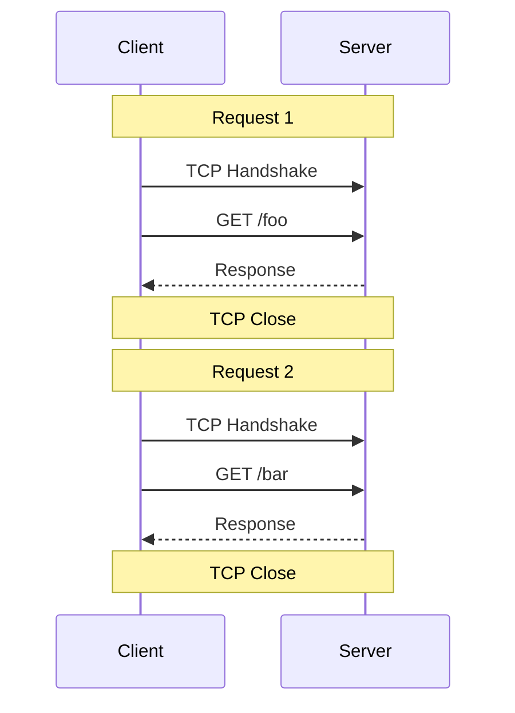
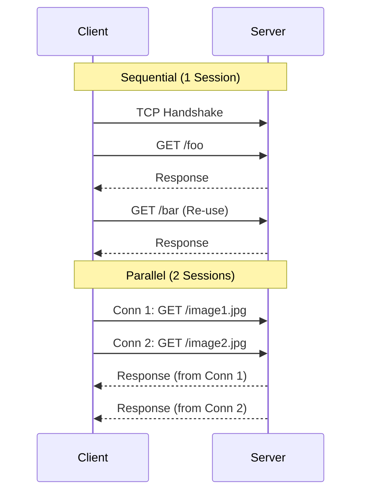
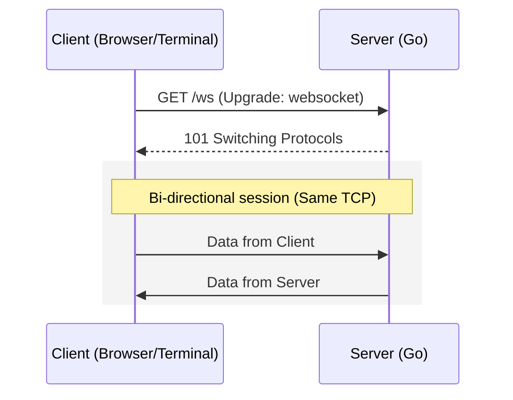
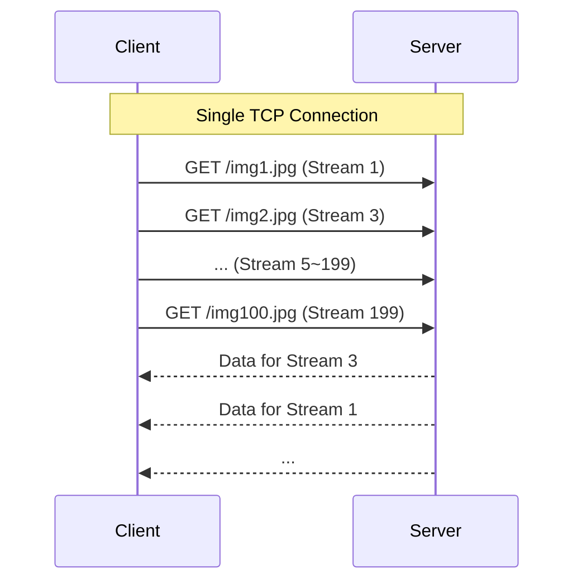
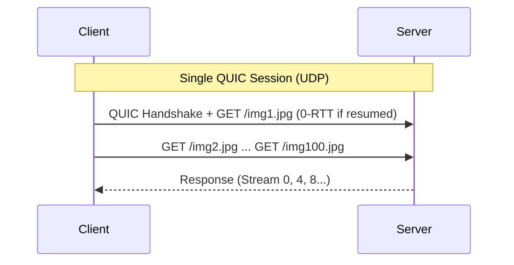
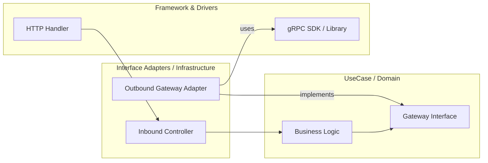

# HTTP 永続接続実習：Keep-Alive, WebSocket, HTTP/2, gRPC, HTTP/3

> **用語について**: 本実習で扱う「永続接続」は、HTTP 仕様（RFC 7230 等）で定義されている **"Persistent Connections"** の訳語です。データベース等の「データの永続性 (Persistency/Persistence)」とは異なり、**一つの TCP 接続、または QUIC が提供する論理的な接続**を維持して複数のリクエストで再利用することを指します。

この実習では、モダンな Web アプリケーションの基盤となる **コネクション（接続）の再利用とストリーミング** について学びます。
HTTP/1.1 から最新の HTTP/3 まで、どのように接続を効率化しているのかを、実際に手を動かしながら理解します。

## ゴール

- HTTP/1.1 の **Keep-Alive** による接続再利用の効果を理解する
- **WebSocket** による双方向・全二重通信を体験する
- **HTTP/2** のマルチプレキシング（多重化）によるリソース取得の効率化を理解する
- **gRPC** (HTTP/2 ベース) の Unary と Streaming の違いを理解する

---

## なぜ「永続接続」が必要なのか？

通信のたびに TCP 接続（3-way handshake）と TLS 接続（Handshake）をやり直すと、特に高レイテンシな環境では大きなオーバーヘッドになります。

| プロトコル | 接続の扱い | 特徴 |
| :--- | :--- | :--- |
| **HTTP/1.0** | 短期接続 | リクエストごとに切断。オーバーヘッド大。 |
| **HTTP/1.1** | 永続接続 (Keep-Alive) | 同一接続では基本的に直列処理。並列化には複数接続が必要で、レスポンス待ちによる **HoL Blocking** が発生しやすい。 |
| **WebSocket** | 双方向接続 | HTTP からアップグレード。一度つなげば双方向から自由に送信可能だが、**TCP レベルの HoL Blocking** は残る。 |
| **SSE** | サーバー送信イベント | HTTP 上でサーバーからクライアントへ片方向ストリームを流す。軽量で通知向き。**TCP レベルの HoL Blocking** は残る。 |
| **HTTP/2** | 多重化接続 | 1 接続内に複数の「ストリーム」。サーバー設定の範囲内で並列処理が可能だが、**TCP レベルの HoL Blocking** は残る。 |
| **gRPC** | ストリーミング | HTTP/2 を基盤とし、ストリームとフロー制御を活用して効率的に双方向通信。 |
| **HTTP/3** | QUIC/UDP | UDP 上で信頼性と暗号化を再構築し、ストリーム単位の再送制御で **TCP レベルの HoL Blocking を回避**。 |

> **HoL Blocking (Head-of-Line Blocking / 先頭での目詰まり)**:
> 行列（キュー）の先頭にあるリクエストやパケットが、処理遅延やロスによって止まってしまうと、後続のリクエストやパケットがどれだけ正常に届いていても、全てが待たされてしまう現象を指します。
>
> - **HTTP/1.1 レベル**: 前のリクエストのレスポンスが届くまで、同じ接続で次のリクエストが送れない「アプリケーション層の順番待ち」。
> - **TCP レベル (WebSocket/SSE/HTTP/2)**:
>   TCP はデータを「正しい順序で届ける」ことを保証します。そのため、1 本の接続で「画像 A」と「画像 B」のデータを混ぜて送っているとき、**画像 A のパケットが 1 つでもロスする**と、OS は後ろに届いている画像 B の正常なパケットをアプリケーション（ブラウザ）に渡さず、バッファに留めてしまいます（画像 A の再送を待つため）。
>   結果として、画像 A のトラブルのせいで、**無関係な画像 B の表示まで止まってしまう**。これが「パイプの目詰まり」の正体です。
>
> **HTTP/3 と QUIC の関係**:
> よく混同されますが、正確には **「QUIC というトランスポート層プロトコル（TCPの代わり）」の上に「HTTP/3 というアプリケーション層」が乗っている** 関係です。
>
> - **QUIC**: UDP をベースに、TLS 1.3 による暗号化、接続 ID による移動耐性、パケットロスへの耐性を備えた新しい「通信の土台」です。
> - **HTTP/3**: その QUIC の多重化機能を直接利用して、HTTP リクエストを流すための「規約」です。
> - **2026年現在の補足**: **gRPC over HTTP/3** は実装・運用の選択肢として広がっていますが、環境によっては引き続き HTTP/2 が主流です。採用可否はプロキシや LB の対応状況を含めて判断してください。

---

## 更新通知（イベント配信）の使い分けガイド

「サーバー側で状態が変わった事実」をクライアントに即座に伝える手法は複数あります。用途に応じた最短の選択指針は以下の通りです。

1. **ブラウザで双方向通信が必要** (チャット、ゲーム) → **WebSocket**
2. **ブラウザへの片方向通知で十分** (ニュースフィード、株価更新) → **SSE (Server-Sent Events)**
    - 実装が非常にシンプル（`text/event-stream`）で、ブラウザ標準で自動再接続もサポートされます。
3. **モバイル等で回線変動が激しい / 低遅延要件が強い** → **WebTransport (HTTP/3) も検討**
4. **サービス間（Backend-to-Backend）通信** → **gRPC Streaming**
    - 型安全（IDL/proto）で、サーバー・クライアント・双方向の全てのストリーミングが揃っています。

---

## アーキテクチャ

1 つの Go サーバーを起動し、異なるパスやプロトコルで通信の違いを観察します。

### HTTP/1.0 (Short-lived Connections)

**想定セッション数: 2** (リクエストが 2 つある場合)
1 つのリクエストごとに TCP 接続を確立し、レスポンスが終わると即座に切断します。最も非効率な方式です。



### HTTP/1.1 (Keep-Alive / Connection Pooling)

HTTP/1.1 では「接続の再利用」が可能になりました。

- **順次 (Sequential) 送信の場合: 想定セッション数 1**
  同じ接続を使いまわして順番に処理します。
- **並列 (Parallel) 送信の場合: 想定セッション数 2以上 (最大6程度)**
  多くのブラウザ実装（Chrome/Firefox 等）では、1 ドメインあたりの同時接続数を **最大 6 本程度** に制限して並列実行します。

> **Pipelining について**:
> 仕様上はレスポンスを待たずに次のリクエストを送る HTTP Pipelining が存在しますが、レスポンス順序保証の難しさや中間プロキシとの相性問題から、主要ブラウザでは事実上無効化されており、実運用では 1 接続 1 リクエストの直列処理になります。



### WebSocket (Upgrade)

**想定セッション数: 1**
HTTP 接続から開始し、そのまま同じ TCP セッションを双方向通信に専用利用します。



### HTTP/2 (Multiplexing)

**想定セッション数: 1**
多数のストリームを 1 接続内で多重化でき、サーバー設定（`SETTINGS_MAX_CONCURRENT_STREAMS`：一般に 100〜256）の範囲内で並列処理されます。

- **100 枚の画像をダウンロードする場合**:
  HTTP/1.1 のようなブラウザ側の接続数制限（6 本）を受けずにリクエストを投げられますが、下層が TCP であるため、**1 パケットのロスでコネクション上の全データ進行が止まる**（TCP レベルの HoL Blocking）という課題は残ります。

> **Server Push について**:
> 仕様上は ID 偶数を用いてサーバーからデータを送る Server Push が存在しますが、現在はほとんど利用されていません。
>
> - **本来の用途**: ページ遷移直後の待ち時間を削るための「予測可能な依存リソースの先読み」が目的です。
>   - **通常**: `GET /index.html` → (解析) → `GET /style.css`, `GET /app.js` ... と順番にリクエストが発生。
>   - **Server Push**: `GET /index.html` を返すと同時に、サーバー側が「次に必ず取りに来る」と分かっている `style.css` や `app.js` を勝手に送りつける。
> - **混同注意**: WebSocket のように「サーバー側でイベントが起きたら通知する」ための仕組みではなく、同一オリジン・同一キャッシュ文脈における**静的リソースの配信最適化**技術です。
> - **2026年現在の潮流**: 「リソースの先読み」には **103 Early Hints** が推奨され、「リアルタイム通知」には今回実習する **WebSocket** や **gRPC Streaming** を選択するのが正解です。



### HTTP/3 (QUIC / 0-RTT)

**想定セッション数: 1** (UDP/QUIC による論理接続)
UDP ベースですが、QUIC レイヤーで信頼性を確保します。接続開始時は 1-RTT 必要ですが、**セッション再開時**には 0-RTT により、ハンドシェイク完了前にリクエストを送信できます。

- **100 枚の画像をダウンロードする場合**:
  HTTP/2 のメリットに加え、QUIC は順序保証を「ストリーム単位」で行うため、パケットロスが起きた特定の画像データだけが再送待ちになり、**他の画像（ストリーム）の転送は止まることなく継続されます**。これにより **TCP レベルの HoL Blocking** が解消されます。
  ※ ただし、アプリケーション層や単一ストリーム内での順序依存による遅延（アプリケーションレベルの HoL）は依然として発生し得ます。



---

## 準備

1. **リポジトリへ移動**

   ```bash
   cd infra/assets/http_persistent_conn
   ```

2. **ツールのインストール**

   以下のコマンドで、ベースとなるツール群（Podman, Go, Protoc 等）をインストールします。

   ```bash
   # Ubuntu 24.04 での実行例
   sudo apt update
   sudo apt install -y podman podman-compose golang-go protobuf-compiler curl websocat
   ```

   次に、Go 言語専用のツール（`protoc-gen-go`, `grpcurl` 等）を `go install` を使って一括セットアップします。

   ```bash
   make setup
   ```

3. **自己署名証明書の生成**

   HTTP/2/3 は TLS・QUIC を前提にするため、ローカル用の証明書を作成します。

   ```bash
   make cert
   ```

4. **Protobuf のコード生成**

   `proto/greeter.proto` から Go の stub を生成し、`pb/greeter.pb.go` を吐き出します。

   ```bash
   make gen
   ```

5. **サーバーを起動**

   ```bash
   make run
   ```

   起動後のポート一覧:

   - `:8080` → HTTP/1.1 + WebSocket + SSE
   - `:8443` → HTTP/2 (TLS)
   - `:8444` → HTTP/3 (QUIC)
   - `:50051` → gRPC (HTTP/2)

   サーバーはこのターミナルで動かしたまま、別ターミナルで以下のステップを走らせていきます。

---

## 実習ステップ

### STEP 1: HTTP/1.1 Keep-Alive の確認

HTTP/1.1 では、デフォルトで接続が維持されます。`curl -v` で確認します。

```bash
# 2回連続でリクエストを送る
curl -v http://localhost:8080/ http://localhost:8080/
```

**観察ポイント**:

1. **curl のログ**: 2 回目のリクエストのログに `Re-using existing connection! (#0) with host localhost` という表示があることを確認してください。TCP の接続が 1 回で済んでいることがわかります。
2. **Socket の状態 (ss コマンド)**: 別ターミナルで以下のコマンドを実行し、`:8080` への接続（ESTAB 状態のソケット）が **1 つだけ** であることを確認します。

    ```bash
    # Ubuntu 24.04: サーバーへの接続状況をリアルタイムで監視
    watch -n 0.1 "ss -ntp | grep :8080"
    ```

    ※ macOS の場合は `watch -n 0.1 "lsof -iTCP:8080 -sTCP:ESTABLISHED"` 等を利用してください。

> **タイムアウトについての補足**:
> サーバー側には通常 **Keep-Alive Timeout** が設定されており、一定時間リクエストがないとサーバー側から TCP 切断（FIN）を送ります。実習中、放置して接続が消えても、次のリクエストで再度ハンドシェイクが行われるだけなので問題ありません。

### STEP 2: WebSocket による双方向通信（HTTP を離れた全二重通信）

WebSocket は **HTTP/1.1 の `Upgrade` ヘッダー** を利用して開始されますが、一度接続が確立されると、もはや HTTP の「リクエスト・レスポンス」という枠組みを離れ、双方が自由なタイミングでデータを送り合える **「全二重通信」** に切り替わります。

| 特徴 | HTTP/1.1 (Keep-Alive) | WebSocket |
| :--- | :--- | :--- |
| **通信方向** | クライアント起点の Request/Response | 全二重（双方が任意タイミングで送信可能） |
| **データ単位** | HTTP メッセージ（Header + Body） | 軽量なフレーム（バイナリ/テキスト） |
| **オーバーヘッド** | 毎回ヘッダーを送る必要がある | 接続後は最小限のフレームヘッダーのみ |

> **プロキシ（Nginx / Traefik）を介す場合**:
>
> - **Nginx**: デフォルトでは `Upgrade` ヘッダーをバックエンドに引き継ぎません。明示的に `proxy_set_header Upgrade $http_upgrade;` 等の設定が必要です。
> - **Traefik**: モダンな設計のため、特別な設定なしで WebSocket を検知し、自動的に TCP トンネルとして動作します。
> - **共通の注意点**: どちらのプロキシも、一定時間通信がないとコネクションを切り捨てる（Idle Timeout）設定があるため、WebSocket を維持するには **Heartbeat（Ping/Pong）** が不可欠です。

```bash
# WebSocket 接続の開始
websocat -v ws://localhost:8080/ws
```

**観察ポイント**:

1. **ハンドシェイク**: `websocat -v` のログで、`HTTP/1.1 101 Switching Protocols` という応答を確認。これが「HTTP から WebSocket への切り替え」の合図です。
2. **双方向性の確認**: このサンプル実装は「エコーサーバー」です。クライアントで入力した内容が即座に返ることを確認してください（サーバー起点の定期 Push は未実装）。
3. **Socket 監視**: `ss` で監視。通信中、ソケットの状態が **ESTAB** のまま維持され、パケットをやり取りしてもソケット自体は 1 つのままであることを確認します。

### STEP 2b: Traefik を介した WebSocket 接続 (Optional)

```bash
# サーバーと Traefik を起動
podman-compose up --build -d

# Traefik (ポート 80) 経由で WebSocket 接続
websocat -v ws://localhost/ws
```

**観察ポイント**:

1. **自動検知**: Traefik は特別な設定なしで `Upgrade` ヘッダーを検知し、適切にバックエンド（Go アプリ）へリクエストを転送します。
2. **透過性**: クライアント（websocat）から見れば、直接接続したときとほぼ同じ挙動になります。プロキシがプロトコルの中身を邪魔せず、ストリームを中継していることがわかります。
3. **注意**: `podman-compose down` で後片付けを忘れないようにしてください。

### STEP 3: HTTP/2 のマルチプレキシング（多重化）

```bash
# HTTP/2 を強制して複数のファイルをダウンロード
curl --http2 -k -v https://localhost:8443/a https://localhost:8443/b
```

**観察ポイント**:

1. **マルチプレキシング**: `curl` のログで `[HTTP/2] [1] GET /a`, `[HTTP/2] [3] GET /b` のように、異なる奇数のストリーム ID が同時に動いていることを確認。
2. **Socket 監視**: 複数のリクエストを投げている間も、OS レベルで見える TCP ソケットは **常に 1 つだけ** であることを確認します。

### STEP 4: HTTP/3 (QUIC) の 0-RTT と UDP への移行

HTTP/3 は TCP ではなく、UDP ベースの **QUIC** プロトコル上で動作します。

> **なぜ TCP をやめたのか？ (TCP レベルの HoL Blocking 解消)**:
> TCP は順序保証を全データに対して一括で行う「一本のパイプ」です。QUIC は、順序保証を「ストリーム単位」で行うため、パケットロスが起きた「特定のストリーム」だけを再送し、他のストリームは止めることなく流し続けることができます。これが HoL Blocking 解消の技術的本質です。

```bash
# HTTP/3 でアクセス
curl --http3 -k -v https://localhost:8444/
```

**観察ポイント**:

1. **プロトコルの違い**: `curl` のログで `ALPN: h3` を確認。
2. **Socket 監視 (UDP)**: `ss -unp` で監視。UDP は状態管理を行わないため、表示が `UNCONN` になる場合がありますが、ポートが開いていれば問題ありません。
    - より確実に確認したい場合: `sudo tcpdump -i lo -n port 8444`

### STEP 5: gRPC (HTTP/2) での多種多様なストリーム通信

gRPC は HTTP/2 の長寿命コネクションとストリーム多重化を活用して、効率的にメッセージを流します。

#### Unary（単発実行）の連続呼び出し vs HTTP/1.1

gRPC は 1 つの `ClientConn` を使い回す設計にすると、HTTP/1.1 Keep-Alive と比べて次のメリットがあります。

| 機能 | HTTP/1.1 Keep-Alive | gRPC Unary (HTTP/2) |
| :--- | :--- | :--- |
| **並列性** | 直列処理（レスポンスを待つ必要がある） | **多重化 (Multiplexing)** |
| **HoL Blocking** | 同一接続で前のレスポンス待ちが発生しやすい | **HTTP レイヤーの HoL は緩和**（ただし TCP レベルの HoL は残る） |
| **リソース効率** | 並列化には複数の TCP 接続が必要 | 1 本の TCP 接続上で多ストリームを扱える（実際の上限は実装・設定依存） |

#### WebSocket と比べた gRPC の優位性

WebSocket も接続を維持しますが、gRPC は以下の点でより洗練されています。

1. **セマンティクスの維持**: WebSocket は接続後はただの「フレーム」を送るだけで HTTP の概念（パスや型）が失われますが、gRPC は「リクエスト・レスポンス」という明確な型を維持します。
2. **ヘッダー圧縮 (HPACK)**: 重複するヘッダー（認証情報等）を圧縮して送るため、メタデータが多い通信でも非常に軽量です。
3. **標準的なフロー制御**: HTTP/2 レベルでウィンドウ制御が組み込まれており、受信側がパンクしないよう自動調整されます。

```bash
# 1. Unary の連続テスト（レスポンス形式の違いを確認）
grpcurl -plaintext -d '{"name": "req1"}' localhost:50051 pb.Greeter/SayHello
grpcurl -plaintext -d '{"name": "req2"}' localhost:50051 pb.Greeter/SayHello

# 2. Server Streaming のテスト（サーバーが 5 件の応答を逐次返す）
grpcurl -plaintext -d '{"name": "stream"}' localhost:50051 pb.Greeter/SayHelloStream

# 3. Bidirectional Streaming のテスト（双方向で送り合う）
# (Ctrl+D で入力を終了)
grpcurl -plaintext -d '{"name": "Alice"}' -d '{"name": "Bob"}' localhost:50051 pb.Greeter/Chat
```

**観察ポイント**:

- `grpcurl` はコマンドごとに新しいプロセスが起動するため、通常は呼び出しごとに新しい接続になります。
- gRPC の真価（1 接続多重化）は、アプリケーション内で `ClientConn` を長寿命で再利用したときに最大化されます。

### STEP 6: Server-Sent Events (SSE) による軽量通知

```bash
# HTTP/1.1 ポートに対して SSE をリクエスト
curl -v http://localhost:8080/sse
```

**観察ポイント**:

1. **Content-Type**: `text/event-stream` が返り、データが逐次届くことを確認。
2. **この実装の挙動**: サンプルコードでは 2 秒おきに 10 件送信した後に接続を閉じます（無限配信ではありません）。
3. **軽量性**: WebSocket のような複雑なフレーム制御ではなく、「長めの HTTP レスポンス」として実装できる点を確認します。

---

## Clean Architecture との関連

Clean Architecture において、通信プロトコルは最外周の「詳細 (Framework & Drivers)」に属します。ビジネスロジック（Usecase/Domain）は、その下のレイヤーである「アダプター (Interface Adapters / Infrastructure)」を通じて、プロトコルの詳細から隔離されています。



1. **Inbound (受信時)**: HTTP ハンドラーや gRPC スタブ（Framework）がリクエストを受け、Controller がドメイン形式に変換して UseCase を呼び出します。
2. **Outbound (送信時)**: UseCase は抽象（Interface）に依存し、Infra 層の Adapter が具体的な gRPC SDK 等（Framework）を使って外部へ送信します。

**設計パターン：BFF (Backend For Frontend) による中継**
実務では、ブラウザフロントエンドに直接 gRPC streaming を刺すのは難易度が高いケースがあります。その場合、**BFF が gRPC でバックエンドと通信し、フロントには WebSocket や SSE で情報を中継する** 構成が Clean Architecture 的にも整合性が高く、広く採用されています。

---

## 結局、どう使い分けるべきか？

現代のシステム設計では、以下のような棲み分けが一般的です。

- **Backend to Backend (マイクロサービス間)**: 第一候補は **gRPC**。型安全、高速なバイナリ、多重化の恩恵を受けやすいです（ただし組織標準や運用基盤により REST を選ぶケースもあります）。
- **Browser to Backend (リアルタイム)**: **WebSocket** が主流です。チャット、株価チャート、通知システムなどで広く使われています。片方向の軽量な通知であれば **SSE** も有力な選択肢です。
- **Browser to Backend (通常の API)**: **REST (JSON/HTTP)** または **gRPC-Web** です。

> [!NOTE]
> **2026年現在の視点**:
> 最近では **WebTransport (HTTP/3 ベース)** が注目されています。用途によっては WebSocket より適する場面がありますが、2026年時点で WebSocket を全面的に置き換える段階ではありません。要件と対応ブラウザを確認して使い分けるのが実務的です。

---

## 付録：HTTP/3 の普及状況 (2026年時点)

- **ブラウザ対応**: 主要ブラウザ（Chrome, Edge, Firefox, Safari）で標準サポート。
- **サーバー / インフラ**: 大手 CDN 経由のトラフィックでは非常に高い比率を占めています。Nginx やクラウドロードバランサも数年前から安定版としてサポートしています。
- **モバイル**: 5G などの移動中ネットワークでは、QUIC の Connection ID による接続継続性が有効に働くケースが多く報告されています。

---

## 片付け

```bash
# プロセスを終了
kill $(jobs -p)
# コンテナを停止
podman-compose down
```

---

## 次のステップ

- **WebTransport への挑戦**: HTTP/3 (QUIC) ベースで、信頼性（Streams）と低遅延（Datagrams）を 1 つの接続で使い分けられる選択肢です。既存 WebSocket との差分を比較しながら評価してみてください。
- **Load Balancer の設定**: L4 LB と L7 LB で、永続接続の扱いがどう変わるか（コネクションの偏り問題）を調査する。
