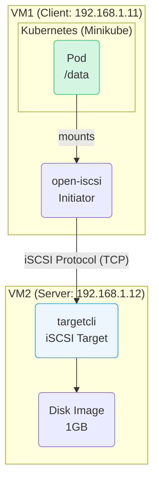
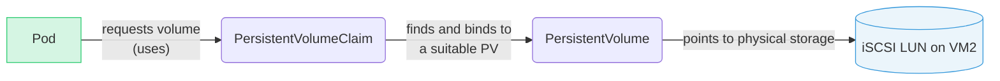

# iSCSI and Kubernetes PersistentVolume Workshop

## Introduction

This workshop provides a hands-on guide to understanding the iSCSI storage protocol and using it as a PersistentVolume in a Kubernetes cluster. The goal is to acquire the skills to leverage iSCSI, a cost-effective and traditional IP-based block storage, in a modern Kubernetes environment.

**What You Will Learn:**

* How to set up an iSCSI target (server) on Ubuntu.
* How to manually connect and mount from an iSCSI initiator (client).
* How to build a lightweight Kubernetes environment using Minikube.
* How to define an iSCSI volume as a PersistentVolume and PersistentVolumeClaim.
* How to mount the iSCSI volume into a Pod and verify data persistence.

**Prerequisites:**

* Two virtual machines (VMs) with Ubuntu 24.04 installed.
* At least 4GB of RAM for each VM.
* Full network connectivity between the two VMs.
* The firewall is properly configured or disabled.
* This guide uses the following IP addresses as examples. Please replace them with the actual IPs of your environment.
  * **VM1**: `192.168.1.11` (iSCSI client & Kubernetes node)
  * **VM2**: `192.168.1.12` (iSCSI target/server)

### Overall Architecture

The overall architecture of the environment you will build in this workshop is as follows.



---

## Phase 1: iSCSI Server Setup and Manual Mount

### Step 1: Build the iSCSI Target (on VM2)

First, let's set up the iSCSI target (server) on VM2, which will provide the storage.

1. **Install Packages**

    Install `targetcli-fb`, the tool for managing iSCSI targets.

    ```bash
    sudo apt update
    sudo apt install -y targetcli-fb
    ```

2. **Create a Disk Image File**

    Instead of a physical disk, we'll create a 1GB image file to act as the backend storage.

    ```bash
    sudo truncate -s 1G /var/lib/iscsi_disk.img
    ```

3. **Configure the iSCSI Target**

    We will use `targetcli` interactively to configure the target.

    ```bash
    sudo targetcli
    ```

    Within the `targetcli` prompt (`/>`), execute the following commands in order.

    ```bash
    # 1. Register the image file as a fileio backstore
    backstores/fileio create disk01 /var/lib/iscsi_disk.img

    # 2. Create an iSCSI target (The IQN will be auto-generated)
    # It will look something like iqn.2003-01.org.linux-iscsi.vm2.x8664:sn.xxxxxxxxxxxx
    iscsi/ create

    # (Reference) Check the created IQN
    ls iscsi/

    # 3. Add a LUN (Logical Unit Number) to the target
    # Specify the IQN you noted from the previous step
    iscsi/iqn.2003-01.org.linux-iscsi.vm2.x8664:sn.xxxxxxxxxxxx/tpg1/luns create /backstores/fileio/disk01

    # 4. Set up an ACL (Access Control List) to allow access from VM1
    # We don't know VM1's IQN yet, so we will configure this later.
    # For now, let's go find VM1's IQN.
    # (Keep this targetcli session open)
    ```

4. **Find VM1's IQN (on VM1)**

    Install the iSCSI initiator tool on VM1 and find its IQN (iSCSI Qualified Name).

    ```bash
    # Execute on VM1
    sudo apt update
    sudo apt install -y open-iscsi
    cat /etc/iscsi/initiatorname.iscsi
    ```

    The string following `InitiatorName=`, like `iqn.1993-08.org.debian:01:xxxxxxxxxxxx`, is the IQN for VM1. Make a note of it.

5. **Configure ACL and Save (back on VM2's targetcli)**

    Now, use the IQN of VM1 to create an ACL in `targetcli` on VM2.

    ```bash
    # Execute in the targetcli prompt on VM2
    # iscsi/iqn.2003-01.../tpg1/acls create <Paste VM1's IQN here>
    iscsi/iqn.2003-01.org.linux-iscsi.vm2.x8664:sn.xxxxxxxxxxxx/tpg1/acls create iqn.1993-08.org.debian:01:xxxxxxxxxxxx

    # 5. Configure the portal (listening IP and port)
    # By default, it listens on 0.0.0.0:3260, but you can also set it explicitly.
    # iscsi/iqn.2003-01.../tpg1/portals create 192.168.1.12

    # 6. Save the configuration and exit
    saveconfig
    exit
    ```

    The iSCSI target is now ready.

### Step 2: Manually Mount the iSCSI Disk (on VM1)

Next, let's verify that VM1 can connect to and mount the iSCSI disk from VM2.

1. **Discover the Target**

    Discover the available iSCSI targets exposed by VM2.

    ```bash
    sudo iscsiadm -m discovery -t sendtargets -p 192.168.1.12
    ```

2. **Log in to the Target**

    Log in to the discovered target.

    ```bash
    sudo iscsiadm -m node --login
    ```

3. **Verify the Disk**

    Check if a new block device has been recognized. You should see a new device like `/dev/sdb` in addition to `/dev/sda`.

    ```bash
    lsblk
    ```

4. **Format and Mount**

    Format the new disk with the `ext4` filesystem and mount it.

    ```bash
    # Adjust /dev/sdb to match your environment
    sudo mkfs.ext4 /dev/sdb
    sudo mkdir /mnt/iscsi_test
    sudo mount /dev/sdb /mnt/iscsi_test
    ```

5. **Test the Mount**

    Write a file to the mounted directory.

    ```bash
    sudo sh -c "echo 'Hello iSCSI' > /mnt/iscsi_test/hello.txt"
    cat /mnt/iscsi_test/hello.txt
    ```

    If it prints `Hello iSCSI`, you have succeeded.

6. **Clean Up**

    Unmount the disk in preparation for the next phase.

    ```bash
    sudo umount /mnt/iscsi_test
    ```

---

## Phase 2: Kubernetes Integration

### Kubernetes Storage Concepts

In Phase 2, we will use the iSCSI disk created in Phase 1 as a persistent volume in Kubernetes. The relationship between the main resources when a Pod uses external storage is as follows.



1. **Pod**: The container running your application. It specifies the volume it wants to mount by referencing the name of a `PersistentVolumeClaim`.
2. **PersistentVolumeClaim (PVC)**: A request for storage, such as "I need 1Gi of fast storage".
3. **PersistentVolume (PV)**: Defines the details of an actual piece of storage that exists, such as an iSCSI disk, an NFS share, or cloud storage, including its connection details (IP address, path, etc.).

This mechanism allows a Pod to consume storage through an abstract request (a PVC) without needing to know the details of the underlying physical storage.

### Step 3: Set Up the Minikube Environment (on VM1)

Now, install Minikube, a lightweight Kubernetes distribution, on VM1.

1. **Install Docker**

    Install Docker as the container runtime.

    ```bash
    sudo apt update
    sudo apt install -y docker.io
    sudo usermod -aG docker $USER && newgrp docker
    ```

2. **Install kubectl**

    Install `kubectl`, the command-line tool for interacting with a Kubernetes cluster.

    ```bash
    curl -LO "https://dl.k8s.io/release/$(curl -L -s https://dl.k8s.io/release/stable.txt)/bin/linux/amd64/kubectl"
    sudo install -o root -g root -m 0755 kubectl /usr/local/bin/kubectl
    ```

3. **Install Minikube**

    ```bash
    curl -Lo minikube https://storage.googleapis.com/minikube/releases/latest/minikube-linux-amd64
    sudo install minikube /usr/local/bin/
    ```

4. **Start Minikube**

    **[IMPORTANT]** In a 4GB RAM environment, creating a VM inside another VM is difficult. The `--driver=none` option runs the Kubernetes components directly on the host OS (VM1) instead of in a new VM. This saves resources but directly affects the VM1 environment and is not recommended for production. For this workshop, it's a practical choice.

    ```bash
    # The open-iscsi service must be running
    sudo systemctl enable --now iscsid

    sudo minikube start --driver=none
    ```

    If you see the message `kubectl is now configured to use "minikube"`, it was successful.

5. **Check the Cluster**

    ```bash
    kubectl get nodes
    ```

    You should see VM1 listed with a `Ready` status.

### Step 4: Use the iSCSI Volume from Kubernetes

Finally, let's use the iSCSI disk as a persistent volume in Kubernetes.

> **Note:** This procedure uses the in-tree iSCSI volume plugin. In newer versions of Kubernetes, CSI drivers are the recommended approach. However, for learning purposes, we will use the simpler in-tree method. This feature requires the `open-iscsi` package to be installed on every node (in our case, VM1), which we already did in Step 2.

1. **Create a PersistentVolume (PV)**

    Create a `PersistentVolume` that defines the iSCSI disk. Create a file named `iscsi-pv.yaml` with the following content. Make sure to update `targetPortal` and `iqn` to match your environment.

    ```yaml
    # iscsi-pv.yaml
    apiVersion: v1
    kind: PersistentVolume
    metadata:
      name: iscsi-pv
    spec:
      capacity:
        storage: 1Gi
      accessModes:
        - ReadWriteOnce
      iscsi:
        targetPortal: "192.168.1.12:3260"
        iqn: "iqn.2003-01.org.linux-iscsi.vm2.x8664:sn.xxxxxxxxxxxx" # IQN of VM2
        lun: 0
        fsType: 'ext4'
        readOnly: false
    ```

2. **Create a PersistentVolumeClaim (PVC)**

    Create a `PersistentVolumeClaim` for a Pod to request storage. Create `iscsi-pvc.yaml` with this content.

    ```yaml
    # iscsi-pvc.yaml
    apiVersion: v1
    kind: PersistentVolumeClaim
    metadata:
      name: iscsi-pvc
    spec:
      accessModes:
        - ReadWriteOnce
      resources:
        requests:
          storage: 1Gi
    ```

3. **Apply the PV and PVC**

    ```bash
    kubectl apply -f iscsi-pv.yaml
    kubectl apply -f iscsi-pvc.yaml
    ```

    Run `kubectl get pv,pvc` and verify that the STATUS is `Bound`.

4. **Mount the Volume from a Pod**

    Create a Pod that uses this PVC. Create `test-pod.yaml` with the following content.

    ```yaml
    # test-pod.yaml
    apiVersion: v1
    kind: Pod
    metadata:
      name: test-pod
    spec:
      containers:
      - name: test-container
        image: busybox
        command: ["/bin/sh", "-c", "sleep 3600"]
        volumeMounts:
        - name: iscsi-storage
          mountPath: "/data"
      volumes:
      - name: iscsi-storage
        persistentVolumeClaim:
          claimName: iscsi-pvc
    ```

5. **Create the Pod and Verify**

    Create the Pod and confirm that the iSCSI volume is mounted correctly.

    ```bash
    kubectl apply -f test-pod.yaml

    # Wait for the Pod to become Running
    kubectl get pod test-pod -w

    # Exec into the Pod and write a file to the mounted directory
    kubectl exec -it test-pod -- sh -c "echo 'Hello from K8s Pod' > /data/k8s_test.txt"

    # Verify the file was written
    kubectl exec -it test-pod -- cat /data/k8s_test.txt
    ```

    It should display `Hello from K8s Pod`.

6. **Verify Data Persistence**

    Confirm that the data persists even after the Pod is recreated.

    ```bash
    # Delete the Pod
    kubectl delete pod test-pod

    # Recreate the Pod
    kubectl apply -f test-pod.yaml

    # Once the Pod is Running, check if the file still exists
    kubectl exec -it test-pod -- cat /data/k8s_test.txt
    ```

    If it once again displays `Hello from K8s Pod`, you have successfully demonstrated that the data is persisted on the iSCSI volume.

---

## Conclusion

Congratulations! In this workshop, you have experienced the entire workflow, from the basics of iSCSI to using external storage as a persistent volume in a Kubernetes cluster.

**Cleanup:**
To revert your environment, run the following commands:

```bash
# Delete Kubernetes resources
kubectl delete -f test-pod.yaml
kubectl delete -f iscsi-pvc.yaml
kubectl delete -f iscsi-pv.yaml

# Stop and delete Minikube cluster
sudo minikube stop
sudo minikube delete

# Log out from iSCSI target (on VM1)
sudo iscsiadm -m node --logout

# Clear iSCSI target configuration (on VM2)
sudo targetcli clearconfig confirm=True
```
