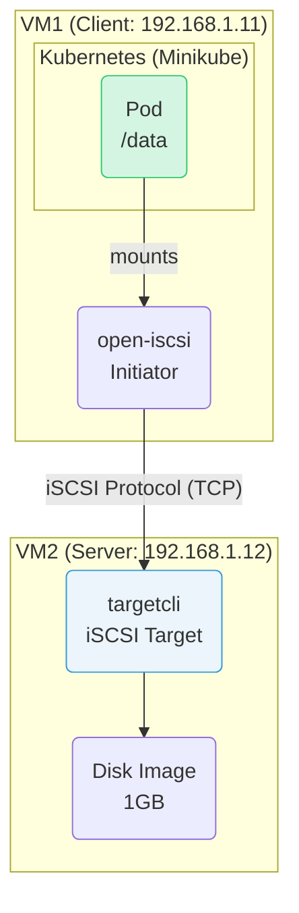
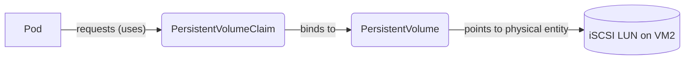

# iSCSI and Kubernetes PersistentVolume Workshop

In this workshop, you will learn how to build **iSCSI**, a traditional block storage protocol, and use it as a PersistentVolume in a Kubernetes cluster.

## Goal

Build the following configuration, mount external storage into a Pod, and verify data persistence.


```mermaid
graph TD
    subgraph "VM1 (Client: 192.168.1.11)"
        direction LR
        subgraph "Kubernetes (Minikube)"
            Pod("Pod<br>/data")
        end
        ISCSI_Client("open-iscsi<br>Initiator")
    end

    subgraph "VM2 (Server: 192.168.1.12)"
        direction LR
        ISCSI_Server("targetcli<br>iSCSI Target") --> Disk("Disk Image<br>1GB")
    end

    Pod -- "mounts" --> ISCSI_Client
    ISCSI_Client -- "iSCSI Protocol (TCP)" --> ISCSI_Server

    style Pod fill:#D5F5E3,stroke:#2ECC71
    style ISCSI_Server fill:#EBF5FB,stroke:#3498DB
```

**What you will learn in this workshop:**

1. **iSCSI Target Setup**: Configuring a server to provide disks over the network.
2. **iSCSI Initiator Setup**: Recognizing and formatting disks on the client side.
3. **K8s PV/PVC Integration**: Abstracting physical storage and safely providing it to Pods.

---

## Challenges in Stateful Applications

Containers are intended to be "ephemeral"; any data inside them is lost when they restart.

### ❌ Challenges

- Saving data (e.g., databases) to a container's internal disk causes data loss when the Pod is deleted.
- Mounting to local disks prevents data access if the Pod moves to another node.

### ✅ iSCSI and PersistentVolume Solutions

- **External Storage**: Data is stored on a dedicated server on the network, accessible regardless of where the Pod runs.
- **Abstraction (PV/PVC)**: Developers don't need to know details like "iSCSI IP addresses"; they only need to issue a request (PVC) for "1GB of capacity."

---

## Architecture

Understand the storage abstraction layers in Kubernetes.


```mermaid
graph LR
    A[Pod] -- "requests (uses)" --> B(PersistentVolumeClaim);
    B -- "binds to" --> C(PersistentVolume);
    C -- "points to physical entity" --> D[(iSCSI LUN on VM2)];
```

### Directory Structure

```text
~/
├── iscsi-pv.yaml    # Physical storage definition (Admin)
├── iscsi-pvc.yaml   # Storage request definition (Developer)
└── test-pod.yaml    # Pod definition using the storage
```

---

## Preparation

### 1. VM Provisioning

- **VM1:** `192.168.1.11` (Client & K8s Node)
- **VM2:** `192.168.1.12` (iSCSI Target)

### 2. Prerequisites

- Both VMs: Ubuntu 24.04 (4GB RAM minimum recommended).
- Firewall properly configured or disabled.

---

## Workshop Steps

### STEP 1: Build iSCSI Target (VM2)

Configure the server-side that provides the storage.

```bash
# Install packages
sudo apt update && sudo apt install -y targetcli-fb

# Create a 1GB virtual disk image
sudo truncate -s 1G /var/lib/iscsi_disk.img

# Target configuration
sudo targetcli /iscsi create iqn.2025-12.world.server:storage
sudo targetcli /backstores/fileio create disk01 /var/lib/iscsi_disk.img
sudo targetcli /iscsi/iqn.2025-12.world.server:storage/tpg1/luns create /backstores/fileio/disk01
```

Next, allow connection from VM1.
*Note: Run `cat /etc/iscsi/initiatorname.iscsi` on VM1 to check the IQN.*

```bash
# Grant access using VM1's IQN
sudo targetcli /iscsi/iqn.2025-12.world.server:storage/tpg1/acls create <VM1_IQN>
sudo targetcli saveconfig
```

### STEP 2: Verify Operation via Manual Mount (VM1)

Confirm connectivity at the OS level before passing it to Kubernetes.

```bash
sudo apt update && sudo apt install -y open-iscsi
sudo systemctl enable --now iscsid

# Discover target and login
sudo iscsiadm -m discovery -t sendtargets -p 192.168.1.12
sudo iscsiadm -m node --targetname iqn.2025-12.world.server:storage --portal 192.168.1.12:3260 --login

# Check disk and format
lsblk # You should see /dev/sdb or similar
sudo mkfs.ext4 /dev/sdb
```

### STEP 3: Prepare Kubernetes (Minikube) (VM1)

```bash
# Install Minikube (Simplified)
curl -Lo minikube https://storage.googleapis.com/minikube/releases/latest/minikube-linux-amd64 && sudo install minikube /usr/local/bin/

# Start (Recommended to use --driver=none to save resources)
sudo minikube start --driver=none
```

### STEP 4: Apply PV and PVC

Register physical storage with Kubernetes and issue a Claim.

1. **PersistentVolume (iscsi-pv.yaml)**

    ```yaml
    apiVersion: v1
    kind: PersistentVolume
    metadata:
      name: iscsi-pv
    spec:
      capacity:
        storage: 1Gi
      accessModes: [ReadWriteOnce]
      iscsi:
        targetPortal: "192.168.1.12:3260"
        iqn: "iqn.2025-12.world.server:storage"
        lun: 0
        fsType: 'ext4'
    ```

2. **PersistentVolumeClaim (iscsi-pvc.yaml)**

    ```yaml
    apiVersion: v1
    kind: PersistentVolumeClaim
    metadata:
      name: iscsi-pvc
    spec:
      accessModes: [ReadWriteOnce]
      resources:
        requests:
          storage: 1Gi
    ```

```bash
kubectl apply -f iscsi-pv.yaml
kubectl apply -f iscsi-pvc.yaml
kubectl get pvc # Success if Status becomes Bound
```

### STEP 5: Verification via Pod

```bash
# Start Pod
kubectl apply -f test-pod.yaml

# Write data
kubectl exec test-pod -- sh -c "echo 'Hello persistent' > /data/hello.txt"

# Delete and restart Pod
kubectl delete pod test-pod
kubectl apply -f test-pod.yaml

# Verify reading
kubectl exec test-pod -- cat /data/hello.txt
# -> Persistence successful if "Hello persistent" is shown!
```

---

## Clean Architecture Highlights

Kubernetes storage management is a truly Clean Architecture-style approach that **separates "Infrastructure Details (IP, protocol)" from "App Requests (capacity)."**

- **PV**: Infrastructure Layer (knows which server and which disk).
- **PVC**: UseCase Layer (expresses the intent of what kind of storage is needed).
- **Pod**: Entity/Business Logic Layer (requires data; doesn't care if the backend is iSCSI or NFS).

---

## Cleanup

```bash
kubectl delete -f test-pod.yaml
kubectl delete -f iscsi-pvc.yaml
kubectl delete -f iscsi-pv.yaml
sudo minikube delete
sudo iscsiadm -m node --logout
```

---

## References

- [Kubernetes Documentation: Persistent Volumes](https://kubernetes.io/docs/concepts/storage/persistent-volumes/)
- [Open-iSCSI Official Site](http://www.open-iscsi.com/)
