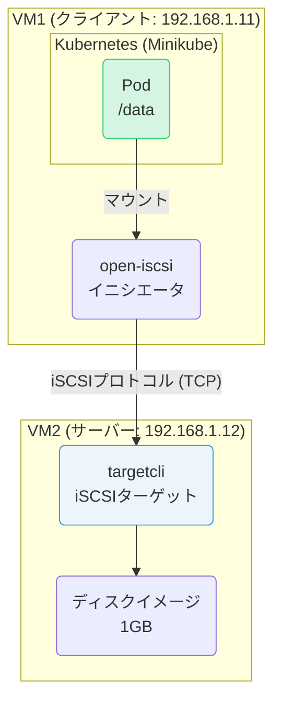
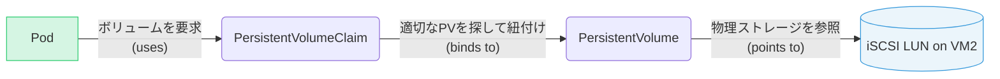

# iSCSIとKubernetes PersistentVolumeワークショップ

## はじめに

このワークショップでは、iSCSIストレージプロトコルを学び、それをKubernetesクラスタの永続ボリューム（PersistentVolume）として利用する方法を実践的に学びます。安価で伝統的なIPベースのブロックストレージであるiSCSIをKubernetesで活用するスキルを習得することを目的とします。

**学習内容:**

* Ubuntu上でのiSCSIターゲット（サーバー）の構築
* iSCSIイニシエータ（クライアント）からの手動接続とマウント
* Minikubeを使った軽量Kubernetes環境の構築
* iSCSIボリュームをPersistentVolumeおよびPersistentVolumeClaimとして定義
* PodからiSCSIボリュームをマウントし、データの永続性を確認

**前提条件:**

* Ubuntu 24.04がインストールされた仮想マシン（VM）が2台準備されていること。
* 各VMのRAMは4GB以上であること。
* 2台のVM間で相互にネットワーク通信が可能であること。
* ファイアウォールが適切に設定されているか、無効になっていること。
* このガイドでは、以下のIPアドレスを例として使用します。ご自身の環境に合わせて適宜読み替えてください。
  * **VM1**: `192.168.1.11` (iSCSIクライアント & Kubernetesノード)
  * **VM2**: `192.168.1.12` (iSCSIターゲット/サーバー)

### 全体構成図

このワークショップで構築する環境の全体像は以下の通りです。



---

## フェーズ1: iSCSIサーバーの構築と手動マウント

### ステップ1: iSCSIターゲットの構築 (VM2で実行)

まず、ストレージを提供する側であるiSCSIターゲット（サーバー）をVM2に構築します。

1. **パッケージのインストール**

    iSCSIターゲットを管理するための`targetcli-fb`をインストールします。

    ```bash
    sudo apt update
    sudo apt install -y targetcli-fb
    ```

2. **ディスクイメージファイルの作成**

    物理ディスクの代わりに、バックエンドストレージとして1GBのイメージファイルを作成します。

    ```bash
    sudo truncate -s 1G /var/lib/iscsi_disk.img
    ```

3. **iSCSIターゲットの設定**

    `targetcli`を対話的に使って設定を行います。

    ```bash
    sudo targetcli
    ```

    `targetcli`のプロンプト (`/>`) 内で、以下のコマンドを順番に実行します。

    ```bash
    # 1. 作成したイメージファイルをバックストアとして登録
    backstores/fileio create disk01 /var/lib/iscsi_disk.img

    # 2. iSCSIターゲットを作成 (IQNは自動生成される)
    # iqn.2003-01.org.linux-iscsi.vm2.x8664:sn.xxxxxxxxxxxx のような形式
    iscsi/ create

    # (参考) 作成されたIQNを確認
    ls iscsi/

    # 3. ターゲットにLUN (Logical Unit Number) を追加
    # 上記で確認したIQNを指定する
    iscsi/iqn.2003-01.org.linux-iscsi.vm2.x8664:sn.xxxxxxxxxxxx/tpg1/luns create /backstores/fileio/disk01

    # 4. VM1からのアクセスを許可するACL (Access Control List) を設定
    # この時点ではVM1のIQNが不明なため、後で設定します。まずはVM1のIQNを確認しに行きます。
    # (このtargetcliセッションは一旦そのままにしておきます)
    ```

4. **VM1のIQNを確認 (VM1で実行)**

    VM1にiSCSIイニシエータツールをインストールし、そのIQN（iSCSI修飾名）を確認します。

    ```bash
    # VM1で実行
    sudo apt update
    sudo apt install -y open-iscsi
    cat /etc/iscsi/initiatorname.iscsi
    ```

    `InitiatorName=`に続く `iqn.1993-08.org.debian:01:xxxxxxxxxxxx`のような文字列がVM1のIQNです。これをメモしてください。

5. **ACLの設定と保存 (VM2のtargetcliに戻って実行)**

    メモしたVM1のIQNを使って、VM2の`targetcli`でACLを作成します。

    ```bash
    # VM2のtargetcliプロンプトで実行
    # iscsi/iqn.2003-01.../tpg1/acls create <VM1のIQNをここにペースト>
    iscsi/iqn.2003-01.org.linux-iscsi.vm2.x8664:sn.xxxxxxxxxxxx/tpg1/acls create iqn.1993-08.org.debian:01:xxxxxxxxxxxx

    # 5. ポータル(待ち受けIPアドレスとポート)を設定
    # デフォルトで0.0.0.0:3260で待ち受けますが、明示的に設定することもできます。
    # iscsi/iqn.2003-01.../tpg1/portals create 192.168.1.12

    # 6. 設定を保存して終了
    saveconfig
    exit
    ```

    これでiSCSIターゲットの準備は完了です。

### ステップ2: iSCSIディスクの手動マウント (VM1で実行)

次に、VM1からVM2のiSCSIディスクに接続し、マウントできることを確認します。

1. **ターゲットの検出**

    VM2のIPアドレスを指定して、公開されているiSCSIターゲットを検出します。

    ```bash
    sudo iscsiadm -m discovery -t sendtargets -p 192.168.1.12
    ```

2. **ターゲットへのログイン**

    検出されたターゲットにログインします。

    ```bash
    sudo iscsiadm -m node --login
    ```

3. **ディスクの確認**

    新しいブロックデバイスとして認識されているか確認します。`/dev/sda`の他に`/dev/sdb`などが見えるはずです。

    ```bash
    lsblk
    ```

4. **フォーマットとマウント**

    新しいディスクを`ext4`ファイルシステムでフォーマットし、マウントします。

    ```bash
    # /dev/sdb を自分の環境に合わせる
    sudo mkfs.ext4 /dev/sdb
    sudo mkdir /mnt/iscsi_test
    sudo mount /dev/sdb /mnt/iscsi_test
    ```

5. **動作確認**

    マウントしたディレクトリにファイルを書き込んでみます。

    ```bash
    sudo sh -c "echo 'Hello iSCSI' > /mnt/iscsi_test/hello.txt"
    cat /mnt/iscsi_test/hello.txt
    ```

    `Hello iSCSI`と表示されれば成功です。

6. **後片付け**

    次のフェーズのために、マウントを解除しておきます。

    ```bash
    sudo umount /mnt/iscsi_test
    ```

---

## フェーズ2: Kubernetesとの連携

### Kubernetesにおけるストレージの仕組み

フェーズ2では、フェーズ1で作成したiSCSIディスクをKubernetesの永続ボリュームとして利用します。KubernetesのPodが外部ストレージを利用する際の主要なリソースの関係は以下の通りです。



1. **Pod**: アプリケーションが動作するコンテナ。マウントしたいボリュームを`PersistentVolumeClaim`の名前で指定します。
2. **PersistentVolumeClaim (PVC)**: 「1Giの高速なストレージが欲しい」といった、ストレージに対する要求です。
3. **PersistentVolume (PV)**: iSCSIディスクやNFS、クラウドストレージといった、実際に存在するストレージの詳細情報（接続先IP、パスなど）を定義したものです。

この仕組みにより、Podは物理的なストレージの詳細を意識することなく、PVCという抽象的な要求を通じてストレージを利用できます。

### ステップ3: Minikube環境の構築 (VM1で実行)

VM1に軽量KubernetesであるMinikubeをインストールします。

1. **Dockerのインストール**

    コンテナランタイムとしてDockerをインストールします。

    ```bash
    sudo apt update
    sudo apt install -y docker.io
    sudo usermod -aG docker $USER && newgrp docker
    ```

2. **kubectlのインストール**

    Kubernetesクラスタを操作するCLIツール`kubectl`をインストールします。

    ```bash
    curl -LO "https://dl.k8s.io/release/$(curl -L -s https://dl.k8s.io/release/stable.txt)/bin/linux/amd64/kubectl"
    sudo install -o root -g root -m 0755 kubectl /usr/local/bin/kubectl
    ```

3. **Minikubeのインストール**

    ```bash
    curl -Lo minikube https://storage.googleapis.com/minikube/releases/latest/minikube-linux-amd64
    sudo install minikube /usr/local/bin/
    ```

4. **Minikubeの起動**

    **【重要】** RAM 4GBの環境では、VM内にさらにVMを作ることは困難です。`--driver=none`オプションは、MinikubeをVMとしてではなく、ホストOS（VM1）上で直接コンポーネントを動かすためのものです。これによりリソースを節約できますが、VM1の環境に直接影響を与えるため、本番環境では非推奨です。今回は学習目的のため、この方法を採用します。

    ```bash
    # open-iscsiサービスが起動している必要がある
    sudo systemctl enable --now iscsid

    sudo minikube start --driver=none
    ```

    `kubectl is now configured to use "minikube"`と表示されたら成功です。

5. **クラスタの確認**

    ```bash
    kubectl get nodes
    ```

    VM1が`Ready`状態で表示されるはずです。

### ステップ4: KubernetesからiSCSIボリュームを利用する

いよいよiSCSIディスクをKubernetesの永続ボリュームとして利用します。

> **注意:** この手順ではKubernetesのin-tree iSCSIボリュームプラグインを利用します。新しいバージョンのKubernetesではCSIドライバの使用が推奨されていますが、学習しやすさを優先し、今回はより簡単なin-tree方式を採用します。この機能を使うには、Kubernetesの各ノード（今回はVM1）に`open-iscsi`パッケージがインストールされている必要があります（ステップ2でインストール済み）。

1. **PersistentVolume (PV) の作成**

    iSCSIディスクの情報を定義した`PersistentVolume`を作成します。以下の内容で`iscsi-pv.yaml`を作成してください。`targetPortal`と`iqn`はご自身の環境に合わせて修正してください。

    ```yaml
    # iscsi-pv.yaml
    apiVersion: v1
    kind: PersistentVolume
    metadata:
      name: iscsi-pv
    spec:
      capacity:
        storage: 1Gi
      accessModes:
        - ReadWriteOnce
      iscsi:
        targetPortal: "192.168.1.12:3260"
        iqn: "iqn.2003-01.org.linux-iscsi.vm2.x8664:sn.xxxxxxxxxxxx" # VM2のIQN
        lun: 0
        fsType: 'ext4'
        readOnly: false
    ```

2. **PersistentVolumeClaim (PVC) の作成**

    Podがストレージを要求するための`PersistentVolumeClaim`を作成します。以下の内容で`iscsi-pvc.yaml`を作成します。

    ```yaml
    # iscsi-pvc.yaml
    apiVersion: v1
    kind: PersistentVolumeClaim
    metadata:
      name: iscsi-pvc
    spec:
      accessModes:
        - ReadWriteOnce
      resources:
        requests:
          storage: 1Gi
    ```

3. **PVとPVCの適用**

    ```bash
    kubectl apply -f iscsi-pv.yaml
    kubectl apply -f iscsi-pvc.yaml
    ```

    `kubectl get pv,pvc`を実行し、ステータスが`Bound`になっていることを確認します。

4. **Podからボリュームをマウント**

    このPVCを使用するPodを作成します。以下の内容で`test-pod.yaml`を作成します。

    ```yaml
    # test-pod.yaml
    apiVersion: v1
    kind: Pod
    metadata:
      name: test-pod
    spec:
      containers:
      - name: test-container
        image: busybox
        command: ["/bin/sh", "-c", "sleep 3600"]
        volumeMounts:
        - name: iscsi-storage
          mountPath: "/data"
      volumes:
      - name: iscsi-storage
        persistentVolumeClaim:
          claimName: iscsi-pvc
    ```

5. **Podの作成と動作確認**

    Podを作成し、iSCSIボリュームがマウントされていることを確認します。

    ```bash
    kubectl apply -f test-pod.yaml

    # PodがRunningになるまで待つ
    kubectl get pod test-pod -w

    # Podに入り、マウントされたディレクトリにファイルを書き込む
    kubectl exec -it test-pod -- sh -c "echo 'Hello from K8s Pod' > /data/k8s_test.txt"

    # ファイルが書き込まれたことを確認
    kubectl exec -it test-pod -- cat /data/k8s_test.txt
    ```

    `Hello from K8s Pod`と表示されるはずです。

6. **データの永続性を確認**

    Podを一度削除し、再度作成してもデータが残っていることを確認します。

    ```bash
    # Podを削除
    kubectl delete pod test-pod

    # 再度Podを作成
    kubectl apply -f test-pod.yaml

    # PodがRunningになったら、ファイルが残っているか確認
    kubectl exec -it test-pod -- cat /data/k8s_test.txt
    ```

    再び`Hello from K8s Pod`と表示されれば、データがiSCSIボリュームに永続化されていることが確認できました。

---

## おわりに

お疲れ様でした。このワークショップを通じて、iSCSIの基本的な仕組みから、Kubernetesクラスタで外部ストレージを永続ボリュームとして利用する一連の流れを体験しました。

**クリーンアップ:**
環境を元に戻すには、以下のコマンドを実行します。

```bash
# Kubernetesリソースの削除
kubectl delete -f test-pod.yaml
kubectl delete -f iscsi-pvc.yaml
kubectl delete -f iscsi-pv.yaml

# Minikubeの停止と削除
sudo minikube stop
sudo minikube delete

# iSCSIターゲットからのログアウト (VM1)
sudo iscsiadm -m node --logout

# iSCSIターゲット設定の削除 (VM2)
sudo targetcli clearconfig confirm=True
```
