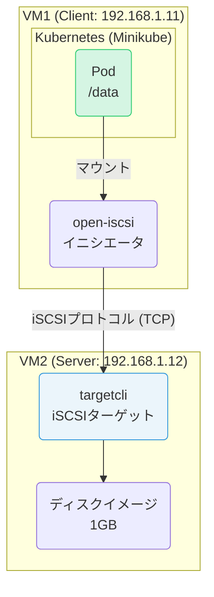

# iSCSI と Kubernetes PersistentVolume 実習

このワークショップでは、伝統的なブロックストレージプロトコルである **iSCSI** を構築し、それを Kubernetes クラスタの永続ボリューム（PersistentVolume）として利用する一連の流れを学びます。

## ゴール

以下の構成を構築し、外部ストレージを Pod からマウントしてデータの永続性を検証します。


```mermaid
graph TD
    subgraph "VM1 (Client: 192.168.1.11)"
        direction LR
        subgraph "Kubernetes (Minikube)"
            Pod("Pod<br>/data")
        end
        ISCSI_Client("open-iscsi<br>イニシエータ")
    end

    subgraph "VM2 (Server: 192.168.1.12)"
        direction LR
        ISCSI_Server("targetcli<br>iSCSIターゲット") --> Disk("ディスクイメージ<br>1GB")
    end

    Pod -- "マウント" --> ISCSI_Client
    ISCSI_Client -- "iSCSIプロトコル (TCP)" --> ISCSI_Server

    style Pod fill:#D5F5E3,stroke:#2ECC71
    style ISCSI_Server fill:#EBF5FB,stroke:#3498DB
```

**この実習で習得すること:**

1. **iSCSI ターゲットの構築**: ネットワーク経由でディスクを提供するサーバーの設定。
2. **iSCSI イニシエータの設定**: クライアント側でのディスク認識とフォーマット。
3. **K8s PV/PVC の連携**: 物理ストレージを抽象化し、Pod へ安全に提供する仕組み。

---

## 状態を持つ（Stateful）アプリケーションの課題

コンテナは本来「使い捨て」であり、再起動すると内部のデータは消失します。

### ❌ 課題

- データベースなどのデータをコンテナ内のディスクに保存すると、Pod の削除と共にデータが消える。
- ローカルディスクにマウントすると、Pod が別のノードに移動した際にデータにアクセスできなくなる。

### ✅ iSCSI と PersistentVolume の解決策

- **外部ストレージ**: データはネットワーク上の専用サーバーに保存され、Pod がどこで動いてもアクセス可能。
- **抽象化 (PV/PVC)**: 開発者は「iSCSI の IP アドレス」などを知る必要はなく、「1GB の容量が欲しい」という要求（PVC）を出すだけで利用可能。

---

## アーキテクチャ

 Kubernetes におけるストレージの抽象化レイヤーと、実際の物理的な接続（iSCSI プロトコル）の関係を理解します。

 ```mermaid
 graph TD
     subgraph K8s_Cluster [VM1: Kubernetes Node / iSCSI Initiator]
         style K8s_Cluster fill:#f9f9f9,stroke:#333,stroke-width:2px
         
         subgraph Logical_Layer [Logic: K8s Resources]
             Pod[Pod]
             PVC[PersistentVolumeClaim<br>(Request 1Gi)]
             PV[PersistentVolume<br>(Pointer to iSCSI)]
             
             Pod -- "mounts" --> PVC
             PVC -- "binds" --> PV
         end
         
         subgraph OS_Layer [Physical: Linux Kernel]
             Device[/dev/sdb<br>Attached Disk]
             Initiator[iSCSI Initiator<br>(open-iscsi)]
             
             PV -. "refers to" .- Device
             Device --- Initiator
         end
     end
 
     subgraph Storage_Server [VM2: iSCSI Target]
         style Storage_Server fill:#e1f5fe,stroke:#0277bd,stroke-width:2px
         Target[iSCSI Target Process]
         Disk[(Disk Image<br>1GB)]
         
         Target -- "reads/writes" --> Disk
     end
 
     Initiator == "iSCSI Protocol (TCP 3260)" ==> Target
 ```

### 重要なポイント

- **論理層 (K8s)**: Pod は「PVC」というチケットを通してストレージを使います。裏側が iSCSI かどうかは知りません。
- **物理層 (OS)**: 実際には VM1 の OS (Linux) が VM2 と TCP 通信を行い、`/dev/sdb` などのデバイスとして認識しています。K8s はこれを Pod に貸し出しているだけです。

### 想定ディレクトリ構造

```text
~/
├── iscsi-pv.yaml    # 物理ストレージ定義 (Admin)
├── iscsi-pvc.yaml   # ストレージ要求定義 (Developer)
└── test-pod.yaml    # 利用する Pod の定義
```

---

## 準備

### 1. VM の用意

- **VM1:** `192.168.1.11` (Client & K8s Node)
- **VM2:** `192.168.1.12` (iSCSI Target)

### 2. 前提条件

- VM1, VM2 ともに Ubuntu 24.04 (RAM 4GB 以上推奨)。
- ファイアウォールが適切に設定（または無効化）されていること。

---

## 実習ステップ

### STEP 1: iSCSI ターゲットの構築 (VM2)

ストレージを提供するサーバー側の設定を行います。

```bash
# パッケージインストール
sudo apt update && sudo apt install -y targetcli-fb

# 1GB の仮想ディスクイメージ作成
sudo truncate -s 1G /var/lib/iscsi_disk.img

# ターゲット設定
sudo targetcli /iscsi create iqn.2025-12.world.server:storage
sudo targetcli /backstores/fileio create disk01 /var/lib/iscsi_disk.img
sudo targetcli /iscsi/iqn.2025-12.world.server:storage/tpg1/luns create /backstores/fileio/disk01
```

次に、VM1 からの接続を許可します。
※ VM1 で `cat /etc/iscsi/initiatorname.iscsi` を実行して IQN を確認してください。

```bash
# VM1のIQNを使ってアクセス許可
sudo targetcli /iscsi/iqn.2025-12.world.server:storage/tpg1/acls create <VM1_IQN>
sudo targetcli saveconfig
```

### STEP 2: 手動マウントによる動作確認 (VM1)

Kubernetes に通す前に、OS レベルで接続できるか確認します。

```bash
sudo apt update && sudo apt install -y open-iscsi
sudo systemctl enable --now iscsid

# ターゲット検出とログイン
sudo iscsiadm -m discovery -t sendtargets -p 192.168.1.12
sudo iscsiadm -m node --targetname iqn.2025-12.world.server:storage --portal 192.168.1.12:3260 --login

# ディスクの確認とフォーマット
lsblk # /dev/sdb 等が増えているはず
sudo mkfs.ext4 /dev/sdb
```

### STEP 3: Kubernetes (Minikube) の準備 (VM1)

```bash
# Minikube インストール (簡略化)
curl -Lo minikube https://storage.googleapis.com/minikube/releases/latest/minikube-linux-amd64 && sudo install minikube /usr/local/bin/

# 起動 (リソース節約のため --driver=none を推奨)
sudo minikube start --driver=none
```

### STEP 4: PV と PVC の適用

物理ストレージを Kubernetes に登録し、要求（Claim）を出します。

1. **PersistentVolume (iscsi-pv.yaml)**

    ```yaml
    apiVersion: v1
    kind: PersistentVolume
    metadata:
      name: iscsi-pv
    spec:
      capacity:
        storage: 1Gi
      accessModes: [ReadWriteOnce]
      iscsi:
        targetPortal: "192.168.1.12:3260"
        iqn: "iqn.2025-12.world.server:storage"
        lun: 0
        fsType: 'ext4'
    ```

2. **PersistentVolumeClaim (iscsi-pvc.yaml)**

    ```yaml
    apiVersion: v1
    kind: PersistentVolumeClaim
    metadata:
      name: iscsi-pvc
    spec:
      accessModes: [ReadWriteOnce]
      resources:
        requests:
          storage: 1Gi
    ```

```bash
kubectl apply -f iscsi-pv.yaml
kubectl apply -f iscsi-pvc.yaml
kubectl get pvc # Status が Bound になれば成功
```

### STEP 5: Pod からの利用と永続性確認

```bash
# Pod の起動
kubectl apply -f test-pod.yaml

# 書き込み
kubectl exec test-pod -- sh -c "echo 'Hello persistent' > /data/hello.txt"

# Pod 削除と再起動
kubectl delete pod test-pod
kubectl apply -f test-pod.yaml

# 読み取り確認
kubectl exec test-pod -- cat /data/hello.txt
# -> "Hello persistent" と出れば永続化成功！
```

---

## Clean Architecture のポイント

Kubernetes のストレージ管理は、**「インフラの詳細（IP, プロトコル）」と「アプリの要求（容量）」を分離**する、まさに Clean Architecture 的なアプローチです。

- **PV**: インフラ層（どのサーバーのどのディスクかを知っている）。
- **PVC**: ユースケース層（どのようなストレージが必要かという意図を持つ）。
- **Pod**: エンティティ/ビジネスロジック層（データがあれば、背後のストレージが iSCSI か NFS かは問わない）。

---

## 片付け

```bash
kubectl delete -f test-pod.yaml
kubectl delete -f iscsi-pvc.yaml
kubectl delete -f iscsi-pv.yaml
sudo minikube delete
sudo iscsiadm -m node --logout
```

---

## 参考文献

- [Kubernetes Documentation: Persistent Volumes](https://kubernetes.io/docs/concepts/storage/persistent-volumes/)
- [Open-iSCSI Official Site](http://www.open-iscsi.com/)
