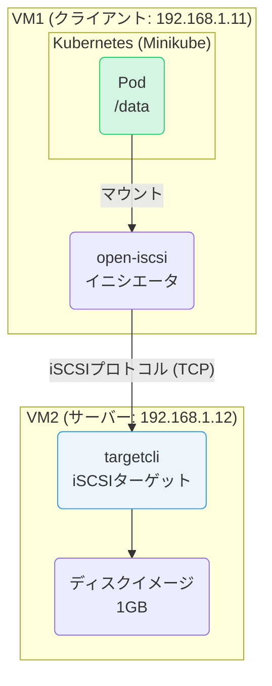
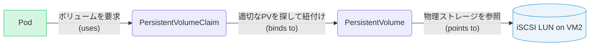

# iSCSIとKubernetes PersistentVolume 実習

## はじめに

このワークショップでは、iSCSI ストレージプロトコルを学び、それを Kubernetes クラスタの永続ボリューム（PersistentVolume）として利用する方法を実践的に学びます。安価で伝統的な IP ベースのブロックストレージである iSCSI を Kubernetes で活用するスキルを習得することを目的とします。

**学習内容:**

* Ubuntu 上での iSCSI ターゲット（サーバー）の構築
* iSCSI イニシエータ（クライアント）からの手動接続とマウント
* Minikube を使った軽量 Kubernetes 環境の構築
* iSCSI ボリュームを PersistentVolume および PersistentVolumeClaim として定義
* Pod から iSCSI ボリュームをマウントし、データの永続性を確認

**前提条件:**

* Ubuntu 24.04 がインストールされた仮想マシン（VM）が 2 台準備されていること。
* 各 VM の RAM は 4GB 以上であること。
* 2 台の VM 間で相互にネットワーク通信が可能であること。
* ファイアウォールが適切に設定されているか、無効になっていること。
* このガイドでは、以下の IP アドレスを例として使用します。ご自身の環境に合わせて適宜読み替えてください。
  * **VM1**: `192.168.1.11` (iSCSI クライアント & Kubernetes ノード)
  * **VM2**: `192.168.1.12` (iSCSI ターゲット/サーバー)

### 全体構成図

このワークショップで構築する環境の全体像は以下の通りです。


```mermaid
graph TD
    subgraph "VM1 (クライアント: 192.168.1.11)"
        direction LR
        subgraph "Kubernetes (Minikube)"
            Pod("Pod<br>/data")
        end
        ISCSI_Client("open-iscsi<br>イニシエータ")
    end

    subgraph "VM2 (サーバー: 192.168.1.12)"
        direction LR
        ISCSI_Server("targetcli<br>iSCSIターゲット") --> Disk("ディスクイメージ<br>1GB")
    end

    Pod -- "マウント" --> ISCSI_Client
    ISCSI_Client -- "iSCSIプロトコル (TCP)" --> ISCSI_Server

    style Pod fill:#D5F5E3,stroke:#2ECC71
    style ISCSI_Server fill:#EBF5FB,stroke:#3498DB
```

---

## フェーズ1: iSCSIサーバーの構築と手動マウント

### ステップ1: iSCSIターゲットの構築 (VM2で実行)

まず、ストレージを提供する側である iSCSI ターゲット（サーバー）を VM2 に構築します。

1. **パッケージのインストール**

    iSCSI ターゲットを管理するための`targetcli-fb`をインストールします。

    ```bash
    sudo apt update
    sudo apt install -y targetcli-fb
    ```

2. **ディスクイメージファイルの作成**

    物理ディスクの代わりに、バックエンドストレージとして 1GB のイメージファイルを作成します。

    ```bash
    sudo truncate -s 1G /var/lib/iscsi_disk.img
    ```

3. **iSCSIターゲットの設定**

    `targetcli` を使って設定を行います。ここでは分かりやすくするため、IQN を明示的に指定します。

    ```bash
    sudo targetcli /iscsi create iqn.2025-12.world.server:storage
    sudo targetcli /backstores/fileio create disk01 /var/lib/iscsi_disk.img
    sudo targetcli /iscsi/iqn.2025-12.world.server:storage/tpg1/luns create /backstores/fileio/disk01
    ```

    次に、VM1 からのアクセスを許可するための設定（ACL）を行いますが、その前に VM1 の IQN を確認する必要があります。

4. **VM1のIQNを確認 (VM1で実行)**

    VM1 に iSCSI イニシエータツールをインストールし、その IQN（iSCSI 修飾名）を確認します。

    ```bash
    # VM1で実行
    sudo apt update
    sudo apt install -y open-iscsi
    cat /etc/iscsi/initiatorname.iscsi
    ```

    `InitiatorName=` に続く `iqn.1993-08.org.debian:01:xxxxxxxxxxxx` のような文字列をメモしてください。

5. **ACLの設定と保存 (VM2で実行)**

    メモした VM1 の IQN を使って、VM2 でアクセス許可を設定します。

    ```bash
    # <VM1のIQN> を先ほどメモした値に置き換えてください
    sudo targetcli /iscsi/iqn.2025-12.world.server:storage/tpg1/acls create iqn.1993-08.org.debian:01:xxxxxxxxxxxx

    # 設定を保存
    sudo targetcli saveconfig
    ```

    これで iSCSI ターゲットの準備は完了です。

### ステップ2: iSCSIディスクの手動マウント (VM1で実行)

次に、VM1 から VM2 の iSCSI ディスクに接続し、マウントできることを確認します。

1. **サービスの起動とターゲットの検出**

    ```bash
    sudo systemctl enable --now iscsid
    sudo iscsiadm -m discovery -t sendtargets -p 192.168.1.12
    ```

2. **ターゲットへのログイン**

    ```bash
    sudo iscsiadm -m node --targetname iqn.2025-12.world.server:storage --portal 192.168.1.12:3260 --login
    ```

3. **ディスクの確認**

    新しいブロックデバイス（例: `/dev/sdb`）が認識されているか確認します。ログイン前後で `lsblk` を比較すると分かりやすいです。

    ```bash
    lsblk
    ```

4. **フォーマットとマウント**

    新しいディスクを `ext4` でフォーマットし、マウントします。**注意: デバイス名（/dev/sdb等）は環境によって異なる場合があります。**

    ```bash
    # デバイス名を lsblk の結果に合わせて適宜変更してください
    sudo mkfs.ext4 /dev/sdb
    sudo mkdir -p /mnt/iscsi_test
    sudo mount /dev/sdb /mnt/iscsi_test
    ```

5. **動作確認**

    マウントしたディレクトリにファイルを書き込んでみます。

    ```bash
    sudo sh -c "echo 'Hello iSCSI' > /mnt/iscsi_test/hello.txt"
    cat /mnt/iscsi_test/hello.txt
    ```

    `Hello iSCSI`と表示されれば成功です。

6. **後片付け**

    次のフェーズのために、マウントを解除しておきます。

    ```bash
    sudo umount /mnt/iscsi_test
    ```

---

## フェーズ2: Kubernetesとの連携

### Kubernetesにおけるストレージの仕組み

フェーズ 2 では、フェーズ 1 で作成した iSCSI ディスクを Kubernetes の永続ボリュームとして利用します。Kubernetes の Pod が外部ストレージを利用する際の主要なリソースの関係は以下の通りです。


```mermaid
graph LR
    A[Pod] -- "ボリュームを要求<br>(uses)" --> B(PersistentVolumeClaim);
    B -- "適切なPVを探して紐付け<br>(binds to)" --> C(PersistentVolume);
    C -- "物理ストレージを参照<br>(points to)" --> D[(iSCSI LUN on VM2)];

    style A fill:#D5F5E3,stroke:#2ECC71
    style D fill:#EBF5FB,stroke:#3498DB
```

1. **Pod**: アプリケーションが動作するコンテナ。マウントしたいボリュームを`PersistentVolumeClaim`の名前で指定します。
2. **PersistentVolumeClaim (PVC)**: 「1Gi の高速なストレージが欲しい」といった、ストレージに対する要求です。
3. **PersistentVolume (PV)**: iSCSI ディスクや NFS、クラウドストレージといった、実際に存在するストレージの詳細情報（接続先 IP、パスなど）を定義したものです。

この仕組みにより、Pod は物理的なストレージの詳細を意識することなく、PVC という抽象的な要求を通じてストレージを利用できます。

### ステップ3: Minikube環境の構築 (VM1で実行)

VM1 に軽量 Kubernetes である Minikube をインストールします。

1. **Podmanと依存パッケージのインストール**

    コンテナランタイム（Podman）と、Minikube の動作に必要なネットワークツールをインストールします。

    ```bash
    sudo apt update
    sudo apt install -y podman conntrack socat
    ```

2. **kubectlのインストール**

    Kubernetes クラスタを操作する CLI ツール`kubectl`をインストールします。

    ```bash
    curl -LO "https://dl.k8s.io/release/$(curl -L -s https://dl.k8s.io/release/stable.txt)/bin/linux/amd64/kubectl"
    sudo install -o root -g root -m 0755 kubectl /usr/local/bin/kubectl
    ```

3. **Minikubeのインストール**

    ```bash
    curl -Lo minikube https://storage.googleapis.com/minikube/releases/latest/minikube-linux-amd64
    sudo install minikube /usr/local/bin/
    ```

4. **Minikubeの起動**

    **【重要】** RAM 4GB の環境では、リソース節約のために `--driver=none` を使用するのが最適です。これにより、Minikube は VM を作らず、ホスト OS 上で直接 Kubernetes コンポーネントを実行します。また、iSCSI デバイスを Pod から直接マウントする際、ホストの `iscsiadm` を利用できるため設定が非常に簡単になります。

    ```bash
    # open-iscsiサービスが起動している必要がある
    sudo systemctl enable --now iscsid

    # noneドライバを使用し、Podmanをコンテナランタイムとして連携させる
    # (注意: noneドライバはsudoで実行する必要があります)
    sudo minikube start --driver=none --container-runtime=podman
    ```

    `kubectl is now configured to use "minikube"`と表示されたら成功です。

5. **クラスタの確認**

    ```bash
    kubectl get nodes
    ```

    VM1 が`Ready`状態で表示されるはずです。

### ステップ4: KubernetesからiSCSIボリュームを利用する

いよいよ iSCSI ディスクを Kubernetes の永続ボリュームとして利用します。

> **注意:** この手順ではKubernetesのin-tree iSCSIボリュームプラグインを利用します。新しいバージョンのKubernetesではCSIドライバの使用が推奨されていますが、学習しやすさを優先し、今回はより簡単なin-tree方式を採用します。この機能を使うには、Kubernetesの各ノード（今回はVM1）に`open-iscsi`パッケージがインストールされている必要があります（ステップ2でインストール済み）。

1. **PersistentVolume (PV) の作成**

    iSCSI ディスクの情報を定義した`PersistentVolume`を作成します。以下の内容で`iscsi-pv.yaml`を作成してください。`targetPortal`と`iqn`はご自身の環境に合わせて修正してください。

    ```yaml
    # iscsi-pv.yaml
    apiVersion: v1
    kind: PersistentVolume
    metadata:
      name: iscsi-pv
    spec:
      capacity:
        storage: 1Gi
      accessModes:
        - ReadWriteOnce
      iscsi:
        targetPortal: "192.168.1.12:3260"
        iqn: "iqn.2025-12.world.server:storage" # VM2で設定したIQN
        lun: 0
        fsType: 'ext4'
        readOnly: false
    ```

2. **PersistentVolumeClaim (PVC) の作成**

    Pod がストレージを要求するための`PersistentVolumeClaim`を作成します。以下の内容で`iscsi-pvc.yaml`を作成します。

    ```yaml
    # iscsi-pvc.yaml
    apiVersion: v1
    kind: PersistentVolumeClaim
    metadata:
      name: iscsi-pvc
    spec:
      accessModes:
        - ReadWriteOnce
      resources:
        requests:
          storage: 1Gi
    ```

3. **PVとPVCの適用**

    ```bash
    kubectl apply -f iscsi-pv.yaml
    kubectl apply -f iscsi-pvc.yaml
    ```

    `kubectl get pv,pvc`を実行し、ステータスが`Bound`になっていることを確認します。

4. **Podからボリュームをマウント**

    この PVC を使用する Pod を作成します。以下の内容で`test-pod.yaml`を作成します。

    ```yaml
    # test-pod.yaml
    apiVersion: v1
    kind: Pod
    metadata:
      name: test-pod
    spec:
      containers:
      - name: test-container
        image: busybox
        command: ["/bin/sh", "-c", "sleep 3600"]
        volumeMounts:
        - name: iscsi-storage
          mountPath: "/data"
      volumes:
      - name: iscsi-storage
        persistentVolumeClaim:
          claimName: iscsi-pvc
    ```

5. **Podの作成と動作確認**

    Pod を作成し、iSCSI ボリュームがマウントされていることを確認します。

    ```bash
    kubectl apply -f test-pod.yaml

    # PodがRunningになるまで待つ
    kubectl get pod test-pod -w

    # Podに入り、マウントされたディレクトリにファイルを書き込む
    kubectl exec -it test-pod -- sh -c "echo 'Hello from K8s Pod' > /data/k8s_test.txt"

    # ファイルが書き込まれたことを確認
    kubectl exec -it test-pod -- cat /data/k8s_test.txt
    ```

    `Hello from K8s Pod`と表示されるはずです。

6. **データの永続性を確認**

    Pod を一度削除し、再度作成してもデータが残っていることを確認します。

    ```bash
    # Podを削除
    kubectl delete pod test-pod

    # 再度Podを作成
    kubectl apply -f test-pod.yaml

    # PodがRunningになったら、ファイルが残っているか確認
    kubectl exec -it test-pod -- cat /data/k8s_test.txt
    ```

    再び`Hello from K8s Pod`と表示されれば、データが iSCSI ボリュームに永続化されていることが確認できました。

---

## おわりに

お疲れ様でした。このワークショップを通じて、iSCSI の基本的な仕組みから、Kubernetes クラスタで外部ストレージを永続ボリュームとして利用する一連の流れを体験しました。

**クリーンアップ:**
環境を元に戻すには、以下のコマンドを実行します。

```bash
# Kubernetesリソースの削除
kubectl delete -f test-pod.yaml
kubectl delete -f iscsi-pvc.yaml
kubectl delete -f iscsi-pv.yaml

# Minikubeの停止と削除
sudo minikube stop
sudo minikube delete

# iSCSIターゲットからのログアウト (VM1)
sudo iscsiadm -m node --logout

# iSCSIターゲット設定の削除 (VM2)
sudo targetcli clearconfig confirm=True
```
