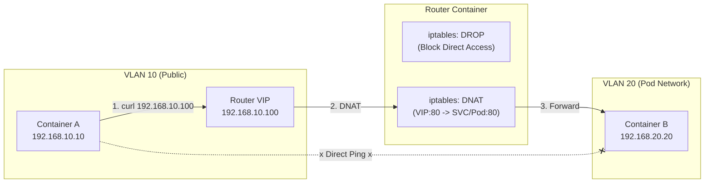
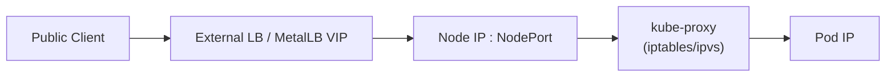

# K8s Service (LoadBalancer) Workshop: Building a Virtual LB with iptables

This workshop extends the environment from [vlan_en.md](./vlan_en.md).
We will learn how Kubernetes `Service (Type: LoadBalancer)` and `MetalLB` manipulate packets behind the scenes by reproducing the behavior using standard Linux features.

## Goal

The ultimate goal of this workshop is to **"access a service running on an internal Kubernetes Pod network from an external public network via a Virtual IP (VIP)."**

Specifically, we will understand and control the communication between the following network configurations:

* **`192.168.10.0/24` (VLAN 10):** This will be treated as the "public network" that users access.
* **`192.168.20.0/24` (VLAN 20):** This will be treated as the "internal network (Pod network)" where Kubernetes Pods run.
* **`192.168.10.100`:** This is the Virtual IP (VIP) we will create on the public network, serving as the single point of entry from the outside.



## How K8s Actually Forwards

LoadBalancer is split into **"VIP advertisement"** and **"forwarding from Service/NodePort to Pods."**
`kube-proxy` is responsible for the latter by programming iptables/ipvs DNAT/SNAT rules.



In this workshop, the **Router container plays LB + Node + kube-proxy** in one place.

## Prerequisites

* Complete up to Step 6 of `vlan_en.md`. Containers `a`, `b`, and `router` must be running.

---

## Step 1. Prepare the Web Server

Start a simple web server on the Pod side (Container B).

```bash
# Install netcat if missing
sudo podman exec b apk add --no-cache busybox-extras

# Start a simple HTTP server on Container B (Port 80)
sudo podman exec -d b sh -c "while true; do echo -e 'HTTP/1.1 200 OK\n\nHello from Pod B' | nc -l -p 80; done"
```

---

## Step 2. Network Isolation (Firewall)

For this experiment, we block direct communication from VLAN 10 (Public) to VLAN 20 (Pod).
In K8s, it is a principle to "use Service IP instead of accessing Pod IP directly." We will forcibly reproduce this.

```bash
# Add a rule to block forwarding on the Router
sudo podman exec router iptables -I FORWARD -i eth0 -o eth1 -j DROP
```

**Verification:**
Confirm that Ping from Container A to B fails.

```bash
sudo podman exec a ping -c 2 192.168.20.20
# Result: 100% packet loss (Unreachable)
```

---

## Step 3. Configure VIP (Virtual IP)

Add a new IP address (`192.168.10.100`) to the router's VLAN 10 interface (`eth0`).
This corresponds to the **LoadBalancer IP (External IP)** in K8s.

```bash
# Add IP to eth0
sudo podman exec router ip addr add 192.168.10.100/32 dev eth0
```

* **Note:** `/32` means a single host IP (just this VIP). MetalLB (L2 mode) does essentially the same thing. For ARP requests ("Who has this IP?"), the router answers "I have it (here is the MAC address)."

---

## Step 4. Configure DNAT (Destination NAT)

This is the **core of K8s Services**.
Write a rule to "Forward access destined for VIP (`192.168.10.100`) to Pod B (`192.168.20.20`)."

```bash
# DNAT Rule: If destination is 10.100:80, rewrite to 20.20:80
sudo podman exec router iptables -t nat -A PREROUTING \
  -d 192.168.10.100 -p tcp --dport 80 \
  -j DNAT --to-destination 192.168.20.20:80
```

---

## Step 5. Handle Return Traffic (SNAT)

Since we blocked "Direct Communication" in Step 2, the reply from Pod B cannot return to Client A (or routing inconsistencies will occur).
Therefore, we add a setting (SNAT) to "make it appear to Pod B that the request came from the Router (`192.168.20.1`)."

```bash
# SNAT (Masquerade) Rule
# If destination is 20.20:80, rewrite source to Router's IP
sudo podman exec router iptables -t nat -A POSTROUTING \
  -d 192.168.20.20 -p tcp --dport 80 \
  -j MASQUERADE
```

* **Note:** In K8s, `kube-proxy` configures these automatically. Also, when using Cloud LBs, similar translation occurs when forwarding to `NodePort`.

---

## Step 6. Verify Operation

Access the VIP (`192.168.10.100`) from Container A.

```bash
# Install curl (if not installed)
sudo podman exec a apk add --no-cache curl

# Access VIP
sudo podman exec a curl http://192.168.10.100
```

**Expected Result:**

```text
Hello from Pod B
```

We confirmed that while direct access to Container B's IP (`20.20`) is blocked, access is possible via the VIP (`10.100`). This is the fundamental behavior of a Load Balancer.

**Cleanup (optional):** remove the temporary firewall rule after the experiment.

```bash
sudo podman exec router iptables -D FORWARD -i eth0 -o eth1 -j DROP
```

---

## Explanation: Mapping to K8s

| This Workshop | K8s Component / Setting |
| :--- | :--- |
| `ip addr add 192.168.10.100` | **MetalLB (Speaker)** <br> The elected leader node advertises the IP. |
| `iptables ... -j DNAT` | **kube-proxy** <br> Translates access to Service/NodePort to Pod IP. |
| `iptables ... -j DROP` | **NetworkPolicy** (Deny All) <br> Blocks unnecessary direct communication. |

**Note:** kube-proxy does not own VIPs; it only forwards Service/NodePort traffic to Pods. VIP advertisement is handled by the LB side (MetalLB or cloud LB).

Through this workshop, you should understand that a Load Balancer is not "magic," but a combination of **"IP Address Advertisement"** and **"Packet Destination Rewriting (NAT)."**

---

### Advanced Topic: Programmatic Automation of Kubernetes

In this workshop, we learned the low-level mechanics of a LoadBalancer using basic Linux features like `iptables`. In real-world operations, it is common to use the `kubectl` command, but for more advanced automation, the Kubernetes API is often manipulated directly from a program.

The provided code snippets (like the `K8sHandler` class) are a perfect example of a toolset for that purpose.

#### What Can This Toolset Do?

This type of Python code allows you to perform many of the same actions as `kubectl`, but programmatically.

* **Create/Update Resources (`apply_yaml`, `manage_k8s_resource`)**
  * You can deploy a full set of resources from a YAML file, just like `kubectl apply -f my-app.yaml`.
  * You can create, update, or delete individual resources, similar to `kubectl create deployment ...`.
  * By integrating this into a CI/CD pipeline, you can achieve things like automatically deploying an application when code is pushed to a Git repository.

* **Information Retrieval and Monitoring (`list_k8s_resources`, `get_pod_logs`, `get_k8s_events`)**
  * You can retrieve the state of resources within the cluster or fetch logs, just like `kubectl get pods` or `kubectl logs my-pod`.
  * This enables the creation of automated monitoring tools, for example, a system that automatically collects logs and sends a notification when a Pod enters an abnormal state.

* **Standardize Manifests (`generate_app_manifest`)**
  * You can automatically generate standardized `Deployment` and `Service` YAML just by providing an application name and a Docker image name.
  * This helps prevent configuration drift within a team and ensures consistent quality for all deployments.

* **Cloud Integration (`K8sClientCache`, etc.)**
  * Managed Kubernetes services like Amazon EKS use cloud-specific authentication methods (in this case, AWS IAM). The provided code encapsulates this complexity, allowing for transparent authentication to make Kubernetes API calls.

#### How It Relates to This Workshop

The **"VIP advertisement"** and **"packet forwarding (DNAT) to Pods"** that we configured manually with `iptables` in this workshop are handled by `MetalLB` and `kube-proxy` in a real Kubernetes environment.

The `Service` and `ConfigMap` resources that instruct those components—telling them "advertise `192.168.10.100` as a VIP" or "forward traffic for this Service to that Pod"—are themselves created by making calls to the Kubernetes API server, using a **program** like the one shown (or `kubectl`).

Understanding both the low-level packet flow (this workshop) and the high-level, declarative API operations (the example code) is key to mastering Kubernetes.

---

### Appendix: What is MetalLB?

Let's take a closer look at `MetalLB`, which was mentioned in the explanation.

MetalLB is a standard add-on for bare-metal (on-premises) Kubernetes clusters that provides a network load-balancer implementation for the `Service` resource with `type: LoadBalancer`.

#### Why is MetalLB Needed?

In a cloud environment like AWS or GCP, when you specify `type: LoadBalancer` for a `Service`, the cloud provider's own load balancer (e.g., ELB, Cloud Load Balancing) is automatically created and assigned an external IP. However, on-premises environments lack this convenient, built-in mechanism for automatically provisioning external IPs.

MetalLB fills this gap, providing a way to assign external IPs to Services in bare-metal clusters, just like in the cloud.

#### How Does It Work? (L2 Mode)

MetalLB has several modes of operation, but the simplest and most common one is **L2 Mode**.

1. **IP Address Advertisement:**
    * From a pool of IP addresses that you pre-configure, MetalLB assigns one IP address (the VIP) to a `LoadBalancer` Service.
    * **One node** in the cluster is elected to be the "owner" of that VIP.
    * This leader node then advertises to the entire network, "I am the owner of the IP address `192.168.10.100` (at this MAC address)" by **responding to ARP requests**.
    * Running `ip addr add 192.168.10.100/32 dev eth0` in this workshop was a direct simulation of this behavior.

2. **Traffic Reception and Forwarding:**
    * Routers and other machines on the network, having received the ARP response, send all packets destined for the VIP to the leader node.
    * Once the packet reaches the node, it is handed over to `kube-proxy`, which uses its own mechanisms (iptables/ipvs) to forward the packet to its final destination Pod.

3. **Failover:**
    * If the leader node goes down, another node is elected as the new leader, takes over ownership of the VIP, and begins responding to ARP requests. This prevents the leader node from being a single point of failure.

A more advanced **BGP Mode** is also available, which allows for true load balancing and faster failover by peering with a physical router and exchanging routing information.

```
