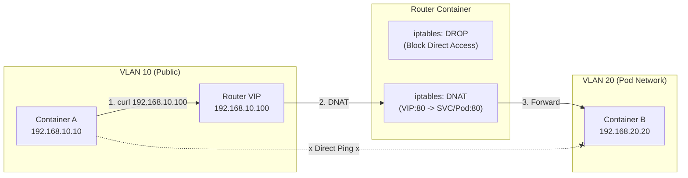

# K8s Service (LoadBalancer) Workshop: Building a Virtual LB with iptables

This workshop extends the environment from [vlan_en.md](./vlan_en.md).
We will learn how Kubernetes `Service (Type: LoadBalancer)` and `MetalLB` manipulate packets behind the scenes by reproducing the behavior using standard Linux features.

## Goal

Build a configuration to access a service running on an internal Kubernetes Pod network from an external public network via a Virtual IP (VIP).


```mermaid
graph LR
    subgraph "VLAN 10 (Public)"
        Client[Container A<br>192.168.10.10]
        VIP[Router VIP<br>192.168.10.100]
    end

    subgraph "Router Container"
        Firewall["iptables: DROP<br>(Block Direct Access)"]
        DNAT["iptables: DNAT<br>(VIP:80 -> SVC/Pod:80)"]
    end

    subgraph "VLAN 20 (Pod Network)"
        Pod[Container B<br>192.168.20.20]
    end

    Client -- "1. curl 192.168.10.100" --> VIP
    VIP -- "2. DNAT" --> DNAT
    DNAT -- "3. Forward" --> Pod
    Client -. "x Direct Ping x" .-x Pod
```

**What you will understand in this workshop:**

1. **VIP Advertisement**: How a specific node acts as the "owner" of an IP address.
2. **Destination NAT (DNAT)**: How traffic destined for a Service IP is distributed to backend Pods.
3. **Source NAT (SNAT)**: Routing control to ensure return packets are processed correctly.

---

## Challenges in Service Exposure

Kubernetes Pods are created and deleted dynamically, and their IP addresses change every time.

### ❌ Challenges

- Direct access to Pod IPs causes connection failures when Pods restart.
- Routing directly to internal networks (Pod NW) from the outside is a security risk.
- Manually creating load balancing mechanisms for multiple Pods is difficult.

### ✅ Service (LoadBalancer) Solutions

- **Immutable IP (VIP)**: Provides a consistent entry point even if backend applications are recreated.
- **Abstraction**: Users only need to know the VIP; `kube-proxy` hides the details of the backend Pods.

---

## Architecture

The Router container takes on the roles of "LB + Node + kube-proxy" all in one.

### Layer Structure and Directory

(Since this workshop primarily involves `iptables` commands, there is no specific directory structure, but it inherits the configuration from the VLAN workshop.)

---

## Preparation

### 1. Prerequisites

- Complete up to STEP 6 of `vlan_en.md`. Containers `a`, `b`, and `router` must be running.

---

## Workshop Steps

### STEP 1: Prepare the Web Server

Start a web server on the Pod side (Container B).

```bash
# Install netcat if missing
sudo podman exec b apk add --no-cache busybox-extras

# Start a simple HTTP server on Container B (Port 80)
sudo podman exec -d b sh -c "while true; do echo -e 'HTTP/1.1 200 OK\n\nHello from Pod B' | nc -l -p 80; done"
```

### STEP 2: Network Isolation (Firewall)

To enforce the principle of "use Service IP instead of accessing Pod IP directly," we block direct communication.

```bash
# Block forwarding at the Router (VLAN 10 -> VLAN 20)
sudo podman exec router iptables -I FORWARD -i eth1 -o eth2 -j DROP
```

*Note: Confirm that Ping from `a` to `b` (192.168.20.20) fails.*

### STEP 3: Configure VIP (Virtual IP)

Add an external-facing IP (`192.168.10.100`) to the router's public interface.

```bash
sudo podman exec router ip addr add 192.168.10.100/32 dev eth1
```

*Note: This causes the router to respond to ARP requests for the VIP (simulating MetalLB behavior).*

### STEP 4: Configure DNAT (Destination NAT)

Write a rule to forward access to the VIP to Pod B (the role of kube-proxy).

```bash
# Rewrite destination 10.100:80 to 20.20:80
sudo podman exec router iptables -t nat -A PREROUTING \
  -d 192.168.10.100 -p tcp --dport 80 \
  -j DNAT --to-destination 192.168.20.20:80
```

### STEP 5: Handle Return Traffic (SNAT)

Rewrite the source IP to the router's IP to ensure responses correctly return via the router.

```bash
sudo podman exec router iptables -t nat -A POSTROUTING \
  -d 192.168.20.20 -p tcp --dport 80 \
  -j MASQUERADE
```

### STEP 6: Verify Operation

```bash
# Access VIP
sudo podman exec a curl http://192.168.10.100
# -> Should output "Hello from Pod B"!
```

---

## Clean Architecture and Automation Perspective

In real Kubernetes, you never perform these `iptables` operations manually.

- **Declarative Configuration**: You create a YAML file like `kind: Service`.
- **Controllers**: MetalLB and kube-proxy detect changes in YAML and automatically generate `iptables` rules.

Understanding both low-level packet manipulation (this workshop) and high-level API-driven operations improves your troubleshooting skills.

---

## Cleanup

```bash
# Delete VIP
sudo podman exec router ip addr del 192.168.10.100/32 dev eth1
# Delete firewall rule
sudo podman exec router iptables -D FORWARD -i eth1 -o eth2 -j DROP
```

---

## References

- [Kubernetes Documentation: Service](https://kubernetes.io/docs/concepts/services-networking/service/)
- [MetalLB Official Site](https://metallb.universe.tf/)
