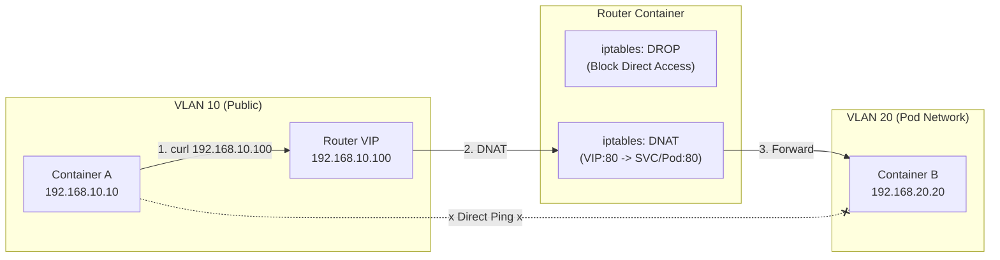

# K8s Service (LoadBalancer) Workshop: Building a Virtual LB with iptables

This workshop extends the environment from [vlan_en.md](./vlan_en.md).
We will learn how Kubernetes `Service (Type: LoadBalancer)` and `MetalLB` manipulate packets behind the scenes by reproducing the behavior using standard Linux features.

> **💡 Glossary**: Please refer to [LoadBalancer](glossary_en.md#network), [iptables](glossary_en.md#network), or [VIP](glossary_en.md#network) in the [Glossary](glossary_en.md) for technical terms used in this workshop.

## Goal

Build a configuration to access a service running on an internal Kubernetes Pod network from an external public network via a Virtual IP (VIP).


```mermaid
graph LR
    subgraph "VLAN 10 (Public)"
        Client[Container A<br>192.168.10.10]
        VIP[Router VIP<br>192.168.10.100]
    end

    subgraph "Router Container"
        Firewall["iptables: DROP<br>(Block Direct Access)"]
        DNAT["iptables: DNAT<br>(VIP:80 -> SVC/Pod:80)"]
    end

    subgraph "VLAN 20 (Pod Network)"
        Pod[Container B<br>192.168.20.20]
    end

    Client -- "1. curl 192.168.10.100" --> VIP
    VIP -- "2. DNAT" --> DNAT
    DNAT -- "3. Forward" --> Pod
    Client -. "x Direct Ping x" .-x Pod
```

**What you will understand in this workshop:**

1. **VIP Advertisement**: How a specific node acts as the "owner" of an IP address.
2. **Destination NAT (DNAT)**: How traffic destined for a Service IP is distributed to backend Pods.
3. **Source NAT (SNAT)**: Routing control to ensure return packets are processed correctly.

---

## Challenges in Service Exposure

Kubernetes Pods are created and deleted dynamically, and their IP addresses change every time.

### ❌ Challenges

- Direct access to Pod IPs causes connection failures when Pods restart.
- Routing directly to internal networks (Pod NW) from the outside is a security risk.
- Manually creating load balancing mechanisms for multiple Pods is difficult.

### ✅ Service (LoadBalancer) Solutions

- **Immutable IP (VIP)**: Provides a consistent entry point even if backend applications are recreated.
- **Abstraction**: Users only need to know the VIP; `kube-proxy` hides the details of the backend Pods.

---

## Architecture

The Router container takes on the roles of "LB + Node + kube-proxy" all in one.

### Packet Flow and Component Mapping

The workshop's `iptables` configuration reproduces the following Kubernetes component roles.

```mermaid
graph LR
    subgraph Public_Net [VLAN 10: Public Network]
        Client[Client Container A<br>192.168.10.10]
    end

    subgraph Router [Router Container (Simulating K8s Node)]
        direction TB
        VIP[VIP: 192.168.10.100<br>(MetalLB Speaker)]

        subgraph KubeProxy [kube-proxy Role]
            DNAT(DNAT: Dest -> Pod IP<br>Service LoadBalancer)
            SNAT(SNAT: Src -> Router IP<br>Masquerade)
        end
    end

    subgraph Pod_Net [VLAN 20: Pod Network]
        Pod[Pod Container B<br>192.168.20.20]
    end

    Client -- "1. Access VIP" --> VIP
    VIP -- "2. Forward" --> DNAT
    DNAT -- "3. Route to Pod" --> Pod
    Pod -. "4. Reply" .-> SNAT
    SNAT -. "5. Restore Src" .-> Client
```

- **VIP (MetalLB)**: Accept traffic for `192.168.10.100` through ARP advertisement.
- **DNAT (kube-proxy)**: Rewrite the destination from the VIP to the Pod IP (`192.168.20.20`).
- **SNAT (kube-proxy)**: Rewrite the source to the router address (`192.168.20.1`) so replies return through the router.

### Layer Structure and Directory

(Since this workshop primarily involves `iptables` commands, there is no specific directory structure, but it inherits the configuration from the VLAN workshop.)

---

## Preparation

### 1. Prerequisites

- Complete up to STEP 6 of `vlan_en.md`. Containers `a`, `b`, and `router` must be running.

---

## Workshop Steps

### STEP 1: Prepare the Web Server

Start a web server on the Pod side (Container B).

```bash
# Install netcat if missing
sudo podman exec b apk add --no-cache busybox-extras

# Start a simple HTTP server on Container B (Port 80)
sudo podman exec -d b sh -c "while true; do echo -e 'HTTP/1.1 200 OK\n\nHello from Pod B' | nc -l -p 80; done"
```

### ✅ Verification Checkpoints

- [ ] Confirmed the web server (nc) is running via `podman exec b ps aux | grep nc`.
- [ ] Confirmed response from `router` via `curl http://192.168.20.20`.

### STEP 2: Network Isolation (Firewall)

To enforce the principle of "use Service IP instead of accessing Pod IP directly," we block direct communication.

```bash
# Block forwarding at the Router (VLAN 10 -> VLAN 20)
sudo podman exec router iptables -I FORWARD -i eth1 -o eth2 -j DROP
```

### ✅ Verification Checkpoints

- [ ] Confirmed `podman exec a ping -c 1 192.168.20.20` fails (timeout).
- [ ] Confirmed direct communication through the router is blocked.

_Note: Confirm that Ping from `a` to `b` (192.168.20.20) fails._

### STEP 3: Configure VIP (Virtual IP)

Add an external-facing IP (`192.168.10.100`) to the router's public interface.

```bash
sudo podman exec router ip addr add 192.168.10.100/32 dev eth1
```

### ✅ Verification Checkpoints

- [ ] Confirmed `192.168.10.100` is added to `eth1` via `podman exec router ip addr show eth1`.
- [ ] Confirmed `podman exec a ping -c 1 192.168.10.100` succeeds.

_Note: This causes the router to respond to ARP requests for the VIP (simulating MetalLB behavior)._

### STEP 4: Configure DNAT (Destination NAT)

Write a rule to forward access to the VIP to Pod B (the role of kube-proxy).

```bash
# Rewrite destination 10.100:80 to 20.20:80
sudo podman exec router iptables -t nat -A PREROUTING \
  -d 192.168.10.100 -p tcp --dport 80 \
  -j DNAT --to-destination 192.168.20.20:80
```

### ✅ Verification Checkpoints

- [ ] Confirmed the DNAT rule is registered via `sudo podman exec router iptables -t nat -L PREROUTING`.

### STEP 5: Handle Return Traffic (SNAT)

Rewrite the source IP to the router's IP to ensure responses correctly return via the router.

```bash
sudo podman exec router iptables -t nat -A POSTROUTING \
  -d 192.168.20.20 -p tcp --dport 80 \
  -j MASQUERADE
```

### STEP 6: Verify Operation

```bash
# Access VIP
# -> Should output "Hello from Pod B"!
```

### ✅ Verification Checkpoints

- [ ] Confirmed communication to `http://192.168.10.100` returns "Hello from Pod B".
- [ ] Confirmed packet counts are increasing via `podman exec router iptables -t nat -L -v`.

---

## Clean Architecture and Automation Perspective

In real Kubernetes, you never perform these `iptables` operations manually.

- **Declarative Configuration**: You create a YAML file like `kind: Service`.
- **Controllers**: MetalLB and kube-proxy detect changes in YAML and automatically generate `iptables` rules.

Understanding both low-level packet manipulation (this workshop) and high-level API-driven operations improves your troubleshooting skills.

---

## Cleanup

```bash
# Delete VIP
sudo podman exec router ip addr del 192.168.10.100/32 dev eth1
# Delete firewall rule
sudo podman exec router iptables -D FORWARD -i eth1 -o eth2 -j DROP
```

---

## References

- [Kubernetes Documentation: Service](https://kubernetes.io/docs/concepts/services-networking/service/)
- [MetalLB Official Site](https://metallb.universe.tf/)

---

## 🔧 Troubleshooting

### Cannot Access VIP

**Symptoms**: `curl: (7) Failed to connect to 192.168.10.100 port 80: Connection timed out`

**Causes and Solutions**:

- **iptables Order**: Re-check that the rule is correctly placed in the `PREROUTING` chain.
- **FORWARD Chain Conflict**: Ensure the `DROP` rule does not block the post-DNAT packets (which typically traversal the FORWARD chain).

### Return Packets Lost

**Symptoms**: Connection hangs or timeouts.

**Causes and Solutions**:

- **Missing MASQUERADE (SNAT)**: If MASQUERADE is missing on the router, Container B will attempt to respond directly to Container A, causing return packets to be lost.

---

## 💻 Environment Notes

### For Linux Users

- Use `iptables` within the `router` container to avoid interference with the host's firewall.

### For macOS / Windows Users

- Works out-of-the-box within the Podman/Docker Desktop Linux VM.
- The VIP is only accessible within the VM network. Extra port-forwarding is needed for host browser access.
