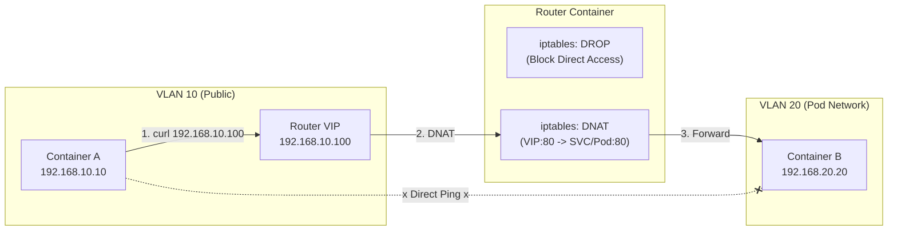
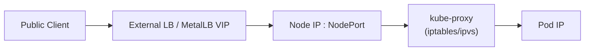

# K8s Service (LoadBalancer) 実習：iptables で作る仮想ロードバランサ

この実習は、[vlan_ja.md](./vlan_ja.md) の環境を拡張して行います。
Kubernetes の `Service (Type: LoadBalancer)` や `MetalLB` が、裏側でどのようにパケットを操作しているかを、Linux の基本機能だけで再現して学びます。

## ゴール

この実習の最終的なゴールは、**「外部の公開ネットワークから、Kubernetes内部のPodネットワークで稼働するサービスへ、仮想IP（VIP）経由でアクセスする」**ことです。

具体的には、以下のネットワーク構成の役割を理解し、その間の通信を制御します。

* **`192.168.10.0/24` (VLAN 10):** ユーザーがアクセスする「公開ネットワーク」として扱います。
* **`192.168.20.0/24` (VLAN 20):** KubernetesのPodが稼働する「内部ネットワーク（Podネットワーク）」として扱います。
* **`192.168.10.100`:** 公開ネットワーク上に作成する仮想IP（VIP）で、これが外部からの唯一のアクセス窓口となります。



## K8s の実際の転送イメージ

LoadBalancer は **「VIP を外側へ広告する仕組み」** と、**「Service/NodePort から Pod へ転送する仕組み」** が分離されています。
後者を担うのが `kube-proxy` で、iptables/ipvs を使って DNAT/SNAT を作ります。



この実習では、**Router コンテナが「LB + Node + kube-proxy」をまとめて再現**します。

## 前提条件

* `vlan_ja.md` の Step 6 まで完了し、コンテナ `a`, `b`, `router` が起動していること。

---

## Step 1. Webサーバーの準備

まず、Pod 側 (Container B) で Web サーバーを起動します。

```bash
# nc が入っていない場合は追加
sudo podman exec b apk add --no-cache busybox-extras

# Container B でシンプルな HTTP サーバーを起動 (ポート 80)
sudo podman exec -d b sh -c "while true; do echo -e 'HTTP/1.1 200 OK\n\nHello from Pod B' | nc -l -p 80; done"
```

---

## Step 2. ネットワークの分断 (Firewall)

実験のため、VLAN 10 (Public) から VLAN 20 (Pod) への直接通信をブロックします。
K8s でも「Pod IP には直接アクセスせず、Service IP を使う」のが原則ですが、それを強制的に再現します。

```bash
# Router で転送をブロックするルールを追加
sudo podman exec router iptables -I FORWARD -i eth0 -o eth1 -j DROP
```

**確認:**
Container A から B への Ping が通らなくなったことを確認します。

```bash
sudo podman exec a ping -c 2 192.168.20.20
# 結果: パケットロス 100% (通信不能)
```

---

## Step 3. VIP (Virtual IP) の設定

ルーターの VLAN 10 側のインタフェース (`eth0`) に、新しい IP アドレス (`192.168.10.100`) を追加します。
これが K8s の **LoadBalancer IP (External IP)** になります。

```bash
# eth0 に IP を追加 (ip addr add)
sudo podman exec router ip addr add 192.168.10.100/32 dev eth0
```

※ **解説:** `/32` は「この 1 つの IP だけ」を意味します。MetalLB (L2モード) もこれと同じことを行います。ARP（「誰がこのIPを持っていますか？」）に対して、ルーターが「私が持っています（MACアドレスはこれです）」と答えるようになります。

---

## Step 4. DNAT (Destination NAT) の設定

ここが **K8s Service の核心** です。
「VIP (`192.168.10.100`) へのアクセスを、Pod B (`192.168.20.20`) へ転送する」ルールを書きます。

```bash
# DNAT ルール: 宛先が 10.100:80 なら、20.20:80 に書き換える
sudo podman exec router iptables -t nat -A PREROUTING \
  -d 192.168.10.100 -p tcp --dport 80 \
  -j DNAT --to-destination 192.168.20.20:80
```

---

## Step 5. 戻りパケットの処理 (SNAT)

Step 2 で「直接通信をブロック」しているため、このままでは Pod B からの返事が Client A に戻れません（またはルーティング上の不整合が起きます）。
そこで、「Pod B から見て、アクセス元が Router (`192.168.20.1`) であるように見せかける」設定 (SNAT) を追加します。

```bash
# SNAT (Masquerade) ルール
# 宛先が 20.20:80 なら、送信元をルーターのIPに書き換える
sudo podman exec router iptables -t nat -A POSTROUTING \
  -d 192.168.20.20 -p tcp --dport 80 \
  -j MASQUERADE
```

※ **解説:** K8s では `kube-proxy` がこれらを自動設定します。また、クラウドLBを使う場合も `NodePort` への転送時に同様の変換が行われます。

---

## Step 6. 動作確認

Container A から、VIP (`192.168.10.100`) にアクセスしてみます。

```bash
# curl をインストール (入っていない場合)
sudo podman exec a apk add --no-cache curl

# VIP にアクセス
sudo podman exec a curl http://192.168.10.100
```

**期待される結果:**

```text
Hello from Pod B
```

Container B の IP (`20.20`) には直接アクセスできないのに、VIP (`10.100`) 経由であればアクセスできることが確認できました。これがロードバランサの基本的な挙動です。

**後片付け（任意）:** 実験用に入れたルールは戻しておきます。

```bash
sudo podman exec router iptables -D FORWARD -i eth0 -o eth1 -j DROP
```

---

## 解説：K8s との対応

| 今回の操作 | K8s のコンポーネント / 設定 |
| :--- | :--- |
| `ip addr add 192.168.10.100` | **MetalLB (Speaker)** <br> リーダー選出されたノードが IP を広報する。 |
| `iptables ... -j DNAT` | **kube-proxy** <br> Service/NodePort へのアクセスを Pod IP に変換する。 |
| `iptables ... -j DROP` | **NetworkPolicy** (Deny All) <br> 不要な直接通信を遮断する。 |

**補足:** kube-proxy は VIP を持たず、Service/NodePort へのトラフィックを Pod に振り分けるだけです。VIP の広告は LB 側（MetalLB やクラウド LB）が担います。

この実習で、ロードバランサが「魔法」ではなく、単なる **「IPアドレスの追加広告」** と **「パケット宛先書き換え (NAT)」** の組み合わせであることが理解できたはずです。

---

### 発展: プログラムによるKubernetesの自動化

このワークショップでは、`iptables`のようなLinuxの基本機能を使ってLoadBalancerの低レベルな仕組みを学びました。実際の運用では、`kubectl`コマンドを使うのが一般的ですが、さらに進んだ自動化の世界では、プログラムからKubernetes APIを直接操作します。

ご提示いただいた`K8sHandler`クラスのようなコードは、まさにそのためのツール群の一例です。

#### このツール群で何ができるのか？

この種のPythonコードは、`kubectl`でできることの多くをプログラムとして実行可能にします。

* **リソースの作成・更新 (`apply_yaml`, `manage_k8s_resource`)**
  * `kubectl apply -f my-app.yaml`のように、YAMLファイルからリソース一式をデプロイできます。
  * `kubectl create deployment ...`のように、個別のリソースを作成・更新・削除できます。
  * CI/CDパイプラインに組み込むことで、Gitへのプッシュをトリガーにアプリケーションを自動でデプロイする、といったことが実現できます。

* **情報取得と監視 (`list_k8s_resources`, `get_pod_logs`, `get_k8s_events`)**
  * `kubectl get pods`や`kubectl logs my-pod`のように、クラスタ内のリソース状態やログを取得できます。
  * これらを使って、特定のPodが異常な状態になったら自動でログを収集して通知する、といった監視の自動化ツールを作成できます。

* **マニフェストの標準化 (`generate_app_manifest`)**
  * アプリケーション名やDockerイメージ名を渡すだけで、標準化された`Deployment`や`Service`のYAMLを自動生成できます。
  * これにより、チーム内での設定のばらつきを防ぎ、一貫した品質でのデプロイが可能になります。

* **クラウド連携 (`K8sClientCache`など)**
  * Amazon EKSのようなマネージドKubernetesでは、クラスタへの接続にクラウド独自の認証方式（この例ではAWS IAM）が使われます。提示されたコードは、そうした複雑な認証を処理して、透過的にKubernetes APIを叩けるようにする仕組みも内包しています。

#### このワークショップの仕組みとの関係

このワークショップで`iptables`を使って手動で設定した**「VIPの広告」**や**「Podへのパケット転送(DNAT)」**は、実際のKubernetes環境では`MetalLB`や`kube-proxy`が担っています。

そして、それらのコンポーネントに「`192.168.10.100`をVIPとして公開しなさい」とか「このServiceはあのPodに転送しなさい」と指示を出す`Service`リソースや`ConfigMap`リソースそのものは、今回見たような**プログラム（または`kubectl`）**を通じてKubernetes APIサーバーに登録されるのです。

低レベルなパケットの流れ（本ワークショップ）と、高レベルなAPIによる宣言的な操作の両方を理解することが、Kubernetesを深く使いこなす鍵となります。

---

### 付録: MetalLBとは？

このワークショップの解説で名前が挙がった`MetalLB`について、もう少し詳しく見てみましょう。

MetalLBは、ベアメタル（オンプレミス）環境のKubernetesクラスタで `Service` の `type: LoadBalancer` を実現するための、標準的なアドオンソフトウェアです。

#### なぜMetalLBが必要か？

AWSやGCPのようなクラウド環境で`type: LoadBalancer`を指定すると、クラウドプロバイダーが提供するロードバランサ（ELB, Cloud Load Balancingなど）が自動的に作成され、外部IPが割り当てられます。しかし、オンプレミス環境には、そのように外部IPを自動で払い出してくれる便利な仕組みがありません。

MetalLBは、このギャップを埋め、オンプレミス環境でもクラウドと同じように、Serviceに外部IPを付与する機能を提供します。

#### どうやって動くのか？ (L2モード)

MetalLBにはいくつかの動作モードがありますが、最もシンプルで一般的なのが**L2モード**です。

1. **IPアドレスの広告:**
    * ユーザーが予め設定したIPアドレスプールから、`LoadBalancer` ServiceにIPアドレス（VIP）を1つ割り当てます。
    * クラスタ内のいずれか**1つのノード**が、そのVIPの「担当」になります。
    * 担当ノードは、ネットワーク全体に対して「`192.168.10.100`というIPアドレスは、私（のMACアドレス）が持っています」と**ARPリクエストに応答**して広告します。
    * このワークショップで`ip addr add 192.168.10.100/32 dev eth0`を実行したのは、まさにこの挙動のシミュレーションです。

2. **トラフィックの受信と転送:**
    * ARPを受け取ったルーターや他のマシンは、VIP宛てのパケットをすべて担当ノードに送ります。
    * パケットを受け取ったノードは、`kube-proxy`の機能（iptables/ipvs）を使って、そのパケットを最終的な目的地のPodへと転送します。

3. **フェイルオーバー:**
    * 担当ノードがダウンした場合、別のノードがリーダーとなり、VIPの担当を引き継いでARPの応答を開始します。これにより、単一障害点になることを防いでいます。

より高度な**BGPモード**では、物理ルーターと連携して経路情報を交換し、より効率的な負荷分散や高速なフェイルオーバーを実現することも可能です。
