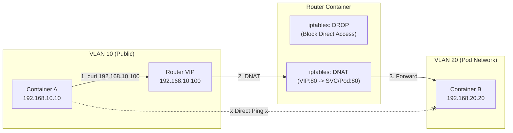

# K8s Service (LoadBalancer) 実習：iptables で作る仮想ロードバランサ

この実習は、[vlan_ja.md](./vlan_ja.md) の環境を拡張して行います。
Kubernetes の `Service (Type: LoadBalancer)` や `MetalLB` が、裏側でどのようにパケットを操作しているかを、Linux の基本機能だけで再現して学びます。

## ゴール

外部の公開ネットワークから、Kubernetes 内部の Pod ネットワークで稼働するサービスへ、仮想 IP（VIP）経由でアクセスする構成を構築します。


```mermaid
graph LR
    subgraph "VLAN 10 (Public)"
        Client[Container A<br>192.168.10.10]
        VIP[Router VIP<br>192.168.10.100]
    end

    subgraph "Router Container"
        Firewall["iptables: DROP<br>(Block Direct Access)"]
        DNAT["iptables: DNAT<br>(VIP:80 -> SVC/Pod:80)"]
    end

    subgraph "VLAN 20 (Pod Network)"
        Pod[Container B<br>192.168.20.20]
    end

    Client -- "1. curl 192.168.10.100" --> VIP
    VIP -- "2. DNAT" --> DNAT
    DNAT -- "3. Forward" --> Pod
    Client -. "x Direct Ping x" .-x Pod
```

**この実習で理解すること:**

1. **VIP の広告**: 特定のノードが代表して IP を「自分のもの」として振る舞う仕組み。
2. **宛先変換 (DNAT)**: サービス用の IP 宛の通信を、背後の Pod へ振り分ける仕組み。
3. **送信元変換 (SNAT)**: 戻りパケットを正しく処理するための経路制御。

---

## サービス公開の課題

Kubernetes の Pod は動的に作成・削除され、そのたびに IP アドレスが変わります。

### ❌ 課題

- Pod の IP アドレスを直接指定してアクセスすると、再起動時に通信が切れる。
- 外部から内部ネットワーク（Pod NW）へ直接ルーティングを通すのはセキュリティ上のリスクがある。
- 複数の Pod に負荷分散させる仕組みを個別に作るのは大変。

### ✅ Service (LoadBalancer) の解決策

- **不変の IP (VIP)**: アプリケーションが何回作り直されても変わらないアクセス先を提供。
- **抽象化**: ユーザーは VIP だけを知っていればよく、背後の Pod の詳細は `kube-proxy` が隠蔽。

---

## アーキテクチャ

 Router コンテナが「LB + Node + kube-proxy」の役割をすべて担います。

### パケットフローとコンポーネントの対応

 実習で行う `iptables` 設定は、Kubernetes の以下のコンポーネントの挙動を再現しています。

 ```mermaid
 graph LR
     subgraph Public_Net [VLAN 10: Public Network]
         Client[Client Container A<br>192.168.10.10]
     end
 
     subgraph Router [Router Container (Simulating K8s Node)]
         direction TB
         VIP[VIP: 192.168.10.100<br>(MetalLB Speaker)]
         
         subgraph KubeProxy [kube-proxy Role]
             DNAT(DNAT: Dest -> Pod IP<br>Service LoadBalancer)
             SNAT(SNAT: Src -> Router IP<br>Masquerade)
         end
     end
 
     subgraph Pod_Net [VLAN 20: Pod Network]
         Pod[Pod Container B<br>192.168.20.20]
     end
 
     Client -- "1. Access VIP" --> VIP
     VIP -- "2. Forward" --> DNAT
     DNAT -- "3. Route to Pod" --> Pod
     Pod -. "4. Reply" .-> SNAT
     SNAT -. "5. Restore Src" .-> Client
 ```

- **VIP (MetalLB)**: `192.168.10.100` へのアクセスを受け付ける（ARP 応答）。
- **DNAT (kube-proxy)**: 宛先を VIP から Pod の IP (`192.168.20.20`) に書き換える。
- **SNAT (kube-proxy)**: 戻りのパケットが迷子にならないよう、送信元をルーター自身 (`192.168.20.1`) に書き換える。

### レイヤー構造とディレクトリ

(本実習は主に `iptables` コマンドによる操作のため、特定のディレクトリ構造はありませんが、vlan 実習の構成を引き継ぎます)

---

## 準備

### 1. 前提条件

- `vlan_ja.md` の STEP 6 まで完了し、コンテナ `a`, `b`, `router` が起動していること。

---

## 実習ステップ

### STEP 1: Web サーバーの準備

Pod 側 (Container B) で Web サーバーを起動します。

```bash
# nc が入っていない場合は追加
sudo podman exec b apk add --no-cache busybox-extras

# Container B でシンプルな HTTP サーバーを起動 (ポート 80)
sudo podman exec -d b sh -c "while true; do echo -e 'HTTP/1.1 200 OK\n\nHello from Pod B' | nc -l -p 80; done"
```

### STEP 2: ネットワークの分断 (Firewall)

「Pod IP には直接アクセスせず、Service IP を使う」原則を強制するため、直接通信をブロックします。

```bash
# Router で転送をブロック (VLAN 10 -> VLAN 20)
sudo podman exec router iptables -I FORWARD -i eth1 -o eth2 -j DROP
```

※ `a` から `b` (192.168.20.20) への Ping が失敗することを確認してください。

### STEP 3: VIP (Virtual IP) の設定

ルーターの公開側インタフェースに、外部向け IP (`192.168.10.100`) を追加します。

```bash
sudo podman exec router ip addr add 192.168.10.100/32 dev eth1
```

※ これにより、ルーターが VIP 宛の ARP リクエストに応答するようになります（MetalLB の挙動）。

### STEP 4: DNAT (Destination NAT) の設定

VIP へのアクセスを Pod B へ転送するルール（kube-proxy の役割）を書きます。

```bash
# 宛先が 10.100:80 なら 20.20:80 に書き換え
sudo podman exec router iptables -t nat -A PREROUTING \
  -d 192.168.10.100 -p tcp --dport 80 \
  -j DNAT --to-destination 192.168.20.20:80
```

### STEP 5: 戻りパケットの処理 (SNAT)

送信元をルーターの IP に書き換えることで、レスポンスが正しくルーター経由で戻るようにします。

```bash
sudo podman exec router iptables -t nat -A POSTROUTING \
  -d 192.168.20.20 -p tcp --dport 80 \
  -j MASQUERADE
```

### STEP 6: 動作確認

```bash
# VIP にアクセス
sudo podman exec a curl http://192.168.10.100
# -> "Hello from Pod B" と出れば成功！
```

---

## クリーンアーキテクチャ・自動化の視点

実際の Kubernetes では、これらの `iptables` 操作を手動で行うことはありません。

- **宣言的設定**: `kind: Service` という YAML を作成。
- **コントローラー**: MetalLB や kube-proxy が YAML の変更を検知して `iptables` ルールを自動生成。

低レベルなパケット操作（本実習）と、高レベルな API による操作の両方を理解することで、トラブルシューティング能力が向上します。

---

## 片付け

```bash
# VIP の削除
sudo podman exec router ip addr del 192.168.10.100/32 dev eth1
# 遮断ルールの削除
sudo podman exec router iptables -D FORWARD -i eth1 -o eth2 -j DROP
```

---

## 参考文献

- [Kubernetes Documentation: Service](https://kubernetes.io/docs/concepts/services-networking/service/)
- [MetalLB Official Site](https://metallb.universe.tf/)
