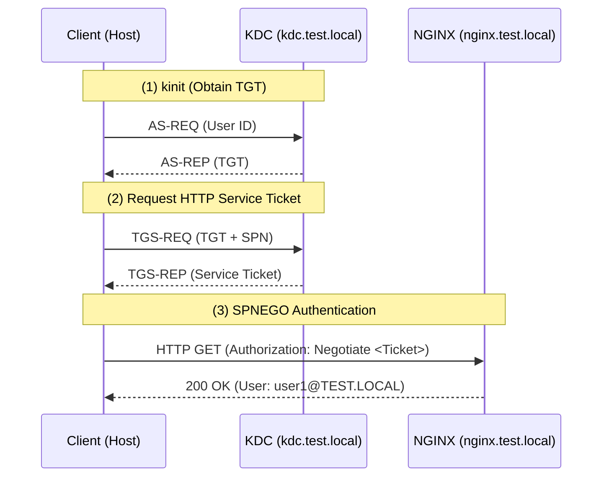
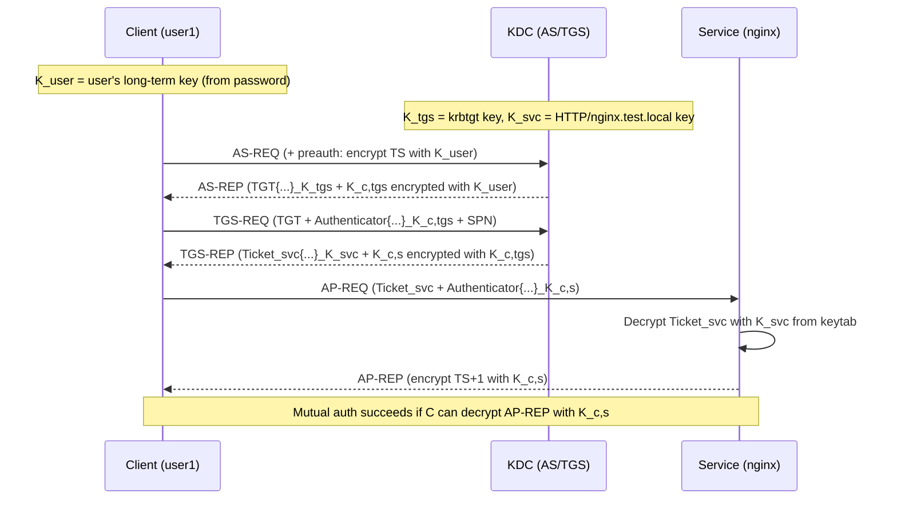

# Kerberos / SPNEGO Authentication Workshop: Single Sign-On with NGINX and Podman

For software engineers, this workshop explains the mechanism of **Kerberos** and **SPNEGO** authentication, which are standard in enterprise environments, by building them using **NGINX** and **Podman**.

> **💡 Glossary**: For technical terms such as [Kerberos](glossary_en.md#network) or [SPN](glossary_en.md#network) appearing in this workshop, please refer to the [Glossary](glossary_en.md).

## Goal

Build a KDC (Key Distribution Center) and an NGINX server on Podman, and understand the flow of "Single Sign-On" where authentication succeeds without password entry from a browser (or curl).



**What you will learn in this workshop:**

1. **Basic Kerberos components:** The roles of KDC, Principals, and Keytabs.
2. **SPN (Service Principal Name):** Linking name resolution and authentication to identify services.
3. **SPNEGO (Negotiate):** The mechanism for performing Kerberos authentication over the HTTP protocol.
4. **Integrating modules into NGINX:** Extending authentication functionality using dynamic modules.

---

## Why Kerberos / SPNEGO?

In corporate networks like Active Directory environments, a mechanism that allows automatic login to multiple web services after a single login is essential for both security and convenience.

- **Passwords are not sent over the network**: Ticket-based authentication reduces the risk of credential leakage.
- **Mutual Authentication**: Not only the client, but the server can also be verified as authentic.
- **Standard Protocol**: You can build a common authentication infrastructure across different OSs like Windows, Linux, and macOS.

---

## Architecture

Using Podman-compose, run two containers, KDC and NGINX, within the same network.

### Directory Structure

```text
kerberos_lab/
├── docker-compose.yml
├── Dockerfile.kdc
├── Dockerfile.nginx
├── krb5.conf          # Shared Kerberos configuration
├── nginx.conf         # NGINX configuration with SPNEGO settings
├── index.txt          # Fixed response returned after auth
└── (krb5.keytab)      # Generated in STEP 2
```

---

## Preparation

### 1. Tool Installation (Host Machine)

```bash
# For Ubuntu/Debian
sudo apt update && sudo apt install -y krb5-user curl podman podman-compose
```

### 2. Host Resolution Setup

Add the following to the host machine's `/etc/hosts` so that container names can be resolved.

```bash
sudo sh -c 'echo "127.0.0.1 kdc.test.local nginx.test.local" >> /etc/hosts'
```

---

## Workshop Steps

### STEP 1: Creating Configuration Files

Create a working directory and place the necessary files.

1. **krb5.conf** (Kerberos Configuration)

    ```ini
    [libdefaults]
        default_realm = TEST.LOCAL
        dns_lookup_realm = false
        dns_lookup_kdc = false

    [realms]
        TEST.LOCAL = {
            kdc = 127.0.0.1:10088
            admin_server = 127.0.0.1
        }

    [domain_realm]
        .test.local = TEST.LOCAL
        test.local = TEST.LOCAL
    ```

2. **nginx.conf** (NGINX Configuration)

    ```nginx
    load_module modules/ngx_http_auth_spnego_module.so;

    events {}

    http {
        server {
            listen 80;
            server_name nginx.test.local;
            root /usr/share/nginx/html;
            default_type text/plain;

            location / {
                auth_gss on;
                auth_gss_realm TEST.LOCAL;
                auth_gss_keytab /etc/nginx/krb5.keytab;
                auth_gss_service_name HTTP/nginx.test.local;
                add_header X-Remote-User $remote_user always;
                try_files /index.txt =404;
            }
        }
    }
    ```

3. **index.txt** (Fixed response)

    ```text
    SPNEGO Authentication Successful
    ```

### ✅ Checkpoint

- [ ] Confirmed that `default_realm` in `krb5.conf` is `TEST.LOCAL`.
- [ ] Confirmed that `ngx_http_auth_spnego_module.so` is loaded in `nginx.conf`.

### STEP 2: Building Container Images

Prepare Dockerfiles to integrate the SPNEGO module into NGINX.

1. **Dockerfile.kdc**

    ```dockerfile
    FROM docker.io/library/ubuntu:24.04
    ENV DEBIAN_FRONTEND=noninteractive
    RUN apt-get update && apt-get install -y krb5-kdc krb5-admin-server
    COPY krb5.conf /etc/krb5.conf
    RUN kdb5_util create -s -P admin_password
    CMD ["krb5kdc", "-n"]
    ```

2. **Dockerfile.nginx**

    ```dockerfile
    FROM docker.io/library/nginx:1.25.1 AS builder
    RUN apt-get update && apt-get install -y git build-essential libkrb5-dev wget libpcre3-dev zlib1g-dev
    RUN wget http://nginx.org/download/nginx-1.25.1.tar.gz && tar zxvf nginx-1.25.1.tar.gz
    RUN git clone https://github.com/stnoonan/spnego-http-auth-nginx-module.git
    WORKDIR /nginx-1.25.1
    RUN ./configure --with-compat --add-dynamic-module=../spnego-http-auth-nginx-module && make modules

    FROM docker.io/library/nginx:1.25.1
    RUN apt-get update && apt-get install -y krb5-user && rm -rf /var/lib/apt/lists/*
    COPY --from=builder /nginx-1.25.1/objs/ngx_http_auth_spnego_module.so /etc/nginx/modules/
    ```

3. **docker-compose.yml**

    ```yaml
    version: "3"
    services:
      kdc:
        build:
          context: .
          dockerfile: Dockerfile.kdc
        image: localhost/krb_kdc:latest
        pull_policy: never
        ports:
          - "10088:88"
          - "10088:88/udp"
        hostname: kdc.test.local

      nginx:
        build:
          context: .
          dockerfile: Dockerfile.nginx
        image: localhost/krb_nginx:latest
        pull_policy: never
        ports:
          - "8080:80"
        volumes:
          - ./nginx.conf:/etc/nginx/nginx.conf:ro
          - ./index.txt:/usr/share/nginx/html/index.txt:ro
          - ./krb5.keytab:/etc/nginx/krb5.keytab:ro
          - ./krb5.conf:/etc/krb5.conf:ro
        depends_on:
          - kdc
        hostname: nginx.test.local
    ```

### ✅ Checkpoint

- [ ] Confirmed that `krb5.keytab` is mounted to NGINX in `docker-compose.yml`.
- [ ] Confirmed that `image: localhost/...` and `pull_policy: never` are set in `docker-compose.yml`.

### STEP 3: Starting KDC and Generating Keytab

Since NGINX cannot start without a Keytab file (server-side password file), start only the KDC first and generate it.

```bash
# Build images (both KDC and NGINX)
# Due to podman-compose specifications, all images defined in the YAML
# must exist locally even when starting only one service.
podman compose build --no-cache

# Start KDC
podman compose up -d kdc

# Create user principal (Password: userpass)
podman compose exec kdc kadmin.local -q "addprinc -pw userpass user1@TEST.LOCAL"

# Create SPN for NGINX
podman compose exec kdc kadmin.local -q "addprinc -randkey HTTP/nginx.test.local@TEST.LOCAL"

# Export Keytab and extract to host
podman compose exec kdc kadmin.local -q "ktadd -k /tmp/krb5.keytab HTTP/nginx.test.local@TEST.LOCAL"
# Actual container names vary by environment (e.g. krb_kdc_1 / krb5_kdc_1)
KDC_CID=$(podman ps -a -q --filter name=_kdc_ | head -n1)
echo "$KDC_CID" # Verify container ID
podman cp "$KDC_CID":/tmp/krb5.keytab ./krb5.keytab
chmod 644 ./krb5.keytab
```

### ✅ Checkpoint

- [ ] Confirmed that `krb5.keytab` was created in the current directory.

### STEP 3.5: Verify KDC behavior (kinit / klist / kdestroy)

After KDC startup and principal creation, quickly verify Kerberos client behavior first.
At this point, `kinit` only gets a TGT, so `HTTP/nginx.test.local@TEST.LOCAL` will not appear yet.

```bash
export KRB5_CONFIG=$(pwd)/krb5.conf

# Get TGT
kinit user1@TEST.LOCAL
# Password: userpass

# Check ticket
klist

# Destroy ticket
kdestroy

# Confirm destroy (typically shows "No credentials cache found")
klist
```

### STEP 4: Starting NGINX and Verification

```bash
# Start NGINX (already built in STEP 3, so just up)
podman compose up -d nginx

# 1. Obtain Ticket (TGT)
export KRB5_CONFIG=$(pwd)/krb5.conf
kinit user1@TEST.LOCAL
# Password: userpass

# 2. Verify Ticket (It's OK if krbtgt/TEST.LOCAL@TEST.LOCAL exists)
klist

# 3. Access via SPNEGO authentication
curl -i --negotiate -u : http://nginx.test.local:8080/

# 4. Verify Service Ticket acquisition
# Run this after curl. You should see HTTP/nginx.test.local@TEST.LOCAL added to the list.
klist
```

**Successful verification points:**

- `X-Remote-User: user1@TEST.LOCAL` appears in the response headers
- `HTTP/nginx.test.local@TEST.LOCAL` is added in `klist`

### ✅ Checkpoint

- [ ] Confirmed that in addition to the TGT (`krbtgt/...`), the Service Ticket (`HTTP/nginx.test.local@...`) is displayed with `klist`.
- [ ] Confirmed that `X-Remote-User` is present in the `curl -i` response headers.

---

### STEP 5: Understand Kerberos Mutual Authentication

Behind `curl --negotiate`, the server also proves it has the correct service key. That is what completes mutual authentication.



#### Which key encrypts/decrypts what

1. **AS-REQ / AS-REP (Get TGT)**
   - Client encrypts preauth (timestamp) with `K_user`.
   - KDC decrypts preauth with `K_user` to verify the user.
   - KDC encrypts `K_c,tgs` (client-TGS session key) with `K_user`.
   - KDC encrypts the TGT body with `K_tgs` (client cannot read TGT contents directly).

2. **TGS-REQ / TGS-REP (Get service ticket)**
   - Client encrypts Authenticator with `K_c,tgs`.
   - KDC decrypts TGT with `K_tgs`, obtains `K_c,tgs`, and decrypts Authenticator.
   - KDC encrypts `K_c,s` (client-service session key) with `K_c,tgs`.
   - KDC encrypts `Ticket_svc` with `K_svc` (only the service can decrypt it).

3. **AP-REQ / AP-REP (Service access + mutual auth)**
   - Client sends `Ticket_svc` and Authenticator (encrypted with `K_c,s`).
   - Service decrypts `Ticket_svc` using `K_svc` in keytab and obtains `K_c,s`.
   - Service decrypts Authenticator with `K_c,s` to verify the client.
   - Service returns AP-REP (typically `TS+1`) encrypted with `K_c,s`.
   - Client decrypts AP-REP with `K_c,s` to verify the server.

#### Quick check with `curl -v`

With `curl -v --negotiate`, if `WWW-Authenticate: Negotiate <token>` appears in the final `200 OK` response, AP-REP is returned, which indicates mutual auth completed.

```bash
curl --negotiate -u : -v http://nginx.test.local:8080/ -o /dev/null
```

**Reference output (key lines)**

```text
< HTTP/1.1 401 Unauthorized
< WWW-Authenticate: Negotiate
...
> Authorization: Negotiate YIIF...   # Client AP-REQ
< HTTP/1.1 200 OK
< WWW-Authenticate: Negotiate YIGC... # Server AP-REP (mutual auth)
```

If `200 OK` is returned but the second `WWW-Authenticate: Negotiate <token>` is missing, mutual-auth token return may not be happening (check module behavior/config).

---

## Cleanup

```bash
podman compose down
rm krb5.keytab
# Delete entries in /etc/hosts manually if needed
```

---

## References

- [MIT Kerberos Documentation](https://web.mit.edu/kerberos/krb5-latest/doc/)
- [spnego-http-auth-nginx-module](https://github.com/stnoonan/spnego-http-auth-nginx-module)
- [RFC 4559 - SPNEGO-based Kerberos HTTP Authentication in Microsoft Windows](https://datatracker.ietf.org/doc/html/rfc4559)

---

## 🔧 Troubleshooting

### NGINX won't start / Error logs appear

- **Cause**: No read permission for the Keytab file, or the path is incorrect.
- **Solution**: Run `chmod 644 ./krb5.keytab` and double-check the `auth_gss_keytab` path in `nginx.conf`.

### 401 Unauthorized with curl

- **Cause**: TGT not obtained with `kinit` on the host machine, or `KRB5_CONFIG` is not set correctly.
- **Solution**: Check for tickets with `klist`, and ensure `curl` is run in the same terminal session where `export KRB5_CONFIG=$(pwd)/krb5.conf` was executed.

### `cannot expose privileged port 88`

- **Cause**: Rootless Podman cannot publish privileged ports below 1024 (such as 88).
- **Solution A (default in this tutorial)**: Use a high host port. This tutorial uses `10088:88` (TCP/UDP) and `kdc = 127.0.0.1:10088` from the beginning.
- **Solution B**: Run rootful Podman or change sysctl. Examples: `sudo podman compose up -d kdc`, `sudo sysctl -w net.ipv4.ip_unprivileged_port_start=88`

### `no container with name or ID "kadmin.local" found`

- **Cause**: In `podman exec -it $(podman ps -q -f name=kdc) ...`, the `$(...)` part is empty, so `kadmin.local` is interpreted as a container name.
- **Solution**: Use `podman compose exec kdc ...`. For `podman cp`, get the ID via `podman ps -a -q --filter name=_kdc_` and verify with `echo "$KDC_CID"`. Names vary by environment (e.g. `krb_kdc_1`, `krb5_kdc_1`), so confirm with `podman ps -a --format '{{.ID}} {{.Names}}'` if needed.

### `krb_nginx did not resolve to an alias ...` / `docker://localhost/... connection refused`

- **Cause**: On `podman compose v1.0.6`, auto-generated image-name resolution can be unstable, causing either unqualified-name errors or failed pulls to `https://localhost/v2`.
- **Solution**: Explicitly set `image: localhost/krb_nginx:latest` and `pull_policy: never` in `docker-compose.yml` (same for KDC). Do not rely on `up --build`; run `podman compose build --no-cache nginx` and then `podman compose up -d nginx` as separate commands.

### `localhost/krb_nginx:latest image not found`

- **Cause**: Due to `podman compose` specifications, all images listed in `docker-compose.yml` must exist locally, even when starting only a specific service (e.g., `kdc`).
- **Solution**: Run `podman compose build --no-cache` to build all images first. Both KDC and NGINX images are required.

---

## 💻 Environment-Specific Notes

### WSL2

- When accessing from a browser on the Windows host side, you will need `hosts` and Kerberos settings on the Windows side as well. It is recommended to complete the workshop within the WSL2 terminal (`curl`).
