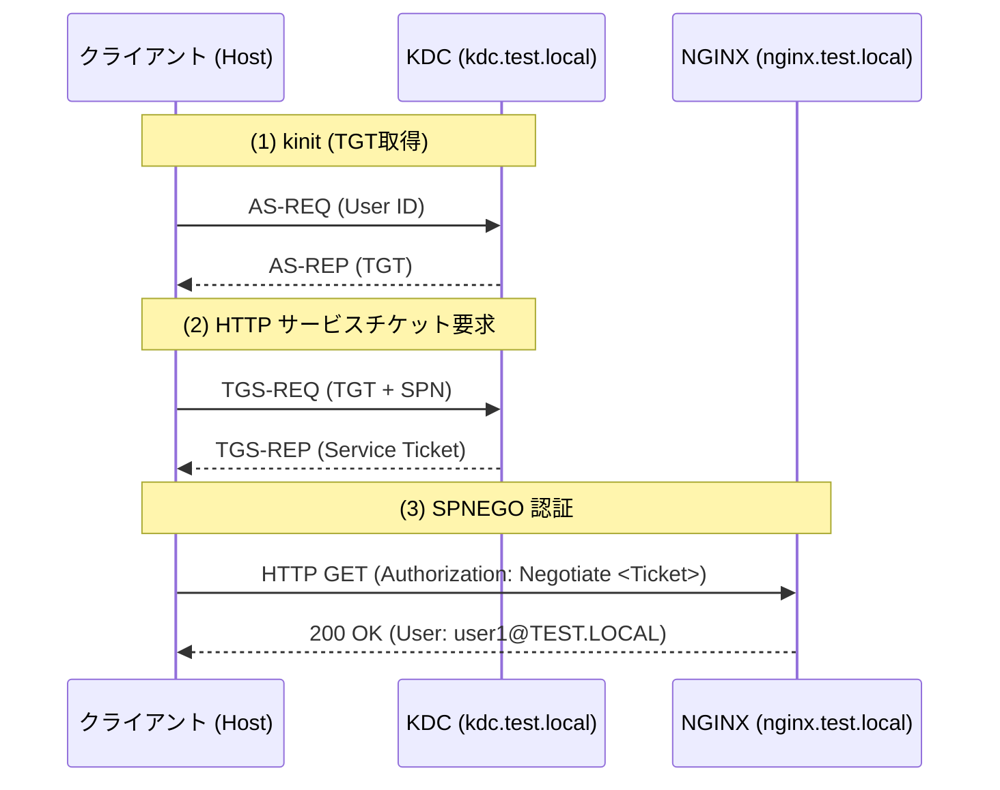
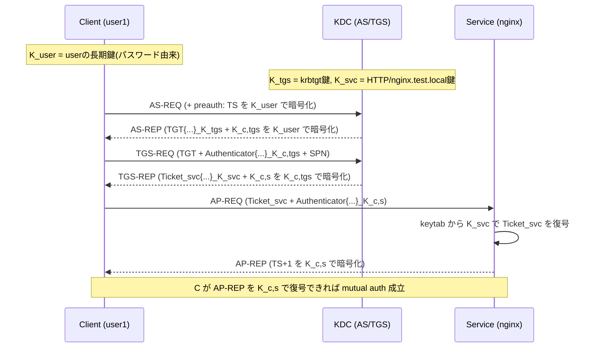

# Kerberos / SPNEGO 認証実習：NGINX と Podman でシングルサインオンを体験する

ソフトウェアエンジニア向けに、エンタープライズ環境で標準的に利用されている **Kerberos** および **SPNEGO** 認証の仕組みを、**NGINX** と **Podman** を使って実際に構築しながら学びます。

> **💡 用語集**: この実習で登場する[Kerberos](glossary_ja.md#network)や[SPN](glossary_ja.md#network)などの専門用語は [用語集](glossary_ja.md) を参照してください。

## ゴール

Podman 上に KDC（Key Distribution Center）と NGINX サーバーを構築し、ブラウザ（または curl）からパスワード入力なしで認証が成功する「シングルサインオン」の流れを理解します。



**この実習で習得すること:**

1. **Kerberos の基本コンポーネント:** KDC、プリンシパル、Keytab の役割。
2. **SPN (Service Principal Name):** サービスを識別するための名前解決と認証の紐付け。
3. **SPNEGO (Negotiate):** HTTP プロトコル上で Kerberos 認証を行う仕組み。
4. **NGINX へのモジュール組み込み:** 動的モジュールを用いた認証機能の拡張。

---

## なぜ Kerberos / SPNEGO なのか？

Active Directory 環境などの社内ネットワークにおいて、一度のログインで複数の Web サービスに自動ログインできる仕組みは、セキュリティと利便性の両立に不可欠です。

- **パスワードをネットワークに流さない**: チケットベースの認証により、認証情報の漏洩リスクを低減します。
- **相互認証**: クライアントだけでなく、サーバーが本物であることも確認できます。
- **標準プロトコル**: Windows, Linux, macOS などの異なる OS 間で共通の認証基盤を構築できます。

---

## アーキテクチャ

Podman-compose を利用し、KDC と NGINX の 2 つのコンテナを同一ネットワーク内で実行します。

### ディレクトリ構造

```text
kerberos_lab/
├── docker-compose.yml
├── Dockerfile.kdc
├── Dockerfile.nginx
├── krb5.conf          # 共通の Kerberos 設定
├── nginx.conf         # SPNEGO 設定を含む NGINX 設定
├── index.txt          # 認証後に返す固定レスポンス
├── kdc-data/          # KDC DB 永続化ディレクトリ
└── (krb5.keytab)      # STEP 2 で生成される
```

---

## 準備

### 1. ツールインストール (ホストマシン)

```bash
# Ubuntu/Debian の場合
sudo apt update && sudo apt install -y krb5-user curl podman podman-compose
```

### 2. ホスト解決の設定

コンテナの名前解決ができるよう、ホストマシンの `/etc/hosts` に追記します。

```bash
sudo sh -c 'echo "127.0.0.1 kdc.test.local nginx.test.local" >> /etc/hosts'
```

---

## 実習ステップ

### STEP 1: 設定ファイルの作成

作業ディレクトリを作成し、必要なファイルを配置します。

1. **krb5.conf** (Kerberos 設定)

    ```ini
    [libdefaults]
        default_realm = TEST.LOCAL
        dns_lookup_realm = false
        dns_lookup_kdc = false
        dns_canonicalize_hostname = false
        rdns = false

    [realms]
        TEST.LOCAL = {
            kdc = 127.0.0.1:10088
            admin_server = 127.0.0.1
        }

    [domain_realm]
        .test.local = TEST.LOCAL
        test.local = TEST.LOCAL
    ```

2. **nginx.conf** (NGINX 設定)

    ```nginx
    load_module modules/ngx_http_auth_spnego_module.so;

    events {}

    http {
        server {
            listen 80;
            server_name nginx.test.local;
            root /usr/share/nginx/html;
            default_type text/plain;

            location / {
                auth_gss on;
                auth_gss_realm TEST.LOCAL;
                auth_gss_keytab /etc/nginx/krb5.keytab;
                auth_gss_service_name HTTP/nginx.test.local;
                auth_gss_allow_basic_fallback off;
                add_header X-Remote-User $remote_user always;
                try_files /index.txt =404;
            }
        }
    }
    ```

3. **index.txt** (固定レスポンス)

    ```text
    SPNEGO Authentication Successful
    ```

### ✅ チェックポイント

- [ ] `krb5.conf` 内の `default_realm` が `TEST.LOCAL` になっていることを確認した
- [ ] `nginx.conf` で `ngx_http_auth_spnego_module.so` をロードしていることを確認した

### STEP 2: コンテナイメージのビルド

NGINX に SPNEGO モジュールを組み込むための Dockerfile を用意します。

1. **Dockerfile.kdc**

    ```dockerfile
    FROM docker.io/library/ubuntu:24.04
    ENV DEBIAN_FRONTEND=noninteractive
    RUN apt-get update && apt-get install -y krb5-kdc krb5-admin-server
    COPY krb5.conf /etc/krb5.conf
    CMD ["/bin/sh", "-c", "if [ ! -f /var/lib/krb5kdc/principal ]; then kdb5_util create -s -P admin_password; fi && exec krb5kdc -n"]
    ```

2. **Dockerfile.nginx**

    ```dockerfile
    FROM docker.io/library/nginx:1.25.1 AS builder
    RUN apt-get update && apt-get install -y git build-essential libkrb5-dev wget libpcre3-dev zlib1g-dev
    RUN wget http://nginx.org/download/nginx-1.25.1.tar.gz && tar zxvf nginx-1.25.1.tar.gz
    RUN git clone https://github.com/stnoonan/spnego-http-auth-nginx-module.git
    WORKDIR /nginx-1.25.1
    RUN ./configure --with-compat --add-dynamic-module=../spnego-http-auth-nginx-module && make modules

    FROM docker.io/library/nginx:1.25.1
    RUN apt-get update && apt-get install -y krb5-user && rm -rf /var/lib/apt/lists/*
    COPY --from=builder /nginx-1.25.1/objs/ngx_http_auth_spnego_module.so /etc/nginx/modules/
    ```

3. **docker-compose.yml**

    ```yaml
    version: "3"
    services:
      kdc:
        build:
          context: .
          dockerfile: Dockerfile.kdc
        image: localhost/krb_kdc:latest
        pull_policy: never
        volumes:
          - ./kdc-data:/var/lib/krb5kdc
        ports:
          - "10088:88"
          - "10088:88/udp"
        hostname: kdc.test.local

      nginx:
        build:
          context: .
          dockerfile: Dockerfile.nginx
        image: localhost/krb_nginx:latest
        pull_policy: never
        ports:
          - "8080:80"
        volumes:
          - ./nginx.conf:/etc/nginx/nginx.conf:ro
          - ./index.txt:/usr/share/nginx/html/index.txt:ro
          - ./krb5.keytab:/etc/nginx/krb5.keytab:ro
          - ./krb5.conf:/etc/krb5.conf:ro
        depends_on:
          - kdc
        hostname: nginx.test.local
    ```

### ✅ チェックポイント

- [ ] `docker-compose.yml` で `krb5.keytab` が NGINX にマウントされていることを確認した
- [ ] `docker-compose.yml` で `image: localhost/...` と `pull_policy: never` を設定したことを確認した

### STEP 3: KDC の起動と Keytab の生成

Keytab ファイル（サーバー用パスワードファイル）がないと NGINX が起動できないため、まず KDC だけを起動して生成します。

```bash
# KDCデータ永続化ディレクトリの作成
mkdir -p ./kdc-data

# イメージのビルド (KDC と NGINX 両方)
# podman-compose の仕様により、片方のサービスのみを起動する場合でも
# YAML に定義されたすべてのイメージがローカルに存在する必要があります
podman compose build --no-cache

# KDC 起動
podman compose up -d kdc

# ユーザープリンシパルの作成 (パスワード: userpass)

podman compose exec kdc kadmin.local -q "addprinc -pw userpass user1@TEST.LOCAL"

# NGINX 用の SPN 作成

podman compose exec kdc kadmin.local -q "addprinc -randkey HTTP/nginx.test.local@TEST.LOCAL"

# Keytab のエクスポートとホストへの取り出し

podman compose exec kdc kadmin.local -q "ktadd -k /tmp/krb5.keytab HTTP/nginx.test.local@TEST.LOCAL"

# KDC の実コンテナ名は環境により krb_kdc_1 / krb5_kdc_1 などに変わる

KDC_CID=$(podman ps -a -q --filter name=_kdc_ | head -n1)
echo "$KDC_CID" # IDを確認
podman cp "$KDC_CID":/tmp/krb5.keytab ./krb5.keytab
chmod 644 ./krb5.keytab
```

### ✅ チェックポイント

- [ ] カレントディレクトリに `krb5.keytab` が作成されたことを確認した

### STEP 3.5: KDC の動作確認（kinit / klist / kdestroy）

KDC 起動と principal 作成ができたら、いったん Kerberos クライアント操作だけを確認します。
この時点では `kinit` は TGT しか取得しないため、`HTTP/nginx.test.local@TEST.LOCAL` はまだ表示されません。

```bash
export KRB5_CONFIG=$(pwd)/krb5.conf

# TGT 取得
kinit user1@TEST.LOCAL
# パスワード: userpass

# チケット確認
klist

# チケット破棄
kdestroy

# 破棄確認（通常は "No credentials cache found" になる）
klist
```

### STEP 4: NGINX の起動と動作確認

```bash
# NGINX 起動 (STEP 3 でビルド済みのため up のみ)
podman compose up -d nginx

# 1. チケット(TGT)の取得
export KRB5_CONFIG=$(pwd)/krb5.conf
kinit user1@TEST.LOCAL
# パスワード: userpass

# 2. チケットの確認 (krbtgt/TEST.LOCAL@TEST.LOCAL があればOK)
klist

# 3. curl が SPNEGO 対応か確認
curl -V
# Features に SPNEGO と GSS-API が含まれることを確認

# 4. SPNEGO 認証によるアクセス
curl -i --negotiate -u : http://nginx.test.local:8080/

# 5. サービスチケットの取得を確認
# curl 実行後に実行。HTTP/nginx.test.local@TEST.LOCAL が増えているはずです
klist
```

**成功時の確認ポイント:**

- `X-Remote-User: user1@TEST.LOCAL` がレスポンスヘッダに含まれる
- `HTTP/nginx.test.local@TEST.LOCAL` が `klist` に追加される
- `curl -V` の Features に `SPNEGO` と `GSS-API` が含まれる

### ✅ チェックポイント

- [ ] `klist` で TGT (`krbtgt/...`) に加えて、サービスチケット (`HTTP/nginx.test.local@...`) が表示されていることを確認した
- [ ] `curl -i` のレスポンスヘッダに `X-Remote-User` が含まれていることを確認した
- [ ] `curl -V` の Features に `SPNEGO` と `GSS-API` が含まれていることを確認した

---

### STEP 5: Kerberos の相互認証 (Mutual Authentication) を理解する

`curl --negotiate` の背後では、クライアントだけでなくサーバー側も「正しいサービス鍵を持っていること」を示し、相互認証が成立します。



#### どの鍵で何を暗号化・復号するか

1. **AS-REQ / AS-REP（TGT取得）**
   - クライアント: `K_user` で preauth（タイムスタンプ）を暗号化して送信。
   - KDC: 受信した preauth を `K_user` で復号して本人性を確認。
   - KDC: `K_c,tgs`（クライアント-TGS セッション鍵）を `K_user` で暗号化して返却。
   - KDC: TGT 本体は `K_tgs` で暗号化（クライアントは中身を読めない）。

2. **TGS-REQ / TGS-REP（サービスチケット取得）**
   - クライアント: Authenticator を `K_c,tgs` で暗号化。
   - KDC: TGT を `K_tgs` で復号し、`K_c,tgs` を取り出して Authenticator を復号。
   - KDC: `K_c,s`（クライアント-サービスセッション鍵）を `K_c,tgs` で暗号化して返却。
   - KDC: サービスチケット `Ticket_svc` を `K_svc` で暗号化（サービスだけが読める）。

3. **AP-REQ / AP-REP（実サービスアクセス + 相互認証）**
   - クライアント: `Ticket_svc` と Authenticator(`K_c,s` 暗号化) を送信。
   - サービス: keytab の `K_svc` で `Ticket_svc` を復号し、`K_c,s` を取得。
   - サービス: `K_c,s` で Authenticator を復号し、クライアント真正性を確認。
   - サービス: AP-REP（典型的には `TS+1`）を `K_c,s` で暗号化して返す。
   - クライアント: AP-REP を `K_c,s` で復号できれば、サーバー真正性を確認。

#### 手軽な確認方法 (`curl -v`)

`curl -v --negotiate` では、最終 `200 OK` 側にも `WWW-Authenticate: Negotiate <token>` が返ると、AP-REP が返却されている（= mutual 認証が成立している）ことを確認できます。

```bash
curl --negotiate -u : -v http://nginx.test.local:8080/ -o /dev/null
```

**参考出力（要点）**

```text
< HTTP/1.1 401 Unauthorized
< WWW-Authenticate: Negotiate
...
> Authorization: Negotiate YIIF...   # クライアントの AP-REQ
< HTTP/1.1 200 OK
< WWW-Authenticate: Negotiate YIGC... # サーバーの AP-REP（mutual 認証）
```

`200 OK` なのに後者の `WWW-Authenticate: Negotiate <token>` が無い場合は、相互認証トークンが返っていない可能性があります（モジュール設定・実装差分を確認）。

---

## 片付け

```bash
podman compose down
rm krb5.keytab
# /etc/hosts の編集内容は必要に応じて手動で削除してください
```

---

## 参考文献

- [MIT Kerberos Documentation](https://web.mit.edu/kerberos/krb5-latest/doc/)
- [spnego-http-auth-nginx-module](https://github.com/stnoonan/spnego-http-auth-nginx-module)
- [RFC 4559 - SPNEGO-based Kerberos HTTP Authentication in Microsoft Windows](https://datatracker.ietf.org/doc/html/rfc4559)

---

## 🔧 トラブルシューティング

### NGINX が起動しない / エラーログが出る

- **原因**: Keytab ファイルの読み込み権限がない、またはパスが間違っている。
- **対処**: `chmod 644 ./krb5.keytab` を実行し、`nginx.conf` の `auth_gss_keytab` パスを再確認してください。

### curl で 401 Unauthorized になる

- **原因**: ホストマシンの `kinit` でチケットを取得していない、または `KRB5_CONFIG` が正しく設定されていない。
- **対処**: `klist` でチケットの有無を確認し、`export KRB5_CONFIG=$(pwd)/krb5.conf` を実行した同一ターミナルで `curl` を実行してください。あわせて `curl -V` を実行し、Features に `SPNEGO` と `GSS-API` が含まれていることを確認してください。含まれていなければ、その `curl` では `--negotiate` を使えません。

### `curl` が Negotiate を継続せず 401 で終わる

- **原因**: `curl` の書式ミス（`-u:`）や URL のホスト名不一致（`localhost`）で、SPNEGO フローが開始されない。
- **対処**: `curl --negotiate -u : -v http://nginx.test.local:8080/` をそのまま使う。`-u:` ではなく `-u :`（スペースあり）にする。`localhost` ではなく `nginx.test.local` を使う。

### `WWW-Authenticate: BASIC realm="TEST.LOCAL"` が返る

- **原因**: NGINX の SPNEGO モジュールで Basic fallback が有効になっている。
- **対処**: `nginx.conf` の該当 `location` に `auth_gss_allow_basic_fallback off;` を追加し、`podman compose up -d --force-recreate nginx` で反映する。

### `HTTP/localhost@TEST.LOCAL not found in Kerberos database` が出る

- **原因**: ホスト名の正規化（canonicalize/reverse DNS）や proxy 経由で、`nginx.test.local` が `localhost` として扱われる。
- **対処**: `krb5.conf` の `[libdefaults]` に `dns_canonicalize_hostname = false` と `rdns = false` を入れる。さらに `env | grep -i proxy` で proxy 設定を確認し、必要なら `unset http_proxy https_proxy HTTP_PROXY HTTPS_PROXY` して再実行する。

### `cannot expose privileged port 88` が出る

- **原因**: rootless Podman では 1024 未満の privileged port（例: 88）を公開できない。
- **対処A（本教材の既定）**: ホスト側を高位ポートにする。`docker-compose.yml` は `10088:88`（TCP/UDP）、`krb5.conf` は `kdc = 127.0.0.1:10088` を使う。
- **対処B**: rootful 実行または sysctl を設定する。例: `sudo podman compose up -d kdc`、`sudo sysctl -w net.ipv4.ip_unprivileged_port_start=88`

### `no container with name or ID "kadmin.local" found` が出る

- **原因**: `podman exec -it $(podman ps -q -f name=kdc) ...` の `$(...)` が空になり、`kadmin.local` がコンテナ名として解釈される。
- **対処**: `podman compose exec kdc ...` を使う。`podman cp` が必要な場合は `podman ps -a -q --filter name=_kdc_` で ID を取得し、`echo "$KDC_CID"` で確認する。名前は `krb_kdc_1` / `krb5_kdc_1` のように環境で変わるため、必要なら `podman ps -a --format '{{.ID}} {{.Names}}'` で実名を確認する。

### `krb_nginx did not resolve to an alias ...` / `docker://localhost/... connection refused` が出る

- **原因**: `podman compose v1.0.6` では自動生成イメージ名の解決が不安定で、未修飾名エラーまたは `https://localhost/v2` への pull で失敗することがある。
- **対処**: `docker-compose.yml` に `image: localhost/krb_nginx:latest` と `pull_policy: never`（KDC も同様）を明示する。`up --build` ではなく、`podman compose build --no-cache nginx` の後に `podman compose up -d nginx` のように `build` と `up` を分けて実行する。

### `localhost/krb_nginx:latest image not found` が出る

- **原因**: `podman compose` の仕様により、特定のサービス（例: `kdc`）のみを起動する場合でも、`docker-compose.yml` に記載された他のすべてのイメージがローカルに存在している必要があります。
- **対処**: `podman compose build --no-cache` を実行して、先にすべてのイメージをビルドしてください。 KDC と NGINX の両方のイメージが必要です。

---

## 💻 環境別注意事項

### WSL2 の場合

- ホスト Windows 側のブラウザからアクセスする場合、Windows 側でも `hosts` 設定と Kerberos 設定が必要になります。実習は WSL2 のターミナル内 (`curl`) で完結させることを推奨します。
