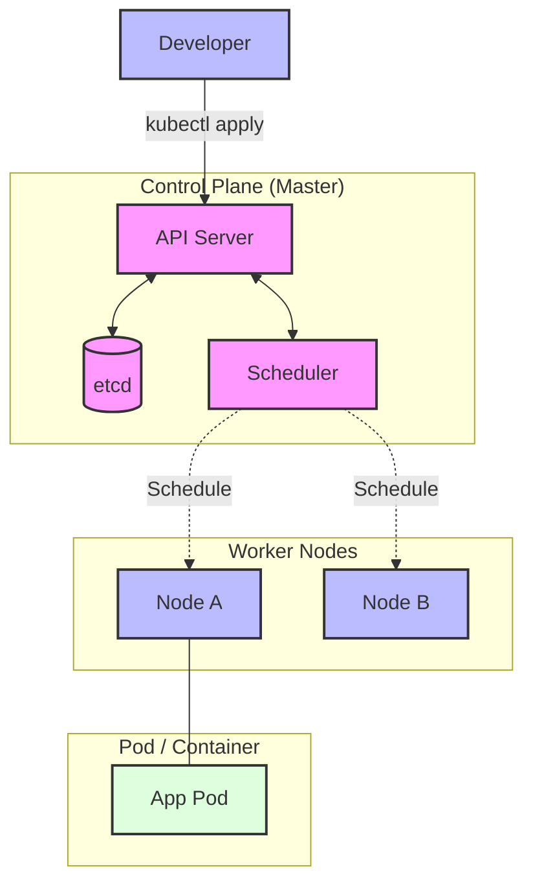
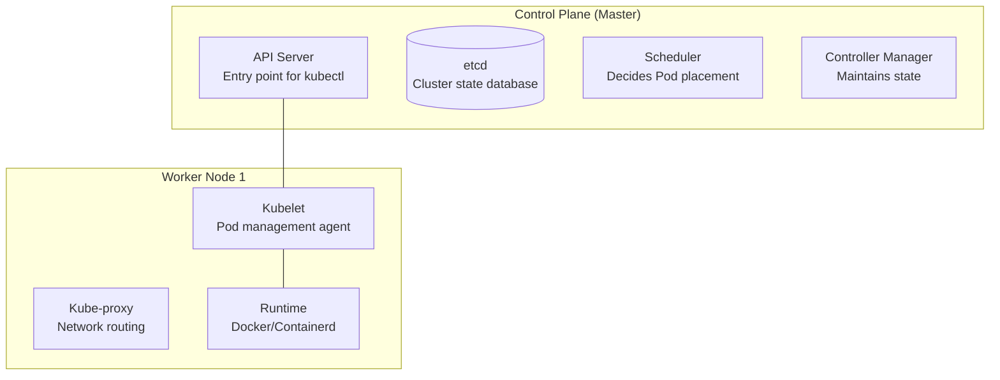

# Kubernetes Workshop: From Basics to Practical Container Orchestration

This workshop covers Kubernetes (K8s) from basic concepts to production-ready configurations through hands-on exercises. We aim to understand K8s not just as an infrastructure tool, but as a **"Platform for running distributed systems."**

> **💡 Glossary**: For technical terms like [Pod](glossary_en.md#kubernetes), [Deployment](glossary_en.md#kubernetes), and [Service](glossary_en.md#kubernetes) used in this workshop, refer to the [Glossary](glossary_en.md).

---

## Why Should Software Engineers Learn Kubernetes?

In modern software development, Kubernetes is more than just an "operations tool." Developers who understand K8s gain several advantages:

1. **High Reproducibility**: What works on your local `kind` cluster will work the same in production. The "it works on my machine" problem is eliminated.
2. **Self-Healing and Auto-Scaling**: K8s handles restarting crashed applications and scaling during traffic spikes, reducing the need for complex concurrency or monitoring code within the app.
3. **API-Driven Infrastructure**: Since all configurations are managed as YAML (code), application deployment can be fully integrated into CI/CD pipelines.

---

## Goals

Master container orchestration with Kubernetes, from basic concepts to practical operations.



**What you'll learn:**

1. **Kubernetes Architecture**: Control Plane and Node responsibilities
2. **Core Resources**: Pod, Deployment, Service usage
3. **Configuration Management**: ConfigMap, Secret for config injection
4. **Storage**: PersistentVolume, PersistentVolumeClaim for data persistence
5. **Networking**: Service, Ingress for external exposure
6. **Helm**: Package manager for application management
7. **Observability**: Metrics, logs, and traces collection

---

## Challenges and Solutions with Kubernetes

### ❌ Traditional Challenges

- **Scaling Complexity**: Managing a growing number of containers manually is impossible.
- **Self-Healing**: Wanting to restart containers automatically when they fail.
- **Zero-Downtime Updates**: Deploying new versions without service interruption.
- **Config Management**: Managing different configurations for different environments.
- **Service Discovery**: Resolving dynamic Pod IP addresses.

### ✅ Kubernetes Solutions

- **Declarative Configuration**: Declare the "desired state," and Kubernetes ensures it's maintained.
- **Self-Healing**: Automatically restarts or replaces failed Pods.
- **Rolling Updates**: Zero-downtime deployment by gradually replacing Pods.
- **Config Injection**: Externalizing configurations via ConfigMap and Secret.
- **Service Discovery**: Dynamic service resolution using DNS.

---

## Architecture

### Component Overview



---

## Preparation

### ✅ Prerequisites

- **kubectl**: CLI for cluster operations
- **kind**: Local K8s environment (runs on Docker/Podman)
- **Helm**: Package manager for K8s

### 1. Tool Installation

```bash
# macOS (Homebrew)
brew install kubectl kind helm go

# Linux
curl -LO "https://dl.k8s.io/release/$(curl -L -s https://dl.k8s.io/release/stable.txt)/bin/linux/amd64/kubectl"
chmod +x kubectl
sudo mv kubectl /usr/local/bin/

# Kind
go install sigs.k8s.io/kind@latest

# Helm
curl https://raw.githubusercontent.com/helm/helm/main/scripts/get-helm-4 | bash
```

### 2. Create Local Cluster

```bash
# Create cluster
kind create cluster --name k8s-workshop

# Verify connectivity
kubectl get nodes
```

---

## Workshop Steps

### STEP 1: Pod Basics

Understand the smallest deployable unit: the Pod.

```yaml
# manifests/01-pod.yaml
apiVersion: v1
kind: Pod
metadata:
  name: nginx-pod
  labels:
    app: nginx
spec:
  containers:
  - name: nginx
    image: nginx:1.27-alpine
    ports:
    - containerPort: 80
    resources:
      requests:
        memory: "64Mi"
        cpu: "250m"
      limits:
        memory: "128Mi"
        cpu: "500m"
```

```bash
# Create Pod
kubectl apply -f manifests/01-pod.yaml

# Check status
kubectl get pods
kubectl describe pod nginx-pod

# Check logs
kubectl logs nginx-pod

# Execute command inside Pod
kubectl exec -it nginx-pod -- sh

# Port-forward
kubectl port-forward nginx-pod 8080:80
# In another terminal: curl http://localhost:8080

# Delete Pod
kubectl delete pod nginx-pod
```

### ✅ Checklist

- [ ] STATUS is `Running` in `kubectl get pods`.
- [ ] Nginx logs are visible via `kubectl logs nginx-pod`.
- [ ] Nginx welcome page is accessible via port-forwarding.

### STEP 2: Declarative Deployment with Deployments

Manage Pods to achieve replication and rolling updates.

```yaml
# manifests/02-deployment.yaml
apiVersion: apps/v1
kind: Deployment
metadata:
  name: nginx-deployment
spec:
  replicas: 3
  selector:
    matchLabels:
      app: nginx
  template:
    metadata:
      labels:
        app: nginx
    spec:
      containers:
      - name: nginx
        image: nginx:1.27-alpine
        ports:
        - containerPort: 80
        livenessProbe:
          httpGet:
            path: /
            port: 80
          initialDelaySeconds: 3
          periodSeconds: 3
        readinessProbe:
          httpGet:
            path: /
            port: 80
          initialDelaySeconds: 3
          periodSeconds: 3
```

```bash
# Create Deployment
kubectl apply -f manifests/02-deployment.yaml

# Check status
kubectl get deployments
kubectl get replicasets
kubectl get pods -l app=nginx

# Scale out
kubectl scale deployment nginx-deployment --replicas=5

# Rolling update
kubectl set image deployment/nginx-deployment nginx=nginx:1.27.4-alpine

# Check rollout status
kubectl rollout status deployment/nginx-deployment
kubectl rollout history deployment/nginx-deployment

# Rollback
kubectl rollout undo deployment/nginx-deployment
```

### ✅ Checklist

- [ ] 3 Pods are `Running` via `kubectl get pods -l app=nginx`.
- [ ] 5 Pods exist after scaling out.
- [ ] Image updates occur with zero downtime.
- [ ] Scheduling history is visible in `Events` via `kubectl describe pod`.

### STEP 3: Service Discovery with Services

Provide a stable network identity (Fixed IP + DNS name) for a set of Pods.

```yaml
# manifests/03-service.yaml
apiVersion: v1
kind: Service
metadata:
  name: nginx-service
spec:
  type: ClusterIP
  selector:
    app: nginx
  ports:
  - port: 80
    targetPort: 80
    protocol: TCP
  sessionAffinity: None
```

```bash
# Create Service
kubectl apply -f manifests/03-service.yaml

# Check status
kubectl get services
kubectl describe service nginx-service

# Verify ClusterIP
SERVICE_IP=$(kubectl get service nginx-service -o jsonpath='{.spec.clusterIP}')
kubectl run test-pod --image=busybox:1.37 --rm -it --restart=Never -- wget -O- http://$SERVICE_IP

# Verify DNS resolution
kubectl run test-dns --image=busybox:1.37 --rm -it --restart=Never -- nslookup nginx-service

# Expose externally via NodePort
kubectl patch service nginx-service -p '{"spec":{"type":"NodePort"}}'
```

### ✅ Checklist

- [ ] Pod IPs are registered in `kubectl get endpoints nginx-service`.
- [ ] Nginx is accessible via ClusterIP.
- [ ] DNS resolution works for `nginx-service.default.svc.cluster.local`.
- [ ] Access is possible via NodePort.

### STEP 4: Configuration Injection with ConfigMap

Separate configurations from container images.

```yaml
# manifests/04-configmap.yaml
apiVersion: v1
kind: ConfigMap
metadata:
  name: app-config
data:
  APP_ENV: "production"
  APP_LOG_LEVEL: "info"
  config.json: |
    {
      "database": {
        "host": "postgres.default.svc.cluster.local",
        "port": 5432
      }
    }
---
apiVersion: v1
kind: Pod
metadata:
  name: config-demo
spec:
  containers:
  - name: demo
    image: busybox:1.37
    command: ["sh", "-c", "echo $APP_ENV && cat /etc/config/config.json && sleep 3600"]
    env:
    - name: APP_ENV
      valueFrom:
        configMapKeyRef:
          name: app-config
          key: APP_ENV
    volumeMounts:
    - name: config-volume
      mountPath: /etc/config
  volumes:
  - name: config-volume
    configMap:
      name: app-config
```

```bash
# Create ConfigMap
kubectl apply -f manifests/04-configmap.yaml

# Verify
kubectl logs config-demo
kubectl exec -it config-demo -- env | grep APP

# Update ConfigMap
kubectl patch configmap app-config --type merge -p '{"data":{"APP_ENV":"staging"}}'
# Verify reflection after Pod recreation
```

### ✅ Checklist

- [ ] Environment variable `APP_ENV` is set to `production`.
- [ ] `/etc/config/config.json` is mounted correctly.
- [ ] Changes reflect in new Pods after ConfigMap update.

### STEP 5: Sensitive Information Management with Secrets

Securely manage passwords, API keys, etc.

```yaml
# manifests/05-secret.yaml
apiVersion: v1
kind: Secret
metadata:
  name: app-secret
type: Opaque
stringData:
  DB_PASSWORD: "secret-password-123"
  API_KEY: "sk-test-12345"
---
apiVersion: v1
kind: Pod
metadata:
  name: secret-demo
spec:
  containers:
  - name: demo
    image: busybox:1.37
    command: ["sh", "-c", "echo $DB_PASSWORD && sleep 3600"]
    env:
    - name: DB_PASSWORD
      valueFrom:
        secretKeyRef:
          name: app-secret
          key: DB_PASSWORD
```

```bash
# Create Secret
kubectl apply -f manifests/05-secret.yaml

# Verify (encoded in base64)
kubectl get secret app-secret -o yaml

# Get resources using the Secret
kubectl get secret app-secret -o jsonpath='{.metadata.ownerReferences}'

# Decode and verify Secret value
kubectl get secret app-secret -o jsonpath='{.data.DB_PASSWORD}' | base64 -d
```

### ✅ Checklist

- [ ] Secret is base64 encoded (not encrypted).
- [ ] Decoded value can be retrieved from environment variables inside the Pod.
- [ ] Secret values are not displayed in `kubectl describe` for security.

### STEP 6: Storage Management with Persistent Volumes

Persist data beyond the life of a Pod.

```yaml
# manifests/06-pvc.yaml
apiVersion: v1
kind: PersistentVolumeClaim
metadata:
  name: data-pvc
spec:
  accessModes:
    - ReadWriteOnce
  resources:
    requests:
      storage: 1Gi
  storageClassName: standard
---
apiVersion: apps/v1
kind: Deployment
metadata:
  name: data-deployment
spec:
  replicas: 1
  selector:
    matchLabels:
      app: data
  template:
    metadata:
      labels:
        app: data
    spec:
      volumes:
      - name: data-volume
        persistentVolumeClaim:
          claimName: data-pvc
      containers:
      - name: writer
        image: busybox:1.37
        command: ["sh", "-c", "echo 'Hello at $(date)' >> /data/test.txt && cat /data/test.txt && sleep 3600"]
        volumeMounts:
        - name: data-volume
          mountPath: /data
```

```bash
# Create PVC
kubectl apply -f manifests/06-pvc.yaml

# Check status
kubectl get pvc
kubectl get pv

# Verify data writing
kubectl logs -l app=data

# Verify data persistence after Pod recreation
kubectl delete pod -l app=data
kubectl logs -l app=data
```

### ✅ Checklist

- [ ] PVC enters `Bound` state.
- [ ] `/data/test.txt` content is preserved after Pod recreation.
- [ ] Volume info is visible in `kubectl describe pvc`.

### STEP 7: HTTP Load Balancing with Ingress

Configure HTTP/HTTPS routing to external clients.

```yaml
# manifests/07-ingress.yaml
apiVersion: networking.k8s.io/v1
kind: Ingress
metadata:
  name: nginx-ingress
  annotations:
    nginx.ingress.kubernetes.io/rewrite-target: /
spec:
  ingressClassName: nginx
  rules:
  - host: nginx.local
    http:
      paths:
      - path: /
        pathType: Prefix
        backend:
          service:
            name: nginx-service
            port:
              number: 80
```

```bash
# Enable NGINX Ingress Controller in Kind
kubectl apply -f https://raw.githubusercontent.com/kubernetes/ingress-nginx/main/deploy/static/provider/kind/deploy.yaml

# Create Ingress
kubectl apply -f manifests/07-ingress.yaml

# Add to /etc/hosts (Verify Node IP)
NODE_IP=$(kubectl get node workshop-control-plane -o jsonpath='{.status.addresses[0].address}')
echo "$NODE_IP nginx.local" | sudo tee -a /etc/hosts

# Verify access
curl http://nginx.local
```

### ✅ Checklist

- [ ] Ingress Controller Pod is `Running`.
- [ ] Nginx welcome page is visible via `curl http://nginx.local`.
- [ ] Routing rules are visible in `kubectl describe ingress`.

### STEP 8: Package Management with Helm

Use Helm Charts to package and manage applications.

```bash
# Create Helm Chart
helm create myapp

# Chart Structure
tree myapp/
# myapp/
# ├── Chart.yaml
# ├── values.yaml
# ├── templates/
# │   ├── deployment.yaml
# │   ├── service.yaml
# │   ├── ingress.yaml
# │   └── _helpers.tpl
# └── values.schema.json

# Edit values.yaml (as needed)
# Set custom images, replica count, etc.

# Package
helm package myapp

# Install
helm install myapp-release ./myapp-0.1.0.tgz

# Verify
helm list
helm status myapp-release
kubectl get all -l app.kubernetes.io/name=myapp

# Upgrade (after editing values.yaml)
helm upgrade myapp-release ./myapp

# Rollback
helm rollback myapp-release

# Uninstall
helm uninstall myapp-release
```

### ✅ Checklist

- [ ] Helm Chart is created successfully.
- [ ] `helm install` succeeds.
- [ ] `helm upgrade` performs a rolling update.
- [ ] `helm rollback` reverts to a previous revision.

### STEP 9: Observability

Collect metrics, logs, and traces.

```bash
# Install Prometheus Operator
helm repo add prometheus-community https://prometheus-community.github.io/helm-charts
helm repo update
helm install prometheus prometheus-community/kube-prometheus-stack

# Access dashboard (port-forward)
kubectl port-forward svc/prometheus-grafana 3000:80
# Browser: http://localhost:3000
# Default Auth: admin / prom-operator

# Verify metrics
kubectl port-forward svc/prometheus-kube-prometheus-prometheus 9090:9090
# Browser: http://localhost:9090

# Check Pod logs
kubectl logs -l app=nginx --tail=100
kubectl logs -f deployment/nginx-deployment

# Multi-container Pod logs
kubectl logs nginx-pod -c nginx-container

# Previous logs (even after restart)
kubectl logs nginx-pod --previous
```

### ✅ Checklist

- [ ] Metrics are collected in Prometheus.
- [ ] Visualized in Grafana dashboard.
- [ ] App logs are visible via `kubectl logs`.

### STEP 10: Containerizing and Deploying a Go Application

Create a simple Go web application, containerize it, and deploy it to Kubernetes.

```bash
# Create project
mkdir -p ~/k8s-workshop/app
cd ~/k8s-workshop/app

# Initialize Go module
go mod init github.com/example/k8s-app

# Create Clean Architecture structure
mkdir -p domain usecase infra cmd/server

# Implementation (simplified)
cat > main.go << 'EOF'
package main

import (
    "fmt"
    "net/http"
    "os"
)

func main() {
    port := os.Getenv("PORT")
    if port == "" {
        port = "8080"
    }

    http.HandleFunc("/", func(w http.ResponseWriter, r *http.Request) {
        fmt.Fprintf(w, "Hello from Kubernetes! Pod: %s\n", os.Getenv("POD_NAME"))
    })

    fmt.Printf("Server listening on port %s\n", port)
    if err := http.ListenAndServe(":"+port, nil); err != nil {
        fmt.Printf("Error: %v\n", err)
        os.Exit(1)
    }
}
EOF

# Create Dockerfile
cat > Dockerfile << 'EOF'
FROM golang:1.24-alpine AS builder
WORKDIR /app
COPY go.mod go.sum ./
RUN go mod download
COPY . .
RUN CGO_ENABLED=0 go build -o server

FROM alpine:3.21
RUN apk --no-cache add ca-certificates
WORKDIR /root/
COPY --from=builder /app/server .
CMD ["./server"]
EOF

# Build image (load into Kind)
docker build -t k8s-app:latest .
kind load docker-image k8s-app:latest --name workshop

# Create manifests
cat > manifests/k8s-app-deployment.yaml << 'EOF'
apiVersion: apps/v1
kind: Deployment
metadata:
  name: k8s-app
spec:
  replicas: 2
  selector:
    matchLabels:
      app: k8s-app
  template:
    metadata:
      labels:
        app: k8s-app
    spec:
      containers:
      - name: server
        image: k8s-app:latest
        ports:
        - containerPort: 8080
        env:
        - name: PORT
          value: "8080"
        - name: POD_NAME
          valueFrom:
            fieldRef:
              fieldPath: metadata.name
        resources:
          requests:
            memory: "32Mi"
            cpu: "100m"
          limits:
            memory: "64Mi"
            cpu: "200m"
EOF

# Deploy
kubectl apply -f manifests/k8s-app-deployment.yaml
kubectl apply -f manifests/k8s-app-service.yaml

# Verify
kubectl get pods -l app=k8s-app
kubectl port-forward svc/k8s-app-service 8080:80
curl http://localhost:8080
```

### ✅ Checklist

- [ ] Docker image is built and loaded into Kind.
- [ ] Pods start from the Deployment.
- [ ] App is accessible via the Service.
- [ ] Each Pod returns a unique `POD_NAME`.

---

## Summary

1. **Kubernetes is Declarative**: Describe the "desired state" in YAML.
2. **Self-Healing**: Automatically restarts failed Pods.
3. **Scalability**: Easily scale via `kubectl scale`.
4. **Configuration Separation**: Externalize config via ConfigMap and Secret.
5. **Observability**: Understand status through metrics, logs, and traces.

---

## Synergy with Clean Architecture

Kubernetes is highly compatible with Clean Architecture:

1. **Layer Separation**: Each layer can be deployed as an independent Deployment.
2. **Dependency Injection**: Configurations injected via ConfigMap and Secret.
3. **Interface Segregation**: Communication between layers abstracted by Services.

```yaml
# Example of Clean Architecture Microservices
apiVersion: v1
kind: Service
metadata:
  name: usecase-service
spec:
  selector:
    app: usecase-layer
  ports:
  - port: 8080
---
apiVersion: apps/v1
kind: Deployment
metadata:
  name: usecase-deployment
spec:
  template:
    spec:
      containers:
      - name: usecase
        image: usecase-service:latest
        env:
        # Resolve Infra Layer Service via DNS
        - name: REPO_ENDPOINT
          value: "infra-service.default.svc.cluster.local:8080"
```

---

## References

- [Kubernetes Documentation](https://kubernetes.io/docs/)
- [Helm Documentation](https://helm.sh/docs/)
- [Prometheus Operator](https://prometheus-operator.dev/)

---

## 🔧 Troubleshooting

### Pod Not Starting (CrashLoopBackOff)

**Symptoms**: Pod is repeatedly restarted.

**Causes and Solutions**:

1. Check logs:

   ```bash
   kubectl logs <pod-name>
   kubectl logs <pod-name> --previous  # Logs from the previous run
   ```

2. Check events:

   ```bash
   kubectl describe pod <pod-name>
   ```

3. Common causes:
   - Image not found: Verify image name and tag.
   - Health check failure: Review `readinessProbe` and `livenessProbe`.
   - Insufficient resources: Check `resources.requests/limits`.

### Pod Not Reachable via Service

**Symptoms**: ClusterIP access fails.

**Causes and Solutions**:

1. Check Endpoints:

   ```bash
   kubectl get endpoints <service-name>
   ```

   - Pods must be `Ready` to be registered.

2. Check Selector:

   ```bash
   kubectl get service <service-name> -o yaml | grep selector -A 3
   kubectl get pods --show-labels
   ```

   - Ensure labels match.

3. Network Policy:

   ```bash
   kubectl get networkpolicies
   ```

   - Check if traffic is blocked by policies.

### Out of Disk Space

**Symptoms**: Pods are `Evicted`.

**Causes and Solutions**:

```bash
# Check node disk usage
kubectl describe node | grep -A 5 "Allocated resources"

# Check PVC usage
kubectl exec -it <pod-name> -- df -h

# Delete unnecessary resources
kubectl delete pods --field-selector=status.phase=Succeeded
kubectl delete pods --field-selector=status.phase=Failed
```

---

## 💻 Environment Specific Notes

### macOS

- **Kind Recommended**: Kind is lighter than the K8s bundled with Docker Desktop.
- **Port-forward**: Map local ports using `kubectl port-forward`.
- **DNS**: Manually add Node IP to `/etc/hosts`.

### Linux

- **In-system K8s**: `kubectl` communicates directly with the cluster.
- **Permissions**: Watch out for `.kube/config` permissions.
- **NetworkPolicy**: CNI plugins like Calico or Cilium are available.

### Windows

- **WSL2 Recommended**: Run Kind/Minikube on WSL2.
- **Paths**: Reference `.kube/config` in WSL2 from the Windows side.
- **Editor**: Use the VS Code Remote - WSL extension.
