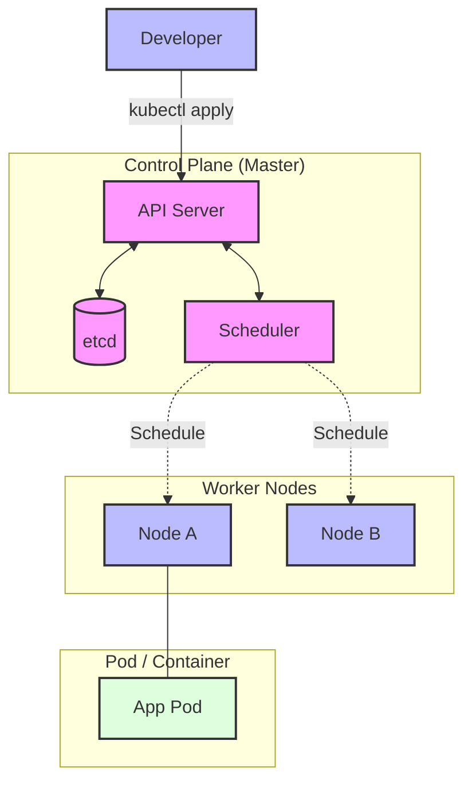
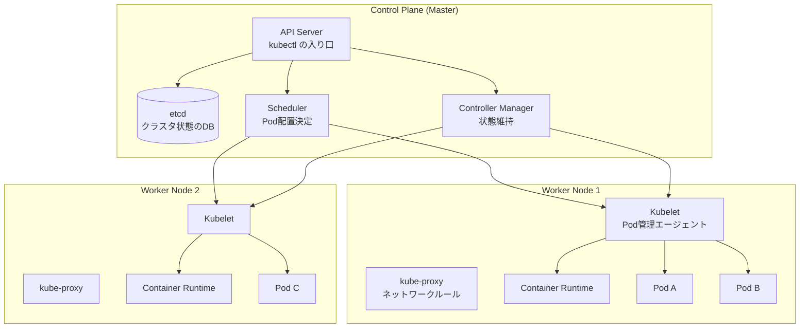

# Kubernetes 実習：コンテナオーケストレーションの基礎から実践まで

このワークショップでは、Kubernetes (K8s) の基礎概念から実際の運用まで、ハンズオン形式で学びます。単なるインフラ管理ツールとしてではなく、**「分散システムを動かすためのプラットフォーム」**としての K8s を理解することを目指します。

> **⚠️ 所要時間の目安**: 本実習は内容が豊富なため、**複数セッションに分割して実施することを推奨**します（目安：各セクション 30〜45 分）。
>
> **💡 用語集**: この実習で登場する[Pod](glossary_ja.md#kubernetes)や[Deployment](glossary_ja.md#kubernetes)、[Service](glossary_ja.md#kubernetes)などの専門用語は [用語集](glossary_ja.md) を参照してください。

---

## なぜソフトウェアエンジニアが Kubernetes を学ぶのか？

現代のソフトウェア開発において、Kubernetes は単なる「運用ツールのひとつ」ではありません。開発者が K8s を理解することで、以下のようなメリットがあります。

1. **再現性の高い環境**: ローカルの `kind` で動くものは、本番でも同じように動きます。「自分のマシンでは動いた」という問題が解消されます。
2. **自己修復・オートスケール**: アプリケーションがクラッシュした際の再起動や、トラフィック増大時のスケールを K8s が代行してくれるため、アプリ側で複雑な並列処理や監視コードを書く必要が減ります。
3. **API 駆動なインフラ**: 全ての構成を YAML（コード）で管理できるため、アプリケーションのデプロイを CI/CD パイプラインに完全に統合できます。

---

## ゴール

Kubernetes を使用したコンテナオーケストレーションの基礎から実践までを習得し、本番運用に必要な知識を身につけます。



**この実習で習得すること:**

1. **Kubernetes アーキテクチャ**: Control Plane と Node の役割分担
2. **基本リソース**: Pod, Deployment, Service の使い方
3. **設定管理**: ConfigMap, Secret による設定注入
4. **ストレージ**: PersistentVolume, PersistentVolumeClaim による永続化
5. **ネットワーキング**: Service, Ingress による外部公開
6. **Helm**: パッケージマネージャーによるアプリケーション管理
7. **Observability**: メトリクス、ログ、トレースの収集

---

## Kubernetes 導入の課題

### ❌ 課題

- **スケーリングの複雑さ**: コンテナの数が増えると、手動管理が不可能になる
- **セルフヒーリング**: コンテナが落ちたとき、自動で再起動したい
- **ロールバット更新**: ゼロダウンタイムでデプロイしたい
- **設定管理**: 環境ごとの設定違いを管理したい
- **サービスディスカバリ**: 動的に変わる Pod の IP を解決したい

### ✅ Kubernetes の解決策

- **宣言的な設定**: 「あるべき状態」を宣言すると、Kubernetes がその状態を作る
- **自己修復**: Pod が落ちると自動で再起動
- **ローリングアップデート**: ゼロダウンタイムでデプロイ
- **設定注入**: ConfigMap, Secret で設定を外部化
- **サービスディスカバリ**: DNS による動的なサービス解決

---

## アーキテクチャ

### コンポーネント構成



### 想定ディレクトリ構造

```text
~/k8s-workshop/
├── manifests/           # Kubernetes マニフェスト
│   ├── 01-pod.yaml
│   ├── 02-deployment.yaml
│   ├── 03-service.yaml
│   ├── 04-configmap.yaml
│   ├── 05-secret.yaml
│   ├── 06-pvc.yaml
│   └── 07-ingress.yaml
├── helm/                # Helm Chart
│   └── myapp/
│       ├── Chart.yaml
│       ├── values.yaml
│       └── templates/
├── app/                 # サンプルアプリケーション
│   ├── main.go
│   ├── Dockerfile
│   └── config/
└── scripts/             # ユーティリティスクリプト
```

---

## 準備

### 1. 前提条件

- **OS**: Linux, macOS, Windows (WSL2)
- **ツール**:
  - kubectl (Kubernetes CLI)
  - Kind (ローカル K8s クラスタ) または Minikube
  - Helm (パッケージマネージャー)
  - Go (サンプルアプリ作成用)

### 2. ツールインストール

```bash
# macOS (Homebrew)
brew install kubectl kind helm go

# Linux
curl -LO "https://dl.k8s.io/release/$(curl -L -s https://dl.k8s.io/release/stable.txt)/bin/linux/amd64/kubectl"
chmod +x kubectl
sudo mv kubectl /usr/local/bin/

# Kind
go install sigs.k8s.io/kind@latest

# Helm
curl https://raw.githubusercontent.com/helm/helm/main/scripts/get-helm-4 | bash
```

### 3. ローカルクラスタ作成

```bash
# Kind クラスタ作成
kind create cluster --name workshop

# コンテキスト確認
kubectl config current-context
kubectl cluster-info
```

### ✅ チェックポイント

- [ ] `kubectl version --client` で kubectl バージョンが表示される
- [ ] `kind get clusters` で `workshop` クラスタが存在する
- [ ] `kubectl get nodes` でノードが Ready 状態

---

## 実習ステップ

### STEP 1: Pod の基礎

最小のデプロイ単位である Pod を理解します。

```yaml
# manifests/01-pod.yaml
apiVersion: v1
kind: Pod
metadata:
  name: nginx-pod
  labels:
    app: nginx
spec:
  containers:
  - name: nginx
    image: nginx:1.27-alpine
    ports:
    - containerPort: 80
    resources:
      requests:
        memory: "64Mi"
        cpu: "250m"
      limits:
        memory: "128Mi"
        cpu: "500m"
```

```bash
# Pod 作成
kubectl apply -f manifests/01-pod.yaml

# 状態確認
kubectl get pods
kubectl describe pod nginx-pod

# ログ確認
kubectl logs nginx-pod

# Pod 内でコマンド実行
kubectl exec -it nginx-pod -- sh

# ポートフォワード
kubectl port-forward nginx-pod 8080:80
# 別ターミナルで: curl http://localhost:8080

# Pod 削除
kubectl delete pod nginx-pod
```

### ✅ チェックポイント

- [ ] `kubectl get pods` で STATUS が `Running` になる
- [ ] `kubectl logs nginx-pod` で nginx のログが見える
- [ ] ポートフォワード経由で nginx ウェルカムページが表示される

### STEP 2: Deployment による宣言的デプロイ

Pod を管理し、レプリケーションとローリングアップデートを実現します。

```yaml
# manifests/02-deployment.yaml
apiVersion: apps/v1
kind: Deployment
metadata:
  name: nginx-deployment
spec:
  replicas: 3
  selector:
    matchLabels:
      app: nginx
  template:
    metadata:
      labels:
        app: nginx
    spec:
      containers:
      - name: nginx
        image: nginx:1.27-alpine
        ports:
        - containerPort: 80
        livenessProbe:
          httpGet:
            path: /
            port: 80
          initialDelaySeconds: 3
          periodSeconds: 3
        readinessProbe:
          httpGet:
            path: /
            port: 80
          initialDelaySeconds: 3
          periodSeconds: 3
```

```bash
# Deployment 作成
kubectl apply -f manifests/02-deployment.yaml

# 状態確認
kubectl get deployments
kubectl get replicasets
kubectl get pods -l app=nginx

# スケールアウト
kubectl scale deployment nginx-deployment --replicas=5

# ローリングアップデート
kubectl set image deployment/nginx-deployment nginx=nginx:1.27.4-alpine

# ロールアウト状態確認
kubectl rollout status deployment/nginx-deployment
kubectl rollout history deployment/nginx-deployment

# ロールバック
kubectl rollout undo deployment/nginx-deployment
```

### ✅ チェックポイント

- [ ] `kubectl get pods -l app=nginx` で 3 つの Pod が Running
- [ ] スケールアウト後、5 つの Pod が存在する
- [ ] イメージ更新時にゼロダウンタイムで切り替わる
- [ ] `kubectl describe pod` で Events にスケジューリング履歴が見える

### STEP 3: Service によるサービスディスカバリ

Pod の集合に安定したネットワーク上のアイデンティティ（固定 IP + DNS 名）を提供します。

```yaml
# manifests/03-service.yaml
apiVersion: v1
kind: Service
metadata:
  name: nginx-service
spec:
  type: ClusterIP
  selector:
    app: nginx
  ports:
  - port: 80
    targetPort: 80
    protocol: TCP
  sessionAffinity: None
```

```bash
# Service 作成
kubectl apply -f manifests/03-service.yaml

# 状態確認
kubectl get services
kubectl describe service nginx-service

# ClusterIP 確認
SERVICE_IP=$(kubectl get service nginx-service -o jsonpath='{.spec.clusterIP}')
kubectl run test-pod --image=busybox:1.37 --rm -it --restart=Never -- wget -O- http://$SERVICE_IP

# DNS 解決確認
kubectl run test-dns --image=busybox:1.37 --rm -it --restart=Never -- nslookup nginx-service

# NodePort で外部公開
kubectl patch service nginx-service -p '{"spec":{"type":"NodePort"}}'
```

### ✅ チェックポイント

- [ ] `kubectl get endpoints nginx-service` で Pod IP が登録されている
- [ ] ClusterIP 経由で nginx にアクセスできる
- [ ] `nginx-service.default.svc.cluster.local` で DNS 解決できる
- [ ] NodePort でノード経由アクセスが可能

### STEP 4: ConfigMap による設定注入

設定をコンテナイメージから分離します。

```yaml
# manifests/04-configmap.yaml
apiVersion: v1
kind: ConfigMap
metadata:
  name: app-config
data:
  APP_ENV: "production"
  APP_LOG_LEVEL: "info"
  config.json: |
    {
      "database": {
        "host": "postgres.default.svc.cluster.local",
        "port": 5432
      }
    }
---
apiVersion: v1
kind: Pod
metadata:
  name: config-demo
spec:
  containers:
  - name: demo
    image: busybox:1.37
    command: ["sh", "-c", "echo $APP_ENV && cat /etc/config/config.json && sleep 3600"]
    env:
    - name: APP_ENV
      valueFrom:
        configMapKeyRef:
          name: app-config
          key: APP_ENV
    volumeMounts:
    - name: config-volume
      mountPath: /etc/config
  volumes:
  - name: config-volume
    configMap:
      name: app-config
```

```bash
# ConfigMap 作成
kubectl apply -f manifests/04-configmap.yaml

# 確認
kubectl logs config-demo
kubectl exec -it config-demo -- env | grep APP

# ConfigMap 更新
kubectl patch configmap app-config --type merge -p '{"data":{"APP_ENV":"staging"}}'
# Pod 再作成で反映されることを確認
```

### ✅ チェックポイント

- [ ] 環境変数 `APP_ENV` が `production` でセットされている
- [ ] `/etc/config/config.json` がマウントされている
- [ ] ConfigMap 更新後、新規 Pod に反映される

### STEP 5: Secret による機密情報管理

パスワード、API キー等を安全に管理します。

```yaml
# manifests/05-secret.yaml
apiVersion: v1
kind: Secret
metadata:
  name: app-secret
type: Opaque
stringData:
  DB_PASSWORD: "secret-password-123"
  API_KEY: "sk-test-12345"
---
apiVersion: v1
kind: Pod
metadata:
  name: secret-demo
spec:
  containers:
  - name: demo
    image: busybox:1.37
    command: ["sh", "-c", "echo $DB_PASSWORD && sleep 3600"]
    env:
    - name: DB_PASSWORD
      valueFrom:
        secretKeyRef:
          name: app-secret
          key: DB_PASSWORD
```

```bash
# Secret 作成
kubectl apply -f manifests/05-secret.yaml

# 確認 (base64 エンコードされている)
kubectl get secret app-secret -o yaml

# Secret を使用して作成したリソース一覧取得
kubectl get secret app-secret -o jsonpath='{.metadata.ownerReferences}'

# Secret の値をデコードして確認
kubectl get secret app-secret -o jsonpath='{.data.DB_PASSWORD}' | base64 -d
```

### ✅ チェックポイント

- [ ] Secret は base64 エンコードされている (暗号化ではない)
- [ ] Pod 内の環境変数からデコードされた値が取得できる
- [ ] `kubectl describe` で Secret 値は表示されない (セキュリティ)

### STEP 6: 永続ボリュームによるストレージ管理

Pod を超えてデータを永続化します。

```yaml
# manifests/06-pvc.yaml
apiVersion: v1
kind: PersistentVolumeClaim
metadata:
  name: data-pvc
spec:
  accessModes:
    - ReadWriteOnce
  resources:
    requests:
      storage: 1Gi
  storageClassName: standard
---
apiVersion: apps/v1
kind: Deployment
metadata:
  name: data-deployment
spec:
  replicas: 1
  selector:
    matchLabels:
      app: data
  template:
    metadata:
      labels:
        app: data
    spec:
      volumes:
      - name: data-volume
        persistentVolumeClaim:
          claimName: data-pvc
      containers:
      - name: writer
        image: busybox:1.37
        command: ["sh", "-c", "echo 'Hello at $(date)' >> /data/test.txt && cat /data/test.txt && sleep 3600"]
        volumeMounts:
        - name: data-volume
          mountPath: /data
```

```bash
# PVC 作成
kubectl apply -f manifests/06-pvc.yaml

# 状態確認
kubectl get pvc
kubectl get pv

# データ書き込み確認
kubectl logs -l app=data

# Pod 再作成してもデータが残っていることを確認
kubectl delete pod -l app=data
kubectl logs -l app=data
```

### ✅ チェックポイント

- [ ] PVC が `Bound` 状態になる
- [ ] Pod 再作成後も `/data/test.txt` の内容が保持される
- [ ] `kubectl describe pvc` でボリューム情報が確認できる

### STEP 7: Ingress による HTTP ロードバランシング

クラスタ外への HTTP/HTTPS ルーティングを設定します。

```yaml
# manifests/07-ingress.yaml
apiVersion: networking.k8s.io/v1
kind: Ingress
metadata:
  name: nginx-ingress
  annotations:
    nginx.ingress.kubernetes.io/rewrite-target: /
spec:
  ingressClassName: nginx
  rules:
  - host: nginx.local
    http:
      paths:
      - path: /
        pathType: Prefix
        backend:
          service:
            name: nginx-service
            port:
              number: 80
```

```bash
# Kind で NGINX Ingress Controller 有効化
kubectl apply -f https://raw.githubusercontent.com/kubernetes/ingress-nginx/main/deploy/static/provider/kind/deploy.yaml

# Ingress 作成
kubectl apply -f manifests/07-ingress.yaml

# /etc/hosts に追加 (ノード IP を確認)
NODE_IP=$(kubectl get node workshop-control-plane -o jsonpath='{.status.addresses[0].address}')
echo "$NODE_IP nginx.local" | sudo tee -a /etc/hosts

# アクセス確認
curl http://nginx.local
```

### ✅ チェックポイント

- [ ] Ingress Controller Pod が Running
- [ ] `curl http://nginx.local` で nginx ウェルカムページが表示される
- [ ] `kubectl describe ingress` でルーティングルールが確認できる

### STEP 8: Helm によるパッケージ管理

Helm Chart を使用してアプリケーションをパッケージ化・管理します。

```bash
# Helm Chart 作成
helm create myapp

# Chart 構造
tree myapp/
# myapp/
# ├── Chart.yaml
# ├── values.yaml
# ├── templates/
# │   ├── deployment.yaml
# │   ├── service.yaml
# │   ├── ingress.yaml
# │   └── _helpers.tpl
# └── values.schema.json

# values.yaml 編集 (必要に応じて)
# カスタムイメージ、レプリカ数等を設定

# パッケージ化
helm package myapp

# インストール
helm install myapp-release ./myapp-0.1.0.tgz

# 確認
helm list
helm status myapp-release
kubectl get all -l app.kubernetes.io/name=myapp

# アップグレード (values.yaml 編集後)
helm upgrade myapp-release ./myapp

# ロールバック
helm rollback myapp-release

# アンインストール
helm uninstall myapp-release
```

### ✅ チェックポイント

- [ ] Helm Chart が正常に作成される
- [ ] `helm install` でデプロイが成功する
- [ ] `helm upgrade` でローリングアップデートが実行される
- [ ] `helm rollback` で以前のリビジョンに戻せる

### STEP 9: Observability (可観測性)

メトリクス、ログ、トレースを収集します。

```bash
# Prometheus Operator インストール
helm repo add prometheus-community https://prometheus-community.github.io/helm-charts
helm repo update
helm install prometheus prometheus-community/kube-prometheus-stack

# ダッシュボードアクセス (ポートフォワード)
kubectl port-forward svc/prometheus-grafana 3000:80
# ブラウザで http://localhost:3000
# デフォルト認証: admin / prom-operator

# メトリクス確認
kubectl port-forward svc/prometheus-kube-prometheus-prometheus 9090:9090
# ブラウザで http://localhost:9090

# Pod ログ確認
kubectl logs -l app=nginx --tail=100
kubectl logs -f deployment/nginx-deployment

# 複数コンテナ Pod のログ
kubectl logs nginx-pod -c nginx-container

# 過去のログ (再起動後も)
kubectl logs nginx-pod --previous
```

### ✅ チェックポイント

- [ ] Prometheus でメトリクスが収集されている
- [ ] Grafana ダッシュボードで可視化されている
- [ ] `kubectl logs` でアプリケーションログが確認できる

### STEP 10: Go アプリケーションのコンテナ化とデプロイ

Go でシンプルなウェブアプリケーションを作成し、コンテナ化して Kubernetes にデプロイします。

```bash
# プロジェクト作成
mkdir -p ~/k8s-workshop/app
cd ~/k8s-workshop/app

# Go モジュール初期化
go mod init github.com/example/k8s-app

# クリーンアーキテクチャ構造作成
mkdir -p domain usecase infra cmd/server

# 実装 (簡略化)
cat > main.go << 'EOF'
package main

import (
    "fmt"
    "net/http"
    "os"
)

func main() {
    port := os.Getenv("PORT")
    if port == "" {
        port = "8080"
    }

    http.HandleFunc("/", func(w http.ResponseWriter, r *http.Request) {
        fmt.Fprintf(w, "Hello from Kubernetes! Pod: %s\n", os.Getenv("POD_NAME"))
    })

    fmt.Printf("Server listening on port %s\n", port)
    if err := http.ListenAndServe(":"+port, nil); err != nil {
        fmt.Printf("Error: %v\n", err)
        os.Exit(1)
    }
}
EOF

# Dockerfile 作成
cat > Dockerfile << 'EOF'
FROM golang:1.24-alpine AS builder
WORKDIR /app
COPY go.mod go.sum ./
RUN go mod download
COPY . .
RUN CGO_ENABLED=0 go build -o server

FROM alpine:3.21
RUN apk --no-cache add ca-certificates
WORKDIR /root/
COPY --from=builder /app/server .
CMD ["./server"]
EOF

# イメージビルド (Kind 用にロード)
docker build -t k8s-app:latest .
kind load docker-image k8s-app:latest --name workshop

# マニフェスト作成
cat > manifests/k8s-app-deployment.yaml << 'EOF'
apiVersion: apps/v1
kind: Deployment
metadata:
  name: k8s-app
spec:
  replicas: 2
  selector:
    matchLabels:
      app: k8s-app
  template:
    metadata:
      labels:
        app: k8s-app
    spec:
      containers:
      - name: server
        image: k8s-app:latest
        ports:
        - containerPort: 8080
        env:
        - name: PORT
          value: "8080"
        - name: POD_NAME
          valueFrom:
            fieldRef:
              fieldPath: metadata.name
        resources:
          requests:
            memory: "32Mi"
            cpu: "100m"
          limits:
            memory: "64Mi"
            cpu: "200m"
EOF

# デプロイ
kubectl apply -f manifests/k8s-app-deployment.yaml
kubectl apply -f manifests/k8s-app-service.yaml

# 確認
kubectl get pods -l app=k8s-app
kubectl port-forward svc/k8s-app-service 8080:80
curl http://localhost:8080
```

### ✅ チェックポイント

- [ ] Docker イメージがビルドされ、Kind にロードされる
- [ ] Deployment から Pod が起動する
- [ ] Service 経由でアプリケーションにアクセスできる
- [ ] 各 Pod が異なる `POD_NAME` を返す

---

## まとめ

1. **Kubernetes は宣言的**: YAML で「あるべき状態」を記述する
2. **自己修復**: Pod が落ちると自動で再起動
3. **スケーラビリティ**: `kubectl scale` で容易にスケール
4. **設定分離**: ConfigMap, Secret で設定を外部化
5. **可観測性**: メトリクス、ログ、トレースで状態把握

---

## クリーンアーキテクチャとの親和性

Kubernetes はクリーンアーキテクチャと非常に相性が良いです：

1. **レイヤー分離**: 各レイヤーを独立した Deployment としてデプロイ可能
2. **依存注入**: ConfigMap, Secret で設定注入
3. **インターフェース分離**: Service でレイヤー間の通信を抽象化

```yaml
# クリーンアーキテクチャなマイクロサービス例
apiVersion: v1
kind: Service
metadata:
  name: usecase-service
spec:
  selector:
    app: usecase-layer
  ports:
  - port: 8080
---
apiVersion: apps/v1
kind: Deployment
metadata:
  name: usecase-deployment
spec:
  template:
    spec:
      containers:
      - name: usecase
        image: usecase-service:latest
        env:
        # Infra Layer の Service を DNS で解決
        - name: REPO_ENDPOINT
          value: "infra-service.default.svc.cluster.local:8080"
```

---

## 参考文献

- [Kubernetes 公式ドキュメント](https://kubernetes.io/docs/)
- [Helm 公式ドキュメント](https://helm.sh/docs/)
- [Prometheus Operator](https://prometheus-operator.dev/)

---

## 🔧 トラブルシューティング

### Pod が起動しない (CrashLoopBackOff)

**症状**: Pod が繰り返し再起動される

**原因と対処**:

1. ログでエラー確認:

   ```bash
   kubectl logs <pod-name>
   kubectl logs <pod-name> --previous  # 前回のログ
   ```

2. イベント確認:

   ```bash
   kubectl describe pod <pod-name>
   ```

3. よくある原因:
   - イメージ不存在: イメージ名、タグ確認
   - ヘルスチェック失敗: `readinessProbe`, `livenessProbe` 見直し
   - リソース不足: `resources.requests/limits` 確認

### Service で Pod に到達できない

**症状**: ClusterIP でアクセスできない

**原因と対処**:

1. Endpoint 確認:

   ```bash
   kubectl get endpoints <service-name>
   ```

   - Pod が `Ready` でないと登録されない

2. Selector 確認:

   ```bash
   kubectl get service <service-name> -o yaml | grep selector -A 3
   kubectl get pods --show-labels
   ```

   - ラベルが一致しているか確認

3. ネットワークポリシー:

   ```bash
   kubectl get networkpolicies
   ```

   - ポリシーで通信がブロックされていないか確認

### ディスク容量不足

**症状**: `Evicted` な Pod が出る

**原因と対処**:

```bash
# ノードのディスク使用量確認
kubectl describe node | grep -A 5 "Allocated resources"

# PVC の使用量確認
kubectl exec -it <pod-name> -- df -h

# 不要なリソース削除
kubectl delete pods --field-selector=status.phase=Succeeded
kubectl delete pods --field-selector=status.phase=Failed
```

---

## 💻 環境別注意事項

### macOS の場合

- **Kind 推奨**: Docker Desktop に付属の K8s より Kind が軽量
- **ポートフォワード**: `kubectl port-forward` でローカルポートにマッピング
- **DNS**: `/etc/hosts` に Node IP を手動追加

### Linux の場合

- **システム内 K8s**: `kubectl` が直接クラスタと通信
- **権限**: `.kube/config` のパーミッションに注意
- **NetworkPolicy**: Calico, Cilium 等の CNI プラグインが利用可能

### Windows の場合

- **WSL2 推奨**: WSL2 上で Kind/Minikube を実行
- **パス**: WSL2 内の `.kube/config` を Windows 側から参照
- **エディタ**: VS Code Remote - WSL 拡張の利用推奨
