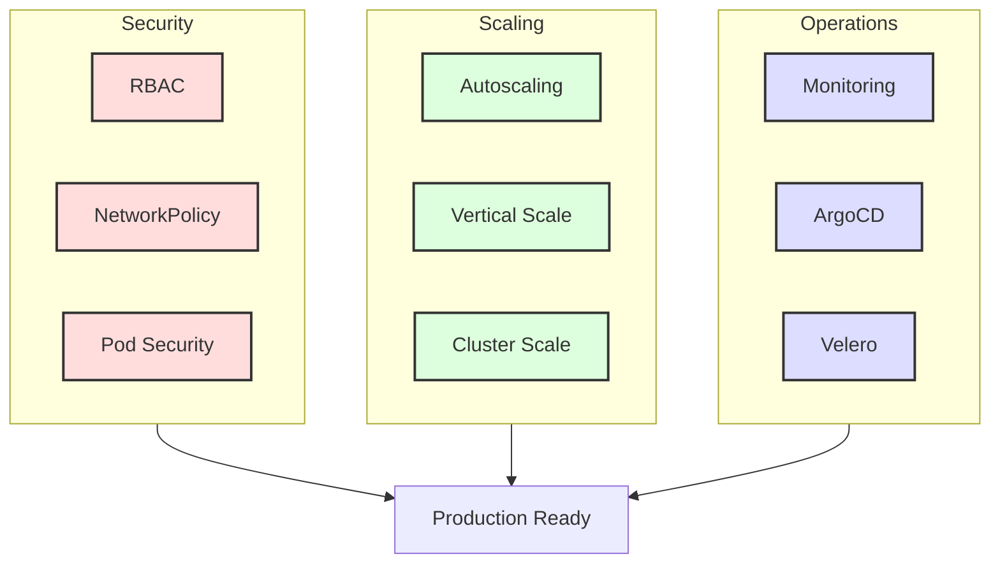

# Kubernetes Operations & Security Workshop: Advanced Features for Production

In this workshop, you will learn the advanced features of Kubernetes required for production operations, including security, scaling, and monitoring.

> **💡 Glossary**: For technical terms like [RBAC](glossary_en.md#security), [NetworkPolicy](glossary_en.md#security), and [HPA](glossary_en.md#kubernetes) used in this workshop, refer to the [Glossary](glossary_en.md).

---

## Why Should Software Engineers Learn Kubernetes Operations?

While developers often focus on writing application code, understanding how that code runs and stays secure in production is a critical skill for a "Senior" engineer.

1. **Security-by-Design**: By understanding RBAC and NetworkPolicies, you can design your application's security at the architecture level, ensuring it follows the principle of least privilege.
2. **Predictable Scaling**: Understanding HPA/VPA allows you to design applications that scale efficiently without resource wastage or performance bottlenecks.
3. **Operational Awareness**: Learning GitOps (ArgoCD) and Backup (Velero) ensures that you can manage the full lifecycle of your application, from deployment to disaster recovery.

---

## Goals

Master production-ready Kubernetes configurations, focusing on building a secure and scalable cluster.



**What you'll learn:**

1. **RBAC**: Role-based access control for permission management
2. **NetworkPolicy**: Control network communication
3. **Pod Security**: Pod security policies
4. **HPA/VPA**: Automatic scaling
5. **Resource Quotas**: Namespace-level resource limits
6. **GitOps**: Declarative deployment with ArgoCD
7. **Backup**: Cluster backup with Velero

---

## Prerequisites

```bash
# Prepare cluster
kind create cluster --name ops-workshop --config - <<EOF
kind: Cluster
apiVersion: kind.x-k8s.io/v1alpha4
nodes:
- role: control-plane
- role: worker
- role: worker
EOF

kubectl cluster-info --context kind-ops-workshop
```

### ✅ Checklist

- [ ] `kubectl get nodes` shows 3 nodes in Ready state

---

## Workshop Steps

### STEP 1: RBAC (Role-Based Access Control)

Implement fine-grained permission management per user/service account.

```yaml
# manifests/rbac.yaml
apiVersion: v1
kind: Namespace
metadata:
  name: development
---
apiVersion: v1
kind: ServiceAccount
metadata:
  name: app-sa
  namespace: development
---
apiVersion: rbac.authorization.k8s.io/v1
kind: Role
metadata:
  name: pod-reader
  namespace: development
rules:
- apiGroups: [""]
  resources: ["pods", "pods/log"]
  verbs: ["get", "list", "watch"]
---
apiVersion: rbac.authorization.k8s.io/v1
kind: RoleBinding
metadata:
  name: read-pods
  namespace: development
subjects:
- kind: ServiceAccount
  name: app-sa
  namespace: development
roleRef:
  kind: Role
  name: pod-reader
  apiGroup: rbac.authorization.k8s.io
---
apiVersion: v1
kind: Pod
metadata:
  name: test-pod
  namespace: development
spec:
  serviceAccountName: app-sa
  containers:
  - name: tester
    image: busybox:1.36
    command: ["sh", "-c", "sleep 3600"]
```

```bash
# Apply RBAC
kubectl apply -f manifests/rbac.yaml

# Verify permissions
kubectl auth can-i get pods -n development --as=system:serviceaccount:development:app-sa
kubectl auth can-i delete pods -n development --as=system:serviceaccount:development:app-sa

# Operate as ServiceAccount
kubectl get pods -n development --as=system:serviceaccount:development:app-sa
```

### ✅ Checklist

- [ ] `can-i get pods` returns `yes`
- [ ] `can-i delete pods` returns `no`
- [ ] ServiceAccount can list Pods

### STEP 2: NetworkPolicy

Control network communication between Pods.

```yaml
# manifests/network-policy.yaml
apiVersion: networking.k8s.io/v1
kind: NetworkPolicy
metadata:
  name: deny-all
  namespace: development
spec:
  podSelector: {}
  policyTypes:
  - Ingress
  - Egress
---
apiVersion: networking.k8s.io/v1
kind: NetworkPolicy
metadata:
  name: allow-web
  namespace: development
spec:
  podSelector:
    matchLabels:
      app: web
  policyTypes:
  - Ingress
  - Egress
  ingress:
  - from:
    - podSelector:
        matchLabels:
          app: frontend
    ports:
    - protocol: TCP
      port: 80
  egress:
  - to:
    - namespaceSelector:
        matchLabels:
          name: kube-system
    ports:
    - protocol: UDP
      port: 53
  - to:
    - podSelector:
        matchLabels:
          app: database
    ports:
    - protocol: TCP
      port: 5432
```

```bash
# Verify CNI plugin (Kind uses kindnet)
# NOTE: kindnet has limited NetworkPolicy support. For full support, use Calico or Cilium.
kubectl get pods -n kube-system -l k8s-app=kindnet

# Test deployments
kubectl create deployment web --image=nginx:1.25-alpine -n development
kubectl create deployment frontend --image=busybox:1.36 -n development -- sleep 3600
kubectl create deployment database --image=postgres:16-alpine -n development

# Add labels
kubectl label deployment web app=web -n development
kubectl label deployment frontend app=frontend -n development
kubectl label deployment database app=database -n development

# Apply NetworkPolicy
kubectl apply -f manifests/network-policy.yaml

# Verify connectivity
kubectl exec -n development deploy/frontend -- wget -O- http://web -T 2
```

### ✅ Checklist

- [ ] deny-all policy blocks traffic
- [ ] allow-web enables frontend → web traffic
- [ ] web → database traffic is permitted

### STEP 3: Pod Security Standards

Enforce Pod security baselines.

```yaml
# manifests/pod-security.yaml
apiVersion: v1
kind: Namespace
metadata:
  name: secure-app
  labels:
    pod-security.kubernetes.io/enforce: restricted
    pod-security.kubernetes.io/audit: restricted
    pod-security.kubernetes.io/warn: restricted
---
apiVersion: v1
kind: Pod
metadata:
  name: secure-pod
  namespace: secure-app
spec:
  securityContext:
    runAsNonRoot: true
    runAsUser: 1000
    fsGroup: 1000
    seccompProfile:
      type: RuntimeDefault
  containers:
  - name: app
    image: nginx:1.25-alpine
    securityContext:
      allowPrivilegeEscalation: false
      capabilities:
        drop:
        - ALL
      readOnlyRootFilesystem: true
```

```bash
# Apply
kubectl apply -f manifests/pod-security.yaml

# Verify privileged container rejection
kubectl run privileged --image=nginx:1.25-alpine -n secure-app --privileged --restart=Never
# Should error

# Check audit logs
kubectl get events -n secure-app --field-selector reason=Violation
```

### ✅ Checklist

- [ ] secure-pod is created
- [ ] privileged Pod is rejected
- [ ] Audit logs show violations

### STEP 4: Horizontal Pod Autoscaler (HPA)

Automatically scale Pods based on CPU/memory usage.

```bash
# Install Metrics Server
kubectl apply -f https://github.com/kubernetes-sigs/metrics-server/releases/latest/download/components.yaml

# Kind requires --kubelet-insecure-tls (self-signed certs on kubelet)
kubectl patch deployment metrics-server -n kube-system --type=json \
  -p='[{"op":"add","path":"/spec/template/spec/containers/0/args/-","value":"--kubelet-insecure-tls"}]'

# Verify operation
kubectl get apiservice v1beta1.metrics.k8s.io
kubectl top nodes
kubectl top pods
```

```yaml
# manifests/hpa.yaml
apiVersion: apps/v1
kind: Deployment
metadata:
  name: scalable-app
spec:
  replicas: 2
  selector:
    matchLabels:
      app: scalable
  template:
    metadata:
      labels:
        app: scalable
    spec:
      containers:
      - name: app
        image: polinux/stress
        resources:
          requests:
            cpu: "100m"
            memory: "128Mi"
          limits:
            cpu: "500m"
            memory: "512Mi"
        command: ["stress"]
        args: ["--cpu", "2", "--vm", "1", "--vm-bytes", "128M", "--timeout", "3600s"]
---
apiVersion: autoscaling/v2
kind: HorizontalPodAutoscaler
metadata:
  name: scalable-hpa
spec:
  scaleTargetRef:
    apiVersion: apps/v1
    kind: Deployment
    name: scalable-app
  minReplicas: 2
  maxReplicas: 10
  metrics:
  - type: Resource
    resource:
      name: cpu
      target:
        type: Utilization
        averageUtilization: 50
  - type: Resource
    resource:
      name: memory
      target:
        type: Utilization
        averageUtilization: 80
  behavior:
    scaleDown:
      stabilizationWindowSeconds: 300
      policies:
      - type: Percent
        value: 50
        periodSeconds: 15
    scaleUp:
      stabilizationWindowSeconds: 0
      policies:
      - type: Percent
        value: 100
        periodSeconds: 15
      - type: Pods
        value: 4
        periodSeconds: 15
      selectPolicy: Max
```

```bash
# Apply HPA
kubectl apply -f manifests/hpa.yaml

# The stress image already generates CPU load (--cpu 2 --vm 1).
# Monitor HPA in another terminal:
kubectl get hpa scalable-hpa --watch
kubectl get pods -l app=scalable --watch

# To test scale-down: reduce load by patching to 0 CPU workers
kubectl patch deployment scalable-app --type=json \
  -p='[{"op":"replace","path":"/spec/template/spec/containers/0/args","value":["--cpu","0","--vm","0","--timeout","3600s"]}]'
```

### ✅ Checklist

- [ ] Pod count increases with CPU usage
- [ ] Scaling stops at max replicas (10)
- [ ] Pod count decreases when load drops

### STEP 5: Resource Quotas & LimitRange

Limit resource consumption per namespace.

```yaml
# manifests/quota.yaml
apiVersion: v1
kind: ResourceQuota
metadata:
  name: compute-quota
  namespace: development
spec:
  hard:
    requests.cpu: "4"
    requests.memory: "8Gi"
    limits.cpu: "8"
    limits.memory: "16Gi"
    persistentvolumeclaims: "4"
---
apiVersion: v1
kind: LimitRange
metadata:
  name: cpu-limit-range
  namespace: development
spec:
  limits:
  - default:
      cpu: "500m"
      memory: "512Mi"
    defaultRequest:
      cpu: "100m"
      memory: "128Mi"
    type: Container
```

```bash
# Apply
kubectl apply -f manifests/quota.yaml

# Verify Quota
kubectl describe resourcequota compute-quota -n development

# Test limit exceeded
kubectl create deployment big-app --image=nginx:1.25-alpine -n development --replicas=10
# Should error
```

### ✅ Checklist

- [ ] ResourceQuota tracks consumption
- [ ] LimitRange sets default values
- [ ] Excess deployment is rejected

### STEP 6: GitOps (ArgoCD)

Use Git repository as single source of truth for deployments.

```bash
# Install ArgoCD
kubectl create namespace argocd
kubectl apply -n argocd -f https://raw.githubusercontent.com/argoproj/argo-cd/stable/manifests/install.yaml

# Get password
argocd admin initial-password -n argocd

# Port forward
kubectl port-forward svc/argocd-server -n argocd 8080:443
# Browser: https://localhost:8080
# User: admin

# Install CLI
brew install argocd

# Login
argocd login localhost:8080 --insecure --username admin --password <PASSWORD>

# Create application
argocd app create guestbook \
  --repo https://github.com/argoproj/argocd-example-apps.git \
  --path guestbook \
  --dest-server https://kubernetes.default.svc \
  --dest-namespace default

# Sync
argocd app sync guestbook

# Check status
argocd app get guestbook
```

### ✅ Checklist

- [ ] Can access ArgoCD UI
- [ ] Application is synced
- [ ] Git changes reflect in cluster

### STEP 7: Backup (Velero)

Backup and restore entire clusters.

```bash
# Install Velero
brew install velero

# Create AWS S3 bucket (or use MinIO)
aws s3 mb s3://velero-backups

# Install Velero server
velero install \
  --provider aws \
  --plugins velero/velero-plugin-for-aws:v1.8.0 \
  --bucket velero-backups \
  --secret-file ./credentials-velero \
  --use-volume-snapshots=false \
  --backup-location-config region=ap-northeast-1

# Create backup
velero backup create nginx-backup --include-namespaces development

# List backups
velero backup get

# Backup details
velero backup describe nginx-backup --details

# Test restore
kubectl delete namespace development
velero restore create --from-backup nginx-backup

# Verify restore
velero restore get
kubectl get all -n development
```

### ✅ Checklist

- [ ] Backup completes successfully
- [ ] Backup file saved to S3
- [ ] Restore recreates Namespace

---

## Summary

1. **Security**: RBAC + NetworkPolicy + Pod Security for defense-in-depth
2. **Scalability**: HPA/VPA for automatic scaling
3. **Resource Management**: Quota + LimitRange for fairness
4. **GitOps**: ArgoCD for declarative deployment
5. **Disaster Recovery**: Velero for backup

---

## Production Operations Checklist

### Security

- [ ] Apply least privilege with RBAC
- [ ] Default deny with NetworkPolicy
- [ ] Enforce Pod Security Standards
- [ ] Encrypt Secrets (at-rest)
- [ ] Perform image scanning

### Availability

- [ ] Configure PodDisruptionBudget
- [ ] Enable HPA/VPA for autoscaling
- [ ] Multi-node/availability zone
- [ ] Regular backup and restore testing

### Observability

- [ ] Prometheus + Grafana for metrics
- [ ] Loki/Elasticsearch for log aggregation
- [ ] Tempo/Jaeger for distributed tracing
- [ ] Alertmanager for alerts

---

## References

- [Kubernetes Security Best Practices](https://kubernetes.io/docs/concepts/security/security-checklist/)
- [ArgoCD Documentation](https://argo-cd.readthedocs.io/)
- [Velero Documentation](https://velero.io/docs/)

---

## 🔧 Troubleshooting

### HPA Not Scaling

**Symptoms**: CPU high but replicas not increasing

**Causes & Fixes**:

1. Verify Metrics Server:
   ```bash
   kubectl get apiservice v1beta1.metrics.k8s.io
   kubectl top pods
   ```

2. Check request values:
   ```bash
   kubectl describe hpa <hpa-name>
   ```
   - `resources.requests` must be set

3. Verify target values:
   - Check if `averageUtilization` is realistic

### ArgoCD Not Syncing

**Symptoms**: Diff exists between Git and cluster but no Sync

**Causes & Fixes**:

1. Check sync status:
   ```bash
   argocd app get <app-name>
   ```

2. Manual sync:
   ```bash
   argocd app sync <app-name>
   ```

3. Enable auto-sync:
   ```yaml
   syncPolicy:
     automated:
       prune: true
       selfHeal: true
   ```

---

## 💡 Platform-Specific Notes

### Kind

- NetworkPolicy depends on CNI
- Metrics Server required for HPA
- Velero requires separate storage

### Cloud (EKS/GKE/AKS)

- Leverage managed services
- IAM integration
- Multi-zone configuration
