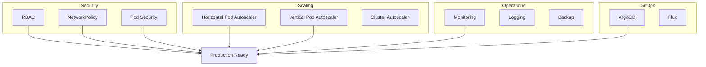

# Kubernetes 運用・セキュリティ実習：本番運用のための高度な機能

このワークショップでは、Kubernetes クラスタの本番運用に必要なセキュリティ、スケーリング、監視の高度な機能を学びます。

> **💡 用語集**: この実習で登場する[RBAC](glossary_ja.md#security)や[NetworkPolicy](glossary_ja.md#security)、[HPA](glossary_ja.md#kubernetes)などの専門用語は [用語集](glossary_ja.md) を参照してください。

## なぜソフトウェアエンジニアが Kubernetes 運用を学ぶのか？

アプリケーションコードを書くことに加え、本番での動作と安全性を理解することも重要です。

1. **設計段階からのセキュリティ**: RBAC と NetworkPolicy を理解し、最小権限の原則をアプリケーションの設計に組み込みます。
2. **予測可能なスケーリング**: HPA/VPA の仕組みを理解し、リソースの浪費や性能のボトルネックを避けます。
3. **運用への理解**: GitOps（ArgoCD）とバックアップ（Velero）を学び、デプロイから災害復旧までのライフサイクルに対応します。

---

## ゴール

本番運用レベルの Kubernetes 構成を習得し、セキュアでスケーラブルなクラスタを構築できるようになります。



**この実習で習得すること:**

1. **RBAC**: ロールベースアクセス制御による権限管理
2. **NetworkPolicy**: ネットワーク通信の制御
3. **Pod Security**: Pod セキュリティポリシー
4. **HPA/VPA**: 自動スケーリング
5. **Resource Quotas**: ネームスペース別リソース制限
6. **GitOps**: ArgoCD による宣言的デプロイ
7. **Backup**: Velero によるクラスタバックアップ

---

## 準備

```bash
# クラスタ準備
kind create cluster --name ops-workshop --config - <<EOF
kind: Cluster
apiVersion: kind.x-k8s.io/v1alpha4
nodes:
- role: control-plane
- role: worker
- role: worker
EOF

kubectl cluster-info --context kind-ops-workshop
```

### ✅ チェックポイント

- [ ] `kubectl get nodes` で 3 つのノードが Ready 状態

---

## 実習ステップ

### STEP 1: RBAC (Role-Based Access Control)

ユーザー/サービスアカウントごとのきめ細かな権限管理を実現します。

```yaml
# manifests/rbac.yaml
apiVersion: v1
kind: Namespace
metadata:
  name: development
---
apiVersion: v1
kind: ServiceAccount
metadata:
  name: app-sa
  namespace: development
---
apiVersion: rbac.authorization.k8s.io/v1
kind: Role
metadata:
  name: pod-reader
  namespace: development
rules:
  - apiGroups: [""]
    resources: ["pods", "pods/log"]
    verbs: ["get", "list", "watch"]
---
apiVersion: rbac.authorization.k8s.io/v1
kind: RoleBinding
metadata:
  name: read-pods
  namespace: development
subjects:
  - kind: ServiceAccount
    name: app-sa
    namespace: development
roleRef:
  kind: Role
  name: pod-reader
  apiGroup: rbac.authorization.k8s.io
---
apiVersion: v1
kind: Pod
metadata:
  name: test-pod
  namespace: development
spec:
  serviceAccountName: app-sa
  containers:
    - name: tester
      image: busybox:1.36
      command: ["sh", "-c", "sleep 3600"]
```

```bash
# RBAC 適用
kubectl apply -f manifests/rbac.yaml

# 権限確認
kubectl auth can-i get pods -n development --as=system:serviceaccount:development:app-sa
kubectl auth can-i delete pods -n development --as=system:serviceaccount:development:app-sa

# ServiceAccount として操作
kubectl get pods -n development --as=system:serviceaccount:development:app-sa
```

### ✅ チェックポイント

- [ ] `can-i get pods` が `yes` になる
- [ ] `can-i delete pods` が `no` になる
- [ ] ServiceAccount として Pod の一覧取得が可能

### STEP 2: NetworkPolicy

Pod 間のネットワーク通信を制御します。

```yaml
# manifests/network-policy.yaml
apiVersion: networking.k8s.io/v1
kind: NetworkPolicy
metadata:
  name: deny-all
  namespace: development
spec:
  podSelector: {}
  policyTypes:
    - Ingress
    - Egress
---
apiVersion: networking.k8s.io/v1
kind: NetworkPolicy
metadata:
  name: allow-web
  namespace: development
spec:
  podSelector:
    matchLabels:
      app: web
  policyTypes:
    - Ingress
    - Egress
  ingress:
    - from:
        - podSelector:
            matchLabels:
              app: frontend
      ports:
        - protocol: TCP
          port: 80
  egress:
    - to:
        - namespaceSelector:
            matchLabels:
              name: kube-system
      ports:
        - protocol: UDP
          port: 53
    - to:
        - podSelector:
            matchLabels:
              app: database
      ports:
        - protocol: TCP
          port: 5432
```

```bash
# CNI プラグイン確認 (Kind は kindnet 使用)
# 注意: kindnet は NetworkPolicy のサポートが限定的。完全なサポートには Calico または Cilium を使用
kubectl get pods -n kube-system -l k8s-app=kindnet

# テスト用デプロイメント
kubectl create deployment web --image=nginx:1.25-alpine -n development
kubectl create deployment frontend --image=busybox:1.36 -n development -- sleep 3600
kubectl create deployment database --image=postgres:16-alpine -n development

# ラベル付与
kubectl label deployment web app=web -n development
kubectl label deployment frontend app=frontend -n development
kubectl label deployment database app=database -n development

# NetworkPolicy 適用
kubectl apply -f manifests/network-policy.yaml

# 通信確認
kubectl exec -n development deploy/frontend -- wget -O- http://web -T 2
```

### ✅ チェックポイント

- [ ] deny-all ポリシー適用後、通信が遮断される
- [ ] allow-web 適用後、frontend → web の通信が可能
- [ ] web → database の通信が許可されている

### STEP 3: Pod Security Standards

Pod のセキュリティ基準を強制します。

```yaml
# manifests/pod-security.yaml
apiVersion: v1
kind: Namespace
metadata:
  name: secure-app
  labels:
    pod-security.kubernetes.io/enforce: restricted
    pod-security.kubernetes.io/audit: restricted
    pod-security.kubernetes.io/warn: restricted
---
apiVersion: v1
kind: Pod
metadata:
  name: secure-pod
  namespace: secure-app
spec:
  securityContext:
    runAsNonRoot: true
    runAsUser: 1000
    fsGroup: 1000
    seccompProfile:
      type: RuntimeDefault
  containers:
    - name: app
      image: nginx:1.25-alpine
      securityContext:
        allowPrivilegeEscalation: false
        capabilities:
          drop:
            - ALL
        readOnlyRootFilesystem: true
```

```bash
# 適用
kubectl apply -f manifests/pod-security.yaml

# 特権コンテナの拒絶を確認
kubectl run privileged --image=nginx:1.25-alpine -n secure-app --privileged --restart=Never
# エラーが出るはず

# Audit ログ確認
kubectl get events -n secure-app --field-selector reason=Violation
```

### ✅ チェックポイント

- [ ] secure-pod は作成される
- [ ] privileged Pod は拒絶される
- [ ] Audit ログに違反が記録される

### STEP 4: Horizontal Pod Autoscaler (HPA)

CPU/メモリ使用量に応じて Pod 数を自動スケールします。

```bash
# Metrics Server インストール
kubectl apply -f https://github.com/kubernetes-sigs/metrics-server/releases/latest/download/components.yaml

# Kind では --kubelet-insecure-tls が必要（kubelet が自己署名証明書を使用するため）
kubectl patch deployment metrics-server -n kube-system --type=json \
  -p='[{"op":"add","path":"/spec/template/spec/containers/0/args/-","value":"--kubelet-insecure-tls"}]'

# 動作確認
kubectl get apiservice v1beta1.metrics.k8s.io
kubectl top nodes
kubectl top pods
```

```yaml
# manifests/hpa.yaml
apiVersion: apps/v1
kind: Deployment
metadata:
  name: scalable-app
spec:
  replicas: 2
  selector:
    matchLabels:
      app: scalable
  template:
    metadata:
      labels:
        app: scalable
    spec:
      containers:
        - name: app
          image: polinux/stress
          resources:
            requests:
              cpu: "100m"
              memory: "128Mi"
            limits:
              cpu: "500m"
              memory: "512Mi"
          command: ["stress"]
          args:
            [
              "--cpu",
              "2",
              "--vm",
              "1",
              "--vm-bytes",
              "128M",
              "--timeout",
              "3600s"
            ]
---
apiVersion: autoscaling/v2
kind: HorizontalPodAutoscaler
metadata:
  name: scalable-hpa
spec:
  scaleTargetRef:
    apiVersion: apps/v1
    kind: Deployment
    name: scalable-app
  minReplicas: 2
  maxReplicas: 10
  metrics:
    - type: Resource
      resource:
        name: cpu
        target:
          type: Utilization
          averageUtilization: 50
    - type: Resource
      resource:
        name: memory
        target:
          type: Utilization
          averageUtilization: 80
  behavior:
    scaleDown:
      stabilizationWindowSeconds: 300
      policies:
        - type: Percent
          value: 50
          periodSeconds: 15
    scaleUp:
      stabilizationWindowSeconds: 0
      policies:
        - type: Percent
          value: 100
          periodSeconds: 15
        - type: Pods
          value: 4
          periodSeconds: 15
      selectPolicy: Max
```

```bash
# HPA 適用
kubectl apply -f manifests/hpa.yaml

# stress イメージが既に CPU 負荷を生成している (--cpu 2 --vm 1)
# 別ターミナルで HPA を監視:
kubectl get hpa scalable-hpa --watch
kubectl get pods -l app=scalable --watch

# スケールダウン確認: CPU ワーカーを 0 に減らして負荷を下げる
kubectl patch deployment scalable-app --type=json \
  -p='[{"op":"replace","path":"/spec/template/spec/containers/0/args","value":["--cpu","0","--vm","0","--timeout","3600s"]}]'
```

### ✅ チェックポイント

- [ ] CPU 使用率上昇に伴い、Pod 数が増加する
- [ ] 最大レプリカ数 (10) で止まる
- [ ] 負荷低下後、Pod 数が減少する

### STEP 5: Resource Quotas & LimitRange

ネームスペースごとのリソース消費を制限します。

```yaml
# manifests/quota.yaml
apiVersion: v1
kind: ResourceQuota
metadata:
  name: compute-quota
  namespace: development
spec:
  hard:
    requests.cpu: "4"
    requests.memory: "8Gi"
    limits.cpu: "8"
    limits.memory: "16Gi"
    persistentvolumeclaims: "4"
---
apiVersion: v1
kind: LimitRange
metadata:
  name: cpu-limit-range
  namespace: development
spec:
  limits:
    - default:
        cpu: "500m"
        memory: "512Mi"
      defaultRequest:
        cpu: "100m"
        memory: "128Mi"
      type: Container
```

```bash
# 適用
kubectl apply -f manifests/quota.yaml

# Quota 確認
kubectl describe resourcequota compute-quota -n development

# 制限超過のテスト
kubectl create deployment big-app --image=nginx:1.25-alpine -n development --replicas=10
# エラーになるはず
```

### ✅ チェックポイント

- [ ] ResourceQuota で消費量が追跡される
- [ ] LimitRange でデフォルト値が設定される
- [ ] 制限超過でデプロイが拒否される

### STEP 6: GitOps (ArgoCD)

Git リポジトリを単一の情報源としてデプロイを管理します。

```bash
# ArgoCD インストール
kubectl create namespace argocd
kubectl apply -n argocd -f https://raw.githubusercontent.com/argoproj/argo-cd/stable/manifests/install.yaml

# パスワード取得
argocd admin initial-password -n argocd

# ポートフォワード
kubectl port-forward svc/argocd-server -n argocd 8080:443
# ブラウザ: https://localhost:8080
# ユーザー: admin

# CLI インストール
brew install argocd

# ログイン
argocd login localhost:8080 --insecure --username admin --password <PASSWORD>

# アプリケーション作成
argocd app create guestbook \
  --repo https://github.com/argoproj/argocd-example-apps.git \
  --path guestbook \
  --dest-server https://kubernetes.default.svc \
  --dest-namespace default

# 同期
argocd app sync guestbook

# 状態確認
argocd app get guestbook
```

### ✅ チェックポイント

- [ ] ArgoCD UI にアクセスできる
- [ ] アプリケーションが同期される
- [ ] Git の変更がクラスタに反映される

### STEP 7: Backup (Velero)

クラスタ全体のバックアップとリストアを行います。

```bash
# Velero インストール
brew install velero

# AWS S3 バケット作成 (または MinIO 使用)
aws s3 mb s3://velero-backups

# Velero サーバーインストール
velero install \
  --provider aws \
  --plugins velero/velero-plugin-for-aws:v1.8.0 \
  --bucket velero-backups \
  --secret-file ./credentials-velero \
  --use-volume-snapshots=false \
  --backup-location-config region=ap-northeast-1

# バックアップ作成
velero backup create nginx-backup --include-namespaces development

# バックアップ一覧
velero backup get

# バックアップ詳細
velero backup describe nginx-backup --details

# リストアテスト
kubectl delete namespace development
velero restore create --from-backup nginx-backup

# リストア確認
velero restore get
kubectl get all -n development
```

### ✅ チェックポイント

- [ ] バックアップが正常に完了する
- [ ] S3 にバックアップファイルが保存される
- [ ] リストアで Namespace が復元される

---

## まとめ

1. **セキュリティ**: RBAC + NetworkPolicy + Pod Security で多層防御
2. **スケーラビリティ**: HPA/VPA で自動スケーリング
3. **リソース管理**: Quota + LimitRange で公平性確保
4. **GitOps**: ArgoCD で宣言的デプロイ
5. **ディザスタリカバリ**: Velero でバックアップ

---

## 本番運用チェックリスト

### セキュリティ

- [ ] RBAC で最小権限の原則を適用
- [ ] NetworkPolicy でデフォルト拒否
- [ ] Pod Security Standards を強制
- [ ] Secret を暗号化 (at-rest)
- [ ] イメージスキャンの実施

### 可用性

- [ ] PodDisruptionBudget 設定
- [ ] HPA/VPA による自動スケーリング
- [ ] 複数ノード/アベイラビリティゾーン
- [ ] 定期バックアップとリストア試験

### 可観測性

- [ ] Prometheus + Grafana でメトリクス収集
- [ ] Loki/Elasticsearch でログ集約
- [ ] Tempo/Jaeger で分散トレース
- [ ] Alertmanager でアラート

---

## 参考文献

- [Kubernetes Security Best Practices](https://kubernetes.io/docs/concepts/security/security-checklist/)
- [ArgoCD Documentation](https://argo-cd.readthedocs.io/)
- [Velero Documentation](https://velero.io/docs/)

---

## 🔧 トラブルシューティング

### HPA がスケールしない

**症状**: CPU 使用率が高いのにレプリカが増えない

**原因と対処**:

1. Metrics Server 動作確認:

   ```bash
   kubectl get apiservice v1beta1.metrics.k8s.io
   kubectl top pods
   ```

2. リクエスト値設定確認:

   ```bash
   kubectl describe hpa <hpa-name>
   ```

   - `resources.requests` が設定されている必要あり

3. ターゲット値確認:
   - `averageUtilization` が現実的な値か確認

### ArgoCD が同期しない

**症状**: Git とクラスタで差分があるのに Sync されない

**原因と対処**:

1. 同期状態確認:

   ```bash
   argocd app get <app-name>
   ```

2. 手動同期:

   ```bash
   argocd app sync <app-name>
   ```

3. 自動同期設定:

   ```yaml
   syncPolicy:
     automated:
       prune: true
       selfHeal: true
   ```

---

## 💻 環境別注意事項

### Kind の場合

- NetworkPolicy は CNI 依存
- HPA には Metrics Server 必須
- Velero は別途ストレージ準備

### クラウド (EKS/GKE/AKS) の場合

- マネージドサービスを活用
- IAM との統合
- マルチゾーン構成
