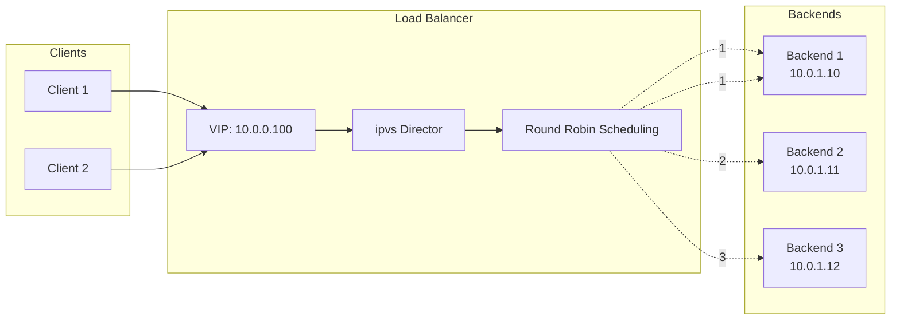
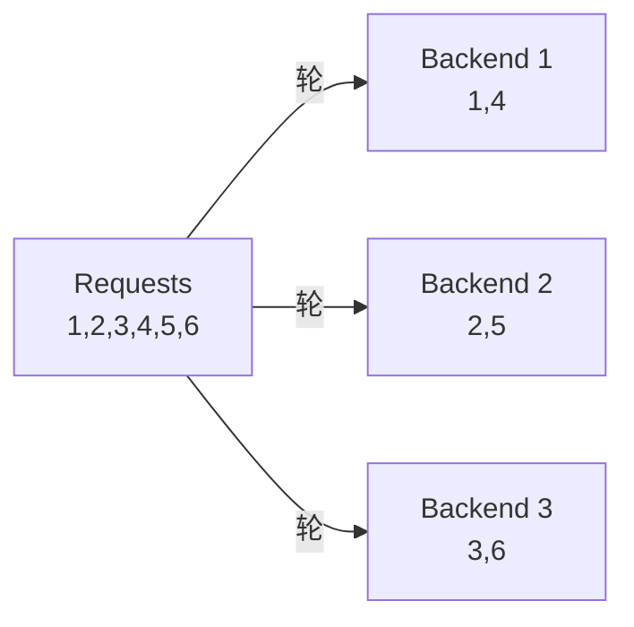
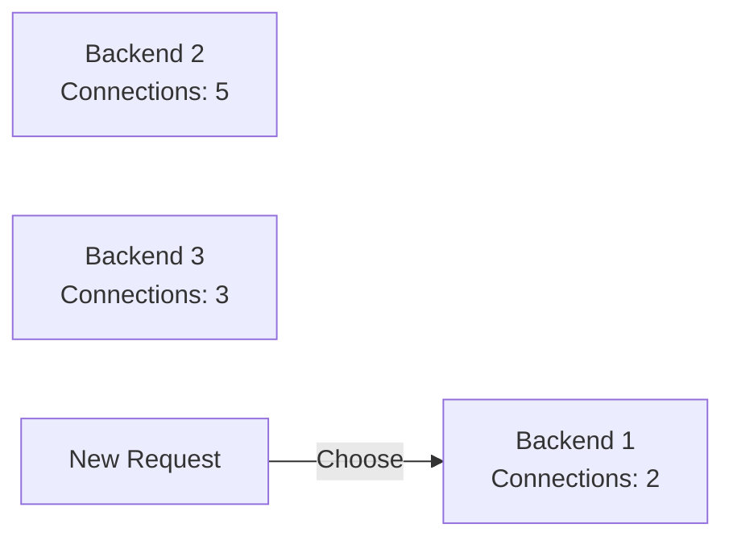
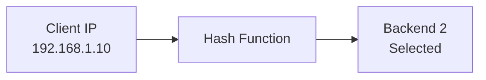
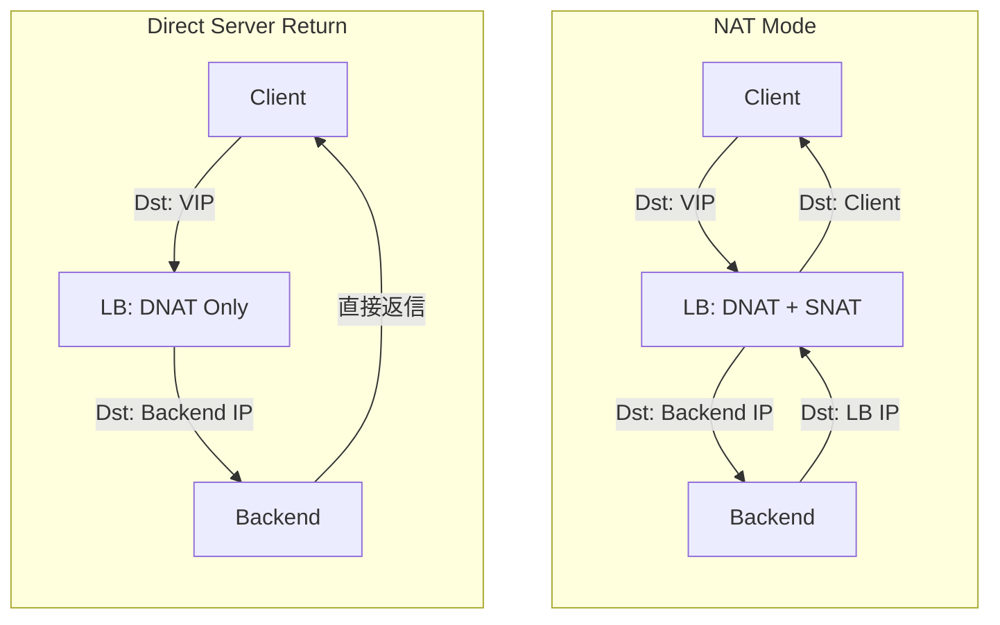

# Load Balancer 実習：iptables で作る仮想ロードバランサ

この実習では、Linux の `iptables` と `ipvs`（IP Virtual Server）を使用して、Kubernetes や HAProxy の背後で動作するロードバランサの仕組みを理解します。

> **💡 用語集**: この実習で登場する[Load Balancer](glossary.md#network)や[DNAT](glossary.md#network)、[Round Robin](glossary.md#network)などの専門用語は [用語集](glossary.md) を参照してください。

## ゴール

1つの仮想 IP（VIP）へのリクエストを、複数のバックエンドサーバーに分散する仕組みを構築します。



**この実習で理解すること:**

1. **DNAT（Destination NAT）**: 宛先 IP を書き換えて転送する仕組み。
2. **スケジューリングアルゴリズム**: リクエストをバックエンドに割り振るポリシー。
3. **ヘルスチェック**: 死活監視と自動除外の仕組み。

---

## ロードバランサの課題

単一のサーバーでトラフィックを処理するには限界があります。

### ❌ 課題

- **単一障害点（SPOF）**: 1台のサーバーが落ちるとサービス全体が停止する。
- **スケーリングの限界**: 1台で処理できるリクエスト数には上限がある。
- **利用不能の継続**: メンテナンス時にサービスを停止する必要がある。

### ✅ ロードバランサの解決策

- **冗長化**: 複数のバックエンドにトラフィックを分散。
- **可用性向上**: 故障したサーバーを自動的に除外。
- **スケーラビリティ**: 必要に応じてバックエンドを追加。

---

## スケジューリングアルゴリズム

### 1. Round Robin（ラウンドロビン）



単純に順番に割り振る。均等に分散されるが、サーバーの性能差を考慮しない。

### 2. Least Connections（最小接続数）



最も接続数が少ないサーバーに割り振る。処理時間が不均一な場合に有効。

### 3. IP Hash



クライアント IP からハッシュを計算し、同じクライアントは常に同じサーバーへ。セッション保持に有効。

---

## アーキテクチャ

### NAT モード vs DSR モード



**NAT モード**: 戻りパケットも LB 経由（シンプルだが LB がボトルネック）。
**DSR モード**: バックエンドから直接応答（高速 but 複雑）。

---

## 準備

### 1. 前提条件

- Podman または Docker がインストールされていること
- 基本的なネットワーク知識があること

### 2. コンテナネットワークの作成

```bash
# 公開ネットワーク
podman network create lb-public --subnet 10.0.0.0/24

# バックエンドネットワーク
podman network create lb-backend --subnet 10.0.1.0/24
```

### ✅ チェックポイント

- [ ] `podman network ls` で両ネットワークが作成されていることを確認した

---

## 実習ステップ

### STEP 1: バックエンドサーバーの準備

3つのバックエンドサーバーを起動します。

```bash
# Backend 1
podman run -d --name backend1 \
  --network lb-backend \
  --ip 10.0.1.10 \
  docker.io/library/nginx:alpine

# Backend 2
podman run -d --name backend2 \
  --network lb-backend \
  --ip 10.0.1.11 \
  docker.io/library/nginx:alpine

# Backend 3
podman run -d --name backend3 \
  --network lb-backend \
  --ip 10.0.1.12 \
  docker.io/library/nginx:alpine
```

各バックエンドに識別用の HTML を設定します。

```bash
echo "Backend 1" | podman exec -i backend1 sh -c 'cat > /usr/share/nginx/html/index.html'
echo "Backend 2" | podman exec -i backend2 sh -c 'cat > /usr/share/nginx/html/index.html'
echo "Backend 3" | podman exec -i backend3 sh -c 'cat > /usr/share/nginx/html/index.html'
```

### ✅ チェックポイント

- [ ] 各バックエンドから直接アクセスしてレスポンスを確認した

### STEP 2: ロードバランサーの構築

ロードバランサー用コンテナを起動します。

```bash
podman run -d --name loadbalancer \
  --network lb-public \
  --ip 10.0.0.10 \
  --network lb-backend \
  --ip 10.0.1.1 \
  --privileged \
  docker.io/library/alpine:latest \
  sleep infinity
```

必要なパッケージをインストールします。

```bash
podman exec loadbalancer apk add --no-cache iptables ipvsadm curl
```

### ✅ チェックポイント

- [ ] `podman exec loadbalancer iptables --version` で iptables が利用可能であることを確認した

### STEP 3: IP 転送の有効化

```bash
podman exec loadbalancer sh -c "echo 1 > /proc/sys/net/ipv4/ip_forward"
```

### STEP 4: iptables による DNAT 設定

VIP（10.0.0.100:80）へのアクセスをバックエンドに転送します。

```bash
# VIP の追加
podman exec loadbalancer ip addr add 10.0.0.100/32 dev eth0

# Round Robin 用のチェーン作成
podman exec loadbalancer iptables -t nat -N BACKENDS

# バックエンドへの転送ルール（NAT）
podman exec loadbalancer iptables -t nat -A BACKENDS -j DNAT --to-destination 10.0.1.10:80
podman exec loadbalancer iptables -t nat -A BACKENDS -j DNAT --to-destination 10.0.1.11:80
podman exec loadbalancer iptables -t nat -A BACKENDS -j DNAT --to-destination 10.0.1.12:80

# 統計用カウンターのリセット
podman exec loadbalancer iptables -t nat -A PREROUTING -d 10.0.0.100 -p tcp --dport 80
```

### ✅ チェックポイント

- [ ] `podman exec loadbalancer ip addr show` で VIP が追加されていることを確認した

### STEP 5: ipvs による高度なロードバランシング

より柔軟なスケジューリングのために ipvs を使用します。

```bash
# ipvs の初期化
podman exec loadbalancer ipvsadm -A -t 10.0.0.100:80 -s rr

# バックエンドの追加（-g: DR mode, -m: NAT mode）
podman exec loadbalancer ipvsadm -a -t 10.0.0.100:80 -r 10.0.1.10:80 -g -w 1
podman exec loadbalancer ipvsadm -a -t 10.0.0.100:80 -r 10.0.1.11:80 -g -w 1
podman exec loadbalancer ipvsadm -a -t 10.0.0.100:80 -r 10.0.1.12:80 -g -w 1
```

### ✅ チェックポイント

- [ ] `podman exec loadbalancer ipvsadm -L` でバックエンドが登録されていることを確認した

### STEP 6: 動作確認

```bash
# テスト用クライアントからアクセス
podman run --rm --network lb-public \
  docker.io/library/alpine:latest \
  sh -c "for i in \$(seq 1 12); do curl -s 10.0.0.100; echo; done"
```

期待される結果: バックエンドが均等に分散される

```
Backend 1
Backend 2
Backend 3
Backend 1
Backend 2
Backend 3
...
```

### ✅ チェックポイント

- [ ] リクエストがバックエンド間で均等に分散されていることを確認した
- [ ] `podman exec loadbalancer ipvsadm -L -c` で接続統計を確認した

---

## スケジューリングアルゴリズムの比較

### Round Robin

```bash
podman exec loadbalancer ipvsadm -E -t 10.0.0.100:80 -s rr
```

### Least Connections

```bash
podman exec loadbalancer ipvsadm -E -t 10.0.0.100:80 -s lc
```

### Weighted Round Robin

```bash
# バックエンドを重み付け再追加
podman exec loadbalancer ipvsadm -d -t 10.0.0.100:80 -r 10.0.1.10:80
podman exec loadbalancer ipvsadm -d -t 10.0.0.100:80 -r 10.0.1.11:80
podman exec loadbalancer ipvsadm -d -t 10.0.0.100:80 -r 10.0.1.12:80

# 重みを変えて追加（-w: weight）
podman exec loadbalancer ipvsadm -a -t 10.0.0.100:80 -r 10.0.1.10:80 -g -w 3  # 3倍
podman exec loadbalancer ipvsadm -a -t 10.0.0.100:80 -r 10.0.1.11:80 -g -w 2  # 2倍
podman exec loadbalancer ipvsadm -a -t 10.0.0.100:80 -r 10.0.1.12:80 -g -w 1  # 1倍
```

---

## 片付け

```bash
# コンテナの削除
podman rm -f backend1 backend2 backend3 loadbalancer

# ネットワークの削除
podman network rm lb-public lb-backend
```

---

## 参考文献

- [Linux Virtual Server Documentation](http://www.linuxvirtualserver.org/)
- [ipvsadm(8) - Linux man page](https://linux.die.net/man/8/ipvsadm)
- [Kubernetes Services: iptables proxy mode](https://kubernetes.io/docs/concepts/services-networking/service/)

---

## 🔧 トラブルシューティング

### VIP にアクセスできない

**症状**: `Connection refused` または `Connection timed out`

**原因と対処:**

- **IP 転送が無効**: `sysctl net.ipv4.ip_forward` で `1` になっているか確認
- **iptables ルールの順序**: `PREROUTING` チェーンのルール順序を確認
- **バックエンドのルート**: バックエンドが LB の IP（10.0.1.1）をデフォルトゲートウェイとして認識しているか確認

### 分散が均等でない

**症状**: 特定のバックエンドにリクエストが集中する

**原因と対処:**

- **NAT モードの使用**: DSR（DR mode）に変更するとパフォーマンスが向上します
- **接続が維持されている**: HTTP/1.1 の Keep-Alive により接続が再利用されている可能性があります

### ipvsadm の統計が増えない

**症状**: `ipvsadm -L -c` で接続数が増えない

**原因と対処:**

- **ファイアウォール**: `iptables -L -n -v` でパケットが DROP されていないか確認
- **IPVS の初期化**: `ipvsadm -C` でクリアして再設定してください

---

## 環境別注意事項

### macOS の場合

Docker Desktop for Mac は Linux VM を使用しているため、基本的には同じ手順で動作しますが、`--privileged` フラグが必要な場合があります。

### Windows の場合

WSL2 上で実行することを推奨します。Docker Desktop for Windows でも同じ手順で動作します。
