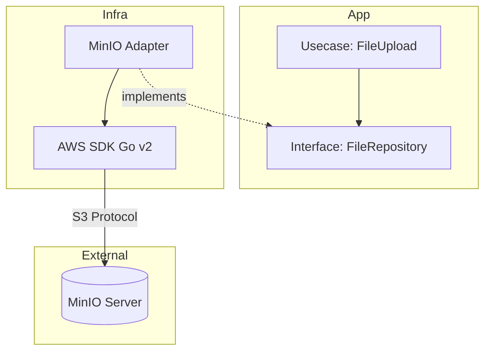

# Object Storage Workshop: Learning S3-Compatible API with MinIO

In this workshop, you will build an AWS S3-compatible object storage server using **MinIO** and learn how to implement file upload, download, and secure file sharing using Presigned URLs from a Go application.

> **💡 Glossary**: Please refer to [Object Storage](glossary.md#storage), [Bucket](glossary.md#storage), or [Presigned URL](glossary.md#security) in the [Glossary](glossary.md) for technical terms used in this workshop.

## Goal

By completing this workshop, you will be able to:

- Understand basic object storage concepts (Buckets, Objects)
- Build an S3-compatible environment locally using MinIO
- Manipulate files from an application using the Go SDK (`aws-sdk-go-v2`)
- Master how to generate Presigned URLs to grant temporary access privileges

---

## Anti-Patterns and Solutions

### ❌ Anti-Pattern: Saving Files to Web Server

Saving uploaded images to the web server's local disk (`./uploads`).

- **Problem**: Files are not shared when the server scales out (multiple instances). Disk capacity overflows.

### ❌ Anti-Pattern: Saving Binaries to DB

Saving images as BLOBs in an RDBMS.

- **Problem**: DB size bloats, negatively affecting backups and performance.

### ✅ Solution: Object Storage (S3/MinIO)

- **Scalability**: Can save files without worrying about capacity.
- **Stateless**: Keeps web servers stateless, making scale-out easy.
- **API Access**: Accessible from anywhere via HTTP.

---

## Architecture

Following Clean Architecture, S3 operation details are hidden in the `infra` layer. The App (Usecase) only knows the abstract interface "save file".



### Directory Structure

```text
infra/assets/minio/
├── docker-compose.yml
├── main.go                 # Sample App (Implementation of Upload/Share features)
└── go.mod
```

---

## Preparation

### 1. Start MinIO

```bash
cd infra/assets/minio
podman compose up -d
```

MinIO Console: `http://localhost:9001`

- Pass: `minioadmin`

### ✅ Verification Checkpoints

- [ ] Confirmed MinIO container is running via `podman ps`.
- [ ] Confirmed MinIO Console is accessible at `http://localhost:9001`.
- [ ] Confirmed a test bucket can be created via the console.

### 2. Client Setup (Alias)

Verify connection using MinIO Client (`mc`) or AWS CLI.

```bash
# Using AWS CLI (configured to point to local MinIO)
aws --endpoint-url http://localhost:9000 s3 mb s3://my-bucket
```

---

## Workshop Steps

### STEP 1: Bucket Creation and Basic Operations

Run the Go application to create a bucket `workshop-images` and upload a file.

**Code Example (Infra Layer)**:

```go
// infra/adapter.go (Excerpt)
func (s *S3Adapter) Upload(ctx context.Context, key string, data []byte) error {
    // PutObject to S3 (MinIO)
    _, err := s.client.PutObject(ctx, &s3.PutObjectInput{
        Bucket: aws.String("workshop-images"),
        Key:    aws.String(key),
        Body:   bytes.NewReader(data),
    })
    return err
}
```

Command:

```bash
go run main.go upload sample.jpg
```

### STEP 2: Generate Presigned URL

Issue a time-limited access URL for a file in a private bucket. This allows you to securely show files only to specific users without making the bucket itself public.

**Code Example (Usecase Layer)**:

```go
// usecase/file_share.go (Excerpt)
func (u *FileShareUsecase) GenerateShareLink(key string) (string, error) {
    // Use presign client
    presignClient := s3.NewPresignClient(u.client)

    // Issue GET URL valid for 15 minutes
    req, _ := presignClient.PresignGetObject(context.TODO(), &s3.GetObjectInput{
        Bucket: aws.String("workshop-images"),
        Key:    aws.String(key),
    }, s3.WithPresignExpires(15*time.Minute))

    return req.URL, nil
}
```

Command:

```bash
go run main.go share sample.jpg
# Output: http://localhost:9000/workshop-images/sample.jpg?X-Amz-Algorithm=...
```

**Why is it secure?**: The URL contains a cryptographic signature, so if any part of the path or expiration time is tampered with, it becomes invalid.

### ✅ Verification Checkpoints

- [ ] Confirmed `go run main.go upload` succeeded and file is visible in MinIO.
- [ ] Confirmed `go run main.go share` generates a valid-looking URL.
- [ ] Confirmed `curl -I "<URL>"` returns HTTP 200 OK.

### STEP 3: Validate URL

Access the generated URL via a browser or `curl` to verify that the image can be downloaded. Also verify that access is denied after the specified expiration time (e.g., 15 minutes).

---

## Clean Architecture Highlights

### Dependency Inversion

The business logic (Usecase) only has the intent to "save a file" and does not know the detail "save to S3".
This allows switching between local disk in development, AWS S3 in production, and MinIO in on-premise environments without changing code (only changing DI).

---

## Cleanup

```bash
podman compose down
```

If data persistence is not configured, data will be lost when containers are removed.

---

## Next Steps

- **Event Notification**: Trigger Lambda (OpenFaaS) on file upload to perform image resizing
- **Lifecycle Policy**: Configure automatic deletion/archiving of old files

---

## 🔧 Troubleshooting

### Connection Refused

**Symptoms**: `dial tcp 127.0.0.1:9000: connect: connection refused`

**Causes and Solutions**:

- **Container Not Running**: Ensure `podman compose up -d` completed successfully.
- **Port Conflict**: Check if another process is using port 9000 (`lsof -i:9000`).

### Signature Verification Error

**Symptoms**: Accessing the generated URL returns a `SignatureDoesNotMatch` error.

**Causes and Solutions**:

- **Credentials Mismatch**: Ensure `AWS_ACCESS_KEY_ID` and `AWS_SECRET_ACCESS_KEY` in your app match MinIO's settings (`minioadmin`).
- **Clock Skew**: Significant time difference between the client (Go app) and server (MinIO) can invalidate signatures.

---

## 💻 Environment Notes

### For macOS Users

- If `localhost` is unreachable, try `127.0.0.1` or the IP address of your Podman machine.

### For Windows Users

- When using WSL2, ensure localhost forwarding is working for your browser. Use `curl` inside WSL if browser access fails.
