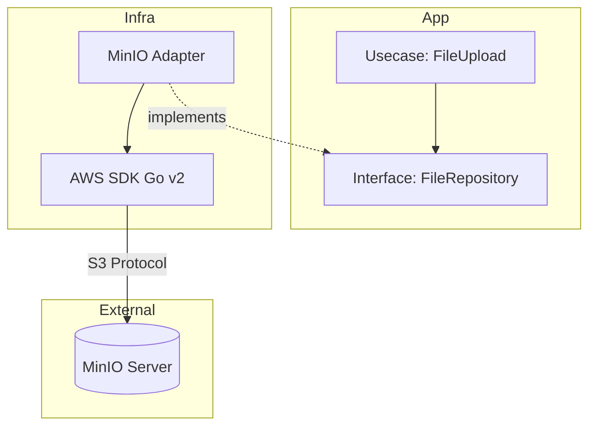

# オブジェクトストレージ実習：MinIO で学ぶ S3 互換 API

この実習では、AWS S3 互換のオブジェクトストレージサーバーである **MinIO** を構築し、Go アプリケーションからファイルのアップロード、ダウンロード、および署名付き URL（Presigned URL）を使用したセキュアなファイル共有の実装方法を学びます。

> **💡 用語集**: この実習で登場する[Object Storage](glossary.md#storage)や[Bucket](glossary.md#storage)、[Presigned URL](glossary.md#security)などの専門用語は [用語集](glossary.md) を参照してください。

## ゴール

この実習を完了すると、以下のことができるようになります：

- オブジェクトストレージの基本概念（バケット、オブジェクト）を理解する
- MinIO を使用してローカルに S3 互換環境を構築する
- Go SDK (`aws-sdk-go-v2`) を使用してアプリケーションからファイルを操作する
- 署名付き URL を生成し、一時的なアクセス権限を付与する方法を習得する

---

## アンチパターンと解決策

### ❌ アンチパターン：Web サーバーへのファイル保存

アップロードされた画像を Web サーバーのローカルディスク（`./uploads`）に保存する。

- **問題点**: サーバーをスケールアウト（複数台構成）した際にファイルが共有されない。ディスク容量が溢れる。

### ❌ アンチパターン：DB へのバイナリ保存

画像を BLOB として RDBMS に保存する。

- **問題点**: DB のサイズが肥大化し、バックアップやパフォーマンスに悪影響を与える。

### ✅ 解決策：オブジェクトストレージ (S3/MinIO)

- **スケーラビリティ**: 容量を気にせず保存可能。
- **ステートレス**: Web サーバーをステートレスに保てるため、スケールアウトが容易。
- **API アクセス**: HTTP 経由でどこからでもアクセス可能。

---

## アーキテクチャ

Clean Architecture に従い、S3 操作の詳細は `infra` 層に隠蔽します。アプリ（Usecase）は「ファイルを保存する」という抽象的なインターフェースのみを知っています。



### 想定ディレクトリ構造

```text
infra/assets/minio/
├── docker-compose.yml
├── main.go                 # サンプルアプリ (Upload/Share機能の実装)
└── go.mod
```

---

## 準備

### 1. MinIO の起動

```bash
cd infra/assets/minio
podman compose up -d
```

MinIO コンソール: `http://localhost:9001`

- Pass: `minioadmin`

### ✅ チェックポイント

- [ ] `podman ps` で MinIO コンテナが実行中であることを確認した
- [ ] ブラウザで `http://localhost:9001` を開き、ログインできることを確認した
- [ ] コンソールからテスト用のバケットが作成できることを確認した

### 2. クライアント設定 (Alias)

MinIO クライアント (`mc`) が利用可能な場合、または AWS CLI を使用して接続確認を行います。

```bash
# AWS CLI の場合 (ローカルのMinIOに向ける設定)
aws --endpoint-url http://localhost:9000 s3 mb s3://my-bucket
```

---

## 実習ステップ

### STEP 1: バケットの作成と基本操作

Go アプリケーションを実行し、バケット `workshop-images` を作成してファイルをアップロードします。

**コード実装例 (Infra層)**:

```go
// infra/adapter.go (抜粋)
func (s *S3Adapter) Upload(ctx context.Context, key string, data []byte) error {
    // S3 (MinIO) にファイルをPutObjectする
    _, err := s.client.PutObject(ctx, &s3.PutObjectInput{
        Bucket: aws.String("workshop-images"),
        Key:    aws.String(key),
        Body:   bytes.NewReader(data),
    })
    return err
}
```

実行コマンド:

```bash
go run main.go upload sample.jpg
```

### STEP 2: 署名付き URL (Presigned URL) の生成

プライベートなバケットにあるファイルに対して、期限付きのアクセス URL を発行します。これにより、バケット自体を公開設定にすることなく、特定のユーザーにのみファイルを安全に見せることができます。

**コード実装例 (Usecase層)**:

```go
// usecase/file_share.go (抜粋)
func (u *FileShareUsecase) GenerateShareLink(key string) (string, error) {
    // 署名付きURL生成クライアントを使用
    presignClient := s3.NewPresignClient(u.client)

    // 15分間だけ有効なGET用URLを発行
    req, _ := presignClient.PresignGetObject(context.TODO(), &s3.GetObjectInput{
        Bucket: aws.String("workshop-images"),
        Key:    aws.String(key),
    }, s3.WithPresignExpires(15*time.Minute))

    return req.URL, nil
}
```

実行コマンド:

```bash
go run main.go share sample.jpg
# Output: http://localhost:9000/workshop-images/sample.jpg?X-Amz-Algorithm=...
```

**なぜ安全なのか？**: URL には暗号学的な署名が含まれており、有効期限やパスの一部でも改ざんされると無効になります。

### ✅ チェックポイント

- [ ] `go run main.go upload` が正常に終了し、MinIO コンソールでファイルを確認できた
- [ ] `go run main.go share` で生成された URL が期待通りの形式であることを確認した
- [ ] `curl -I "<URL>"` で HTTP 200 OK が返ることを確認した

### STEP 3: URL の検証

生成された URL をブラウザまたは `curl` で叩き、画像がダウンロードできることを確認します。指定した有効期限（例：15 分）が過ぎると、アクセスできなくなることも確認します。

---

## Clean Architecture のポイント

### 依存関係の逆転

ビジネスロジック（Usecase）は「ファイルを保存したい」という意図のみを持ち、「S3 に保存する」という詳細は知りません。
これにより、開発環境ではローカルディスク、本番環境では AWS S3、オンプレ環境では MinIO といった切り替えが、コードの修正なし（DI の変更のみ）で可能になります。

---

## 片付け

```bash
podman compose down
```

データの永続化設定をしていない場合、コンテナ削除と共にデータも消えます。

---

## 次のステップ

- **イベント通知**: ファイルアップロードをトリガーに Lambda (OpenFaaS) を起動し、画像縮小処理を行う
- **ライフサイクルポリシー**: 古いファイルを自動的に削除・アーカイブする設定

---

## 🔧 トラブルシューティング

### 接続エラー (Connection Refused)

**症状**: `dial tcp 127.0.0.1:9000: connect: connection refused`

**原因と対処**:

- **コンテナ未起動**: `podman compose up -d` が成功しているか確認してください。
- **ポート競合**: 既に他のプロセスが 9000 番ポートを使用していないか確認してください (`lsof -i:9000`)。

### 署名検証エラー (Signature Does Not Match)

**症状**: 生成された URL にアクセスすると `SignatureDoesNotMatch` エラーが出る

**原因と対処**:

- **認証情報の不一致**: アプリ側の `AWS_ACCESS_KEY_ID` と `AWS_SECRET_ACCESS_KEY` が MinIO の設定値 (`minioadmin`) と一致しているか確認してください。
- **時刻のズレ**: クライアント（Go アプリ）とサーバー（MinIO）の時刻が著しくズレていると署名が正しく検証されません。

---

## 💻 環境別注意事項

### macOS の場合

- `localhost` でアクセスできない場合、`127.0.0.1` または Podman マシンの IP アドレスを試してください。

### Windows の場合

- WSL2 を使用している場合、Windows 側のブラウザからアクセスするには localhost 転送が正しく機能している必要があります。不可能な場合は WSL 内部の `curl` を使用してください。
