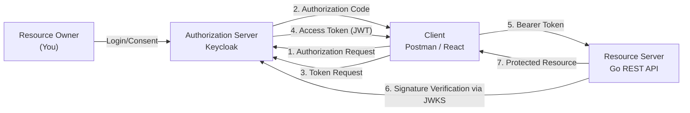

# OAuth2 Workshop: Learning Authorization Flow with Keycloak, Go, and Podman

In this workshop, you will learn the practical flow of OAuth2 using **Keycloak (Authorization Server)** and a **REST API written in Go (Resource Server)**. We assume the client is **Postman** or a **React app**, and you will verify the process from obtaining an access token to calling the API.

> **💡 Glossary**: For technical terms such as [OAuth2](glossary.md#oauth2), [Access Token](glossary.md#access-token), and [Resource Server](glossary.md#resource-server) that appear in this workshop, please refer to the [Glossary](glossary.md).

## Goals

After completing this workshop, you will be able to:

- Explain the actors and responsibilities in OAuth2
- Configure Realms, Clients, and Users in Keycloak
- Obtain an access token using `Authorization Code + PKCE`
- Verify JWTs on the Go API side and return protected resources
- Call the API with a Bearer token from Postman or a React app

---

## Actors and Roles

| Actor                | Example Implementation/Tool | Role                                             |
| -------------------- | --------------------------- | ------------------------------------------------ |
| Resource Owner       | Myself                      | The user who authorizes the login                |
| Client               | Postman / React App         | Something that obtains a token and calls the API |
| Authorization Server | Keycloak                    | Verifies the user and issues tokens              |
| Resource Server      | My REST API                 | Verifies the token and provides data (resources) |

---

## Anti-patterns and Solutions

### ❌ Anti-pattern 1: Embedding API keys in the frontend

- **Problem**: Easily leaked through browser developer tools or distributed binaries. Revocation and permission control are coarse.

### ❌ Anti-pattern 2: Implementing custom login and custom tokens

- **Problem**: Prone to security specification omissions (signature verification, expiration, refresh, PKCE).

### ✅ Solution: OAuth2 + OIDC + Keycloak

- Consolidate authentication and token issuance in Keycloak
- Clients obtain tokens using standard flows
- The Go API verifies the JWT signature, Issuer, and Audience

---

## Architecture



### Expected Directory Structure

```text
infra/assets/oauth2/
├── docker-compose.yml       # Keycloak startup
├── realm-export.json        # Initial Realm definition (optional)
├── api/
│   ├── main.go              # Go Resource Server
│   └── go.mod
└── README.md                # Supplementary notes (optional)
```

---

## Preparation

### 1. Starting Keycloak (Podman)

```bash
mkdir -p infra/assets/oauth2 && cd infra/assets/oauth2
cat > docker-compose.yml <<'YAML'
services:
  keycloak:
    image: quay.io/keycloak/keycloak:26.1
    container_name: workshop-keycloak
    command: start-dev
    environment:
      KC_BOOTSTRAP_ADMIN_USERNAME: admin
      KC_BOOTSTRAP_ADMIN_PASSWORD: admin
    ports:
      - "8080:8080"
YAML

podman compose up -d
```

Keycloak Admin Console: `http://localhost:8080`

### 2. Keycloak Initial Setup

1. Log in with `admin / admin`
2. Create a Realm named `workshop`
3. Create one User (e.g., `swe-user`) and set a password
4. Create a Client (e.g., `workshop-client`)
    - Client authentication: `Off` (Public client)
    - Standard flow: `On`
    - Valid redirect URIs: `http://localhost:3000/*`, `https://oauth.pstmn.io/v1/callback`
5. Add Scopes `openid profile email` as needed

### ✅ Checkpoints

- [ ] `workshop-keycloak` is running (verify with `podman ps`)
- [ ] Realm `workshop` has been created
- [ ] You can log in as `swe-user`
- [ ] Redirect URIs for `workshop-client` are configured

---

## Workshop Steps

### STEP 1: Obtain an Access Token with the Client

#### Using Postman

1. Select `OAuth 2.0` in the Authorization tab
2. Grant Type: `Authorization Code (with PKCE)`
3. Auth URL:
   `http://localhost:8080/realms/workshop/protocol/openid-connect/auth`
4. Access Token URL:
   `http://localhost:8080/realms/workshop/protocol/openid-connect/token`
5. Client ID: `workshop-client`
6. Scope: `openid profile email`
7. Callback URL: `https://oauth.pstmn.io/v1/callback`

Execute `Get New Access Token`, log in, and obtain the token.

#### Using React (Example)

Use an OIDC client library (e.g., `oidc-client-ts`) with `Authorization Code + PKCE` and the same Auth URL, Token URL, and Client ID.

### STEP 2: Build the Go Resource Server

The Go API receives the `Authorization: Bearer <token>` header and verifies the signature using Keycloak's JWKS.

```go
// main.go
package main

import (
	"encoding/json"
	"log"
	"net/http"
	"strings"

	"github.com/MicahParks/keyfunc/v3"
	"github.com/golang-jwt/jwt/v5"
)

const (
	jwksURL  = "http://localhost:8080/realms/workshop/protocol/openid-connect/certs"
	issuer   = "http://localhost:8080/realms/workshop"
	audience = "workshop-client"
)

func main() {
	// 1. Initialize functionality to fetch and manage public keys (JWKS) from Keycloak
	kf, err := keyfunc.NewDefault([]string{jwksURL})
	if err != nil {
		log.Fatalf("Failed to create keyfunc: %v", err)
	}

	http.HandleFunc("/health", func(w http.ResponseWriter, r *http.Request) {
		w.Write([]byte("OK"))
	})

	http.HandleFunc("/api/profile", func(w http.ResponseWriter, r *http.Request) {
		// 2. Extract Bearer token from Authorization header
		authHeader := r.Header.Get("Authorization")
		if !strings.HasPrefix(authHeader, "Bearer ") {
			http.Error(w, "Unauthorized", http.StatusUnauthorized)
			return
		}
		tokenStr := strings.TrimPrefix(authHeader, "Bearer ")
		if tokenStr == "" {
			http.Error(w, "Unauthorized", http.StatusUnauthorized)
			return
		}

		// 3. Verify token (signature, exp, iss, aud, alg)
		token, err := jwt.Parse(
			tokenStr,
			kf.Keyfunc,
			jwt.WithAudience(audience),
			jwt.WithIssuer(issuer),
			jwt.WithValidMethods([]string{"RS256"}),
		)
		if err != nil || !token.Valid {
			// Detail errors only to server logs
			log.Printf("token validation failed: %v", err)
			http.Error(w, "Unauthorized", http.StatusUnauthorized)
			return
		}

		// Retrieve sub (Subject) claim and respond
		claims, ok := token.Claims.(jwt.MapClaims)
		if !ok {
			http.Error(w, "Unauthorized", http.StatusUnauthorized)
			return
		}
		sub, ok := claims["sub"].(string)
		if !ok || sub == "" {
			http.Error(w, "Unauthorized", http.StatusUnauthorized)
			return
		}

		w.Header().Set("Content-Type", "application/json")
		if err := json.NewEncoder(w).Encode(map[string]string{
			"message": "Hello, authenticated SWE!",
			"sub":     sub,
		}); err != nil {
			log.Printf("response encode failed: %v", err)
		}
	})

	log.Println("Resource Server started on :8081")
	log.Fatal(http.ListenAndServe(":8081", nil))
}
```

Minimal setup to run:

```bash
cd api
go mod tidy
go run main.go
```

API Examples:

- `GET /health` (No authentication required)
- `GET /api/profile` (Authentication required)

### STEP 3: Call the API with the Token

```bash
curl -i http://localhost:8081/health

curl -i http://localhost:8081/api/profile \
  -H "Authorization: Bearer <ACCESS_TOKEN>"
```

Expected results:

- Without token: `401 Unauthorized`
- With invalid token: `401 Unauthorized`
- With valid token: `200 OK` + JSON response

### ✅ Checkpoints

- [ ] Obtained an access token using Postman or React
- [ ] Go API started on port 8081
- [ ] `/api/profile` returned 401 without a Bearer token
- [ ] `/api/profile` returned 200 with a valid token

---

## Implementation Highlights (Resource Server)

At a minimum, verify the following when validating a JWT:

- The signature algorithm is as expected (e.g., RS256)
- `iss` is `http://localhost:8080/realms/workshop`
- `aud` includes `workshop-client` (or an API-specific audience)
- `exp` is within the expiration limit

**Warning**: Never trust the JWT payload without verifying the signature.

---

## Cleanup

```bash
cd infra/assets/oauth2
podman compose down
```

To completely remove data:

```bash
podman rm -f workshop-keycloak
```

---

## Next Steps

- Session persistence without re-authentication using Refresh Tokens
- Fine-grained authorization per API (Role / Scope checks)
- Domain separation between Resource Server and Authorization Server (production-like)

---

## 🔧 Troubleshooting

### redirect_uri mismatch

**Symptoms**: `invalid_redirect_uri` is displayed after login

**Solution**:

- Accurately register the callback URL in the Keycloak Client's `Valid redirect URIs`
- Check for mismatches in trailing slashes or `http/https`

### token audience invalid

**Symptoms**: `audience` error on the API side

**Solution**:

- Add an Audience Mapper in the Keycloak Client Scope (e.g., `workshop-client-scope`) or within Client Mappers.
  - Go to `Client Scopes` > `roles` (or create new) > `Mappers` > `Add mapper` > `By configuration` > Select `Audience`.
  - Enter `workshop-client` in `Included Client Audience`.
- Verify the consistency between the API's expected audience and the Client ID.

### JWKS fetch failure

**Symptoms**: JWKS error during API startup or at the first request

**Solution**:

- Verify you can access `http://localhost:8080/realms/workshop/protocol/openid-connect/certs`
- Ensure you didn't start the API before the Podman container was fully ready

---

## 💻 Environment-Specific Notes

### macOS

- If using Podman Machine and facing `localhost` reachability issues, check network settings with `podman machine inspect`.

### Windows

- In WSL2 + Podman configurations, ensure the browser's callback URL matches the URL in the execution environment (Windows side vs. WSL side).
