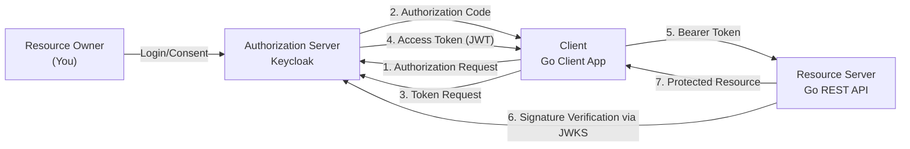
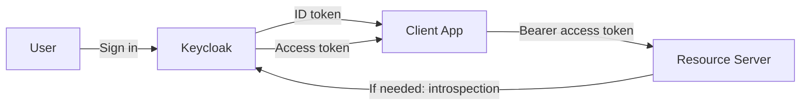
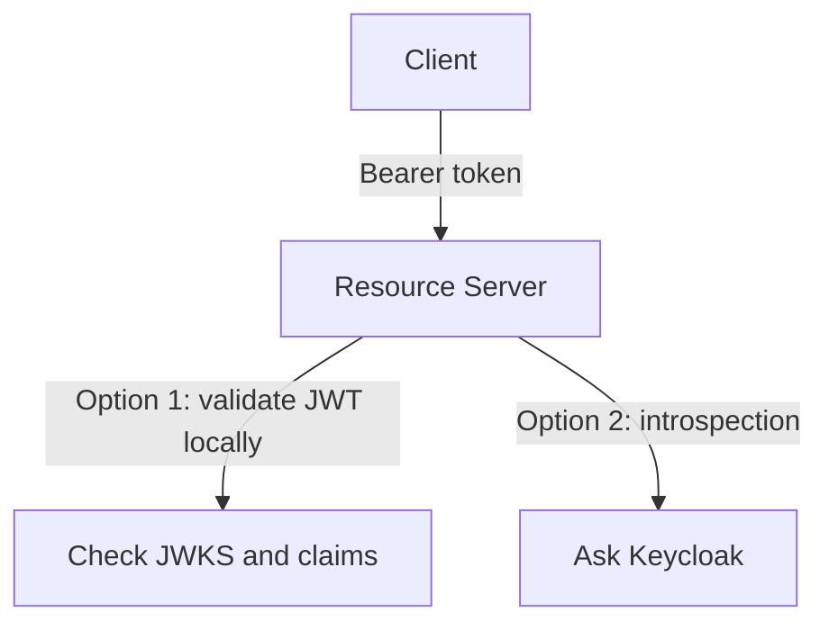
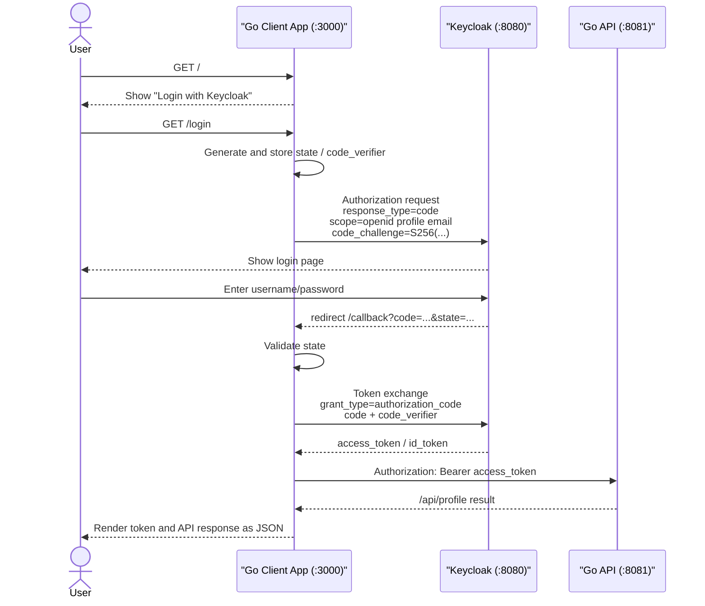

# OAuth2 Workshop: Learning the Authorization Flow with Keycloak, Go, and Podman

In this workshop, you will walk through an end-to-end OAuth2 flow using **Keycloak (Authorization Server)** and a **Go client app / Go REST API (Resource Server)**. The Go client app will obtain an access token and use it to call the API.

> **💡 Glossary**: For technical terms such as [OAuth2](glossary_en.md#oauth2), [Access Token](glossary_en.md#access-token), and [Resource Server](glossary_en.md#resource-server) that appear in this workshop, please refer to the [Glossary](glossary_en.md).

## Goals

After completing this workshop, you will be able to:

- Explain the actors and responsibilities in OAuth2
- Configure Realms, Clients, and Users in Keycloak
- Obtain an access token using `Authorization Code + PKCE`
- Verify JWTs on the Go API side and return protected resources
- Call the API with a Bearer token from the Go client app

---

## Actors and Roles

| Actor                | Example Implementation/Tool | Role                                             |
| -------------------- | --------------------------- | ------------------------------------------------ |
| Resource Owner       | Yourself                    | The user who signs in and grants access          |
| Client               | Go Client App               | Something that obtains a token and calls the API |
| Authorization Server | Keycloak                    | Verifies the user and issues tokens              |
| Resource Server      | Your REST API               | Verifies the token and returns protected data    |

---

## Anti-patterns and Solutions

### ❌ Anti-pattern 1: Embedding API keys in the frontend

- **Problem**: Easily leaked through browser developer tools or distributed binaries. Revocation and permission control are coarse.

### ❌ Anti-pattern 2: Implementing custom login and custom tokens

- **Problem**: Prone to security specification omissions (signature verification, expiration, refresh, PKCE).

### ✅ Solution: OAuth2 + OIDC + Keycloak

- Centralize authentication and token issuance in Keycloak
- Clients obtain tokens using standard flows
- The Go API verifies the JWT signature, Issuer, and Audience

---

## Architecture



### Directory Layout

```text
infra/assets/oauth2/
├── docker-compose.yml       # Keycloak startup
├── realm-export.json        # Initial Realm definition (optional)
├── client/
│   ├── main.go              # Go OIDC Client App
│   └── go.mod
├── api/
│   ├── main.go              # Go Resource Server
│   └── go.mod
└── README.md                # Supplementary notes (optional)
```

---

## Preparation

### Prerequisites

- [ ] Confirmed Podman is installed via `podman version`
- [ ] Confirmed `podman compose` or `podman-compose` plugin is available (verify with `podman compose version`)
- [ ] Confirmed Go 1.22 or later is installed via `go version`

### 1. Start Keycloak (Podman)

```bash
mkdir -p infra/assets/oauth2 && cd infra/assets/oauth2
cat > docker-compose.yml <<'YAML'
services:
  keycloak:
    image: quay.io/keycloak/keycloak:26.1
    container_name: workshop-keycloak
    command: start-dev
    environment:
      KC_BOOTSTRAP_ADMIN_USERNAME: admin
      KC_BOOTSTRAP_ADMIN_PASSWORD: admin
    ports:
      - "8080:8080"
YAML

podman compose up -d
```

Keycloak admin console: `http://localhost:8080`

### 2. Keycloak Initial Setup

1. Log in with `admin / admin`
2. Create a Realm named `workshop`
3. Create a user (for example, `swe-user`) and set a password
4. Create a Client (e.g., `workshop-client`)
   - Client authentication: `Off` (Public client)
   - Standard flow: `On`
   - Valid redirect URIs: `http://localhost:3000/callback`
5. Add the `profile` and `email` client scopes if needed
   - `openid` may not appear in Keycloak's Client Scope list
   - `openid` is a reserved scope for OIDC and is usually supplied in the authorization request as `scope=openid`
6. Add an Audience mapper so the access token includes `aud=workshop-client`
   - `Client scopes` > `roles` > `Mappers` > `Add mapper` > `By configuration` > `Audience`
   - `Name`: `aud-workshop-client`
   - `Included Client Audience`: `workshop-client`
   - `Add to access token`: `On`
   - `Add to ID token`: `Off`
   - `Add to lightweight access token`: `Off`
   - `Add to token introspection`: `On`
   - Without this, the Go API later fails with `token has invalid audience`

Notes:

- OAuth 2.0 is a way for an app to call an API safely on behalf of a user
- OIDC is an extension to OAuth 2.0 that adds user login identity
- An `ID token` describes who signed in
- An `access token` represents permission to call an API
- In this workshop, the Go API validates the `access token`, so `Add to access token` must be `On`
- `Add to ID token = Off` avoids forcing this audience into the login-focused ID token
- `Add to lightweight access token = Off` keeps this out of lightweight tokens; this workshop uses a regular access token
- `Add to token introspection = On` makes the audience visible if you use token introspection
- However, `Add to token introspection = On` does not mean this workshop is using introspection
- The Go API in this workshop does not call the introspection endpoint; it validates JWTs directly using JWKS

## Token Types and Introspection

To understand OAuth2 and OIDC properly, it helps to separate the purpose of each token and validation mechanism.

### Overview



- `ID token`: tells the client who signed in
- `access token`: tells the resource server whether the API call is allowed
- `token introspection`: lets the resource server ask the authorization server whether a token is valid
- `lightweight access token`: a smaller access token format that may rely on introspection for additional details

### ID token

An `ID token` is an **OIDC token**. OAuth2 by itself does not standardize how to represent the logged-in user, but OIDC adds the `ID token` for that purpose.

Main uses:

- Let the client confirm that sign-in succeeded
- Provide a stable user identifier such as `sub`
- Optionally carry claims such as `email` or `name`

Important points:

- An `ID token` is **for the client**
- It is usually not sent to an API as the token for authorization
- It is best understood as the result of the login process

### Access token

An `access token` is the token used to call an API. The client sends it to the resource server as `Authorization: Bearer <token>`.

Main uses:

- Let the API decide whether the caller is allowed to access the resource
- Carry claims such as `iss`, `aud`, `exp`, `scope`, and `roles`

Important points:

- An `access token` is **for the resource server**
- The Go API in this workshop validates this token
- The Audience mapper needs `Add to access token = On` because the API expects `aud` in this token

### Lightweight access token

A `lightweight access token` is a smaller access token that carries fewer claims than a regular access token. Whether it is used depends on the Keycloak setup and operating model.

Why it exists:

- A token with many claims can become large
- In some environments, such as API gateways or multi-service topologies, smaller tokens are desirable
- Additional details can then be retrieved through mechanisms such as introspection

How it relates to this workshop:

- This workshop uses direct JWT validation in the Go API
- It does not assume lightweight access tokens
- `Add to lightweight access token = Off` is fine for this setup

### Token introspection

`Token introspection` is a mechanism where the resource server asks the authorization server whether a token is still valid and what attributes it has.

How it differs from direct JWT validation:



Characteristics of direct JWT validation:

- Easy to make fast decisions within the resource server itself
- No need to call Keycloak on every request
- But immediate revocation handling usually needs additional design

Characteristics of introspection:

- The authorization server can confirm whether the token is valid
- Revocation and invalidation are easier to centralize
- But it adds network calls whenever introspection is used

What `Add to token introspection = On` means:

- It makes audience information available in the introspection response
- The Go API in this workshop does not use introspection, but this setting keeps the data available if you switch to that model later
- In other words, this only enables data for introspection responses; it does not mean Keycloak is being queried on every request

### What this workshop uses

In this workshop, responsibilities are split like this:

- The Go client app can receive both an `ID token` and an `access token`
- The Go API receives an `access token` and validates it directly using JWKS
- Keycloak can provide an introspection endpoint if needed

The two key ideas are:

- Use the `ID token` to understand the login result
- Use the `access token` to authorize API access

The common failure point in this workshop is that the API checks the `aud` claim in the `access token`.  
That is why the Audience mapper needs `Add to access token = On`.

### OIDC Client vs. Resource Server

This is an easy place to get confused.

- OIDC Client: sends the user to the IdP login page and receives the authorization code or ID token
- Resource Server: validates the received access token and returns the API response

Applied to this workshop:

- The Go client app acts as an OAuth 2.0 client / OIDC client
  - In OIDC discussions, it may play an RP-like role, but in this workshop, calling it a `Client` is more precise
- The Go API acts as the resource server

#### Why an OIDC client may use a secret

An OIDC client may exchange tokens directly with the IdP. Depending on the client type, it may identify itself with both a `client_id` and a `client_secret`.

Typical cases:

- Confidential Client
  - A server-side web app
  - Can keep a `client_secret` safely
  - May use the secret when calling the token endpoint
- Public Client
  - An SPA, mobile app, or a PKCE-based sample like this one
  - Cannot safely keep a `client_secret`
  - Uses PKCE instead of a `client_secret`

So the accurate statement is not "an OIDC client always needs a secret," but rather "confidential clients often use a secret."

#### Why the resource server does not need a secret here

The resource server in this workshop does not log in to Keycloak. It does two things:

1. Fetches public keys from Keycloak's JWKS endpoint
2. Verifies the JWT signature with those public keys

This is public-key signature verification, so it does not require a user ID, password, or `client_secret`.

The model is:

- Keycloak signs the token with its private key
- The resource server verifies that signature with the corresponding public key

The important point is that this is **signature verification**, not decryption.

- The JWT payload is often readable as-is
- But being readable is not the same as being trustworthy
- If signature verification succeeds, the resource server can conclude that Keycloak issued the token and that the payload was not tampered with in transit
- That is why claims such as `aud`, `iss`, and `exp` can be trusted and used for authorization decisions

#### What is `kid`?

The `kid` in the JWT header means **Key ID**. It identifies which key was used to sign the token.

Why it matters:

- Keycloak may rotate signing keys
- A JWKS document may contain multiple public keys
- The resource server uses the JWT header's `kid` to select the correct public key

Flow:

1. Receive the JWT
2. Read the `kid` from the JWT header
3. Find the public key with the same `kid` in the JWKS
4. Verify the signature with that public key
5. After verification succeeds, check `iss`, `aud`, `exp`, and other claims

So `kid` is the marker that tells the resource server which public key to use for signature verification.

That is why [api/main.go](/Users/scott/repo/sokoide/workshop/infra/assets/oauth2/api/main.go) can run with just `go run`. It only needs:

- Access to `jwksURL`
- Tokens whose `iss`, `aud`, and `exp` are valid

#### Are there cases where a resource server does need a secret?

Yes. For example, if the resource server does not validate JWTs locally and instead uses `token introspection` for each request, then Keycloak may require client authentication for that introspection call.

Additional note:

- This workshop sets `Add to token introspection = On`, but it does not actually call the introspection endpoint
- It uses direct JWT validation through JWKS
- That is why the API can start without client credentials for Keycloak

In short:

- OIDC Client
  - Handles the login flow
  - May use a `client_secret`, depending on the client type
- Resource Server
  - Handles access token validation
  - Usually does not need a secret when validating JWTs directly
  - May need credentials when using introspection

### ✅ Checkpoints

- [ ] `workshop-keycloak` is running (verify with `podman ps`)
- [ ] Realm `workshop` has been created
- [ ] You can log in as `swe-user`
- [ ] Redirect URIs for `workshop-client` are configured

---

## Workshop Steps

### STEP 1: Obtain an Access Token with the Go Client App

`infra/assets/oauth2/client/main.go` is a minimal Go client app that signs in to Keycloak with `Authorization Code + PKCE`, receives an access token on the callback, and then immediately calls the protected API.

Flow:



What the client app does:

1. It serves a simple page at `/` with a link to `/login`
2. At `/login`, it generates `state` and `code_verifier` and stores them in the browser session
3. It builds `code_challenge` from `code_verifier` and redirects to Keycloak's authorization endpoint
4. After the user signs in, it receives `code` and `state` at `/callback`
5. It validates `state` to protect against CSRF
6. It exchanges `code` and `code_verifier` at the token endpoint to obtain an `access_token`
7. It sends that `access_token` to the Go API as `Authorization: Bearer ...`
8. It returns the API response as JSON

Why PKCE is used:

- Even if someone steals the `code`, they still cannot exchange it without the matching `code_verifier`
- Public clients cannot safely keep a client secret, so `Authorization Code + PKCE` is used

Endpoints in this sample:

- `/`: start page
- `/login`: start Keycloak login
- `/callback`: redirect target from Keycloak
- `/call-api`: call the API again with the cached access token
- `/logout`: discard the session token

```go
// client/main.go
package main
```

Run it with:

```bash
cd infra/assets/oauth2/client
go run main.go
```

Then open `http://localhost:3000` in your browser and click `Login with Keycloak`.

Internal configuration values:

- Auth URL: `http://localhost:8080/realms/workshop/protocol/openid-connect/auth`
- Token URL: `http://localhost:8080/realms/workshop/protocol/openid-connect/token`
- Client ID: `workshop-client`
- Scope: `openid profile email`
- Redirect URI: `http://localhost:3000/callback`

Notes:

- It is normal for `profile` and `email` to appear in the Client Scope tab while `openid` does not
- What matters is that the authorization request includes `openid`
- `/callback` immediately calls `/api/profile`, so if the Audience mapper is missing, only the API call fails

Expected behavior:

- The browser is redirected to the Keycloak login page
- After login, the browser returns to the Go client app's `/callback`
- The response shows `access_token` as JSON
- It also shows the `/api/profile` response
- If you see `token has invalid audience`, the Audience mapper is missing in Keycloak

### STEP 2: Build the Go Resource Server

The Go API receives the `Authorization: Bearer <token>` header and verifies the signature using Keycloak's JWKS.

```go
// main.go
package main

import (
	"encoding/json"
	"log"
	"net/http"
	"strings"

	"github.com/MicahParks/keyfunc/v3"
	"github.com/golang-jwt/jwt/v5"
)

const (
	jwksURL  = "http://localhost:8080/realms/workshop/protocol/openid-connect/certs"
	issuer   = "http://localhost:8080/realms/workshop"
	audience = "workshop-client"
)

func main() {
	// 1. Initialize functionality to fetch and manage public keys (JWKS) from Keycloak
	kf, err := keyfunc.NewDefault([]string{jwksURL})
	if err != nil {
		log.Fatalf("Failed to create keyfunc: %v", err)
	}

	http.HandleFunc("/health", func(w http.ResponseWriter, r *http.Request) {
		w.Write([]byte("OK"))
	})

	http.HandleFunc("/api/profile", func(w http.ResponseWriter, r *http.Request) {
		// 2. Extract Bearer token from Authorization header
		authHeader := r.Header.Get("Authorization")
		if !strings.HasPrefix(authHeader, "Bearer ") {
			http.Error(w, "Unauthorized", http.StatusUnauthorized)
			return
		}
		tokenStr := strings.TrimPrefix(authHeader, "Bearer ")
		if tokenStr == "" {
			http.Error(w, "Unauthorized", http.StatusUnauthorized)
			return
		}

		// 3. Verify token (signature, exp, iss, aud, alg)
		token, err := jwt.Parse(
			tokenStr,
			kf.Keyfunc,
			jwt.WithAudience(audience),
			jwt.WithIssuer(issuer),
			jwt.WithValidMethods([]string{"RS256"}),
		)
		if err != nil || !token.Valid {
			// Detail errors only to server logs
			log.Printf("token validation failed: %v", err)
			http.Error(w, "Unauthorized", http.StatusUnauthorized)
			return
		}

		// Retrieve sub (Subject) claim and respond
		claims, ok := token.Claims.(jwt.MapClaims)
		if !ok {
			http.Error(w, "Unauthorized", http.StatusUnauthorized)
			return
		}
		sub, ok := claims["sub"].(string)
		if !ok || sub == "" {
			http.Error(w, "Unauthorized", http.StatusUnauthorized)
			return
		}

		w.Header().Set("Content-Type", "application/json")
		if err := json.NewEncoder(w).Encode(map[string]string{
			"message": "Hello, authenticated SWE!",
			"sub":     sub,
		}); err != nil {
			log.Printf("response encode failed: %v", err)
		}
	})

	log.Println("Resource Server started on :8081")
	log.Fatal(http.ListenAndServe(":8081", nil))
}
```

Minimal run command:

```bash
cd api
go mod tidy
go run main.go
```

API endpoints:

- `GET /health` (No authentication required)
- `GET /api/profile` (Authentication required)

### STEP 3: Call the API with the Token

```bash
curl -i http://localhost:8081/health

curl -i http://localhost:8081/api/profile \
  -H "Authorization: Bearer <ACCESS_TOKEN>"
```

Expected results:

- Without token: `401 Unauthorized`
- With invalid token: `401 Unauthorized`
- With valid token: `200 OK` + JSON response

### ✅ Checkpoints

- [ ] Obtained an access token using the Go client app
- [ ] Go API started on port 8081
- [ ] `/api/profile` returned 401 without a Bearer token
- [ ] `/api/profile` returned 200 with a valid token

---

## Resource Server Validation Checklist

At a minimum, verify the following when validating a JWT:

- The signature algorithm is what you expect (for example, RS256)
- `iss` is `http://localhost:8080/realms/workshop`
- `aud` includes `workshop-client` (or an API-specific audience)
- `exp` has not expired

**Warning**: Never trust a JWT payload unless you have verified the signature.

---

## Cleanup

```bash
cd infra/assets/oauth2
podman compose down
```

To completely remove data:

```bash
podman rm -f workshop-keycloak
```

---

## Next Steps

- Session persistence without re-authentication using Refresh Tokens
- Fine-grained authorization per API (Role / Scope checks)
- Domain separation between Resource Server and Authorization Server (production-like)

---

## 🔧 Troubleshooting

### redirect_uri mismatch

**Symptoms**: `invalid_redirect_uri` is displayed after login

**Solution**:

- Accurately register the callback URL in the Keycloak Client's `Valid redirect URIs`
- Check for mismatches in trailing slashes or `http/https`

### token audience invalid

**Symptoms**: An `audience` error on the API side

**Solution**:

- Add an Audience Mapper in a Keycloak Client Scope (for example, `workshop-client-scope`) or directly in the client mappers.
  - Go to `Client Scopes` > `roles` (or create new) > `Mappers` > `Add mapper` > `By configuration` > Select `Audience`.
  - Use `aud-workshop-client` for `Name`.
  - Enter `workshop-client` for `Included Client Audience`.
- Verify that the API's expected audience matches the Client ID.

### JWKS fetch failure

**Symptoms**: JWKS error during API startup or at the first request

**Solution**:

- Verify you can access `http://localhost:8080/realms/workshop/protocol/openid-connect/certs`
- Ensure you didn't start the API before the Podman container was fully ready

---

## 💻 Environment-Specific Notes

### macOS

- If using Podman Machine and facing `localhost` reachability issues, check network settings with `podman machine inspect`.

### Windows

- In WSL2 + Podman configurations, ensure the browser's callback URL matches the URL in the execution environment (Windows side vs. WSL side).
