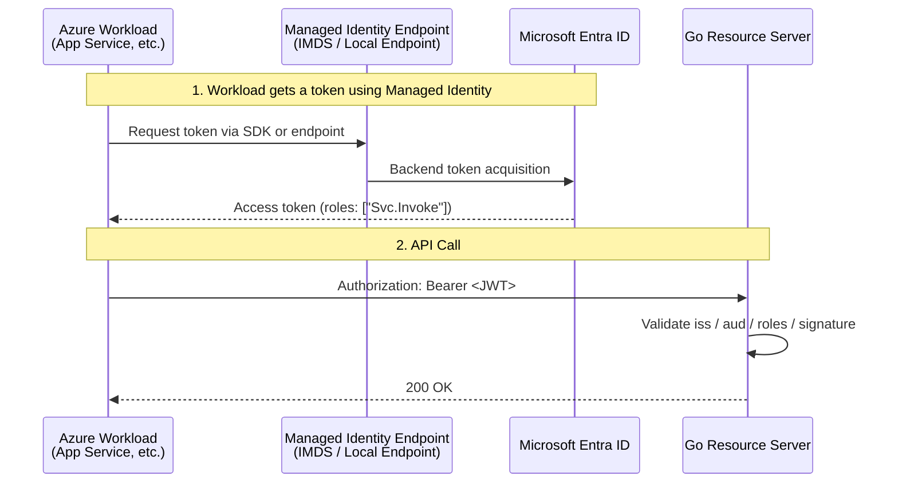
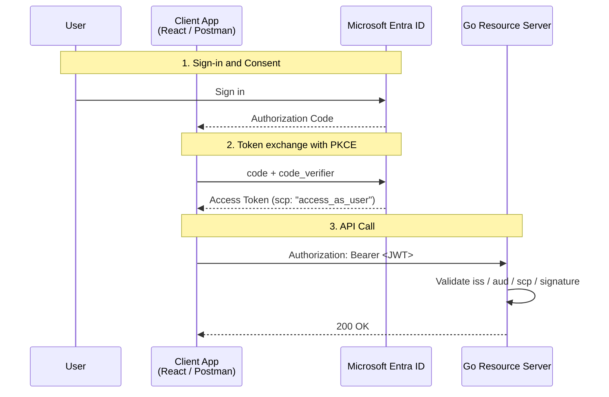

# OAuth2 Workshop: Learning Authorization Flows with Microsoft Entra ID and Go

In this workshop, you will use **Microsoft Entra ID** as the authorization server and a **Go REST API** as the resource server to understand OAuth 2.0 / OpenID Connect in real-world scenarios.

This guide covers two main patterns:

- **A. M2M (Machine-to-Machine)**: An Azure workload calls the API using its **Managed Identity**.
- **B. User-Delegated Flow**: A client such as React or Postman signs in a **user** and calls the API on that user's behalf.

> **Note**:
> App registrations and API exposure settings are primarily managed in the **Microsoft Entra admin center** (`entra.microsoft.com`).
> Enabling **Managed Identity** is done on the Azure resource side, usually via the **Azure Portal** (`portal.azure.com`).

---

## Which one should you choose?

```text
Is a user involved?
    │
    ├─ YES → B. User-Delegated Flow
    │         (SPA, mobile apps, or Postman acting as a user)
    │
    └─ NO  → Is it running on Azure?
              │
              ├─ YES → A. M2M (Managed Identity recommended)
              │         (App Service, Functions, batch jobs on VM, etc.)
              │
              └─ NO  → M2M (Client Credentials + Secret/Certificate)
                        (On-premises, connections from other clouds)
```

---

## Values to Keep in Advance

You will need the following values during configuration. It is helpful to note them down beforehand.

| Value | Where to find | Where it's used |
| --- | --------- | --------- |
| **Tenant ID** | Entra admin center → Overview | Go code environment variable `TENANT_ID` |
| **API App Client ID** | App registrations → workshop-api → Overview | Go code environment variable `API_CLIENT_ID`, Token requests |
| **Client App Client ID** | App registrations → workshop-client → Overview | Postman / SPA configuration |
| **Managed Identity Object ID** | Azure Portal → Resource → Identity → Object ID | App Role assignment (`az rest` command) |

> **Note**: Client ID is also referred to as "Application (client) ID". It is a string in GUID format.

---

## First, Understand the Classification

| Item | A. M2M | B. User-Delegated Flow |
| ---- | ------ | --------------------- |
| Subject | Application / Workload | User |
| Typical Examples | App Service, Functions, VM, Batch jobs | SPA, Mobile, Desktop, Postman |
| Auth Flow | Client Credentials Flow | Authorization Code Flow + PKCE |
| API Side Permissions | **App Role** | **Scope** |
| Token Claim | `roles: ["Svc.Invoke"]` | `scp: "access_as_user"` |
| Managed Identity | Actively used (within Azure) | Normally not used |
| Token Expiration | Typically longer (~60 min) | Typically shorter (~5-60 min) |

> **Key Difference**:
>
> - **M2M**: The API validates the `roles` claim in the token.
> - **User-Delegated**: The API validates the `scp` (scope) claim in the token.

---

## Important: Difference between v1 and v2 tokens

Entra ID issues two types of access token formats. This workshop uses **v2 tokens**.

| Item | v1 Token | v2 Token |
| ------ | ------------ | ------------ |
| `aud` (audience) | `api://<client-id>` (URI format) | `<client-id>` (GUID format) |
| `iss` (issuer) | `https://sts.windows.net/<tenant-id>/` | `https://login.microsoftonline.com/<tenant-id>/v2.0` |
| Validation complexity | Requires URI matching | Simple GUID matching |

**Why we recommend v2**: It simplifies the validation logic and reduces implementation errors.

> **Setting**: App registrations → Target App → Manifest → `"requestedAccessTokenVersion": 2`

---

## Debug: Checking Token Contents

To verify your configuration, decode the acquired token and inspect its contents.

### Method 1: jwt.ms (Recommended)

1. Copy the token to your clipboard.
2. Visit [https://jwt.ms](https://jwt.ms).
3. Paste the token to see the decoded Claims.

### Method 2: jwt.io (Local check)

```bash
# Decode token (without signature validation)
echo "<TOKEN>" | cut -d'.' -f2 | base64 -d 2>/dev/null | jq .
```

### Claims to Verify

| Claim | Expected Value | Description |
| ------- | -------- | ---------- |
| `aud` | API Client ID | Is it intended for your API? |
| `iss` | `https://login.microsoftonline.com/<tenant-id>/v2.0` | Is it from the correct tenant? |
| `scp` | `access_as_user` | For user-delegated flows |
| `roles` | `["Svc.Invoke"]` | For M2M flows |
| `appid` | Client App ID | Which app requested the token? |

---

## Actors and Roles

| Actor | Example | Role |
| ---- | ---- | ---- |
| Resource Owner | User | Signs in and grants consent |
| Client | React / Postman / Azure Workload | Obtains an access token and calls the API |
| Authorization Server | Microsoft Entra ID | Authenticates and issues access tokens |
| Resource Server | Go REST API | Validates tokens and returns resources |

---

## A. M2M Configuration

This pattern is for service-to-service communication without user intervention. When calling an API from an Azure workload, **Managed Identity + App Role** is the standard approach.

### Architecture



### Setup Steps

#### 1. Register the API App

- **Microsoft Entra admin center** → `App registrations` → `New registration`
- Name: `workshop-api`
- After creation, note the `Application (client) ID` (used later).
- `Expose an API` → `Set` to configure the **Application ID URI**.
  - Example: `api://<API_APP_CLIENT_ID>`
  - > **Important**: This URI is used as the "resource identifier" during token requests. However, once the v2 token setting is enabled as described below, the actual `aud` (audience) claim in the token will contain the **Client ID (GUID)**, not the URI.

#### 2. Expose an App Role in the API

- `App registrations` → `workshop-api` → `App roles` → `Create app role`
- Display name: `Svc.Invoke`
- Allowed member types: `Applications`
- Value: `Svc.Invoke`
- Add a description if needed, then save.

#### 3. Configure API to accept v2 Access Tokens

By default, v1 tokens are issued. To use v2 tokens, follow these steps:

- Open `Manifest`.
- Set `requestedAccessTokenVersion` to `2` inside the `api` section.

```json
"api": {
  "requestedAccessTokenVersion": 2
}
```

> **Why v2**: In v2 tokens, `aud` becomes the API's client ID (GUID), simplifying the validation logic.
>
> **Note**: Previously this was named `accessTokenAcceptedVersion`, but now `requestedAccessTokenVersion` is used.

---

#### 4. Create an App Service and Call the API

This example shows a Go implementation for an App Service (Client) that retrieves a token using Managed Identity and calls another API (Resource).

#### 4-1. Add Dependency Packages

Use `azidentity` from the Azure SDK for Go.

```bash
go get github.com/Azure/azure-sdk-for-go/sdk/azidentity
go get github.com/Azure/azure-sdk-for-go/sdk/azcore
```

#### 4-2. Go Code Example

Using `azidentity.NewDefaultAzureCredential` allows the code to work seamlessly in both local environments (logged in via Azure CLI) and Azure environments (Managed Identity). This example implements a web server to display the results in a browser.

```go
package main

import (
	"context"
	"fmt"
	"io"
	"log"
	"net/http"
	"os"

	"github.com/Azure/azure-sdk-for-go/sdk/azcore/policy"

	"github.com/Azure/azure-sdk-for-go/sdk/azidentity"
)

func main() {
	// Get port from environment variable (App Service default is 8080)
	port := os.Getenv("PORT")
	if port == "" {
		port = "8080"
	}

	http.HandleFunc("/", func(w http.ResponseWriter, r *http.Request) {
		// 1. Authenticate using Managed Identity
		cred, err := azidentity.NewDefaultAzureCredential(nil)
		if err != nil {
			http.Error(w, "Failed to create credential: "+err.Error(), 500)
			return
		}

		// 2. Attempt to acquire a token
		scope := os.Getenv("API_SCOPE")
		if scope == "" {
			fmt.Fprintln(w, "Warning: API_SCOPE is not set. Using default...")
			scope = "https://graph.microsoft.com/.default" // For testing
		}

		token, err := cred.GetToken(context.Background(), policy.TokenRequestOptions{
			Scopes: []string{scope},
		})

		if err != nil {
			// Display error in browser on failure
			fmt.Fprintf(w, "❌ Token Error: %v\n", err)
			log.Printf("Token Error: %v", err)
			return
		}

		// 3. Display success message in browser
		fmt.Fprintf(w, "✅ Managed Identity Success!\n")
		fmt.Fprintf(w, "Token (first 10 chars): %s...\n", token.Token[:10])
		fmt.Fprintf(w, "Expires On: %v\n\n", token.ExpiresOn)
		
		log.Printf("Successfully retrieved token for scope: %s", scope)

		// 4. Call the API Endpoint
		apiEndpoint := os.Getenv("API_ENDPOINT")
		if apiEndpoint == "" {
			fmt.Fprintln(w, "⚠️ API_ENDPOINT is not set. Skipping API call.")
			return
		}

		client := &http.Client{}
		req, err := http.NewRequest("GET", apiEndpoint, nil)
		if err != nil {
			fmt.Fprintf(w, "❌ Failed to create API request: %v\n", err)
			return
		}

		req.Header.Set("Authorization", "Bearer "+token.Token)
		resp, err := client.Do(req)
		if err != nil {
			fmt.Fprintf(w, "❌ API Call Failed: %v\n", err)
			return
		}
		defer resp.Body.Close()

		body, _ := io.ReadAll(resp.Body)
		if resp.StatusCode >= 200 && resp.StatusCode < 300 {
			fmt.Fprintf(w, "✅ API Call Success! (Status: %s)\n", resp.Status)
		} else {
			fmt.Fprintf(w, "⚠️ API Call Failed (Status: %s)\n", resp.Status)
		}
		fmt.Fprintf(w, "Response Body:\n%s\n", string(body))
	})

	log.Printf("Starting server on port %s...", port)
	if err := http.ListenAndServe(":"+port, nil); err != nil {
		log.Fatal(err)
	}
}
```

#### 4-3. Execution Notes

- **Behavior on App Service**: After the container starts, accessing `http://<your-app-name>.azurewebsites.net/` will trigger token retrieval using Managed Identity and display the result of the API call.

#### Client App Environment Variables

| Variable | Required | Description | Default |
| --------- | :----: | ------ | ------------- |
| `PORT` | - | Listening port number | `8080` |
| `API_SCOPE` | - | The scope of the API you want to access | `https://graph.microsoft.com/.default` (for testing) |
| `API_ENDPOINT` | - | The URL of the API to call | - (skips API call if not set) |

> **Note**: Typically, `API_SCOPE` is set to `api://<api-client-id>/.default`. The `.default` suffix means "all permissions assigned to that API".

- **API-side Validation**: As mentioned before, the API server (Resource Server) must validate that the `aud` matches its own Client ID.

---

#### 5. Enable Managed Identity on Azure Resources

- **Azure Portal** → Target Resource (App Service, etc.) → `Identity`.
- Enable `System assigned` or `User assigned`.
- After enabling, note the **principal object ID** of the Managed Identity.

#### 6. Assign the App Role to the Managed Identity

Assigning an App Role to a Managed Identity is more reliable via **Microsoft Graph / Azure CLI** than the UI.

```bash
# ============================================
# Preparation: Obtain IDs
# ============================================

# API app's Client ID (from App registrations Overview)
# Example: 11111111-2222-3333-4444-555555555555
API_APP_CLIENT_ID=<API_APP_CLIENT_ID>

# Managed Identity's Object ID
# Find in Azure Portal → Resource → Identity → Object ID
# This functions as the Service Principal's Object ID
MI_SP_OBJECT_ID=<MANAGED_IDENTITY_OBJECT_ID>

# Get API app's service principal object ID
API_SP_OBJECT_ID=$(az ad sp show --id ${API_APP_CLIENT_ID} --query id -o tsv)

# Get the App Role ID exposed by the API
APP_ROLE_ID=$(az ad sp show --id ${API_APP_CLIENT_ID} \
  --query "appRoles[?value=='Svc.Invoke'].id | [0]" -o tsv)

az rest --method POST \
  --uri "https://graph.microsoft.com/v1.0/servicePrincipals/${MI_SP_OBJECT_ID}/appRoleAssignments" \
  --body "{
    \"principalId\": \"${MI_SP_OBJECT_ID}\",
    \"resourceId\": \"${API_SP_OBJECT_ID}\",
    \"appRoleId\": \"${APP_ROLE_ID}\"
  }"
```

> **Important**: When a Managed Identity acquires a token, it usually doesn't hit Entra's `/token` directly. It uses the Azure Identity SDK or the local endpoint for Managed Identity.

---

## B. User-Delegated Flow Configuration

This pattern is for SPAs or Postman calling an API after signing in a user. The current recommendation is **Authorization Code Flow + PKCE**.

### Architecture



### Setup Steps

#### 1. Expose a Scope in the API App

- **Microsoft Entra admin center** → `App registrations` → `workshop-api`.
- `Expose an API` → `Add a scope`.
- Scope name: `access_as_user`.
- Who can consent: `Admins and users`.
- Fill in Admin consent and User consent display names, then save.

#### 2. Register the Client App

- `App registrations` → `New registration` → Name: `workshop-client`.
- `Authentication` → `Add a platform`.
  - For browser-based SPAs like React: **`Single-page application`**.
  - For Postman or native apps: `Mobile and desktop applications`.
- Register the Redirect URI (e.g., `http://localhost:3000` or `https://oauth.pstmn.io/v1/callback`).

> **Important**: For SPAs, make sure to select `Single-page application` in the platform configuration. Selecting `Web` will cause CORS errors during token exchange.

#### 3. Add API Permission to the Client App

- `workshop-client` → `API permissions` → `Add a permission`.
- `My APIs` → `workshop-api`.
- Add `Delegated permissions` → `access_as_user`.

#### 4. Perform Consent

| Consent Type | Required When | Performer |
| ---------- | ------------ | ------ |
| **User Consent** | Tenant allows user consent + Low impact permissions | The user signing in |
| **Admin Consent** | User consent disabled / High impact / Application permissions | Tenant Admin |

Operation:

- User Consent: A consent screen is shown during the first sign-in.
- Admin Consent: Click `API permissions` → `Grant admin consent for [Tenant Name]`.
  - Required if tenant policy prohibits user consent or for Application permissions (M2M).

---

## Go Resource Server Implementation Example

Below is a minimal example using `github.com/MicahParks/keyfunc/v3` and `github.com/golang-jwt/jwt/v5`. It reads settings from environment variables and runs on port `8080` (App Service default).

```go
package main

import (
	"encoding/json"
	"fmt"
	"log"
	"net/http"
	"os"
	"strings"

	"github.com/MicahParks/keyfunc/v3"
	"github.com/golang-jwt/jwt/v5"
)

func main() {
	// Read settings from environment variables
	tenantID := os.Getenv("TENANT_ID")
	apiClientID := os.Getenv("API_CLIENT_ID")
	requiredScope := os.Getenv("REQUIRED_SCOPE")
	if requiredScope == "" {
		requiredScope = "access_as_user"
	}
	requiredAppRole := os.Getenv("REQUIRED_APP_ROLE")
	if requiredAppRole == "" {
		requiredAppRole = "Svc.Invoke"
	}

	if tenantID == "" || apiClientID == "" {
		log.Fatal("Error: TENANT_ID and API_CLIENT_ID must be set")
	}

	jwksURL := fmt.Sprintf("https://login.microsoftonline.com/%s/discovery/v2.0/keys", tenantID)
	expectedIssuer := fmt.Sprintf("https://login.microsoftonline.com/%s/v2.0", tenantID)

	// Fetch JWKS for token validation
	kf, err := keyfunc.NewDefault([]string{jwksURL})
	if err != nil {
		log.Fatalf("failed to create keyfunc: %v", err)
	}

	http.HandleFunc("/api/profile", func(w http.ResponseWriter, r *http.Request) {
		authHeader := r.Header.Get("Authorization")
		if !strings.HasPrefix(authHeader, "Bearer ") {
			http.Error(w, "Unauthorized", http.StatusUnauthorized)
			return
		}

		tokenStr := strings.TrimPrefix(authHeader, "Bearer ")
		// Validate JWT signature, Issuer, and Audience
		token, err := jwt.Parse(tokenStr, kf.Keyfunc,
			jwt.WithIssuer(expectedIssuer),
			jwt.WithAudience(apiClientID),
			jwt.WithValidMethods([]string{"RS256"}),
		)
		if err != nil || !token.Valid {
			http.Error(w, "Invalid token", http.StatusUnauthorized)
			return
		}

		claims, ok := token.Claims.(jwt.MapClaims)
		if !ok {
			http.Error(w, "Invalid claims", http.StatusUnauthorized)
			return
		}

		// Validate App Role (for M2M flow)
		hasValidRole := false
		if rawRoles, ok := claims["roles"].([]any); ok {
			for _, r := range rawRoles {
				if role, ok := r.(string); ok && role == requiredAppRole {
					hasValidRole = true
					break
				}
			}
		}

		// Validate Scope (for user-delegated flow)
		scp, _ := claims["scp"].(string)
		hasValidScope := false
		for _, s := range strings.Fields(scp) {
			if s == requiredScope {
				hasValidScope = true
				break
			}
		}

		if !hasValidScope && !hasValidRole {
			http.Error(w, "Forbidden: insufficient permissions", http.StatusForbidden)
			return
		}

		_ = json.NewEncoder(w).Encode(map[string]any{
			"status": "ok",
			"user":   claims["name"],
			"claims": claims,
		})
	})

	// Use PORT environment variable (default is 8080)
	port := os.Getenv("PORT")
	if port == "" {
		port = "8080"
	}

	log.Printf("Starting API server on port %s...", port)
	log.Fatal(http.ListenAndServe(":"+port, nil))
}
```

### Implementation Notes

- **`aud` Validation**: Match against the actual `aud` claim in the token. For v2 tokens, this is the API's **Client ID (GUID)**.
- **Meaning of `scp` and `access_as_user`**:
  - `access_as_user` is a **Scope** used only in the **"User-Delegated Flow (Pattern B)"**.
  - It represents the permission for the app to act on behalf of the signed-in user. You create this in the "Expose an API" menu in Entra ID.
- **Permissions in M2M Flow**:
  - **The `scp` (Scope) claim is NOT used in the M2M Flow (Pattern A).** Instead, **`roles` (App Role)** is used.
  - In Managed Identity communication, the `scp` claim is typically missing, and the assigned App Role appears in the `roles` claim.
- **Validation Logic**: The Go code above allows access if **either** `hasValidScope` (for users) or `hasValidRole` (for M2M) is true.
- **Environment Variables**: Set the following in your App Service configuration:

#### Environment Variables List

| Variable | Required | Description | Default |
| --------- | :----: | ------ | ------------- |
| `TENANT_ID` | ✅ | Entra Tenant ID | - |
| `API_CLIENT_ID` | ✅ | API App Client ID | - |
| `REQUIRED_SCOPE` | - | Scope required for user flow | `access_as_user` |
| `REQUIRED_APP_ROLE` | - | App Role required for M2M flow | `Svc.Invoke` |
| `PORT` | - | Listening port number | `8080` |

---

## Local Verification Steps

### 1. Start the API Server

```bash
# Passing constants via environment variables
TENANT_ID=<tenant-id> \
API_CLIENT_ID=<api-client-id> \
go run main.go
```

### 2. Acquire a Token and Test

#### For User-Delegated Flow (Using Postman)

1. Postman → Authorization tab.
2. Type: `OAuth 2.0`.
3. Grant type: `Authorization Code (With PKCE)`.
4. Callback URL: `https://oauth.pstmn.io/v1/callback`.
5. Auth URL: `https://login.microsoftonline.com/<tenant-id>/oauth2/v2.0/authorize`.
6. Access Token URL: `https://login.microsoftonline.com/<tenant-id>/oauth2/v2.0/token`.
7. Client ID: `<client-app-id>`.
8. Scope: `api://<api-client-id>/access_as_user`.
9. Code Challenge Method: `S256`.
10. "Get New Access Token" → After sign-in, it's automatically attached to requests.

```bash
# Call the API with the acquired token
curl -H "Authorization: Bearer <token>" http://localhost:8081/api/profile
```

#### For M2M (Using Azure CLI)

```bash
# To emulate Managed Identity locally for development, use a Service Principal
az login --service-principal \
  -u <client-id> \
  -p <client-secret> \
  --tenant <tenant-id>

# Get access token
TOKEN=$(az account get-access-token \
  --resource api://<api-client-id> \
  --query accessToken -o tsv)

# API call
curl -H "Authorization: Bearer $TOKEN" http://localhost:8081/api/profile
```

### 3. Common Errors and Verification

| Error | Verification Command | Action |
| -------- | ------------- | ------ |
| `401 Unauthorized` | Check token on jwt.ms | Does `aud` match the API's Client ID? |
| `403 Forbidden` | Check `scp` / `roles` | Is the Scope or App Role granted? |
| `invalid_client` | Check Client ID / Secret | Are you using the correct App Registration? |

---

## Troubleshooting

| Symptom | Cause | Solution |
| ---- | ---- | ---- |
| **401 Unauthorized / `aud` mismatch** | Token not intended for this API | Decode the token at [jwt.ms](https://jwt.ms) and verify `aud` matches the API's Client ID. |
| **403 Forbidden** | Signature valid but missing permissions | Verify `scp` / `roles`, consent status, and App Role assignment. |
| **CORS error in SPA token exchange** | Redirect URI platform misconfiguration | Ensure platform is set to `Single-page application`, not `Web`. |
| **`roles` missing** | Using user flow / Assignment skipped | For M2M, use Client Credentials. Double-check App Role assignment (`az rest` steps). |
| **`iss` mismatch** | Wrong tenant / Mix of v1 and v2 | Verify `requestedAccessTokenVersion` and Resource Server issuer settings. |
| **`ManagedIdentityCredential: managed identity timed out`** | No App Role assigned to API | **Expected behavior if no role is assigned.** Entra ID denies the token request, causing the SDK to timeout. Assign the App Role to the Managed Identity. |

### How to Debug Tokens

If you encounter token validation errors, follow these steps:

#### 1. Check Token Structure

```bash
# Recommended: Check on jwt.ms
# 1. Copy token
# 2. Go to https://jwt.ms
# 3. Paste and verify

# Or use jq
echo "<TOKEN>" | cut -d'.' -f2 | base64 -d 2>/dev/null | jq .
```

#### 2. Claims to Verify (v2 Tokens)

```json
{
  "aud": "11111111-2222-3333-4444-555555555555",  // Matches API Client ID
  "iss": "https://login.microsoftonline.com/<tenant-id>/v2.0",
  "scp": "access_as_user",      // For user-delegated flow
  "roles": ["Svc.Invoke"],      // For M2M flow
  "appid": "client-app-id"      // The requesting application ID
}
```

#### 3. Common Mistakes

| Mistake | Correct Configuration |
| -------- | ----------- |
| `aud` is `api://xxx` (URI format) | Should be Client ID (GUID) for v2 tokens |
| `iss` is `sts.windows.net` | Should be `login.microsoftonline.com/.../v2.0` for v2 |
| Checking `scp` in M2M flow | Check `roles` in M2M |
| Checking `roles` in user flow | Check `scp` in user-delegated flow |

**Display on Success:**
Once permissions are correctly assigned and the API call succeeds, the browser will display:

```text
✅ Managed Identity Success!
Token (first 10 chars): eyJ0eXAiOi...
Expires On: 2026-03-23 ...

✅ API Call Success! (Status: 200 OK)
Response Body:
{"claims":{..., "roles":["Svc.Invoke"], ...}, "status":"ok", ...}
```

**Display when App Role is NOT assigned:**
The token can be obtained from Entra ID, but if the API rejects it, you will see the following (note that token acquisition itself may timeout if the Managed Identity has no App Role assigned to any API):

```text
✅ Managed Identity Success!
Token (first 10 chars): eyJ0eXAiOi...
Expires On: 2026-03-23 ...

⚠️ API Call Failed (Status: 403 Forbidden)
Response Body:
Forbidden: insufficient permissions
```

**Display when Managed Identity is not enabled or Entra ID denies token issuance:**
If there is an issue with the Managed Identity configuration itself, an error like this will appear:

```text
❌ Token Error: DefaultAzureCredential: failed to acquire a token.
Attempted credentials:
	EnvironmentCredential: missing environment variable AZURE_TENANT_ID
	WorkloadIdentityCredential: no client ID specified. Check pod configuration or set ClientID in the options
	ManagedIdentityCredential: managed identity timed out. See https://aka.ms/azsdk/go/identity/troubleshoot#dac for more information
	AzureCLICredential: Azure CLI not found on path
	AzureDeveloperCLICredential: Azure Developer CLI not found on path
```

---

## Summary

- **M2M**: Use `Managed Identity + App Role`.
- **User-Delegated**: Use `Authorization Code + PKCE + Scope`.
- App registration UI is mainly in the **Microsoft Entra admin center**.
- Enabling Managed Identity is in the **Azure Portal**.
- API side must validate `iss`, `aud`, `scp` / `roles`, and signature separately.

---

## Configuration Checklist

### M2M (Managed Identity)

- [ ] Register API App and set Application ID URI.
- [ ] Create App Role (`Svc.Invoke`).
- [ ] Set `requestedAccessTokenVersion: 2` in Manifest.
- [ ] Enable Managed Identity on the Azure resource.
- [ ] Assign App Role to Managed Identity (`az rest`).
- [ ] Validate `roles` in the API server.

### User-Delegated Flow

- [ ] Expose Scope (`access_as_user`) in the API App.
- [ ] Register Client App (choose `Single-page application` for SPAs).
- [ ] Register Redirect URI.
- [ ] Add API Permission to the Client App.
- [ ] Grant Admin Consent (if required).
- [ ] Validate `scp` in the API server.

---

## References

- [Microsoft identity platform and OAuth 2.0 authorization code flow](https://learn.microsoft.com/en-us/entra/identity-platform/v2-oauth2-auth-code-flow)
- [How to add a redirect URI to your application](https://learn.microsoft.com/en-us/entra/identity-platform/how-to-add-redirect-uri)
- [Application manifest reference](https://learn.microsoft.com/en-us/entra/identity-platform/reference-app-manifest)
- [Scopes and permissions in the Microsoft identity platform](https://learn.microsoft.com/en-us/entra/identity-platform/scopes-oidc)
- [Assign an application role to a managed identity using PowerShell](https://learn.microsoft.com/en-us/entra/identity/managed-identities-azure-resources/assign-app-role-managed-identity-powershell)
