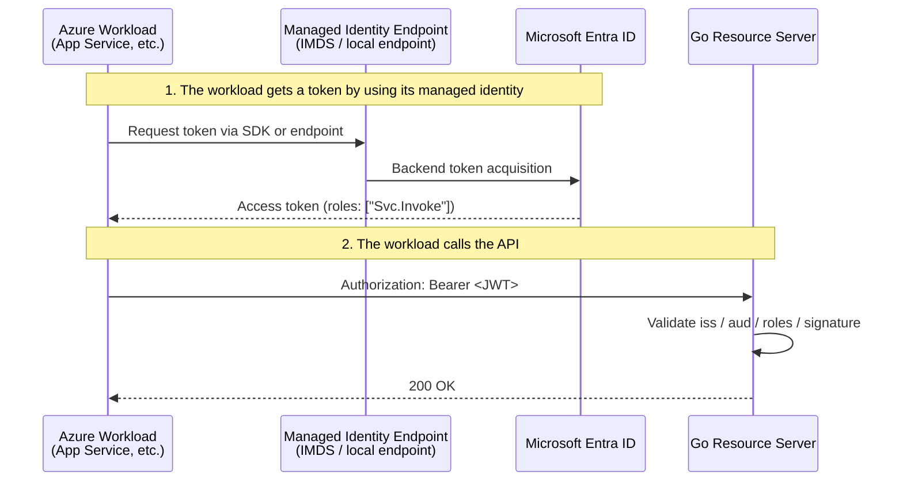
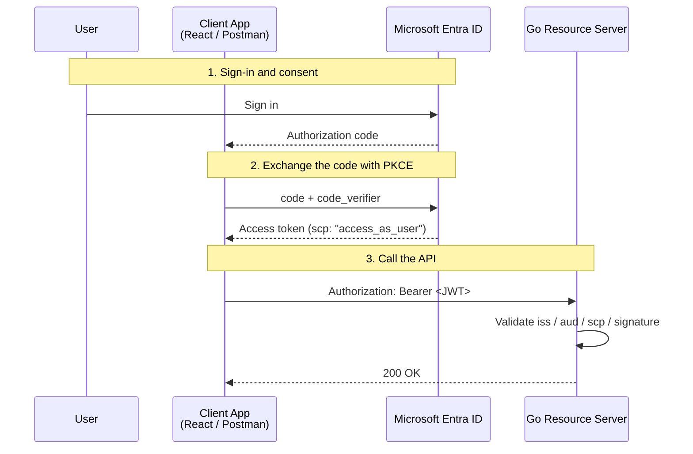

# OAuth2 Workshop: Learning Authorization Flows with Microsoft Entra ID and Go

In this workshop, you will use **Microsoft Entra ID** as the authorization server and a **Go REST API** as the resource server. The goal is to understand how OAuth 2.0 and OpenID Connect work in realistic Azure environments.

This guide covers two common patterns:

- **A. Machine-to-Machine (M2M)**: an Azure workload calls your API by using a **managed identity**
- **B. User-delegated access**: a client such as React or Postman signs in a **user** and calls your API on that user's behalf

> Note:
> Most app registration and API exposure settings are now managed in the **Microsoft Entra admin center** (`entra.microsoft.com`).
> Managed identity settings belong to Azure resources, so you usually configure them in the **Azure portal** (`portal.azure.com`).

---

## First, Separate the Two Patterns

| Item | A. M2M | B. User-delegated access |
| ---- | ------ | ------------------------ |
| Actor | Application / workload | User |
| Typical examples | App Service, Functions, VM, scheduled job | SPA, mobile app, desktop app, Postman |
| OAuth 2.0 flow | Client Credentials flow | Authorization Code flow + PKCE |
| Permission model on the API side | **App Role** | **Scope** |
| Typical claim | `roles` | `scp` |
| Managed identity | Common and recommended | Normally not used |

---

## Actors and Roles

| Actor | Example | Role |
| ---- | ---- | ---- |
| Resource Owner | User | Signs in and grants consent |
| Client | React, Postman, Azure workload | Obtains an access token and calls the API |
| Authorization Server | Microsoft Entra ID | Authenticates and issues access tokens |
| Resource Server | Go REST API | Validates tokens and returns protected data |

---

## A. Machine-to-Machine (M2M)

This is service-to-service communication with no interactive user. In Azure, the standard pattern is **Managed Identity + App Role**.

### Architecture



### Setup Steps

#### 1. Register the API app

- Open the **Microsoft Entra admin center** → `App registrations` → `New registration`
- Name: `workshop-api`
- After creation, record the **Application (client) ID**
- Go to `Expose an API` and select `Set` to configure the **Application ID URI**
  - Example: `api://<API_APP_CLIENT_ID>`
  - > **Important**: This URI is used as the "resource identifier" when requesting a token. Note that if you enable v2 tokens as described below, the actual `aud` (audience) claim in the token will be the **Client ID (GUID)**, not this URI.

#### 2. Expose an app role for application access

- `App registrations` → `workshop-api` → `App roles` → `Create app role`
- Display name: `Svc.Invoke`
- Allowed member types: `Applications`
- Value: `Svc.Invoke`
- Add a description if needed, then save

#### 3. Configure the API to accept v2 access tokens

- Open `Manifest`
- Set `requestedAccessTokenVersion` to `2` inside the `api` section

```json
"api": {
  "requestedAccessTokenVersion": 2
}
```

> **Why v2?**: In v2 tokens, the `aud` claim becomes the API's client ID (GUID), making validation logic simpler and more consistent.

#### 4. Enable managed identity on the Azure resource

- Open the **Azure portal**
- Go to the target resource, such as App Service
- Open `Identity`
- Enable either `System assigned` or `User assigned`
- Record the managed identity's **principal object ID**

#### 5. Assign the app role to the managed identity

Assigning a custom API app role to a managed identity is usually easier through **Microsoft Graph / Azure CLI** than through the portal UI.

```bash
# ============================================
# Preparation: Obtain the IDs
# ============================================

# The Application (client) ID of your API app
API_APP_CLIENT_ID=<API_APP_CLIENT_ID>

# The Object ID of your Managed Identity
# Find this in Azure Portal → Resource → Identity → Object ID
# Note: This is the Service Principal Object ID
MI_SP_OBJECT_ID=<MANAGED_IDENTITY_OBJECT_ID>

# ============================================
# Assign the App Role
# ============================================

# Get the service principal object ID of the API app
API_SP_OBJECT_ID=$(az ad sp show --id ${API_APP_CLIENT_ID} --query id -o tsv)

# Get the ID of the app role published by the API app
APP_ROLE_ID=$(az ad sp show --id ${API_APP_CLIENT_ID} \
  --query "appRoles[?value=='Svc.Invoke'].id | [0]" -o tsv)

az rest --method POST \
  --uri "https://graph.microsoft.com/v1.0/servicePrincipals/${MI_SP_OBJECT_ID}/appRoleAssignments" \
  --body "{
    \"principalId\": \"${MI_SP_OBJECT_ID}\",
    \"resourceId\": \"${API_SP_OBJECT_ID}\",
    \"appRoleId\": \"${APP_ROLE_ID}\"
  }"
```

> Important:
> When a workload uses managed identity, it normally does **not** call the Microsoft Entra `/token` endpoint directly.
> It uses the Azure Identity SDK or the managed identity local endpoint provided by the platform.

---

## B. User-Delegated Access

This is the pattern for SPAs, mobile apps, desktop apps, or Postman when a signed-in user calls your API. The recommended flow is **Authorization Code + PKCE**.

### Architecture



### Setup Steps

#### 1. Expose a scope on the API app

- Open the **Microsoft Entra admin center** → `App registrations` → `workshop-api`
- Go to `Expose an API` → `Add a scope`
- Scope name: `access_as_user`
- Who can consent: `Admins and users`
- Fill in the admin consent and user consent display text, then save

#### 2. Register the client app

- `App registrations` → `New registration` → Name: `workshop-client`
- Open `Authentication` → `Add a platform`
  - For React or another browser SPA: `Single-page application`
  - For Postman or native clients: `Mobile and desktop applications`
- Register the redirect URI

> For SPAs, the redirect URI must be registered as a **Single-page application** platform. Otherwise, the authorization code exchange can fail with a CORS error.

#### 3. Add API permissions to the client app

- Open `workshop-client` → `API permissions` → `Add a permission`
- Select `My APIs` → `workshop-api`
- Choose `Delegated permissions`
- Add `access_as_user`

#### 4. Handle consent

Operation:

- **User consent**: A consent screen is shown during the first sign-in.
- **Admin consent**: Go to `API permissions` → `Grant admin consent for [Tenant Name]`.
  - Required if user consent is disabled by tenant policy, or for Application permissions (M2M).

---

## Go Resource Server Example

The following example uses `github.com/MicahParks/keyfunc/v3` and `github.com/golang-jwt/jwt/v5`.

```go
package main

import (
	"encoding/json"
	"log"
	"net/http"
	"strings"

	"github.com/MicahParks/keyfunc/v3"
	"github.com/golang-jwt/jwt/v5"
)

const (
	tenantID         = "<YOUR_TENANT_ID>"         // Entra Admin Center → Overview → Tenant ID
	apiClientID      = "<API_APP_CLIENT_ID>"      // App registrations → workshop-api → Application (client) ID
	requiredScope    = "access_as_user"           // Scope to validate for delegated user flow
	requiredAppRole  = "Svc.Invoke"               // App Role to validate for M2M flow
	jwksURL          = "https://login.microsoftonline.com/" + tenantID + "/discovery/v2.0/keys"
	expectedIssuer   = "https://login.microsoftonline.com/" + tenantID + "/v2.0"
)

func main() {
	kf, err := keyfunc.NewDefault([]string{jwksURL})
	if err != nil {
		log.Fatalf("failed to create keyfunc: %v", err)
	}

	http.HandleFunc("/api/profile", func(w http.ResponseWriter, r *http.Request) {
		authHeader := r.Header.Get("Authorization")
		if !strings.HasPrefix(authHeader, "Bearer ") {
			http.Error(w, "Unauthorized", http.StatusUnauthorized)
			return
		}

		tokenStr := strings.TrimPrefix(authHeader, "Bearer ")
		token, err := jwt.Parse(tokenStr, kf.Keyfunc,
			jwt.WithIssuer(expectedIssuer),
			jwt.WithAudience(apiClientID),
			jwt.WithValidMethods([]string{"RS256"}),
		)
		if err != nil || !token.Valid {
			http.Error(w, "Invalid token", http.StatusUnauthorized)
			return
		}

		claims, ok := token.Claims.(jwt.MapClaims)
		if !ok {
			http.Error(w, "Invalid claims", http.StatusUnauthorized)
			return
		}

		scp, _ := claims["scp"].(string)

		hasValidRole := false
		if rawRoles, ok := claims["roles"].([]any); ok {
			for _, r := range rawRoles {
				if role, ok := r.(string); ok && role == requiredAppRole {
					hasValidRole = true
					break
				}
			}
		}

		hasValidScope := false
		for _, s := range strings.Fields(scp) {
			if s == requiredScope {
				hasValidScope = true
				break
			}
		}

		if !hasValidScope && !hasValidRole {
			http.Error(w, "Forbidden: insufficient permissions", http.StatusForbidden)
			return
		}

		_ = json.NewEncoder(w).Encode(map[string]any{
			"status": "ok",
			"user":   claims["name"],
		})
	})

	log.Println("server started on :8081")
	log.Fatal(http.ListenAndServe(":8081", nil))
}
```

### Implementation Notes

- Validate `aud` against the **actual `aud` claim** in the token you receive
- With `requestedAccessTokenVersion = 2`, it is usually simplest to validate `aud` against the API app's **client ID (GUID)**
- `scp` is a space-delimited string, so compare scopes as individual values, not with `strings.Contains`
- M2M tokens carry `roles`, while delegated user tokens carry `scp`

---

## Troubleshooting

- **401 Unauthorized / `aud` mismatch**
  - The token was not issued for your API. Decode the token (e.g., at [jwt.ms](https://jwt.ms)) and confirm that `aud` matches the API's client ID.
- **403 Forbidden**
  - Signature validation passed, but the token is missing the required `scp` or `roles`. Recheck consent, scope assignment, or the `az rest` assignment step.
- **CORS error during SPA token exchange**
  - The redirect URI may not be configured under the `Single-page application` platform type. (Ensure it is not registered as `Web`).
- **`roles` claim is missing**
  - You may be using a delegated user flow instead of application permissions, or the app role assignment to the managed identity has not been completed.
- **`iss` mismatch**
  - You may be receiving tokens from another tenant, or you may have mixed v1 and v2 assumptions. Recheck `requestedAccessTokenVersion` and the Resource Server's issuer validation settings.

---

## Summary

- For **M2M**, use `Managed Identity + App Role`
- For **user-delegated access**, use `Authorization Code + PKCE + Scope`
- App registration and API exposure are mainly handled in the **Microsoft Entra admin center**
- Managed identity is enabled on the Azure resource in the **Azure portal**
- On the API side, validate `iss`, `aud`, `scp`, `roles`, and the JWT signature explicitly

---

## References

- [Microsoft identity platform and OAuth 2.0 authorization code flow](https://learn.microsoft.com/en-us/entra/identity-platform/v2-oauth2-auth-code-flow)
- [How to add a redirect URI to your application](https://learn.microsoft.com/en-us/entra/identity-platform/how-to-add-redirect-uri)
- [Application manifest reference](https://learn.microsoft.com/en-us/entra/identity-platform/reference-app-manifest)
- [Scopes and permissions in the Microsoft identity platform](https://learn.microsoft.com/en-us/entra/identity-platform/scopes-oidc)
- [Assign an application role to a managed identity using PowerShell](https://learn.microsoft.com/en-us/entra/identity/managed-identities-azure-resources/assign-app-role-managed-identity-powershell)
