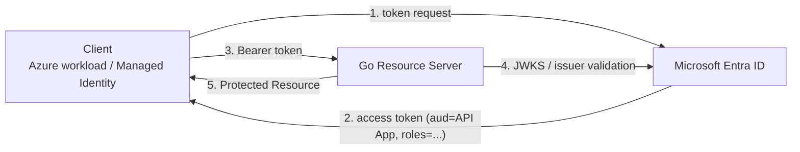
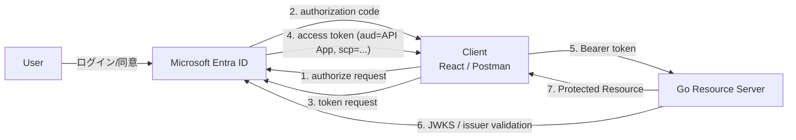
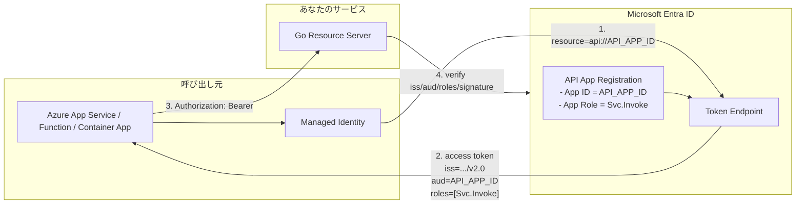
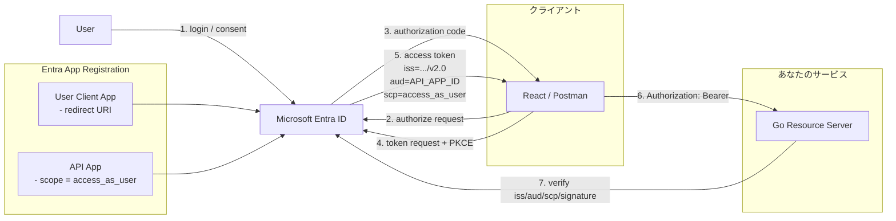

# OAuth2 実習：Microsoft Entra ID + Go で学ぶ認可フロー

この実習では、**Microsoft Entra ID（Authorization Server / IdP）** と **Go 製 REST API（Resource Server）** を使い、OAuth2 / OIDC の実運用フローを学びます。Azure Portal（`portal.azure.com`）での構成方法と、Go API 側での JWT 検証を扱います。

この文書では、次の 2 パターンを整理します。

- **A. M2M（Machine-to-Machine）**
  Azure 上のサービスが、**自分自身の ID** であなたの API を呼ぶ
- **B. ユーザー委任フロー**
  React / Postman などのクライアントが、**ユーザーの代理** としてあなたの API を呼ぶ

> **💡 用語集**: OAuth2 や Access Token、Resource Server などの専門用語は [用語集](/Users/scott/repo/sokoide/workshop/infra/glossary_ja.md) を参照してください。

## ゴール

- Microsoft Entra ID を IdP として使う構成を説明できる
- M2M とユーザー委任フローの違いを説明できる
- Azure Portal で API App / Client App / App Role / Scope を構成できる
- Go API 側で Entra 発行 JWT の `iss` / `aud` / `roles` / `scp` を検証できる

---

## まず分類を整理する

### A. M2M とは何か

M2M は **Machine-to-Machine** の略です。
ユーザーがログインせず、**サービスが別のサービスを呼ぶ**通信を指します。

例:

- Azure Container Apps のジョブがあなたの API を呼ぶ
- Azure Functions が夜間バッチとしてあなたの API を呼ぶ
- 別のバックエンド API が内部連携であなたの API を呼ぶ

このときの主体は **ユーザーではなくアプリケーション** です。
Entra では通常 **OAuth 2.0 Client Credentials** を使います。

### B. ユーザー委任フローとは何か

これは React や Postman などのクライアントが、**ログインしたユーザーの代理** として API を呼ぶ形です。
主体はユーザーですが、実際の API 呼び出しはクライアントが行います。

Entra では通常 **Authorization Code + PKCE** を使います。

### A と B の違い

| 項目 | A. M2M | B. ユーザー委任フロー |
| ---- | ------ | --------------------- |
| 主体 | アプリケーション | ユーザー |
| 典型例 | バックエンド間通信 | React / Postman / SPA |
| OAuth2 フロー | Client Credentials | Authorization Code + PKCE |
| Entra で主に使う権限 | App Role | Delegated Scope |
| トークンで主に見る claim | `roles` | `scp` |
| Managed Identity | よく使う | 通常使わない |

**注意**:

- B を `C2B` と呼ぶのは一般的ではありません
- この文書では B を **ユーザー委任フロー** と呼びます

---

## 登場人物と役割

| 登場人物 | 実装・ツール例 | 役割 |
| ---- | ---- | ---- |
| Resource Owner | ユーザー | ログインし、アクセスを許可する人 |
| Client | React / Postman / Azure workload | トークンを取得し API を呼ぶもの |
| Authorization Server | Microsoft Entra ID | ユーザー認証とトークン発行を行う |
| Resource Server | Go REST API | トークンを検証し、保護された資源を返す |

---

## アーキテクチャ

### A. M2M



### B. ユーザー委任フロー



---

## Entra 側の基本構成

Entra では通常、少なくとも次の App Registration を使います。

- **API App**: あなたの Resource Server を表すアプリ
- **User Client App**: React / Postman など、ユーザー委任フローで使うクライアント

M2M では、呼び出し元が Azure の Managed Identity の場合、追加の App Registration が不要なことがあります。
その代わり、**Managed Identity の service principal** に API App の **App Role** を割り当てます。

### 想定ディレクトリ構造

```text
infra/assets/oauth2/
└── api/
    ├── main.go
    └── go.mod
```

---

## 準備

### 1. Azure Portal にサインインする

1. [Azure Portal](https://portal.azure.com) にサインイン
2. `Microsoft Entra ID` を開く
3. 実習用テナントを確認する
4. `Overview` から **Tenant ID** を控える

この文書では、まず **単一テナント** 前提で進めます。

### 2. API App Registration を作成する

1. `Microsoft Entra ID` → `App registrations` → `New registration`
2. Name: `workshop-api`
3. Supported account types: `Single tenant only`
4. Register
5. `Overview` で **Application (client) ID** を控える

以降、この値を `API_APP_ID` と呼びます。
この `API_APP_ID` が、実際にはあなたの API 向けトークンの `aud` として使われます。

### 3. API App の `Expose an API` を設定する

1. `Manage` → `Expose an API` → `Add`
2. Application ID URI を作成
   - 例: `api://<API_APP_ID>`
3. この URI を控える

以降、この値を `API_APP_ID_URI` と呼びます。

### 4. API App に Delegated Scope を追加する

これは **B. ユーザー委任フロー** 用です。

1. `Manage` → `Expose an API` → `Add a scope`
2. Scope name: `access_as_user`
3. Who can consent: `Admins and users`
4. Display name / Description は任意
5. `State: Enabled`

### 5. API App に App Role を追加する

これは **A. M2M** 用です。

1. `Manage` → `App roles` → `Create app role`
2. Display name: `Svc.Invoke`
3. Allowed member types: `Applications`
4. Value: `Svc.Invoke`
5. Description は任意
6. `Do you want to enable this app role?` を有効化
7. Save

### 6. API App のアクセストークンを v2 にする

1. `Manage` → `Manifest` を開く
2. `requestedAccessTokenVersion` を `2` に設定
3. Save

### 7. User Client App Registration を作成する

これは **B. ユーザー委任フロー** 用です。

1. `App registrations` → `New registration`
2. Name: `workshop-client`
3. Supported account types: `Accounts in this organizational directory only`
4. Register
5. `Overview` で **Application (client) ID** を控える

### 8. User Client App の Authentication を設定する

- `Add a platform` → `Single-page application`
  - Redirect URI: `http://localhost:3000/`
- `Add a platform` → `Mobile and desktop applications`
  - Redirect URI: `https://oauth.pstmn.io/v1/callback`

React だけなら SPA のみで十分です。Postman を使うなら `https://oauth.pstmn.io/v1/callback` も登録します。

### 9. User Client App に API permission を追加する

1. `API permissions` → `Add a permission`
2. `My APIs` を選ぶ
3. `workshop-api` を選ぶ
4. `Delegated permissions` → `access_as_user` を追加
5. 必要なら `Grant admin consent` を実行

---

## A. M2M の構成

### 何をするか

Azure 上のサービスが、**自分の Managed Identity** で Entra からトークンを取得し、あなたの API を呼びます。

このとき API は、主に次を見ます。

- `aud == API_APP_ID`
- `roles` に `Svc.Invoke` が含まれる

### 図で見る A. M2M



```text
[Azure App Service]
    |
    |  Managed Identity を使って token 要求
    |  resource = api://<API_APP_ID>
    v
[Microsoft Entra ID]
    |
    |  access token を返す
    |  aud   = <API_APP_ID>
    |  roles = ["Svc.Invoke"]
    v
[Your Go API]
    |
    |  JWT を検証
    |  - signature
    |  - iss
    |  - aud
    |  - roles
    v
[200 OK / 403 Forbidden]
```

### Managed Identity に App Role を付与する

前提:

- 呼び出し元ワークロードに **System-assigned** または **User-assigned Managed Identity** がある
- その Managed Identity の **service principal** が Entra に存在する

考え方:

- API App 側に `Svc.Invoke` という **App Role** を作る
- 呼び出し元 Managed Identity の service principal に、その role を割り当てる

Portal だけでは作業しづらいことがあるため、実運用では Azure CLI / PowerShell / Graph API を併用することがあります。

### クライアントが要求するトークン

M2M では通常、`scope` に **`.default`** を使います。

```text
scope=api://<API_APP_ID>/.default
```

Managed Identity からこの API 向けトークンを取得すると、アクセストークンに `roles` claim が入ります。

### API 側で期待する claim

- `iss`: `https://login.microsoftonline.com/<TENANT_ID>/v2.0`
- `aud`: `API_APP_ID`
- `roles`: `Svc.Invoke`

### M2M のチェックポイント

- [ ] API App に `Svc.Invoke` App Role を追加した
- [ ] 呼び出し元 Managed Identity にその role を割り当てた
- [ ] クライアントが `api://<API_APP_ID>/.default` でトークン取得できた
- [ ] トークンの `aud` が `API_APP_ID` になっている
- [ ] トークンの `roles` に `Svc.Invoke` が入っている

### Workshop 具体例: Azure App Service があなたの API を呼ぶ

この Workshop では、次の 2 つを用意すると流れを確認しやすいです。

- **受け側 App Service または API**: あなたの Resource Server
- **呼び側 App Service**: Managed Identity 付きのクライアント

構成イメージ:

```text
Azure App Service (caller, Managed Identity enabled)
  -> Microsoft Entra ID から access token を取得
  -> Authorization: Bearer <token>
  -> Your Resource Server
```

#### 手順 1: あなたのサービスを Entra に登録する

1. `workshop-api` を API App として登録する
2. `Expose an API` で `api://<API_APP_ID>` を作る
3. `App roles` に `Svc.Invoke` を追加する
4. `requestedAccessTokenVersion = 2` にする

この API App が、Entra から見たあなたのサービスです。
あなたのサーバーでは、以後 `aud == API_APP_ID` のトークンを受け付けます。

#### 手順 2: 呼び側の Azure App Service を作る

1. Azure で Web App を 1 つ作る
2. `Identity` を開く
3. `System assigned` を `On` にする
4. Save

これで、この App Service に Managed Identity が付きます。

#### 手順 3: 呼び側 App Service に API App の App Role を付与する

やることは次の 1 点です。

- 呼び側 App Service の Managed Identity の service principal に、`workshop-api` の `Svc.Invoke` role を割り当てる

実務では Azure CLI / PowerShell / Microsoft Graph で行うことが多いです。
これが完了すると、呼び側 App Service が取得するトークンに `roles: ["Svc.Invoke"]` が入るようになります。

#### 手順 4: 呼び側 App Service でトークンを取得する

App Service では、Managed Identity 用のローカルエンドポイントが環境変数として提供されます。

- `IDENTITY_ENDPOINT`
- `IDENTITY_HEADER`

HTTP で取得する場合のイメージ:

```text
GET ${IDENTITY_ENDPOINT}?resource=api://<API_APP_ID>&api-version=2019-08-01
X-IDENTITY-HEADER: ${IDENTITY_HEADER}
```

ここでの `resource` は、あなたの API の **Application ID URI** です。
取得した `access_token` を、そのままあなたの API に送ります。

#### 手順 5: 呼び側 App Service からあなたの API を呼ぶ

```http
GET https://your-api.example.com/api/profile
Authorization: Bearer <ACCESS_TOKEN>
```

#### 手順 6: あなたの API で検証する

API 側では少なくとも次を検証します。

- `iss == https://login.microsoftonline.com/<TENANT_ID>/v2.0`
- `aud == API_APP_ID`
- `roles` に `Svc.Invoke` が入っている
- 署名、期限が正しい

#### 確認観点

- 呼び側 App Service がトークンを取得できる
- そのトークンの `aud` が `API_APP_ID`
- そのトークンの `roles` に `Svc.Invoke`
- あなたの API が `200 OK` を返す
- role を外すと `403 Forbidden` になる

#### 最小サンプルの考え方

Workshop では次のようにすると確認しやすいです。

- あなたの Go API は `/health` と `/api/profile` だけ持つ
- 呼び側 App Service は `/call-api` のような 1 エンドポイントだけ持つ
- `/call-api` 内で Managed Identity からトークン取得し、あなたの API を 1 回呼ぶ
- 成功時は API の応答をそのまま返す

この構成なら、Entra での audience/role 設定と、Go 側の JWT validation の両方を最小構成で確認できます。

#### サンプルコードの配置

- 受け側 API:
  [infra/assets/oauth2/api/main.go](/Users/scott/repo/sokoide/workshop/infra/assets/oauth2/api/main.go)
- 呼び側 App Service:
  [infra/assets/oauth2/caller/main.go](/Users/scott/repo/sokoide/workshop/infra/assets/oauth2/caller/main.go)

#### 呼び側 App Service の必要環境変数

- `TARGET_API_URL`
  例: `https://your-api.example.com/api/profile`
- `TARGET_API_RESOURCE`
  例: `api://<API_APP_ID>`
- `MANAGED_IDENTITY_CLIENT_ID`
  User-assigned Managed Identity を使う場合のみ指定

App Service で Managed Identity を有効化すると、次はプラットフォーム側から自動で渡されます。

- `IDENTITY_ENDPOINT`
- `IDENTITY_HEADER`

#### 呼び側サンプルの使い方

1. 呼び側 App Service に [main.go](/Users/scott/repo/sokoide/workshop/infra/assets/oauth2/caller/main.go) をデプロイする
2. App Service の Managed Identity を有効化する
3. `TARGET_API_URL` と `TARGET_API_RESOURCE` を App Settings に設定する
4. App Service の Managed Identity に `Svc.Invoke` を割り当てる
5. `GET /call-api` を呼ぶ

成功時は、呼び側 App Service があなたの API を呼んだ結果を JSON で返します。

---

## B. ユーザー委任フローの構成

### 何をするか

React / Postman などのクライアントが、**ユーザーの代理** としてあなたの API を呼びます。

このとき API は、主に次を見ます。

- `aud == API_APP_ID`
- `scp` に `access_as_user` が含まれる

### 図で見る B. ユーザー委任フロー



```text
[User]
   |
   |  login / consent
   v
[Microsoft Entra ID] <---- [User Client App]
   |                        - redirect URI
   |                        - PKCE
   |<---- [API App]
   |      - scope: access_as_user
   |
   |  access token を返す
   |  aud = <API_APP_ID>
   |  scp = access_as_user
   v
[React / Postman]
   |
   |  Bearer token 付きで API 呼び出し
   v
[Your Go API]
   |
   |  JWT を検証
   |  - signature
   |  - iss
   |  - aud
   |  - scp
   v
[200 OK / 403 Forbidden]
```

### 認可エンドポイント

```text
https://login.microsoftonline.com/<TENANT_ID>/oauth2/v2.0/authorize
```

### トークンエンドポイント

```text
https://login.microsoftonline.com/<TENANT_ID>/oauth2/v2.0/token
```

### Postman の場合

1. Authorization タブで `OAuth 2.0` を選択
2. Grant Type: `Authorization Code (With PKCE)`
3. Auth URL:
   `https://login.microsoftonline.com/<TENANT_ID>/oauth2/v2.0/authorize`
4. Access Token URL:
   `https://login.microsoftonline.com/<TENANT_ID>/oauth2/v2.0/token`
5. Client ID: `USER_CLIENT_APP_ID`
6. Scope:
   `openid profile email offline_access api://<API_APP_ID>/access_as_user`
7. Callback URL:
   `https://oauth.pstmn.io/v1/callback`
8. Client Secret は空欄

### React の場合

`msal-browser` / `msal-react` などを使い、以下を設定します。

- Authority:
  `https://login.microsoftonline.com/<TENANT_ID>`
- Client ID:
  `USER_CLIENT_APP_ID`
- Redirect URI:
  `http://localhost:3000/`
- Scope:
  `api://<API_APP_ID>/access_as_user`

### ユーザー委任フローのチェックポイント

- [ ] User Client App を作成した
- [ ] Redirect URI を登録した
- [ ] `access_as_user` を Delegated permission として追加した
- [ ] Postman または React でアクセストークンを取得できた
- [ ] トークンの `aud` が `API_APP_ID` になっている
- [ ] トークンの `scp` に `access_as_user` が入っている

---

## Go Resource Server の実装例

次の例は、**M2M とユーザー委任フローの両方**を受け付けます。

- M2M なら `roles` に `Svc.Invoke` が必要
- ユーザー委任フローなら `scp` に `access_as_user` が必要

```go
package main

import (
	"encoding/json"
	"log"
	"net/http"
	"strings"

	"github.com/MicahParks/keyfunc/v3"
	"github.com/golang-jwt/jwt/v5"
)

const (
	tenantID       = "<TENANT_ID>"
	apiAppID       = "<API_APP_ID>"
	requiredScope  = "access_as_user"
	requiredAppRole = "Svc.Invoke"

	jwksURL = "https://login.microsoftonline.com/" + tenantID + "/discovery/v2.0/keys"
	issuer  = "https://login.microsoftonline.com/" + tenantID + "/v2.0"
)

func main() {
	kf, err := keyfunc.NewDefault([]string{jwksURL})
	if err != nil {
		log.Fatalf("failed to create keyfunc: %v", err)
	}

	http.HandleFunc("/health", func(w http.ResponseWriter, _ *http.Request) {
		w.Write([]byte("OK"))
	})

	http.HandleFunc("/api/profile", func(w http.ResponseWriter, r *http.Request) {
		authHeader := r.Header.Get("Authorization")
		if !strings.HasPrefix(authHeader, "Bearer ") {
			http.Error(w, "Unauthorized", http.StatusUnauthorized)
			return
		}

		tokenStr := strings.TrimPrefix(authHeader, "Bearer ")
		token, err := jwt.Parse(
			tokenStr,
			kf.Keyfunc,
			jwt.WithAudience(apiAppID),
			jwt.WithIssuer(issuer),
			jwt.WithValidMethods([]string{"RS256"}),
		)
		if err != nil || !token.Valid {
			log.Printf("token validation failed: %v", err)
			http.Error(w, "Unauthorized", http.StatusUnauthorized)
			return
		}

		claims, ok := token.Claims.(jwt.MapClaims)
		if !ok {
			http.Error(w, "Unauthorized", http.StatusUnauthorized)
			return
		}

		scp, _ := claims["scp"].(string)
		roles := toStringSlice(claims["roles"])

		if !hasScope(scp, requiredScope) && !hasRole(roles, requiredAppRole) {
			http.Error(w, "Forbidden", http.StatusForbidden)
			return
		}

		sub, _ := claims["sub"].(string)
		name, _ := claims["name"].(string)

		w.Header().Set("Content-Type", "application/json")
		if err := json.NewEncoder(w).Encode(map[string]any{
			"message": "Hello, authenticated caller!",
			"sub":     sub,
			"name":    name,
			"scp":     scp,
			"roles":   roles,
		}); err != nil {
			log.Printf("response encode failed: %v", err)
		}
	})

	log.Println("Resource Server started on :8081")
	log.Fatal(http.ListenAndServe(":8081", nil))
}

func hasScope(scopeList, required string) bool {
	for _, s := range strings.Fields(scopeList) {
		if s == required {
			return true
		}
	}
	return false
}

func hasRole(roles []string, required string) bool {
	for _, r := range roles {
		if r == required {
			return true
		}
	}
	return false
}

func toStringSlice(v any) []string {
	items, ok := v.([]any)
	if !ok {
		return nil
	}

	out := make([]string, 0, len(items))
	for _, item := range items {
		s, ok := item.(string)
		if ok {
			out = append(out, s)
		}
	}
	return out
}
```

最小構成の起動例:

```bash
cd infra/assets/oauth2/api
go mod tidy
go run main.go
```

---

## Resource Server 側の検証ポイント

JWT 検証時は最低限以下を確認します。

- 署名アルゴリズムが想定通りであること
- `iss` が `https://login.microsoftonline.com/<TENANT_ID>/v2.0` であること
- `aud` が `API_APP_ID` であること
- `exp` が有効期限内であること
- M2M なら `roles` に必要な App Role が含まれること
- ユーザー委任フローなら `scp` に必要な Scope が含まれること

**注意**:

- Microsoft Graph 向けトークンを自作 API に流用してはいけません
- 任意の文字列を `aud` にするのではなく、**Entra に登録した API App** を audience にします
- Managed Identity は主に **A. M2M** 用です
- React / Postman などのユーザーありクライアントで Managed Identity を前提にしません

---

## 使い分けの指針

- **Azure 上のバッチ、ジョブ、バックエンド間通信**
  A. M2M を使う
- **React アプリ、Postman、ユーザーログインを伴うフロントエンド**
  B. ユーザー委任フローを使う
- **1 つの API が両方から呼ばれる**
  API 側で `roles` と `scp` の両方を受け付ける

---

## 🔧 トラブルシューティング

### M2M で `roles` が入らない

**対処**:

- API App に `Allowed member types = Applications` の App Role を作成したか確認する
- 呼び出し元 Managed Identity の service principal に、その App Role を割り当てたか確認する
- クライアントが `api://<API_APP_ID>/.default` を要求しているか確認する

### ユーザー委任フローで `scp` が入らない

**対処**:

- API App の `Expose an API` で `access_as_user` scope を作成したか確認する
- User Client App に Delegated permission を追加したか確認する
- 要求 scope が `api://<API_APP_ID>/access_as_user` になっているか確認する

### audience invalid

**対処**:

- API 側の `aud` 検証値を `API_APP_ID` に合わせる
- Microsoft Graph 用トークンを送っていないか確認する
- あなたの API 向けに取得したトークンか確認する

### redirect URI mismatch

**対処**:

- `Authentication` に登録した URI と `redirect_uri` を完全一致させる
- Postman の場合は `https://oauth.pstmn.io/v1/callback` を登録する

### issuer invalid

**対処**:

- 単一テナントなら `https://login.microsoftonline.com/<TENANT_ID>/v2.0` を使う
- `requestedAccessTokenVersion` が `2` か確認する

---

## 参考

- [OAuth 2.0 and OpenID Connect protocols - Microsoft Learn](https://learn.microsoft.com/en-us/entra/identity-platform/v2-protocols)
- [Access tokens in the Microsoft identity platform - Microsoft Learn](https://learn.microsoft.com/en-us/entra/identity-platform/access-tokens)
- [Claims validation - Microsoft Learn](https://learn.microsoft.com/en-us/entra/identity-platform/claims-validation)
- [Expose scopes in a protected web API - Microsoft Learn](https://learn.microsoft.com/en-us/entra/identity-platform/scenario-protected-web-api-expose-scopes)
- [Add app roles and receive them in the token - Microsoft Learn](https://learn.microsoft.com/en-us/entra/identity-platform/howto-add-app-roles-in-apps)
- [OAuth 2.0 client credentials flow - Microsoft Learn](https://learn.microsoft.com/en-us/entra/identity-platform/v2-oauth2-client-creds-grant-flow)
- [Assign an app role to a managed identity - Microsoft Learn](https://learn.microsoft.com/en-us/entra/identity/managed-identities-azure-resources/assign-app-role-managed-identity-powershell)
- [How to add a redirect URI to your application - Microsoft Learn](https://learn.microsoft.com/en-us/entra/identity-platform/how-to-add-redirect-uri)
