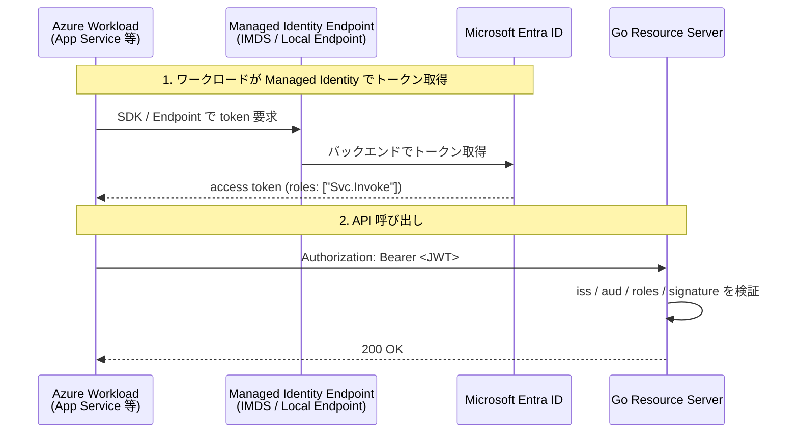
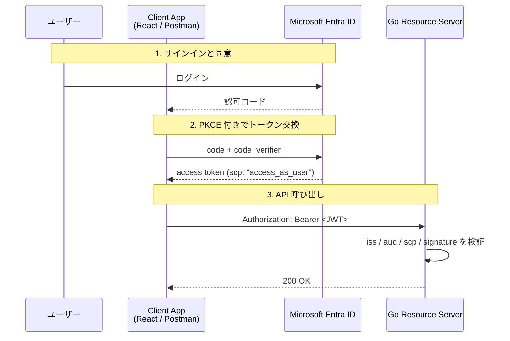

# OAuth2 実習: Microsoft Entra ID + Go で学ぶ認可フロー

この実習では、**Microsoft Entra ID** を認可サーバー、**Go 製 REST API** をリソースサーバーとして使い、OAuth 2.0 / OpenID Connect の実運用パターンを確認します。

対象は次の 2 パターンです。

- **A. M2M (Machine-to-Machine)**: Azure 上のワークロードが、**Managed Identity** を使って API を呼ぶ
- **B. ユーザー委任フロー**: React / Postman などのクライアントが、**ユーザーとしてサインイン**して API を呼ぶ

> 注意:
> アプリ登録や API 公開の UI は、現在は主に **Microsoft Entra 管理センター** (`entra.microsoft.com`) にあります。
> 一方、**Managed Identity の有効化** は Azure リソース側のため、通常は **Azure Portal** (`portal.azure.com`) で行います。

---

## どちらを選ぶべきか？

```text
ユーザーが介在するか？
    │
    ├─ YES → B. ユーザー委任フロー
    │         （SPA、モバイルアプリ、Postman でユーザーとして操作）
    │
    └─ NO  → Azure 上で動くか？
              │
              ├─ YES → A. M2M (Managed Identity 推奨)
              │         （App Service、Functions、VM 上のバッチ等）
              │
              └─ NO  → M2M (Client Credentials + Secret/Certificate)
                        （オンプレミス、他クラウドからの接続）
```

---

## 事前に控えるべき値

設定作業中に以下の値が必要になります。先にメモしておくとスムーズです。

| 値                             | 取得場所                                       | 使用箇所                                          |
| ------------------------------ | ---------------------------------------------- | ------------------------------------------------- |
| **テナント ID**                | Entra 管理センター → 概要                      | Go コードの環境変数 `TENANT_ID`                   |
| **API App Client ID**          | App registrations → workshop-api → 概要        | Go コードの環境変数 `API_CLIENT_ID`、トークン要求 |
| **Client App Client ID**       | App registrations → workshop-client → 概要     | Postman / SPA 設定                                |
| **Managed Identity Object ID** | Azure Portal → リソース → Identity → Object ID | App Role 割り当て（`az rest` コマンド）           |

> **補足**: Client ID は「アプリケーション(クライアント)ID」とも表記されます。GUID 形式の文字列です。

---

## まず分類を整理する

| 項目                       | A. M2M                             | B. ユーザー委任フロー                |
| -------------------------- | ---------------------------------- | ------------------------------------ |
| 主体                       | アプリケーション / ワークロード    | ユーザー                             |
| 典型例                     | App Service, Functions, VM, バッチ | SPA, モバイル, デスクトップ, Postman |
| 認証フロー                 | Client Credentials Flow            | Authorization Code Flow + PKCE       |
| API 側で使う権限           | **App Role**                       | **Scope**                            |
| トークンの Claim           | `roles: ["Svc.Invoke"]`            | `scp: "access_as_user"`              |
| Managed Identity           | 積極的に使う（Azure 内）           | 通常使わない                         |
| アクセストークンの有効期限 | 通常長め（〜60分）                 | 通常短め（〜5-60分）                 |

> **重要な違い**:
>
> - **M2M**: API 側はトークンの `roles` claim を検証
> - **ユーザー委任**: API 側はトークンの `scp` (scope) claim を検証

---

## 重要: v1 トークンと v2 トークンの違い

Entra ID は 2 種類のアクセストークン形式を発行します。この実習では **v2 トークン** を使用します。

| 項目             | v1 トークン                            | v2 トークン                                          |
| ---------------- | -------------------------------------- | ---------------------------------------------------- |
| `aud` (audience) | `api://<client-id>` (URI 形式)         | `<client-id>` (GUID 形式)                            |
| `iss` (issuer)   | `https://sts.windows.net/<tenant-id>/` | `https://login.microsoftonline.com/<tenant-id>/v2.0` |
| 検証の複雑さ     | URI マッチングが必要                   | GUID マッチングで済む                                |

**本実習では v2 を推奨する理由**: 検証ロジックがシンプルになり、実装ミスを減らせるため。

> **設定方法**: App registrations → 対象アプリ → Manifest → `"requestedAccessTokenVersion": 2`

---

## デバッグ: トークンの中身を確認する

設定が正しいか確認するには、取得したトークンをデコードして中身を確認します。

### 方法 1: jwt.ms (推奨)

1. トークンをクリップボードにコピー
2. <https://jwt.ms> にアクセス
3. トークンをペースト → Claims が表示される

### 方法 2: jwt.io (ローカル確認)

```bash
# トークンをデコード（署名検証なし）
echo "<トークン>" | cut -d'.' -f2 | base64 -d 2>/dev/null | jq .
```

### 確認すべき Claim

| Claim   | 期待値                                               | 確認内容               |
| ------- | ---------------------------------------------------- | ---------------------- |
| `aud`   | API の Client ID                                     | 自分の API 宛てか      |
| `iss`   | `https://login.microsoftonline.com/<tenant-id>/v2.0` | 正しいテナントか       |
| `scp`   | `access_as_user`                                     | ユーザー委任の場合     |
| `roles` | `["Svc.Invoke"]`                                     | M2M の場合             |
| `appid` | Client App の ID                                     | どのアプリが要求したか |

---

## 登場人物と役割

| 登場人物             | 例                                   | 役割                                 |
| -------------------- | ------------------------------------ | ------------------------------------ |
| Resource Owner       | ユーザー                             | サインインし、権限付与に同意する主体 |
| Client               | React / Postman / Azure ワークロード | アクセストークンを取得し API を呼ぶ  |
| Authorization Server | Microsoft Entra ID                   | 認証し、アクセストークンを発行する   |
| Resource Server      | Go REST API                          | トークンを検証し、リソースを返す     |

---

## A. M2M の構成

ユーザーが介在しないサービス間通信です。Azure 上のワークロードから API を呼ぶ場合は、**Managed Identity + App Role** が基本です。

### アーキテクチャ図



### 設定手順

#### 1. API App を登録する

- **Microsoft Entra 管理センター** → `App registrations` → `New registration`
- Name: `workshop-api`
- 作成後、`Application (client) ID` を控える（後で使います）
- `Expose an API` → `Set` から **Application ID URI** を設定
  - 例: `api://<API_APP_CLIENT_ID>`
  - > **重要**: トークン要求時の「リソース識別子」として使います。ただし、後述の v2 トークン設定を有効にすると、実際のトークンの `aud` (audience) claim には URI ではなく **Client ID (GUID)** が入ります。

#### 2. API で App Role を公開する

- `App registrations` → `workshop-api` → `App roles` → `Create app role`
- Display name: `Svc.Invoke`
- Allowed member types: `Applications`
- Value: `Svc.Invoke`
- 必要なら Description を設定して保存

#### 3. API が v2 アクセストークンを受れる設定にする

既定では v1 トークンが発行されます。v2 トークンを使うには以下を設定します。

- `Manifest` を開く
- `api` セクション内の `requestedAccessTokenVersion` を `2` にする

```json
"api": {
  "requestedAccessTokenVersion": 2
}
```

> **なぜ v2 か**: v2 トークンでは `aud` が API の client ID (GUID) になり、検証ロジックがシンプルになります。
>
> **補足**: 以前は `accessTokenAcceptedVersion` という名称でしたが、現在は `requestedAccessTokenVersion` を使用します。

---

#### 4. App Service を作成し API を呼び出す

App Service (Client) から、Managed Identity を使って別の API (Resource) を呼び出す Go の実装例です。

#### 4-1. 依存パッケージの導入

Azure SDK for Go の `azidentity` を使用します。

```bash
go get github.com/Azure/azure-sdk-for-go/sdk/azidentity
go get github.com/Azure/azure-sdk-for-go/sdk/azcore
```

#### 4-2. Go のコード例

`azidentity.NewDefaultAzureCredential` を使うと、ローカル環境（Azure CLI ログイン済み）でも Azure 環境（Managed Identity）でもコードを変更せずに動作させることができます。この例では、結果をブラウザで確認できるよう Web サーバーとして実装します。

```go
package main

import (
	"context"
	"fmt"
	"io"
	"log"
	"net/http"
	"os"

	"github.com/Azure/azure-sdk-for-go/sdk/azcore/policy"

	"github.com/Azure/azure-sdk-for-go/sdk/azidentity"
)

func main() {
	// Get port from environment variable (App Service default is 8080)
	port := os.Getenv("PORT")
	if port == "" {
		port = "8080"
	}

	http.HandleFunc("/", func(w http.ResponseWriter, r *http.Request) {
		// 1. Authenticate using Managed Identity
		cred, err := azidentity.NewDefaultAzureCredential(nil)
		if err != nil {
			http.Error(w, "Failed to create credential: "+err.Error(), 500)
			return
		}

		// 2. Attempt to acquire a token
		scope := os.Getenv("API_SCOPE")
		if scope == "" {
			fmt.Fprintln(w, "Warning: API_SCOPE is not set. Using default...")
			scope = "https://graph.microsoft.com/.default" // For testing
		}

		token, err := cred.GetToken(context.Background(), policy.TokenRequestOptions{
			Scopes: []string{scope},
		})

		if err != nil {
			// Display error in browser on failure
			fmt.Fprintf(w, "❌ Token Error: %v\n", err)
			log.Printf("Token Error: %v", err)
			return
		}

		// 3. Display success message in browser
		fmt.Fprintf(w, "✅ Managed Identity Success!\n")
		fmt.Fprintf(w, "Token (first 10 chars): %s...\n", token.Token[:10])
		fmt.Fprintf(w, "Expires On: %v\n\n", token.ExpiresOn)

		log.Printf("Successfully retrieved token for scope: %s", scope)

		// 4. Call the API Endpoint
		apiEndpoint := os.Getenv("API_ENDPOINT")
		if apiEndpoint == "" {
			fmt.Fprintln(w, "⚠️ API_ENDPOINT is not set. Skipping API call.")
			return
		}

		client := &http.Client{}
		req, err := http.NewRequest("GET", apiEndpoint, nil)
		if err != nil {
			fmt.Fprintf(w, "❌ Failed to create API request: %v\n", err)
			return
		}

		req.Header.Set("Authorization", "Bearer "+token.Token)
		resp, err := client.Do(req)
		if err != nil {
			fmt.Fprintf(w, "❌ API Call Failed: %v\n", err)
			return
		}
		defer resp.Body.Close()

		body, _ := io.ReadAll(resp.Body)
		if resp.StatusCode >= 200 && resp.StatusCode < 300 {
			fmt.Fprintf(w, "✅ API Call Success! (Status: %s)\n", resp.Status)
		} else {
			fmt.Fprintf(w, "⚠️ API Call Failed (Status: %s)\n", resp.Status)
		}
		fmt.Fprintf(w, "Response Body:\n%s\n", string(body))
	})

	log.Printf("Starting server on port %s...", port)
	if err := http.ListenAndServe(":"+port, nil); err != nil {
		log.Fatal(err)
	}
}
```

#### 4-3. 実行時の注意点

- **App Service 上での動作**: コンテナ起動後、`http://<your-app-name>.azurewebsites.net/` にアクセスすると、Managed Identity を使用してトークンを取得し、さらにそのトークンを使って API を呼び出した結果が表示されます。

#### Client App の環境変数

| 環境変数       | 必須 | 説明                          | デフォルト値                                      |
| -------------- | :--: | ----------------------------- | ------------------------------------------------- |
| `PORT`         |  -   | リッスンポート番号            | `8080`                                            |
| `API_SCOPE`    |  -   | アクセスしたい API のスコープ | `https://graph.microsoft.com/.default` (テスト用) |
| `API_ENDPOINT` |  -   | 呼び出す API の URL           | - (未設定時は API 呼び出しスキップ)               |

> **注意**: `API_SCOPE` には通常 `api://<api-client-id>/.default` を設定します。`.default` は「その API に割り当てられた全権限」を意味します。

- **API 側の検証**: API サーバー（Resource Server）側では、前述の通り `aud` が自身の Client ID と一致するかを必ず検証してください。

---

#### 5. Azure リソースで Managed Identity を有効化する

- **Azure Portal** → 対象リソース (App Service など) → `Identity`
- `System assigned` または `User assigned` を有効化
- 有効化後、Managed Identity の **principal object ID** を控える

#### 6. Managed Identity に App Role を割り当てる

カスタム API の App Role を Managed Identity に割り当てる作業は、UI より **Microsoft Graph / Azure CLI** の方が確実です。

```bash
# ============================================
# 事前準備: 各 ID の取得方法
# ============================================

# API アプリの client ID（App registrations の概要画面から確認）
# 例: 11111111-2222-3333-4444-555555555555
API_APP_CLIENT_ID=<API_APP_CLIENT_ID>

# Managed Identity の Object ID
# Azure Portal → 対象リソース → Identity → Object ID から確認
# ※これが Service Principal の Object ID として機能します
MI_SP_OBJECT_ID=<MANAGED_IDENTITY_OBJECT_ID>

# API アプリの service principal object ID を取得
API_SP_OBJECT_ID=$(az ad sp show --id ${API_APP_CLIENT_ID} --query id -o tsv)

# API が公開している App Role の ID を取得
APP_ROLE_ID=$(az ad sp show --id ${API_APP_CLIENT_ID} \
  --query "appRoles[?value=='Svc.Invoke'].id | [0]" -o tsv)

az rest --method POST \
  --uri "https://graph.microsoft.com/v1.0/servicePrincipals/${MI_SP_OBJECT_ID}/appRoleAssignments" \
  --body "{
    \"principalId\": \"${MI_SP_OBJECT_ID}\",
    \"resourceId\": \"${API_SP_OBJECT_ID}\",
    \"appRoleId\": \"${APP_ROLE_ID}\"
  }"
```

> 重要:
> Managed Identity がトークンを取るとき、通常は Entra の `/token` を直接叩きません。
> Azure Identity SDK か、Managed Identity 用のローカルエンドポイントを使います。

---

## B. ユーザー委任フローの構成

SPA や Postman が、ユーザーをサインインさせたうえで API を呼ぶパターンです。現在の推奨は **Authorization Code Flow + PKCE** です。

### アーキテクチャ図



### 設定手順

#### 1. API App で Scope を公開する

- **Microsoft Entra 管理センター** → `App registrations` → `workshop-api`
- `Expose an API` → `Add a scope`
- Scope name: `access_as_user`
- Who can consent: `Admins and users`
- Admin consent display name / User consent display name を設定して保存

#### 2. Client App を登録する

- `App registrations` → `New registration` → Name: `workshop-client`
- `Authentication` → `Add a platform`
  - React などの SPA: **`Single-page application`** を選択
  - Postman やネイティブアプリ: `Mobile and desktop applications` を選択
- Redirect URI を登録（例: `http://localhost:3000` や `https://oauth.pstmn.io/v1/callback`）

> **重要**: SPA の場合、プラットフォーム構成で必ず `Single-page application` を選択してください。`Web` として登録すると、トークン交換時に CORS エラーになります。

#### 3. Client App に API Permission を追加する

- `workshop-client` → `API permissions` → `Add a permission`
- `My APIs` → `workshop-api`
- `Delegated permissions` → `access_as_user` を追加

#### 4. 同意 (consent) を行う

| 同意の種類       | 必要なケース                                                        | 実行者                     |
| ---------------- | ------------------------------------------------------------------- | -------------------------- |
| **ユーザー同意** | ユーザー同意が許可されたテナント + 低影響権限                       | サインインするユーザー自身 |
| **管理者同意**   | テナントでユーザー同意が無効 / 高影響権限 / Application permissions | テナント管理者             |

操作方法:

- ユーザー同意: 初回サインイン時に同意画面が表示される
- 管理者同意: `API permissions` → `Grant admin consent for [テナント名]` をクリック
  - ※テナントポリシーでユーザー同意が禁止されている場合や、Application permissions (M2M) の場合は必須です。

---

## Go Resource Server の実装例

以下は `github.com/MicahParks/keyfunc/v3` と `github.com/golang-jwt/jwt/v5` を使った最小例です。環境変数から設定を読み込み、ポート `8080`（App Service 既定）で動作します。

```go
package main

import (
	"encoding/json"
	"fmt"
	"log"
	"net/http"
	"os"
	"strings"

	"github.com/MicahParks/keyfunc/v3"
	"github.com/golang-jwt/jwt/v5"
)

func main() {
	// 環境変数から設定を読み込み
	tenantID := os.Getenv("TENANT_ID")
	apiClientID := os.Getenv("API_CLIENT_ID")
	requiredScope := os.Getenv("REQUIRED_SCOPE")
	if requiredScope == "" {
		requiredScope = "access_as_user"
	}
	requiredAppRole := os.Getenv("REQUIRED_APP_ROLE")
	if requiredAppRole == "" {
		requiredAppRole = "Svc.Invoke"
	}

	if tenantID == "" || apiClientID == "" {
		log.Fatal("Error: TENANT_ID and API_CLIENT_ID must be set")
	}

	jwksURL := fmt.Sprintf("https://login.microsoftonline.com/%s/discovery/v2.0/keys", tenantID)
	expectedIssuer := fmt.Sprintf("https://login.microsoftonline.com/%s/v2.0", tenantID)

	// トークン検証用の JWKS を取得
	kf, err := keyfunc.NewDefault([]string{jwksURL})
	if err != nil {
		log.Fatalf("failed to create keyfunc: %v", err)
	}

	http.HandleFunc("/api/profile", func(w http.ResponseWriter, r *http.Request) {
		authHeader := r.Header.Get("Authorization")
		if !strings.HasPrefix(authHeader, "Bearer ") {
			http.Error(w, "Unauthorized", http.StatusUnauthorized)
			return
		}

		tokenStr := strings.TrimPrefix(authHeader, "Bearer ")
		// JWT の署名、Issuer、Audience を検証
		token, err := jwt.Parse(tokenStr, kf.Keyfunc,
			jwt.WithIssuer(expectedIssuer),
			jwt.WithAudience(apiClientID),
			jwt.WithValidMethods([]string{"RS256"}),
		)
		if err != nil || !token.Valid {
			http.Error(w, "Invalid token", http.StatusUnauthorized)
			return
		}

		claims, ok := token.Claims.(jwt.MapClaims)
		if !ok {
			http.Error(w, "Invalid claims", http.StatusUnauthorized)
			return
		}

		// App Role の検証 (M2M フロー用)
		hasValidRole := false
		if rawRoles, ok := claims["roles"].([]any); ok {
			for _, r := range rawRoles {
				if role, ok := r.(string); ok && role == requiredAppRole {
					hasValidRole = true
					break
				}
			}
		}

		// Scope の検証 (ユーザー委任フロー用)
		scp, _ := claims["scp"].(string)
		hasValidScope := false
		for _, s := range strings.Fields(scp) {
			if s == requiredScope {
				hasValidScope = true
				break
			}
		}

		if !hasValidScope && !hasValidRole {
			http.Error(w, "Forbidden: insufficient permissions", http.StatusForbidden)
			return
		}

		_ = json.NewEncoder(w).Encode(map[string]any{
			"status": "ok",
			"user":   claims["name"],
			"claims": claims,
		})
	})

	// PORT 環境変数を使用（App Service の既定は 8080）
	port := os.Getenv("PORT")
	if port == "" {
		port = "8080"
	}

	log.Printf("Starting API server on port %s...", port)
	log.Fatal(http.ListenAndServe(":"+port, nil))
}
```

### 実装上の注意

- **`aud` 検証**: 実際のトークンの `aud` claim に合わせる。v2 トークンでは API の **client ID (GUID)** になる
- **`scp` と `requiredScope` の意味**:
  - `access_as_user` は、**「ユーザー委任フロー (Pattern B)」** でのみ使用される **スコープ (Scope)** です。
  - これは「このアプリがサインインしているユーザーに代わって API を操作すること」を許可する権限の名前です。Entra ID の「API の公開」メニューで作成します。
- **M2M フローでの権限**:
  - **M2M フロー (Pattern A) では `scp`（スコープ）は使用されません。** 代わりに **`roles`（App Role）** が使用されます。
  - Managed Identity を使った通信では、トークンに `scp` クレームは含まれず、割り当てた App Role が `roles` クレームに入ります。
- **検証ロジック**: 上記の Go コードでは、`hasValidScope`（ユーザー用）または `hasValidRole`（M2M 用）の **どちらか一方が true** であればアクセスを許可する構成になっています。
- **環境変数**: App Service の設定から以下の環境変数を設定してください。

#### 環境変数一覧

| 環境変数            | 必須 | 説明                                 | デフォルト値     |
| ------------------- | :--: | ------------------------------------ | ---------------- |
| `TENANT_ID`         |  ✅  | Entra テナント ID                    | -                |
| `API_CLIENT_ID`     |  ✅  | API アプリの Client ID               | -                |
| `REQUIRED_SCOPE`    |  -   | ユーザー委任フローで要求するスコープ | `access_as_user` |
| `REQUIRED_APP_ROLE` |  -   | M2M フローで要求する App Role        | `Svc.Invoke`     |
| `PORT`              |  -   | リッスンポート番号                   | `8080`           |

---

## ローカル検証手順

### 1. API サーバーを起動

```bash
# 定数を環境変数で渡す場合
TENANT_ID=<tenant-id> \
API_CLIENT_ID=<api-client-id> \
go run main.go

# または main.go 内の定数を書き換えて
go run main.go
```

### 2. トークンを取得してテスト

#### ユーザー委任フローの場合（Postman 使用）

1. Postman → Authorization タブ
2. Type: `OAuth 2.0`
3. Grant type: `Authorization Code (With PKCE)`
4. Callback URL: `https://oauth.pstmn.io/v1/callback`
5. Auth URL: `https://login.microsoftonline.com/<tenant-id>/oauth2/v2.0/authorize`
6. Access Token URL: `https://login.microsoftonline.com/<tenant-id>/oauth2/v2.0/token`
7. Client ID: `<client-app-id>`
8. Scope: `api://<api-client-id>/access_as_user`（または `https://graph.microsoft.com/.default` 等）
9. Code Challenge Method: `S256`
10. 「Get New Access Token」→ トークン取得後、リクエストに自動付与

```bash
# 取得したトークンで API 呼び出し
curl -H "Authorization: Bearer <token>" http://localhost:8081/api/profile
```

#### M2M の場合（Azure CLI 使用）

```bash
# Managed Identity をエミュレート（ローカル開発用）
# 実際は Azure 上で動作させるか、Service Principal を使用

# Service Principal + Client Credentials でトークン取得
az login --service-principal \
  -u <client-id> \
  -p <client-secret> \
  --tenant <tenant-id>

# アクセストークン取得
TOKEN=$(az account get-access-token \
  --resource api://<api-client-id> \
  --query accessToken -o tsv)

# API 呼び出し
curl -H "Authorization: Bearer $TOKEN" http://localhost:8081/api/profile
```

### 3. よくあるエラーと確認方法

| エラー             | 確認コマンド              | 対策                                     |
| ------------------ | ------------------------- | ---------------------------------------- |
| `401 Unauthorized` | トークンを jwt.ms で確認  | `aud` が API の Client ID と一致するか   |
| `403 Forbidden`    | `scp` / `roles` を確認    | Scope または App Role が付与されているか |
| `invalid_client`   | Client ID / Secret を確認 | 正しい App Registration を使用しているか |

---

## トラブルシューティング

| 現象                                                        | 原因                                            | 対策                                                                                                                                                                           |
| ----------------------------------------------------------- | ----------------------------------------------- | ------------------------------------------------------------------------------------------------------------------------------------------------------------------------------ |
| **401 Unauthorized / `aud` mismatch**                       | API 向けではないトークンを受信                  | トークンを [jwt.ms](https://jwt.ms) でデコードし、`aud` が API の client ID と一致するか確認                                                                                   |
| **403 Forbidden**                                           | 署名検証は通ったが権限不足                      | `scp` / `roles` の追加、同意の実施、App Role 割り当てを確認                                                                                                                    |
| **SPA でトークン交換時に CORS エラー**                      | Redirect URI のプラットフォーム設定ミス         | `Authentication` で `Single-page application` であることを確認（`Web` は不可）                                                                                                 |
| **`roles` が入らない**                                      | ユーザー委任フローを使っている / 割り当て未実施 | M2M なら Client Credentials を使用。App Role の割り当て（`az rest` 手順）を再確認                                                                                              |
| **`iss` mismatch**                                          | テナント違い / v1・v2 混在                      | `requestedAccessTokenVersion` と Resource Server の issuer 設定を見直し                                                                                                        |
| **`ManagedIdentityCredential: managed identity timed out`** | API への App Role が未割り当て                  | **Role 未割り当て時の想定動作です。** 権限がないため Entra ID がトークン発行を拒否し、結果として SDK がタイムアウトします。Managed Identity に App Role を割り当ててください。 |

### トークンのデバッグ方法

トークン検証エラーが発生した場合、以下の順序で確認してください。

#### 1. トークン構造の確認

```bash
# jwt.ms で確認（推奨）
# 1. トークンをコピー
# 2. https://jwt.ms にアクセス
# 3. ペーストして確認

# または jq で確認
echo "<トークン>" | cut -d'.' -f2 | base64 -d 2>/dev/null | jq .
```

#### 2. 確認すべき Claim（v2 トークン）

```json
{
  "aud": "11111111-2222-3333-4444-555555555555", // API の Client ID と一致
  "iss": "https://login.microsoftonline.com/<tenant-id>/v2.0",
  "scp": "access_as_user", // ユーザー委任フローの場合
  "roles": ["Svc.Invoke"], // M2M フローの場合
  "appid": "client-app-id" // どのアプリが要求したか
}
```

#### 3. よくある間違い

| 間違い                            | 正しい設定                                           |
| --------------------------------- | ---------------------------------------------------- |
| `aud` が `api://xxx`（URI 形式）  | v2 トークンでは Client ID (GUID)                     |
| `iss` が `sts.windows.net`        | v2 トークンでは `login.microsoftonline.com/.../v2.0` |
| M2M で `scp` をチェック           | M2M では `roles` をチェック                          |
| ユーザー委任で `roles` をチェック | ユーザー委任では `scp` をチェック                    |

**成功時の表示:**
正しく権限が割り当てられ、API 呼び出しに成功すると、ブラウザには以下のように表示されます。

```text
✅ Managed Identity Success!
Token (first 10 chars): eyJ0eXAiOi...
Expires On: 2026-03-23 ...

✅ API Call Success! (Status: 200 OK)
Response Body:
{"claims":{..., "roles":["Svc.Invoke"], ...}, "status":"ok", ...}
```

**権限 (App Role) が未割り当ての場合の表示:**
Entra ID 側でトークンは取得できますが、API 側で拒否されると以下のように表示されます（Managed Identity 自体に API への App Role が割り当てられていない場合などは、トークン取得自体がタイムアウトすることもあります）。

```text
✅ Managed Identity Success!
Token (first 10 chars): eyJ0eXAiOi...
Expires On: 2026-03-23 ...

⚠️ API Call Failed (Status: 403 Forbidden)
Response Body:
Forbidden: insufficient permissions
```

**Managed Identity が有効化されていない、または Entra ID がトークン発行を拒否した場合のエラー表示:**
Managed Identity の設定自体に不備がある場合などは、以下のようなエラーが表示されます。

```text
❌ Token Error: DefaultAzureCredential: failed to acquire a token.
Attempted credentials:
	EnvironmentCredential: missing environment variable AZURE_TENANT_ID
	WorkloadIdentityCredential: no client ID specified. Check pod configuration or set ClientID in the options
	ManagedIdentityCredential: managed identity timed out. See https://aka.ms/azsdk/go/identity/troubleshoot#dac for more information
	AzureCLICredential: Azure CLI not found on path
	AzureDeveloperCLICredential: Azure Developer CLI not found on path
```

---

## まとめ

- **M2M** では `Managed Identity + App Role`
- **ユーザー委任** では `Authorization Code + PKCE + Scope`
- App 登録の UI は主に **Microsoft Entra 管理センター**
- Managed Identity の有効化は **Azure Portal**
- API 側は `iss` / `aud` / `scp` / `roles` / 署名を分けて検証する

---

## 設定チェックリスト

### M2M (Managed Identity)

- [ ] API App を登録し、Application ID URI を設定
- [ ] App Role (`Svc.Invoke`) を作成
- [ ] `requestedAccessTokenVersion: 2` を設定
- [ ] Azure リソースで Managed Identity を有効化
- [ ] Managed Identity に App Role を割り当て（az rest）
- [ ] API サーバーで `roles` を検証

### ユーザー委任フロー

- [ ] API App で Scope (`access_as_user`) を公開
- [ ] Client App を登録（SPA は `Single-page application` を選択）
- [ ] Redirect URI を登録
- [ ] Client App に API Permission を追加
- [ ] 管理者同意を実施（必要な場合）
- [ ] API サーバーで `scp` を検証

---

## 参考

- [Microsoft identity platform and OAuth 2.0 authorization code flow](https://learn.microsoft.com/en-us/entra/identity-platform/v2-oauth2-auth-code-flow)
- [How to add a redirect URI to your application](https://learn.microsoft.com/en-us/entra/identity-platform/how-to-add-redirect-uri)
- [Application manifest reference](https://learn.microsoft.com/en-us/entra/identity-platform/reference-app-manifest)
- [Scopes and permissions in the Microsoft identity platform](https://learn.microsoft.com/en-us/entra/identity-platform/scopes-oidc)
- [Assign an application role to a managed identity using PowerShell](https://learn.microsoft.com/en-us/entra/identity/managed-identities-azure-resources/assign-app-role-managed-identity-powershell)
