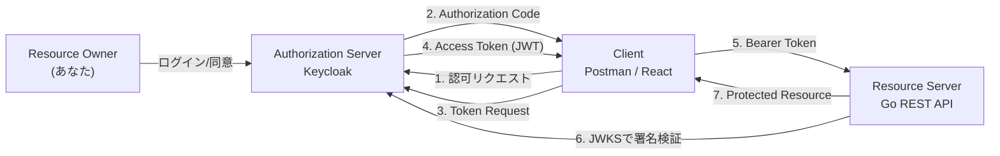

# OAuth2 実習：Keycloak + Go + Podman で学ぶ認可フロー

この実習では、**Keycloak（Authorization Server）** と **Go 製 REST API（Resource Server）** を使い、SWE が OAuth2 の実運用フローを手を動かして学びます。クライアントは **Postman または React アプリ** を想定し、アクセストークン取得から API 呼び出しまでを一通り検証します。

> **💡 用語集**: この実習で登場する[OAuth2](glossary.md#oauth2)や[Access Token](glossary.md#access-token)、[Resource Server](glossary.md#resource-server)などの専門用語は [用語集](glossary.md) を参照してください。

## ゴール

この実習を完了すると、以下のことができるようになります：

- OAuth2 の登場人物と責務を説明できる
- Keycloak で Realm / Client / User を構成できる
- `Authorization Code + PKCE` でアクセストークンを取得できる
- Go API 側で JWT を検証し、保護されたリソースを返せる
- Postman または React から Bearer トークン付きで API を叩ける

---

## 登場人物と役割

| 登場人物             | 実装・ツール例        | 役割                                   |
| -------------------- | --------------------- | -------------------------------------- |
| Resource Owner       | 私自身                | ログインを許可するユーザー             |
| Client               | Postman / Reactアプリ | トークンを取得し、APIを叩くもの        |
| Authorization Server | Keycloak              | ユーザーを確認し、トークンを発行する   |
| Resource Server      | 私のREST API          | トークンを検証し、データ（資源）を渡す |

---

## アンチパターンと解決策

### ❌ アンチパターン 1：API キーをフロントに埋め込む

- **問題点**: ブラウザ開発者ツールや配布バイナリから流出しやすい。失効・権限制御が粗い。

### ❌ アンチパターン 2：独自ログイン + 独自トークン実装

- **問題点**: セキュリティ仕様漏れ（署名検証、期限、リフレッシュ、PKCE）を起こしやすい。

### ✅ 解決策：OAuth2 + OIDC + Keycloak

- 認証とトークン発行を Keycloak に集約
- クライアントは標準フローでトークン取得
- Go API は JWT の署名・Issuer・Audience を検証

---

## アーキテクチャ



### 想定ディレクトリ構造

```text
infra/assets/oauth2/
├── docker-compose.yml       # Keycloak 起動
├── realm-export.json        # 初期Realm定義（任意）
├── api/
│   ├── main.go              # Go Resource Server
│   └── go.mod
└── README.md                # 補足メモ（任意）
```

---

## 準備

### 1. Keycloak の起動（Podman）

```bash
mkdir -p infra/assets/oauth2 && cd infra/assets/oauth2
cat > docker-compose.yml <<'YAML'
services:
  keycloak:
    image: quay.io/keycloak/keycloak:26.1
    container_name: workshop-keycloak
    command: start-dev
    environment:
      KC_BOOTSTRAP_ADMIN_USERNAME: admin
      KC_BOOTSTRAP_ADMIN_PASSWORD: admin
    ports:
      - "8080:8080"
YAML

podman compose up -d
```

Keycloak 管理画面: `http://localhost:8080`

### 2. Keycloak 初期設定

1. `admin / admin` でログイン
2. Realm `workshop` を作成
3. User を 1 人作成（例: `swe-user`）し、パスワードを設定
4. Client を作成（例: `workshop-client`）
    - Client authentication: `Off`（Public client）
    - Standard flow: `On`
    - Valid redirect URIs: `http://localhost:3000/*`, `https://oauth.pstmn.io/v1/callback`
5. 必要に応じて Scope `openid profile email` を付与

### ✅ チェックポイント

- [ ] `podman ps` で `workshop-keycloak` が起動している
- [ ] Realm `workshop` が作成されている
- [ ] `swe-user` でログインできる
- [ ] `workshop-client` の redirect URI が設定されている

---

## 実習ステップ

### STEP 1: Client でアクセストークンを取得する

#### Postman の場合

1. Authorization タブで `OAuth 2.0` を選択
2. Grant Type: `Authorization Code (with PKCE)`
3. Auth URL:
   `http://localhost:8080/realms/workshop/protocol/openid-connect/auth`
4. Access Token URL:
   `http://localhost:8080/realms/workshop/protocol/openid-connect/token`
5. Client ID: `workshop-client`
6. Scope: `openid profile email`
7. Callback URL: `https://oauth.pstmn.io/v1/callback`

`Get New Access Token` を実行し、ログインしてトークンを取得します。

#### React の場合（例）

OIDC クライアントライブラリ（例: `oidc-client-ts`）で `Authorization Code + PKCE` を設定し、同じ Auth URL/Token URL/Client ID を使用します。

### STEP 2: Go Resource Server を作る

Go API は `Authorization: Bearer <token>` を受け取り、Keycloak の JWKS で署名検証します。

```go
// main.go
package main

import (
	"encoding/json"
	"log"
	"net/http"
	"strings"

	"github.com/MicahParks/keyfunc/v3"
	"github.com/golang-jwt/jwt/v5"
)

const (
	jwksURL  = "http://localhost:8080/realms/workshop/protocol/openid-connect/certs"
	issuer   = "http://localhost:8080/realms/workshop"
	audience = "workshop-client"
)

func main() {
	// 1. Keycloakから公開鍵(JWKS)を取得・管理する機能を初期化
	kf, err := keyfunc.NewDefault([]string{jwksURL})
	if err != nil {
		log.Fatalf("Failed to create keyfunc: %v", err)
	}

	http.HandleFunc("/health", func(w http.ResponseWriter, r *http.Request) {
		w.Write([]byte("OK"))
	})

	http.HandleFunc("/api/profile", func(w http.ResponseWriter, r *http.Request) {
		// 2. AuthorizationヘッダからBearerトークンを抽出
		authHeader := r.Header.Get("Authorization")
		if !strings.HasPrefix(authHeader, "Bearer ") {
			http.Error(w, "Unauthorized", http.StatusUnauthorized)
			return
		}
		tokenStr := strings.TrimPrefix(authHeader, "Bearer ")
		if tokenStr == "" {
			http.Error(w, "Unauthorized", http.StatusUnauthorized)
			return
		}

		// 3. トークンの検証 (署名, exp, iss, aud, alg)
		token, err := jwt.Parse(
			tokenStr,
			kf.Keyfunc,
			jwt.WithAudience(audience),
			jwt.WithIssuer(issuer),
			jwt.WithValidMethods([]string{"RS256"}),
		)
		if err != nil || !token.Valid {
			// 詳細はサーバーログにのみ出す
			log.Printf("token validation failed: %v", err)
			http.Error(w, "Unauthorized", http.StatusUnauthorized)
			return
		}

		// sub (Subject) クレームなどを取得してレスポンス
		claims, ok := token.Claims.(jwt.MapClaims)
		if !ok {
			http.Error(w, "Unauthorized", http.StatusUnauthorized)
			return
		}
		sub, ok := claims["sub"].(string)
		if !ok || sub == "" {
			http.Error(w, "Unauthorized", http.StatusUnauthorized)
			return
		}

		w.Header().Set("Content-Type", "application/json")
		if err := json.NewEncoder(w).Encode(map[string]string{
			"message": "Hello, authenticated SWE!",
			"sub":     sub,
		}); err != nil {
			log.Printf("response encode failed: %v", err)
		}
	})

	log.Println("Resource Server started on :8081")
	log.Fatal(http.ListenAndServe(":8081", nil))
}
```

最小構成の起動例:

```bash
cd api
go mod tidy
go run main.go
```

API 例:

- `GET /health`（認証不要）
- `GET /api/profile`（認証必須）

### STEP 3: トークン付きで API を叩く

```bash
curl -i http://localhost:8081/health

curl -i http://localhost:8081/api/profile \
  -H "Authorization: Bearer <ACCESS_TOKEN>"
```

期待結果:

- トークンなし: `401 Unauthorized`
- 不正トークン: `401 Unauthorized`
- 正常トークン: `200 OK` + JSON レスポンス

### ✅ チェックポイント

- [ ] Postman または React でアクセストークンを取得できた
- [ ] Go API が 8081 で起動した
- [ ] `/api/profile` が Bearer トークンなしで 401 を返した
- [ ] 正常トークンで `/api/profile` が 200 を返した

---

## 実装の要点（Resource Server 側）

JWT 検証時は最低限以下を確認します。

- 署名アルゴリズムが想定通り（例: RS256）
- `iss` が `http://localhost:8080/realms/workshop`
- `aud` に `workshop-client`（または API 用 audience）が含まれる
- `exp` が有効期限内

**注意**: 「署名検証なしで JWT payload を信用する」実装は厳禁です。

---

## 片付け

```bash
cd infra/assets/oauth2
podman compose down
```

データを完全に消す場合:

```bash
podman rm -f workshop-keycloak
```

---

## 次のステップ

- Refresh Token を使った再認証なしセッション継続
- API ごとの細粒度認可（Role / Scope チェック）
- Resource Server と Authorization Server のドメイン分離（本番相当）

---

## 🔧 トラブルシューティング

### redirect_uri mismatch

**症状**: ログイン後に `invalid_redirect_uri` が表示される

**対処**:

- Keycloak Client の `Valid redirect URIs` にコールバック URL を正確に登録する
- 末尾スラッシュや `http/https` の不一致を見直す

### token audience invalid

**症状**: API 側で `audience` エラーになる

**対処**:

- Keycloak 側で Client Scope (`workshop-client-scope`等) または Client 内の Mappers で Audience を追加します。
  - `Client Scopes` > `roles` (または新規作成) > `Mappers` > `Add mapper` > `By configuration` > `Audience` を選択。
  - `Included Client Audience` に `workshop-client` を入力。
- API の期待 audience と Client ID の整合を確認する

### JWKS 取得に失敗する

**症状**: API 起動時または初回リクエスト時に JWKS エラー

**対処**:

- `http://localhost:8080/realms/workshop/protocol/openid-connect/certs` にアクセスできるか確認
- Podman コンテナの起動完了前に API を起動していないか確認

---

## 💻 環境別注意事項

### macOS の場合

- Podman Machine 利用時、`localhost` 到達性に問題があれば `podman machine inspect` でネットワーク設定を確認してください。

### Windows の場合

- WSL2 + Podman 構成では、ブラウザのコールバック URL と実行環境の URL（Windows 側 / WSL 側）を揃えてください。
