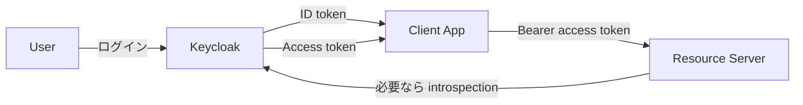
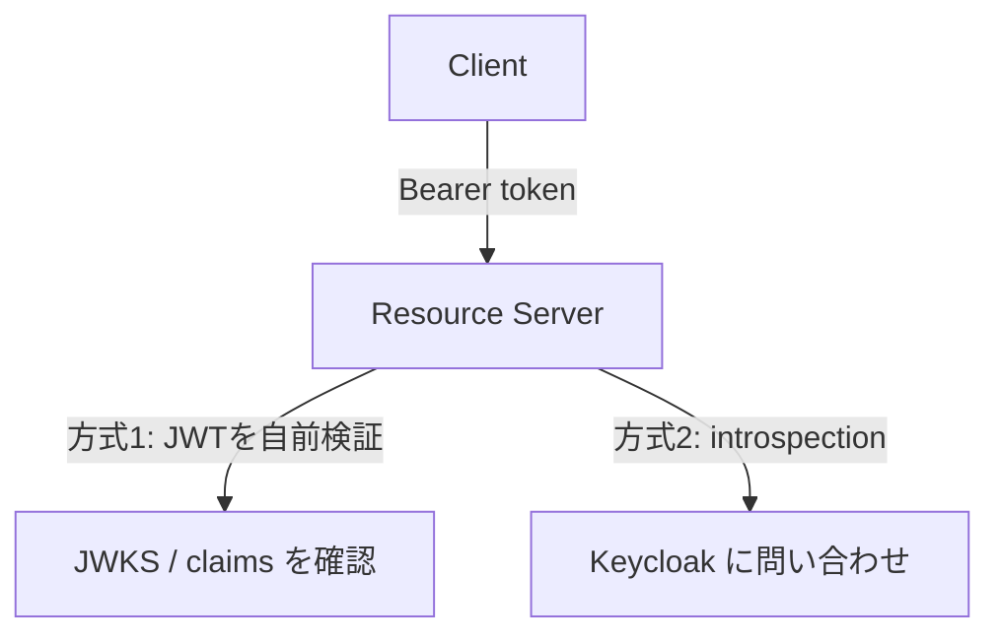
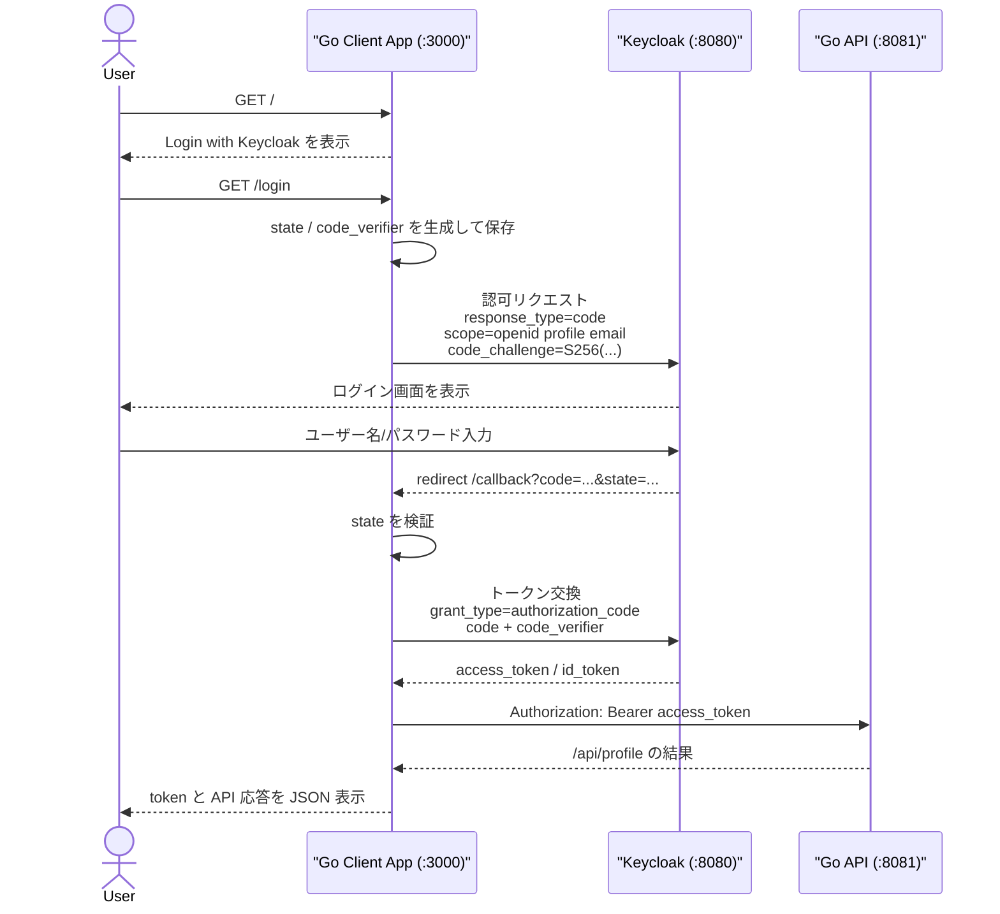

# OAuth2 実習：Keycloak + Go + Podman で学ぶ認可フロー

この実習では、**Keycloak（Authorization Server）** と **Go 製 Client アプリ / REST API（Resource Server）** を使い、SWE が OAuth2 の実運用フローを手を動かして学びます。Go Client アプリでアクセストークン取得から API 呼び出しまでを一通り検証します。

> **💡 用語集**: この実習で登場する[OAuth2](glossary_ja.md#oauth2)や[Access Token](glossary_ja.md#access-token)、[Resource Server](glossary_ja.md#resource-server)などの専門用語は [用語集](glossary_ja.md) を参照してください。

## ゴール

この実習を完了すると、以下のことができるようになります：

- OAuth2 の登場人物と責務を説明できる
- Keycloak で Realm / Client / User を構成できる
- `Authorization Code + PKCE` でアクセストークンを取得できる
- Go API 側で JWT を検証し、保護されたリソースを返せる
- Go Client アプリから Bearer トークン付きで API を叩ける

---

## 登場人物と役割

| 登場人物             | 実装・ツール例        | 役割                                   |
| -------------------- | --------------------- | -------------------------------------- |
| Resource Owner       | 私自身                | ログインを許可するユーザー             |
| Client               | Go Client アプリ      | トークンを取得し、APIを叩くもの        |
| Authorization Server | Keycloak              | ユーザーを確認し、トークンを発行する   |
| Resource Server      | 私のREST API          | トークンを検証し、データ（資源）を渡す |

---

## アンチパターンと解決策

### ❌ アンチパターン 1：API キーをフロントに埋め込む

- **問題点**: ブラウザ開発者ツールや配布バイナリから流出しやすい。失効・権限制御が粗い。

### ❌ アンチパターン 2：独自ログイン + 独自トークン実装

- **問題点**: セキュリティ仕様漏れ（署名検証、期限、リフレッシュ、PKCE）を起こしやすい。

### ✅ 解決策：OAuth2 + OIDC + Keycloak

- 認証とトークン発行を Keycloak に集約
- クライアントは標準フローでトークン取得
- Go API は JWT の署名・Issuer・Audience を検証

---

## アーキテクチャ


### 想定ディレクトリ構造

```text
infra/assets/oauth2/
├── docker-compose.yml       # Keycloak 起動
├── realm-export.json        # 初期Realm定義（任意）
├── client/
│   ├── main.go              # Go OIDC Client App
│   └── go.mod
├── api/
│   ├── main.go              # Go Resource Server
│   └── go.mod
└── README.md                # 補足メモ（任意）
```

---

## 準備

### 1. Keycloak の起動（Podman）

```bash
mkdir -p infra/assets/oauth2 && cd infra/assets/oauth2
cat > docker-compose.yml <<'YAML'
services:
  keycloak:
    image: quay.io/keycloak/keycloak:26.1
    container_name: workshop-keycloak
    command: start-dev
    environment:
      KC_BOOTSTRAP_ADMIN_USERNAME: admin
      KC_BOOTSTRAP_ADMIN_PASSWORD: admin
    ports:
      - "8080:8080"
YAML

podman compose up -d
```

Keycloak 管理画面: `http://localhost:8080`

### 2. Keycloak 初期設定

1. `admin / admin` でログイン
2. Realm `workshop` を作成
3. User を 1 人作成（例: `swe-user`）し、パスワードを設定
4. Client を作成（例: `workshop-client`）
    - Client authentication: `Off`（Public client）
    - Standard flow: `On`
    - Valid redirect URIs: `http://localhost:3000/callback`
5. 必要に応じて Client Scope `profile` `email` を付与
    - `openid` は Keycloak の Client Scope 一覧に出ないことがあります
    - `openid` は OIDC を使うための予約済みスコープで、通常は認可リクエスト側で `scope=openid` を指定します
6. Audience mapper を追加して、アクセストークンの `aud` に `workshop-client` を含める
    - `Client scopes` > `roles` > `Mappers` > `Add mapper` > `By configuration` > `Audience`
    - `Name`: `aud-workshop-client`
    - `Included Client Audience`: `workshop-client`
    - `Add to access token`: `On`
    - `Add to ID token`: `Off`
    - `Add to lightweight access token`: `Off`
    - `Add to token introspection`: `On`
    - これを入れないと、後続の Go API で `token has invalid audience` になります

補足:

- OAuth 2.0 は「アプリがユーザーの代わりに API を安全に呼ぶための仕組み」です
- OIDC は OAuth 2.0 の上に「ログインしたユーザーが誰か」を扱うための拡張です
- `ID token` は「誰がログインしたか」を表すトークンです
- `access token` は「API を呼ぶ権限」を表すトークンです
- この実習では Go API が `access token` を検証するため、`Add to access token` を `On` にします
- `Add to ID token = Off` は、ログイン確認用の ID token に audience を無理に入れないためです
- `Add to lightweight access token = Off` は、軽量トークンにこの情報を載せない設定です。この実習では通常の access token を使うため `Off` のままで問題ありません
- `Add to token introspection = On` は、トークン introspection を使う場合にも audience 情報を見えるようにする設定です
- ただし、`Add to token introspection = On` は「この教材が introspection を使っている」という意味ではありません
- この教材の Go API は introspection endpoint を呼ばず、JWKS を使って JWT を直接検証しています

## トークンの種類と Introspection

SWE が OAuth2 / OIDC を理解するうえでは、「どのトークンが何のために存在するのか」を切り分けて考えるのが重要です。

### 全体像



- `ID token`: 「誰がログインしたか」を Client に伝える
- `access token`: 「この token で API を呼んでよいか」を Resource Server に伝える
- `token introspection`: Resource Server が Authorization Server に「この token は有効か」を問い合わせる仕組み
- `lightweight access token`: access token を軽量化して、詳細情報を introspection 側で補う設計で使われることがある

### ID token

`ID token` は **OIDC のトークン** です。OAuth2 だけでは「誰がログインしたか」は標準化されていませんが、OIDC では `ID token` によってユーザー識別情報を Client に渡します。

主な用途:

- Client がログイン成功を確認する
- `sub` などのユーザー識別子を知る
- 必要に応じて `email` `name` などのクレームを参照する

重要な点:

- `ID token` は **Client 向け** です
- 通常、API 呼び出しにそのまま使うものではありません
- 「ログイン結果」を表すトークンと考えると理解しやすいです

### Access token

`access token` は **API 呼び出し用のトークン** です。Client はこれを `Authorization: Bearer <token>` として Resource Server に送ります。

主な用途:

- API が呼び出し権限を確認する
- `iss` `aud` `exp` `scope` `roles` などを見て受け入れるか判断する

重要な点:

- `access token` は **Resource Server 向け** です
- 今回の Go API はこの token を検証しています
- Audience mapper の `Add to access token = On` が必要なのは、この token に `aud` を入れたいからです

### Lightweight access token

`lightweight access token` は、通常の access token より **載せる情報を減らした軽量トークン** です。Keycloak の構成や運用方針によって使われます。

背景:

- access token に多くの claim を載せると token が大きくなる
- API ゲートウェイや複数サービス間で token サイズを小さくしたいことがある
- その代わり、必要な詳細は introspection などで補う設計をとる

この実習での位置づけ:

- この実習は JWT を Go API 側で直接検証する流れです
- そのため、lightweight access token を前提にしていません
- `Add to lightweight access token = Off` で問題ありません

### Token introspection

`token introspection` は、Resource Server が Authorization Server に対して「この token は今も有効か」「どんな属性を持つか」を問い合わせる仕組みです。

JWT を直接検証する方式との違い:



JWT 直接検証の特徴:

- Resource Server 単体で高速に判定しやすい
- Keycloak への問い合わせが毎回不要
- ただし、失効状態の即時反映などは別途設計が必要

Introspection の特徴:

- Authorization Server に問い合わせて有効性を確認できる
- 失効や無効化を中央で反映しやすい
- その代わり、毎回または必要時にネットワーク問い合わせが増える

`Add to token introspection = On` の意味:

- introspection レスポンスにも audience 情報を載せる設定です
- この実習の Go API は introspection を使っていませんが、将来 introspection 方式に切り替えても情報が揃いやすくなります
- つまり「introspection 用の情報を載せる設定」を `On` にしているだけで、「毎回 Keycloak に問い合わせている」わけではありません

### この実習では何を使っているか

この実習の構成では、役割は次のように分かれます。

- Go Client app: `ID token` と `access token` を受け取れる
- Go API: `access token` を受け取り、JWKS を使って直接検証する
- Keycloak: 必要なら introspection エンドポイントも提供できる

実際に重要なのは次の 2 点です。

- ログイン確認には `ID token`
- API 認可には `access token`

そして今回のエラー原因になりやすいのは、**API が見るのは `access token` 側の `aud` だ**という点です。  
そのため Audience mapper では `Add to access token = On` を設定します。

### OIDC Client と Resource Server の違い

ここは混同しやすいポイントです。

- OIDC Client: ユーザーを IdP のログイン画面へ送り、認可コードや ID token を受け取る側
- Resource Server: 受け取った access token を検証して、API を返す側

今回の構成に当てはめると:

- Go Client app は OAuth 2.0 Client / OIDC Client として動作する
  - OIDC の説明文脈では RP 的な役割を持ちますが、この教材では「Client」と呼ぶ方が正確です
- Go API が Resource Server に相当する

#### なぜ OIDC Client は secret を持つことがあるのか

OIDC Client は IdP と直接 token 交換を行うことがあります。そのとき Client の種類によっては `client_id` に加えて `client_secret` を使って自分自身を識別します。

典型例:

- Confidential Client
  - サーバーサイド Web アプリ
  - `client_secret` を安全に保持できる
  - token エンドポイント呼び出し時に secret を使うことがある
- Public Client
  - SPA やモバイルアプリ、今回のような PKCE 前提のサンプル
  - `client_secret` を安全に保持できない
  - `client_secret` の代わりに PKCE を使う

つまり、**OIDC Client だから必ず secret が必要**なのではなく、**Confidential Client では secret を使うことが多い**、が正確です。

#### なぜ Resource Server は secret が不要なのか

今回の Resource Server は Keycloak に「ログイン」していません。やっていることは次の 2 つです。

1. Keycloak が公開している JWKS から公開鍵を取得する
2. その公開鍵で JWT の署名を検証する

これは公開鍵暗号の検証なので、user ID / password も `client_secret` も不要です。

考え方:

- Keycloak: 秘密鍵で token に署名する
- Resource Server: 公開鍵で署名を検証する

ここで重要なのは、**復号（decrypt）ではなく署名検証（verify）をしている**という点です。

- JWT の payload は多くの場合そのまま読めます
- しかし、読めることと「信頼できる」ことは別です
- 公開鍵で署名検証が通ることで、「この token は Keycloak が署名したもので、途中で改ざんされていない」と判断できます
- その前提があるので、`aud` `iss` `exp` などの claim を信頼して判定できます

#### `kid` とは何か

JWT の header にある `kid` は **Key ID** のことです。どの鍵で署名された token なのかを識別するための ID です。

役割:

- Keycloak は鍵をローテーションすることがある
- JWKS には複数の公開鍵が載ることがある
- Resource Server は JWT header の `kid` を見て、対応する公開鍵を選ぶ

流れ:

1. JWT を受け取る
2. JWT header の `kid` を確認する
3. JWKS の中から同じ `kid` の公開鍵を探す
4. その公開鍵で署名検証する
5. 検証後に `iss` `aud` `exp` などを確認する

つまり `kid` は、**どの公開鍵で署名検証すべきかを選ぶための目印**です

そのため、[api/main.go](/Users/scott/repo/sokoide/workshop/infra/assets/oauth2/api/main.go) は `go run` だけで動きます。必要なのは:

- `jwksURL` にアクセスできること
- 受け取った token の `iss` `aud` `exp` が正しいこと

#### では secret が必要になる Resource Server もあるか

あります。たとえば Resource Server が JWT を自前検証せず、`token introspection` で Keycloak に毎回問い合わせる方式では、Keycloak 側に対して client 認証が必要になることがあります。

補足:

- この教材では `Add to token introspection = On` にしていますが、実際に introspection endpoint は使っていません
- 使っているのは JWKS による JWT 直接検証です
- そのため、Keycloak への client 認証情報なしで API を起動できます

整理すると:

- OIDC Client
  - ログインフロー担当
  - Client 種別によっては `client_secret` を使う
- Resource Server
  - access token 検証担当
  - JWT 直接検証なら通常 secret 不要
  - introspection 方式なら secret 等が必要になることがある

### ✅ チェックポイント

- [ ] `podman ps` で `workshop-keycloak` が起動している
- [ ] Realm `workshop` が作成されている
- [ ] `swe-user` でログインできる
- [ ] `workshop-client` の redirect URI が設定されている

---

## 実習ステップ

### STEP 1: Go Client App でアクセストークンを取得する

`infra/assets/oauth2/client/main.go` は、`Authorization Code + PKCE` で Keycloak にログインし、コールバックでアクセストークンを受け取り、そのまま保護 API も呼べる最小構成の Go Client アプリです。

処理の流れ:



この Client app がやっていること:

1. `/` で簡単な画面を出し、`/login` へのリンクを表示する
2. `/login` で `state` と `code_verifier` を生成し、ブラウザ用セッションに保存する
3. `code_verifier` から `code_challenge` を作って、Keycloak の認可エンドポイントへリダイレクトする
4. Keycloak ログイン後、`/callback` で `code` と `state` を受け取る
5. `state` が一致することを確認して CSRF を防ぐ
6. `code` と `code_verifier` を使って token エンドポイントで `access_token` を取得する
7. 取得した `access_token` を `Authorization: Bearer ...` として Go API に渡す
8. Go API の応答を、そのまま JSON で表示する

PKCE の意味:

- `code` だけ盗まれても、対応する `code_verifier` を持っていないと token 交換できないようにする仕組みです
- Public client では client secret を安全に持てないため、`Authorization Code + PKCE` を使います

このサンプルのエンドポイント:

- `/`: 開始画面
- `/login`: Keycloak へログイン開始
- `/callback`: Keycloak から戻る受け口
- `/call-api`: 保存済み access token で API を再実行
- `/logout`: セッション内の token を破棄

```go
// client/main.go
package main
```

起動例:

```bash
cd infra/assets/oauth2/client
go run main.go
```

起動したらブラウザで `http://localhost:3000` を開き、`Login with Keycloak` を押します。

内部で使う設定値:

- Auth URL: `http://localhost:8080/realms/workshop/protocol/openid-connect/auth`
- Token URL: `http://localhost:8080/realms/workshop/protocol/openid-connect/token`
- Client ID: `workshop-client`
- Scope: `openid profile email`
- Redirect URI: `http://localhost:3000/callback`

補足:

- `profile` / `email` が Client の Scope タブに見えても、`openid` が見えないのは通常動作です
- 重要なのは、認可リクエスト時に `openid` を含めることです
- `/callback` では取得したトークンでそのまま `/api/profile` も呼ぶため、Audience mapper が未設定だと API 側だけ失敗します

期待動作:

- Keycloak のログイン画面へリダイレクトされる
- ログイン後、Go Client App の `/callback` に戻る
- JSON で `access_token` が表示される
- あわせて `/api/profile` の呼び出し結果も返る
- もし `token has invalid audience` が出る場合は、Keycloak の Audience mapper 設定漏れです

### STEP 2: Go Resource Server を作る

Go API は `Authorization: Bearer <token>` を受け取り、Keycloak の JWKS で署名検証します。

```go
// main.go
package main

import (
	"encoding/json"
	"log"
	"net/http"
	"strings"

	"github.com/MicahParks/keyfunc/v3"
	"github.com/golang-jwt/jwt/v5"
)

const (
	jwksURL  = "http://localhost:8080/realms/workshop/protocol/openid-connect/certs"
	issuer   = "http://localhost:8080/realms/workshop"
	audience = "workshop-client"
)

func main() {
	// 1. Keycloakから公開鍵(JWKS)を取得・管理する機能を初期化
	kf, err := keyfunc.NewDefault([]string{jwksURL})
	if err != nil {
		log.Fatalf("Failed to create keyfunc: %v", err)
	}

	http.HandleFunc("/health", func(w http.ResponseWriter, r *http.Request) {
		w.Write([]byte("OK"))
	})

	http.HandleFunc("/api/profile", func(w http.ResponseWriter, r *http.Request) {
		// 2. AuthorizationヘッダからBearerトークンを抽出
		authHeader := r.Header.Get("Authorization")
		if !strings.HasPrefix(authHeader, "Bearer ") {
			http.Error(w, "Unauthorized", http.StatusUnauthorized)
			return
		}
		tokenStr := strings.TrimPrefix(authHeader, "Bearer ")
		if tokenStr == "" {
			http.Error(w, "Unauthorized", http.StatusUnauthorized)
			return
		}

		// 3. トークンの検証 (署名, exp, iss, aud, alg)
		token, err := jwt.Parse(
			tokenStr,
			kf.Keyfunc,
			jwt.WithAudience(audience),
			jwt.WithIssuer(issuer),
			jwt.WithValidMethods([]string{"RS256"}),
		)
		if err != nil || !token.Valid {
			// 詳細はサーバーログにのみ出す
			log.Printf("token validation failed: %v", err)
			http.Error(w, "Unauthorized", http.StatusUnauthorized)
			return
		}

		// sub (Subject) クレームなどを取得してレスポンス
		claims, ok := token.Claims.(jwt.MapClaims)
		if !ok {
			http.Error(w, "Unauthorized", http.StatusUnauthorized)
			return
		}
		sub, ok := claims["sub"].(string)
		if !ok || sub == "" {
			http.Error(w, "Unauthorized", http.StatusUnauthorized)
			return
		}

		w.Header().Set("Content-Type", "application/json")
		if err := json.NewEncoder(w).Encode(map[string]string{
			"message": "Hello, authenticated SWE!",
			"sub":     sub,
		}); err != nil {
			log.Printf("response encode failed: %v", err)
		}
	})

	log.Println("Resource Server started on :8081")
	log.Fatal(http.ListenAndServe(":8081", nil))
}
```

最小構成の起動例:

```bash
cd api
go mod tidy
go run main.go
```

API 例:

- `GET /health`（認証不要）
- `GET /api/profile`（認証必須）

### STEP 3: トークン付きで API を叩く

```bash
curl -i http://localhost:8081/health

curl -i http://localhost:8081/api/profile \
  -H "Authorization: Bearer <ACCESS_TOKEN>"
```

期待結果:

- トークンなし: `401 Unauthorized`
- 不正トークン: `401 Unauthorized`
- 正常トークン: `200 OK` + JSON レスポンス

### ✅ チェックポイント

- [ ] Go Client App でアクセストークンを取得できた
- [ ] Go API が 8081 で起動した
- [ ] `/api/profile` が Bearer トークンなしで 401 を返した
- [ ] 正常トークンで `/api/profile` が 200 を返した

---

## 実装の要点（Resource Server 側）

JWT 検証時は最低限以下を確認します。

- 署名アルゴリズムが想定通り（例: RS256）
- `iss` が `http://localhost:8080/realms/workshop`
- `aud` に `workshop-client`（または API 用 audience）が含まれる
- `exp` が有効期限内

**注意**: 「署名検証なしで JWT payload を信用する」実装は厳禁です。

---

## 片付け

```bash
cd infra/assets/oauth2
podman compose down
```

データを完全に消す場合:

```bash
podman rm -f workshop-keycloak
```

---

## 次のステップ

- Refresh Token を使った再認証なしセッション継続
- API ごとの細粒度認可（Role / Scope チェック）
- Resource Server と Authorization Server のドメイン分離（本番相当）

---

## 🔧 トラブルシューティング

### redirect_uri mismatch

**症状**: ログイン後に `invalid_redirect_uri` が表示される

**対処**:

- Keycloak Client の `Valid redirect URIs` にコールバック URL を正確に登録する
- 末尾スラッシュや `http/https` の不一致を見直す

### token audience invalid

**症状**: API 側で `audience` エラーになる

**対処**:

- Keycloak 側で Client Scope (`workshop-client-scope`等) または Client 内の Mappers で Audience を追加します。
  - `Client Scopes` > `roles` (または新規作成) > `Mappers` > `Add mapper` > `By configuration` > `Audience` を選択。
  - `Name` は `aud-workshop-client` を推奨。
  - `Included Client Audience` に `workshop-client` を入力。
- API の期待 audience と Client ID の整合を確認する

### JWKS 取得に失敗する

**症状**: API 起動時または初回リクエスト時に JWKS エラー

**対処**:

- `http://localhost:8080/realms/workshop/protocol/openid-connect/certs` にアクセスできるか確認
- Podman コンテナの起動完了前に API を起動していないか確認

---

## 💻 環境別注意事項

### macOS の場合

- Podman Machine 利用時、`localhost` 到達性に問題があれば `podman machine inspect` でネットワーク設定を確認してください。

### Windows の場合

- WSL2 + Podman 構成では、ブラウザのコールバック URL と実行環境の URL（Windows 側 / WSL 側）を揃えてください。
