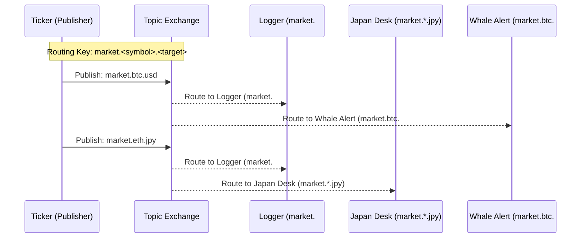

# RabbitMQ Workshop: Real-time Crypto Monitoring System with Topic Exchange

In this workshop, you will build a system that flexibly filters and processes real-time trade data using the powerful **Topic Exchange** feature of **RabbitMQ**.

## Goal

Build a monitoring system based on **Clean Architecture** with the following features.



**What you will learn in this workshop:**

1. **Pub/Sub Pattern**: Complete decoupling of senders and receivers.
2. **Topic Exchange**: Advanced routing using dot-separated keys.
3. **Wildcard Matching**: Using `*` (one word) and `#` (zero or more words).

---

## Challenges in Communication Design

Directly communicating between microservices (e.g., via HTTP) presents several issues.

### ❌ Challenges

- **Tight Coupling**: The sender must know "who receives the data," requiring code changes whenever a new consumer is added.
- **Fault Tolerance**: If the receiver is down, the sender's process may block or error out.
- **Scalability**: Receivers can be overwhelmed by sudden bursts of data (spikes).

### ✅ Message Queue (RabbitMQ) Solutions

- **Asynchronous Communication**: The sender simply drops a message into the queue and moves on, independent of the receiver's state.
- **Loose Coupling**: Senders only care about the "Exchange." RabbitMQ manages who gets the message.
- **Buffering**: Unprocessed messages wait in the queue, allowing consumers to process them at their own pace.

---

## Architecture

The system centers around a Topic Exchange that dynamically controls message destinations.

### Directory Structure

```text
infra/assets/rabbitmq_crypto/
├── cmd/                        # Entry points for each role
│   ├── ticker/                 # Data generation & distribution
│   ├── logger/                 # All-records logging
│   ├── alert/                  # Whale alert detection
│   └── japandesk/              # JPY monitoring
└── pkg/
    ├── domain/                 # Entities, Repository Interface
    ├── usecase/                # Simulation and Monitoring logic
    └── infra/                  # RabbitMQ Adapter
```

---

## Preparation

### 1. Start RabbitMQ (with Management Plugin)

```bash
cd infra/assets/rabbitmq_crypto
make mq-up
```

*Note: Access the management UI at [http://localhost:15672](http://localhost:15672) (guest/guest).*

### 2. Install Dependencies

```bash
go mod tidy
```

---

## Workshop Steps

### STEP 1: Stream Market Data (Ticker)

Start the `ticker` that continuously generates trade data.

```bash
go run cmd/ticker/main.go
```

*Note: It will keep publishing messages with keys like `market.btc.usd`.*

### STEP 2: Log All Transactions (Topic: `market.#`)

Use the `#` wildcard to subscribe to all currency pairs.

```bash
go run cmd/logger/main.go
```

### STEP 3: Conditional Filtering

Start consumers matching specific conditions in separate terminals.

- **JPY-pair only**: `go run cmd/japandesk/main.go` (Key: `market.*.jpy`)
- **Large BTC trades**: `go run cmd/alert/main.go` (Key: `market.btc.#`)

---

## Clean Architecture Highlights

The code communicates with RabbitMQ through an interface defined in `pkg/domain`.

```go
type TradePublisher interface {
    Publish(ctx context.Context, trade Trade) error
}
```

This design allows you to swap the broker for Kafka or NATS in the future by simply replacing the infrastructure implementation without touching the business logic (UseCase).

---

## Cleanup

```bash
make mq-down
```

---

## References

- [RabbitMQ Tutorial - Topic Exchange (Go)](https://www.rabbitmq.com/tutorials/tutorial-five-go.html)
- [AMQP 0-9-1 Model Explained](https://www.rabbitmq.com/tutorials/amqp-concepts.html)
