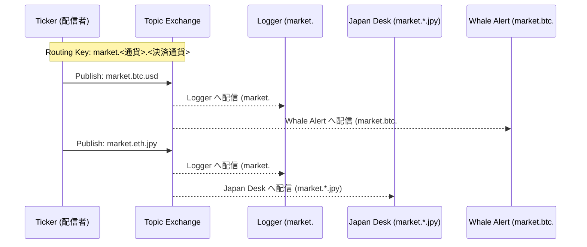

# RabbitMQ 実習：Topic Exchange で作るリアルタイム・仮想通貨監視システム

この実習では、メッセージブローカー **RabbitMQ** の強力な機能である **Topic Exchange** を使用して、リアルタイムに流れる取引データを柔軟にフィルタリング・処理するシステムを構築します。

## ゴール

以下の機能を備えた監視システムを **Clean Architecture** に基づいて構築します。



**この実習で習得すること:**

1. **Pub/Sub パターン**: 送信者と受信者の完全な分離。
2. **Topic Exchange**: ドット区切りのキーによる高度なルーティング。
3. **ワイルドカードのマッチング**: `*`（1 単語）と `#`（複数単語）の使い分け。

---

## 通信設計の課題

マイクロサービス間でデータをやり取りする際、直接 HTTP などで通信（同期通信）すると、様々な問題が発生します。

### ❌ 課題

- **密結合**: 送信側が「誰がデータを受け取るか」を知っている必要があり、受信者が増えるたびにコード修正が必要。
- **耐障害性**: 受信側がダウンしていると、送信側もエラーになり処理が止まる。
- **負荷分散**: 急激なデータ量の増加（スパイク）に耐えられず、受信側がパンクする。

### ✅ メッセージキュー (RabbitMQ) の解決策

- **非同期通信**: 送信側はキューに投げるだけで完了。受信側の状態に依存しない。
- **疎結合**: 送信側は「交換機（Exchange）」に投げるだけ。誰が受け取るかは RabbitMQ が管理。
- **バッファリング**: 未処理のメッセージはキューに溜まるため、受信側のペースで処理可能。

---

## アーキテクチャ

メッセージの宛先を動的に制御する Topic Exchange を中心に構成します。

### 想定ディレクトリ構造

```text
infra/assets/rabbitmq_crypto/
├── cmd/                        # 各ロールのエントリーポイント
│   ├── ticker/                 # 取引データの生成・配信
│   ├── logger/                 # 全件記録
│   ├── alert/                  # 大口アラート
│   └── japandesk/              # 日本円監視
└── pkg/
    ├── domain/                 # エンティティ、リポジトリ I/F
    ├── usecase/                # シミュレーション・監視ロジック
    └── infra/                  # RabbitMQ アダプター
```

---

## 準備

### 1. RabbitMQ の起動 (Management Plugin 付き)

```bash
cd infra/assets/rabbitmq_crypto
make mq-up
```

※ [http://localhost:15672](http://localhost:15672) (guest/guest) で管理画面を確認できます。

### 2. 依存ライブラリのインストール

```bash
go mod tidy
```

---

## 実習ステップ

### STEP 1: 市場データの配信 (Ticker)

取引データを生成し続ける `ticker` を起動します。

```bash
go run cmd/ticker/main.go
```

※ `market.btc.usd` などのキーでメッセージを投げ続けます。

### STEP 2: 全取引のロギング (Topic: `market.#`)

ワイルドカード `#` を使い、全通貨ペアを購読します。

```bash
go run cmd/logger/main.go
```

### STEP 3: 条件付きフィルタリング

特定の条件にマッチするコンシューマーを別ターミナルで起動します。

- **日本円建てのみ**: `go run cmd/japandesk/main.go` (Key: `market.*.jpy`)
- **Bitcoin の大口取引**: `go run cmd/alert/main.go` (Key: `market.btc.#`)

---

## クリーンアーキテクチャのポイント

本実習では、`pkg/domain` で抽象化されたインターフェースを使用しています。

```go
type TradePublisher interface {
    Publish(ctx context.Context, trade Trade) error
}
```

この設計により、将来的にメッセージブローカーを Kafka や NATS に変更する場合でも、ビジネスロジック（Usecase）を一切修正せずに、インフラ層の実装を差し替えるだけで対応可能です。

---

## 片付け

```bash
make mq-down
```

---

## 参考文献

- [RabbitMQ Tutorial - Topic Exchange (Go)](https://www.rabbitmq.com/tutorials/tutorial-five-go.html)
- [AMQP 0-9-1 Model Explained](https://www.rabbitmq.com/tutorials/amqp-concepts.html)
