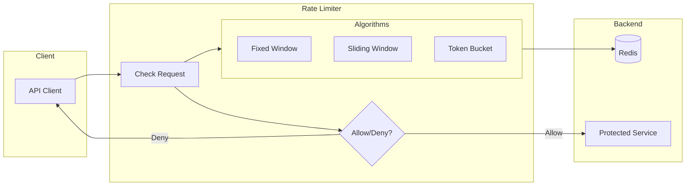
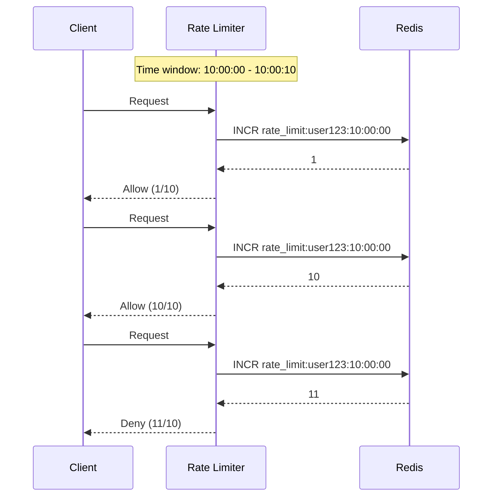
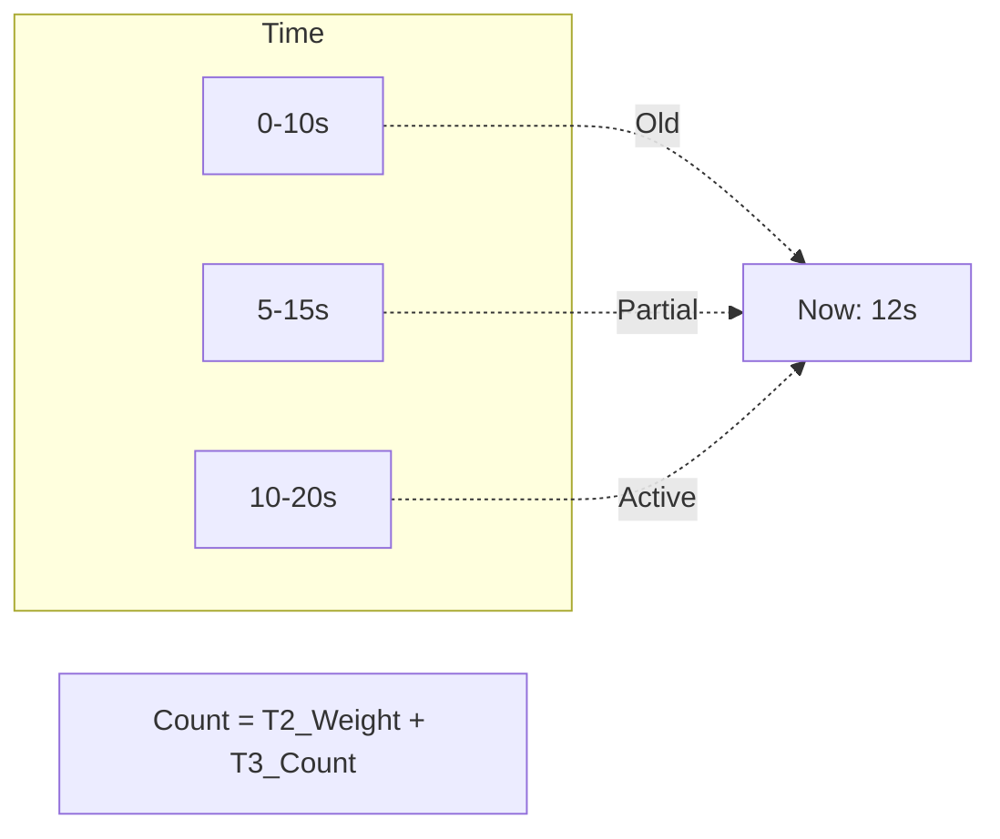
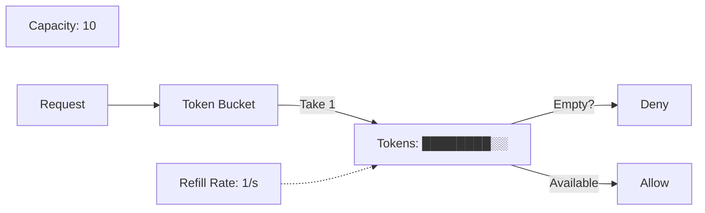

# Rate Limiting Workshop: Request Throttling with Redis

> **⏱️ Estimated Time**: Approx. 60 minutes

In this workshop, you will build a "Rate Limiting" system to prevent overload of APIs and Web services using Redis data structures.

> **💡 Glossary**: For technical terms such as [Rate Limiting](glossary_en.md#network), [Token Bucket](glossary_en.md#network), and [Sliding Window](glossary_en.md#network), please refer to the [Glossary](glossary_en.md).

## Implementation Code

The complete implementation for this workshop can be found in [`infra/assets/rate_limiting/`](assets/rate_limiting/).

```bash
cd infra/assets/rate_limiting
ls -la
# domain/  usecase/  infra/  main.go
```

## Goal

Implement multiple algorithms (Fixed Window, Sliding Window, Token Bucket) and understand their characteristics and use cases.



**What you will learn:**

1. **Fixed Window**: Simple, but suffers from request bursts at window boundaries.
2. **Sliding Window**: Smoother limiting, but with higher computational cost.
3. **Token Bucket**: Balance between burst tolerance and steady-state rate limiting.

---

## Challenges of Rate Limiting

Excessive requests to an API can impact the entire system.

### ❌ Challenges

- **Resource Exhaustion**: Database connections, CPU, and memory are used up.
- **Cascading Failures**: Impact spreads to downstream services.
- **Increased Costs**: Sudden spikes in pay-as-you-go cloud service fees.
- **Unfairness**: A few users monopolize resources.

### ✅ Rate Limiting Solutions

- **Protection**: Safeguard backend services from overload.
- **Fairness**: Provide equal access opportunities to all users.
- **Cost Management**: Predictable resource usage.

---

## Algorithm Comparison

### 1. Fixed Window



**Pros**: Memory efficient, easy to implement.
**Cons**: Traffic can double at window boundaries.

#### Boundary Spike Example

```text
Limit: 10 requests / 10 seconds

Time 00:09: 10 requests -> Allowed (Window 1: 0-10s)
Time 00:11: 10 requests -> Allowed (Window 2: 10-20s)

Result: 20 requests in 2 seconds = 2x the configured traffic!
```

Algorithms like Sliding Window or Token Bucket solve this issue.

### 2. Sliding Window



**Pros**: Smooth limiting, no spikes at boundaries.
**Cons**: Higher computational cost and memory usage.

### 3. Token Bucket



**Pros**: Allows bursts, flexible rate settings.
**Cons**: Complex parameter tuning.

---

## Architecture

### Target Directory Structure

```text
infra/assets/rate_limiting/
├── domain/         # Definition of limiting rules
├── usecase/        # Implementation of each algorithm
├── infra/          # Redis adapter
├── cmd/            # Test CLI
└── main.go         # Entry point
```

---

## Setup

### 1. Start Redis

```bash
# For Podman
podman run -d --name rate-limit-redis -p 6379:6379 docker.io/library/redis:alpine

# For Docker (alternative)
docker run -d --name rate-limit-redis -p 6379:6379 redis:alpine
```

### 2. Project Setup

```bash
cd infra/assets/rate_limiting
go mod tidy
```

### ✅ Checkpoint

- [ ] Confirmed Redis is running with `podman ps`

---

## Hands-on Steps

### STEP 1: Implement Fixed Window

Implement a counter per time window.

```bash
# Max 5 requests per 10 seconds
go run main.go -algorithm fixed-window -user user1 -limit 5 -window 10s
```

**Implementation Highlights:**

```go
// Redis key example: rate_limit:{userID}:{window_start}
// Dividing Unix time by windowSeconds ensures the same key is used within the same window
// Example: window=10s, both 10:00:05 and 10:00:08 result in the same key "rate_limit:user1:123456789"
key := fmt.Sprintf("rate_limit:%s:%d", userID, time.Now().Unix()/windowSeconds)
count, _ := redis.Incr(ctx, key).Result()
redis.Expire(ctx, key, windowDuration)
```

### ✅ Checkpoint

- [ ] Confirmed the 6th request is denied after 5 successes
- [ ] Confirmed it resets in the next time window

### STEP 2: Implement Sliding Window

Accurately count requests in the last N seconds.

```bash
# Max 5 requests in the last 10 seconds
go run main.go -algorithm sliding-window -user user2 -limit 5 -window 10s
```

**Implementation Highlights:**

```go
// Calculate weight of the previous window
now := time.Now().Unix()
oldWindowStart := now - windowSeconds
oldWindowCount := redis.Get(ctx, key(oldWindowStart))

// Calculate current count using linear interpolation
elapsed := now % windowSeconds
weightedOldCount := float64(oldWindowCount) * (1 - float64(elapsed)/float64(windowSeconds))
currentCount := weightedOldCount + currentWindowCount
```

### ✅ Checkpoint

- [ ] Confirmed smoother limiting compared to Fixed Window
- [ ] Confirmed no spikes at window boundaries

### STEP 3: Implement Token Bucket

Implement burstable rate limiting.

```bash
# Capacity 10, Refill rate 1/sec
go run main.go -algorithm token-bucket -user user3 -capacity 10 -rate 1
```

**Implementation Highlights:**

```go
// Calculate tokens from the last refill time
lastRefill := redis.Get(ctx, "last_refill:"+userID)
elapsed := now - lastRefill
tokensToAdd := elapsed * refillRate
currentTokens := min(capacity, previousTokens + tokensToAdd)

if currentTokens >= requestedTokens {
    // Consume tokens
    redis.Set(ctx, "tokens:"+userID, currentTokens - requestedTokens)
    return true
}
```

### ✅ Checkpoint

- [ ] Confirmed bursts (temporary large request volume) are allowed
- [ ] Confirmed rate limiting works in steady-state

### STEP 4: Algorithm Comparison

Compare the characteristics of each algorithm.

```bash
# Spike test at boundaries
for i in {1..20}; do
  curl -s http://localhost:8080/api?user=test
  sleep 0.5
done
```

| Algorithm      | Boundary Behavior | Memory Usage | CPU Usage | Burst Tolerance |
| :---           | :---              | :---         | :---      | :---            |
| Fixed Window   | Spikes possible   | Low          | Low       | No              |
| Sliding Window | Smooth            | High         | High      | No              |
| Token Bucket   | Smooth            | Medium       | Medium    | Yes             |

---

## Implementation Patterns

### Clean Architecture Configuration

**Domain (Interface Definition):**

```go
type RateLimiter interface {
    Allow(ctx context.Context, userID string) (bool, error)
    Reset(ctx context.Context, userID string) error
}
```

**Usecase (Algorithm Implementation):**

```go
type FixedWindowLimiter struct {
    redis  *redis.Client
    limit  int64
    window time.Duration
}

func (f *FixedWindowLimiter) Allow(ctx context.Context, userID string) (bool, error) {
    // Implementation...
}
```

**Infra (Redis Adapter):**

```go
type RedisRepository struct {
    client *redis.Client
}
```

---

## Cleanup

```bash
podman stop rate-limit-redis
podman rm rate-limit-redis
```

---

## References

- [Redis: INCR - Redis Documentation](https://redis.io/commands/incr/)
- [Rate Limiting Wikipedia](https://en.wikipedia.org/wiki/Rate_limiting)
- [Cloudflare: How to design a rate limiter](https://blog.cloudflare.com/counting-things-a-lot-of-things/)

---

## 🔧 Troubleshooting

### Rate Limiting Not Working Correctly

**Symptoms**: Requests are allowed even when exceeding limits.

**Causes and Solutions:**

- **Redis Key Conflict**: If multiple instances share Redis, review key design.
- **Clock Drift**: Check NTP synchronization in distributed environments.

### Sliding Window is Slow

**Symptoms**: Response delay.

**Causes and Solutions:**

- **Reduce Redis Commands**: Use Lua scripts to execute multiple commands atomically.

```lua
-- ratelimit_sliding.lua
local key = KEYS[1]
local now = tonumber(ARGV[1])
local window = tonumber(ARGV[2])
-- ... processing ...
```

---

## Environment-specific Notes

### macOS

You can also install Redis directly via Homebrew.

```bash
brew install redis
brew services start redis
```

### Windows

Recommended to run on Ubuntu via WSL2.
