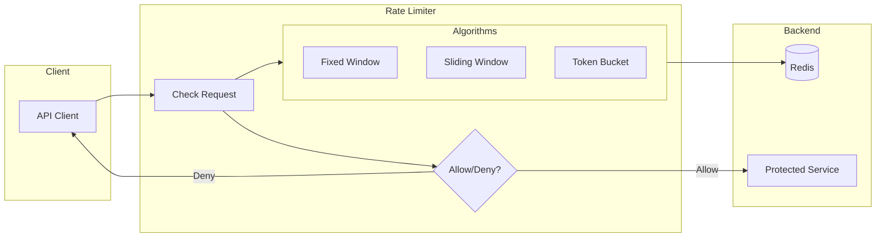
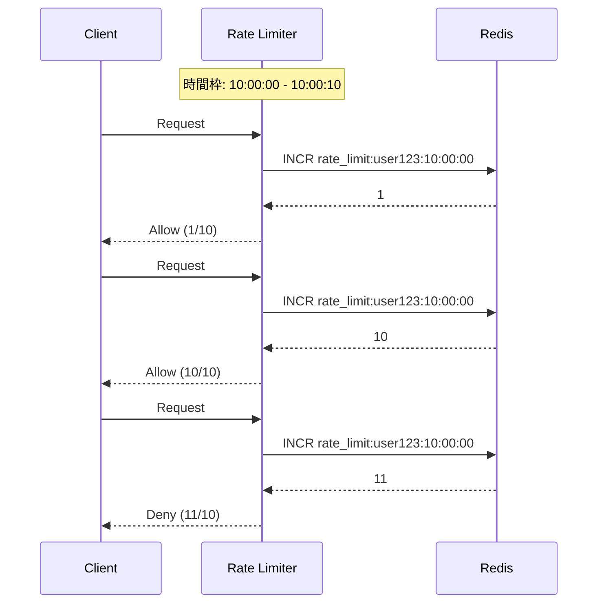
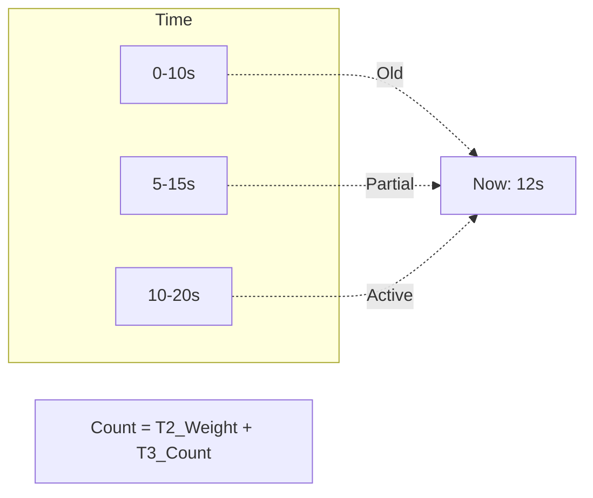
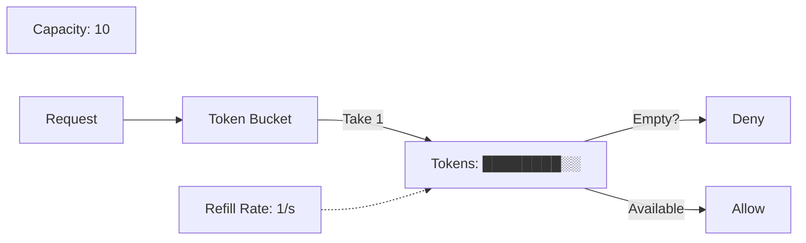

# Rate Limiting 実習：Redis で作るリクエスト制限

> **⏱️ 所要時間**: 約 60 分

この実習では、Redis のデータ構造を活用して、API や Web サービスの過負荷を防ぐ「レート制限（Rate Limiting）」システムを構築します。

> **💡 用語集**: この実習で登場する[Rate Limiting](glossary_ja.md#network)や[Token Bucket](glossary_ja.md#network)、[Sliding Window](glossary_ja.md#network)などの専門用語は [用語集](glossary_ja.md) を参照してください。

## 実装コード

この実習の完全な実装は [`infra/assets/rate_limiting/`](assets/rate_limiting/) にあります。

```bash
cd infra/assets/rate_limiting
ls -la
# domain/  usecase/  infra/  main.go
```

## ゴール

複数のアルゴリズム（固定窓、スライディング窓、トークンバケット）を実装し、それぞれの特性と使い分けを理解します。



**この実習で理解すること:**

1. **固定窓（Fixed Window）**: シンプルだが境界でリクエストが集中する問題。
2. **スライディング窓**: より滑らかな制限だが、計算コストが高い。
3. **トークンバケット**: バースト許容と定常レート制限のバランス。

---

## レート制限の課題

API に過度のリクエストが送られると、システム全体が影響を受けます。

### ❌ 課題

- **リソース枯渇**: データベース接続、CPU、メモリが使い果たされる。
- **カスケード障害**: 下流のサービスにも影響が広がる。
- **コスト増**: クラウドサービスの従量課金が急増する。
- **公平性**: 一部のユーザーがリソースを独占する。

### ✅ レート制限の解決策

- **保護**: バックエンドサービスを過負荷から守る。
- **公平性**: 全ユーザーに均等なアクセス機会を提供。
- **コスト管理**: 予測可能なリソース使用量。

---

## アルゴリズム比較

### 1. 固定窓（Fixed Window）



**利点**: メモリ効率が良い、実装が簡単。
**欠点**: 窓の境界でリクエストが集中する（2 倍のトラフィックが発生可能）。

#### 境界スパイク問題の具体例

```text
制限: 10リクエスト/10秒

時刻 00:09 に 10リクエスト → 許可（窓1: 0-10秒）
時刻 00:11 に 10リクエスト → 許可（窓2: 10-20秒）

結果: 2秒間に 20リクエスト = 設定の2倍のトラフィック！
```

この問題を解決するのがスライディング窓やトークンバケットです。

### 2. スライディング窓（Sliding Window）



**利点**: 滑らかな制限、境界でのスパイクがない。
**欠点**: 計算コストが高い、メモリ使用量が増える。

### 3. トークンバケット（Token Bucket）



**利点**: バースト許容、柔軟なレート設定。
**欠点**: 複雑なパラメータ調整。

---

## アーキテクチャ

### 想定ディレクトリ構造

```text
infra/assets/rate_limiting/
├── domain/         # 制限ルールの定義
├── usecase/        # 各アルゴリズムの実装
├── infra/          # Redis アダプター
├── cmd/            # テスト用 CLI
└── main.go         # エントリーポイント
```

---

## 準備

### 1. Redis の起動

```bash
# Podman の場合
podman run -d --name rate-limit-redis -p 6379:6379 docker.io/library/redis:alpine

# Docker の場合（読み替え）
docker run -d --name rate-limit-redis -p 6379:6379 redis:alpine
```

### 2. プロジェクトのセットアップ

```bash
cd infra/assets/rate_limiting
go mod tidy
```

### ✅ チェックポイント

- [ ] `podman ps` で Redis が起動していることを確認した

---

## 実習ステップ

### STEP 1: 固定窓（Fixed Window）の実装

時間枠ごとのカウンターを実装します。

```bash
# 10秒間に最大5リクエスト
go run main.go -algorithm fixed-window -user user1 -limit 5 -window 10s
```

**実装のポイント:**

```go
// Redis キーの例: rate_limit:{userID}:{window_start}
// Unix時間をwindowSecondsで割ることで、同じ時間枠内では同じキーになる
// 例: window=10s の場合、10:00:05 と 10:00:08 は同じキー "rate_limit:user1:123456789"
key := fmt.Sprintf("rate_limit:%s:%d", userID, time.Now().Unix()/windowSeconds)
count, _ := redis.Incr(ctx, key).Result()
redis.Expire(ctx, key, windowDuration)
```

### ✅ チェックポイント

- [ ] 5 リクエスト成功後、6 回目が拒否されることを確認した
- [ ] 次の時間枠でリセットされることを確認した

### STEP 2: スライディング窓の実装

直近 N 秒間のリクエスト数を正確にカウントします。

```bash
# 直近10秒間に最大5リクエスト
go run main.go -algorithm sliding-window -user user2 -limit 5 -window 10s
```

**実装のポイント:**

```go
// 直前の窓の重みを計算
now := time.Now().Unix()
oldWindowStart := now - windowSeconds
oldWindowCount := redis.Get(ctx, key(oldWindowStart))

// 線形補間で現在のカウントを計算
elapsed := now % windowSeconds
weightedOldCount := float64(oldWindowCount) * (1 - float64(elapsed)/float64(windowSeconds))
currentCount := weightedOldCount + currentWindowCount
```

### ✅ チェックポイント

- [ ] 固定窓よりも滑らかな制限が動作していることを確認した
- [ ] 窓の境界でのスパイクがないことを確認した

### STEP 3: トークンバケットの実装

バースト可能な制限を実装します。

```bash
# 容量10、補充レート1/秒
go run main.go -algorithm token-bucket -user user3 -capacity 10 -rate 1
```

**実装のポイント:**

```go
// 最終補充時刻からトークンを計算
lastRefill := redis.Get(ctx, "last_refill:"+userID)
elapsed := now - lastRefill
tokensToAdd := elapsed * refillRate
currentTokens := min(capacity, previousTokens + tokensToAdd)

if currentTokens >= requestedTokens {
    // トークンを消費
    redis.Set(ctx, "tokens:"+userID, currentTokens - requestedTokens)
    return true
}
```

### ✅ チェックポイント

- [ ] バースト（一時的な大量リクエスト）が許容されることを確認した
- [ ] 定常状態でレート制限が働いていることを確認した

### STEP 4: アルゴリズムの比較

各アルゴリズムの特性を比較テストします。

```bash
# 境界でのスパイクテスト
for i in {1..20}; do
  curl -s http://localhost:8080/api?user=test
  sleep 0.5
done
```

| アルゴリズム | 境界での挙動 | メモリ使用 | CPU 使用 | バースト許容 |
| :--- | :--- | :--- | :--- | :--- |
| 固定窓 | スパイクあり | 低 | 低 | なし |
| スライディング窓 | 滑らか | 高 | 高 | なし |
| トークンバケット | 滑らか | 中 | 中 | あり |

---

## 実装パターン

### Clean Architecture での構成

**Domain（インターフェース定義）:**

```go
type RateLimiter interface {
    Allow(ctx context.Context, userID string) (bool, error)
    Reset(ctx context.Context, userID string) error
}
```

**Usecase（アルゴリズム実装）:**

```go
type FixedWindowLimiter struct {
    redis  *redis.Client
    limit  int64
    window time.Duration
}

func (f *FixedWindowLimiter) Allow(ctx context.Context, userID string) (bool, error) {
    // 実装...
}
```

**Infra（Redis アダプター）:**

```go
type RedisRepository struct {
    client *redis.Client
}
```

---

## 片付け

```bash
podman stop rate-limit-redis
podman rm rate-limit-redis
```

---

## 参考文献

- [Redis: INCR - Redis Documentation](https://redis.io/commands/incr/)
- [Rate Limiting Wikipedia](https://en.wikipedia.org/wiki/Rate_limiting)
- [Cloudflare: How to design a rate limiter](https://blog.cloudflare.com/counting-things-a-lot-of-things/)

---

## 🔧 トラブルシューティング

### レート制限が正しく動作しない

**症状**: 設定した制限を超えてもリクエストが許可される

**原因と対処:**

- **Redis キーの競合**: 複数のインスタンスが同じ Redis を使用している場合、キー設計を見直してください
- **クロックのずれ**: 分散環境では NTP 同期を確認してください

### スライディング窓が遅い

**症状**: レスポンスが遅い

**原因と対処:**

- **Redis コマンド数削減**: Lua スクリプトで複数のコマンドをアトミックに実行してください

```lua
-- ratelimit_sliding.lua
local key = KEYS[1]
local now = tonumber(ARGV[1])
local window = tonumber(ARGV[2])
-- ... 処理 ...
```

---

## 環境別注意事項

### macOS の場合

Homebrew で Redis をインストールすることも可能です。

```bash
brew install redis
brew services start redis
```

### Windows の場合

WSL2 上の Ubuntu で Podman を使用することを推奨します。
