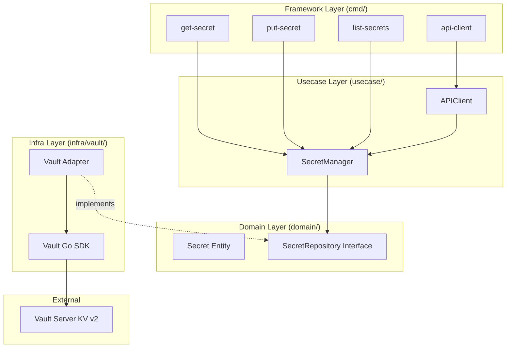

# Secret Management Workshop: Secure API Key Management with HashiCorp Vault

In this workshop, you will build a secure secret management system using **HashiCorp Vault** and **Go**, learning how to manage sensitive data without hardcoding it.

## Goal

Build and experience a secure secret management flow, acquiring the following skills:

- Understand why secret management is critical for security.
- Identify and avoid common anti-patterns (hardcoded credentials, .env files).
- Master HashiCorp Vault fundamentals (KV v2, tokens).
- Integrate Vault into applications using Clean Architecture.
- Implement secret versioning and rotation.

---

## Challenges in Secret Management (Anti-Patterns)

Before learning the right way, let's look at common mistakes and their risks.

### ❌ Anti-Pattern 1: Hardcoded Credentials

Writing credentials directly into the Git history.

- **Problem**: They remain in the history forever and are exposed to everyone with repository access.

### ❌ Anti-Pattern 2: Environment Variable Files (.env)

- **Problem**: Easy to accidentally commit to Git, and lacks an audit log of who accessed them.

### ✅ External Secret Manager Solutions

Using Vault provides centralized management, audit logs, encryption at rest, and automatic rotation.

---

## Architecture

We implement **Clean Architecture** with proper separation of concerns.



### Directory Structure

```text
infra/assets/secret_management/
├── cmd/                        # Entry points for operations
├── domain/                     # Pure Go definitions
├── usecase/                    # Orchestration of secret management
├── infra/                      # Vault adapter implementation
├── Makefile                    # Container management commands
└── go.mod
```

---

## Preparation

### 1. Start Vault

```bash
cd infra/assets/secret_management
make vault-up
```

### 2. Enable KV v2 Secrets Engine

```bash
# Initialize inside the container
make init
```

---

## Workshop Steps

### STEP 1: Identify Anti-Patterns

Look for hardcoded passwords in other workshop assets. Realize how terrifying it is that once committed, they stay in the history even if deleted later.

### STEP 2: Basic Secret Operations (Put/Get)

```bash
# Store
go run cmd/put-secret/main.go api/external-key "sk-live-abc123xyz789"
# Retrieve
go run cmd/get-secret/main.go api/external-key
```

### STEP 3: Practical Example - API Client

Verify the pattern of retrieving a key from Vault at startup and using it for a (simulated) API call.

```bash
go run cmd/api-client/main.go
```

### STEP 4: Versioning and Rotation

In Vault KV v2, writing a new value to the same key automatically increments the version.

```bash
# Update
go run cmd/put-secret/main.go api/key "new-value"
# Check history (using container command)
podman exec workshop-vault vault kv metadata get secret/api/key
```

### STEP 5: Understand the Architecture

Examine the `usecase` layer code and confirm it has zero dependencies on Vault (it only depends on the interface).

---

## Clean Architecture Highlights

The business logic doesn't care **"whether the secret is in Vault or AWS."** It retrieves secrets through abstract operations defined in `domain/repository.go`. This makes the system extremely resilient to infrastructure changes.

---

## Cleanup

```bash
make vault-down
```

---

## Next Steps

- **Dynamic Secrets**: Learn how to issue temporary database access on-demand.
- **Transit Secrets Engine**: Learn how to encrypt data without storing the decryption key in the application.
