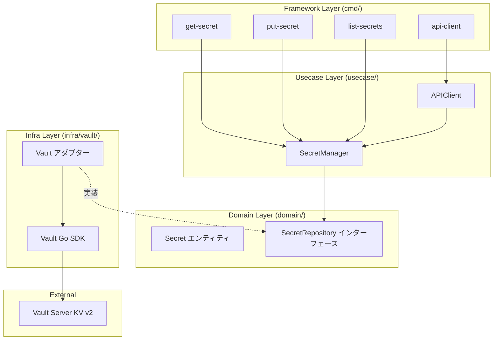

# シークレット管理実習：HashiCorp Vault による安全な API キー管理

この実習では、**HashiCorp Vault** と **Go** を使用して、API キー、データベース認証情報、その他のセンシティブデータをソースコードにハードコードすることなく安全に管理するシステムを構築します。

## ゴール

安全なシークレット管理フローを構築・体験し、以下のスキルを習得します。

- シークレット管理がなぜ重要かを理解する。
- 一般的なアンチパターン（ハードコード、.env ファイル）を識別・回避する。
- HashiCorp Vault の基本（KV v2、トークン）を習得。
- Clean Architecture を使用して Vault をアプリケーションに統合する。
- シークレットのバージョニングとローテーションを実装する。

---

## シークレット管理の課題（アンチパターン）

正しい方法を学ぶ前に、よくある間違いとそのリスクを確認します。

### ❌ アンチパターン 1：ハードコードされた認証情報

認証情報を Git 履歴に直接書き込む手法です。

- **問題点**: 履歴に永遠に残り、リポジトリへのアクセス権を持つ全員に露出します。

### ❌ アンチパターン 2：環境変数ファイル (.env)

- **問題点**: Git に誤ってコミットされやすく、誰がアクセスしたかの監査ログも残りません。

### ✅ 外部シークレットマネージャーの解決策

Vault を使うことで、中央集権的な管理、監査ログ、暗号化、自動ローテーションが実現します。

---

## アーキテクチャ

適切な関心の分離を持つ **Clean Architecture** を実装します。



### 想定ディレクトリ構造

```text
infra/assets/secret_management/
├── cmd/                        # 各操作のエントリーポイント
├── domain/                     # 純粋な Go による定義
├── usecase/                    # シークレット管理のオーケストレーション
├── infra/                      # Vault アダプターの実装
├── Makefile                    # コンテナ管理コマンド
└── go.mod
```

---

## 準備

### 1. Vault の起動

```bash
cd infra/assets/secret_management
make vault-up
```

### 2. KV v2 シークレットエンジンの有効化

```bash
# コンテナ内で初期化を実行
make init
```

---

## 実習ステップ

### STEP 1: アンチパターンの確認

他のワークショップ資産などで、パスワードがハードコードされている箇所がないか探してみましょう。一度コミットされると、後から消しても履歴に残る恐怖を実感してください。

### STEP 2: 基本的なシークレット操作 (Put/Get)

```bash
# 保存
go run cmd/put-secret/main.go api/external-key "sk-live-abc123xyz789"
# 取得
go run cmd/get-secret/main.go api/external-key
```

### STEP 3: 実践例 - API クライアント

起動時に Vault からキーを取得し、それを使って API 呼び出し（シミュレート）を行うパターンを確認します。

```bash
go run cmd/api-client/main.go
```

### STEP 4: バージョニングとローテーション

Vault KV v2 では、同じキーに新しい値を書き込むと自動的にバージョンが上がります。

```bash
# 更新
go run cmd/put-secret/main.go api/key "new-value"
# 履歴確認 (コンテナ内コマンド)
podman exec workshop-vault vault kv metadata get secret/api/key
```

### STEP 5: アーキテクチャの理解

`usecase` レイヤーのコードを見て、Vault への依存が一切ない（インターフェースにのみ依存している）ことを確認してください。

---

## クリーンアーキテクチャのポイント

ビジネスロジックは、**「シークレットが Vault にあるか AWS にあるか」**を気にしません。`domain/repository.go` で定義された抽象的な操作を通じてシークレットを取得します。これにより、インフラの変更に対して非常に堅牢なシステムになります。

---

## 片付け

```bash
make vault-down
```

---

## 次のステップ

- **動的シークレット**: データベースへの一時的なアクセス権限をオンデマンドで発行する機能を学ぶ。
- **Transit 認証**: アプリケーション側で復号鍵を持たずにデータを暗号化する仕組みを学ぶ。
