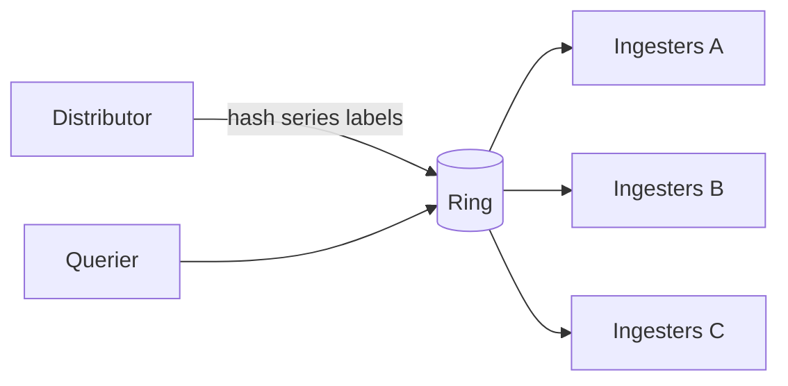

# Sharding Fundamentals: Sparse Table, Segment Tree, Elasticsearch, and Cortex

This guide explains practical sharding design for distributed systems and connects theory to production systems:

- **Elasticsearch** for index/data sharding
- **Cortex** for time-series ingestion/query sharding with a hash ring
- **Sparse Table** and **Segment Tree** as supporting data structures for shard-aware planning and balancing

## Goal

By reading this guide, you should be able to:

1. Choose a sharding strategy (hash/range/tenant-aware) based on workload shape.
2. Select a shard key that minimizes skew and cross-shard fan-out.
3. Understand where sparse tables and segment trees fit in sharded control planes.
4. Map sharding concepts to Elasticsearch and Cortex.
5. Understand the impact of Cortex PRs #7266 and #7270 on ring-control loops.

---

## Why Sharding Exists

A single node eventually hits limits in one or more dimensions:

- storage size
- write throughput
- query concurrency
- fault domain blast radius

Sharding splits data and traffic across nodes so the system can scale horizontally and recover from node loss without full outage.

---

## Common Sharding Strategies

### 1. Hash-based sharding

- Route by `hash(key) % N` (or consistent hashing ring).
- Usually best for write distribution.
- Risk: query fan-out when access patterns are not key-local.

### 2. Range-based sharding

- Route by key range (time range, lexicographic ID range, etc.).
- Efficient for range scans.
- Risk: hotspot shards when new writes cluster on one range.

### 3. Tenant-aware or domain-aware sharding

- Route by tenant, org, customer, or business domain.
- Useful for noisy-neighbor isolation and SLO boundaries.
- Risk: skew when tenants are very different in traffic volume.

---

## Shard Key Selection Framework

When selecting a shard key, evaluate these questions first:

1. What is the dominant operation: write-heavy, point read, or range scan?
2. What is the hot key risk: are a few IDs responsible for most traffic?
3. Can common queries be answered within one shard?
4. How often do entities move across keys (for example, user re-partition)?

Typical outcomes:

- write-heavy + uniform keys: hash sharding
- range scans by time: range or hybrid (time + hash suffix)
- multi-tenant SaaS: tenant-aware sharding, optionally with intra-tenant hash

Anti-patterns:

- shard key chosen from low-cardinality fields
- shard key unrelated to major query predicates
- no migration path defined for future re-sharding

---

## Consistent Hashing and Rehash Cost

Naive `hash(key) % N` remaps most keys when `N` changes. Consistent hashing reduces movement during scale-out/scale-in.

Practical options:

- token ring with virtual nodes
- rendezvous (highest-random-weight) hashing
- jump consistent hash for low-memory client-side routing

Operational notes:

- virtual nodes improve distribution smoothness
- replication factor must be considered with topology awareness
- scale events should be rate-limited to avoid cache churn and queue spikes

---

## Sparse Table vs Segment Tree in Sharded Systems

These are not sharding methods themselves. They are **auxiliary data structures** for fast routing and balancing decisions.

### Sparse Table (static range query)

- Best when underlying values are mostly immutable between rebuilds.
- Precompute range answers (commonly RMQ/min/max/GCD style).
- Query in `O(1)` for idempotent operations like min/max.
- Build in `O(n log n)` and updates are expensive.

Practical use:

- query planner snapshots with precomputed shard-latency minima
- read-heavy shard-selection policies updated in batch windows

### Segment Tree (dynamic range query)

- Best when values change continuously.
- Query and point update typically in `O(log n)`.
- Suitable for online balancing with frequent metric updates.

Practical use:

- live shard load tracking (QPS, p95/p99 latency, queue depth)
- fast “least loaded shard in range/window” decisions

### Rule of thumb

- Use **Sparse Table** when routing metadata is mostly static and query volume is high.
- Use **Segment Tree** when routing metadata is dynamic and update frequency is high.

---

## Hotspot Mitigation Patterns

### Write hotspots

- key salting (`user_id#bucket`)
- adaptive partitioning (split hot ranges)
- buffering and batch writes

### Read hotspots

- request coalescing / singleflight
- read replicas with bounded staleness
- edge/cache tiers with key-level TTL strategy

### Tenant hotspots

- shuffle sharding (isolate tenants to shard subsets)
- per-tenant quotas and fairness scheduling
- noisy-neighbor circuit breakers

---

## Rebalancing and Re-sharding

Re-sharding should be treated as a product feature, not an emergency action.

Safe migration patterns:

1. **Dual-write + read-from-old** phase.
2. Backfill historical data to new shard layout.
3. Read-compare (shadow reads) for consistency checks.
4. Switch reads to new layout.
5. Decommission old layout after verification window.

What to monitor during migration:

- cross-shard latency and fan-out count
- mismatch rate between old/new reads
- error budget burn rate
- queue depth and retry storm signals

---

## Query Fan-out Control

Cross-shard fan-out is often the hidden cost of sharding.

Reduction strategies:

- align shard key with dominant filter predicates
- add pre-aggregation indexes
- use routing hints (tenant, partition key, time window)
- execute two-phase queries (candidate shard discovery, then targeted fetch)

---

## Replication and Failure Domains

Sharding without replication gives scale but weak availability.

Design points:

- replication factor per data criticality tier
- zone-aware replica placement
- leader election and write quorum policy
- read semantics during partial failures (strong vs eventual)

---

## Example 1: Elasticsearch

Elasticsearch shards an index into **primary shards** (plus replicas). Writes and queries are routed to shards, then merged.

### How it maps to sharding concepts

- Default routing hashes routing value (by default `_id`) to choose primary shard.
- Search can fan out to many shards and then merge results.
- Hotspots appear when routing keys or write windows are uneven.

### Practical design tips

- use custom routing for tenant locality when applicable
- plan index lifecycle and shard size boundaries early
- reduce fan-out by constraining query time range and index pattern
- review shard imbalance regularly and rebalance proactively

---

## Example 2: Cortex

Cortex uses a **consistent-hash ring** for sharding and replication of time-series responsibilities across ingesters and ring-based components.

### How it maps to sharding concepts

- Hash-based sharding maps series to token ranges in the ring.
- Replication set assigns multiple ingesters for HA.
- Ring health and convergence speed directly affect ingestion/query stability.

### Practical Cortex-specific notes

- ring backend latency affects ownership propagation
- token movement should be controlled during rollouts
- shuffle-sharding style isolation can reduce tenant blast radius in multi-tenant environments

---

## Cortex PR Notes on Ring Watch Loop Optimization

### PR #7266

- URL: [cortexproject/cortex#7266](https://github.com/cortexproject/cortex/pull/7266)
- Title: `ring/kv/dynamodb: reuse timers in watch loops to avoid per-poll allocations`
- Status: **merged on February 16, 2026**
- Key changes:
  - Replaced repeated `time.After(...)` in DynamoDB watch loops with reusable `time.Timer`.
  - Added safe `resetTimer` behavior (stop + drain + reset).
  - Added benchmark file `pkg/ring/kv/dynamodb/client_timer_benchmark_test.go`.
- Reported benchmark result in PR:
  - `time.After`: about `248 B/op`, `3 allocs/op`
  - reusable timer: `0 B/op`, `0 allocs/op`

### PR #7270

- URL: [cortexproject/cortex#7270](https://github.com/cortexproject/cortex/pull/7270)
- Title: `[ENHANCEMENT] ring/backoff: reuse timers in lifecycler and backoff loops`
- Status: **open as of February 18, 2026**
- Key changes:
  - Extends timer reuse into `lifecycler`, `basic_lifecycler`, and `util/backoff`.
  - Introduces shared safe timer helpers in `pkg/ring/ticker.go`.
  - Includes a small DynamoDB CAS allocation improvement (`make(map..., len(buf))`).

### Why these matter for sharding

Ring watch/backoff/lifecycler loops run continuously in control-plane paths. Reducing per-iteration allocations lowers GC pressure and jitter, which helps keep shard ownership transitions and ring convergence stable under load.

---

## Practical Design Checklist

1. Pick shard key by access pattern first, not by schema aesthetics.
2. Define rebalancing strategy before production (split, migrate, throttle).
3. Add hotspot observability: per-shard QPS, p95/p99 latency, queue depth.
4. Track cross-shard fan-out and keep it within explicit SLO limits.
5. Separate control-plane stability from data-plane throughput budgets.
6. Use static vs dynamic metadata structures intentionally:
   - static-heavy: Sparse Table
   - update-heavy: Segment Tree

---

## References

- Elasticsearch routing and shards:
  - [Routing field](https://www.elastic.co/guide/en/elasticsearch/reference/current/mapping-routing-field.html)
  - [Clusters, nodes, and shards](https://www.elastic.co/docs/deploy-manage/distributed-architecture/clusters-nodes-shards)
- Cortex hash ring docs:
  - [Hash rings](https://cortexmetrics.io/docs/configuration/arguments/#hash-rings)
- Cortex PRs:
  - [PR #7266](https://github.com/cortexproject/cortex/pull/7266)
  - [PR #7270](https://github.com/cortexproject/cortex/pull/7270)
