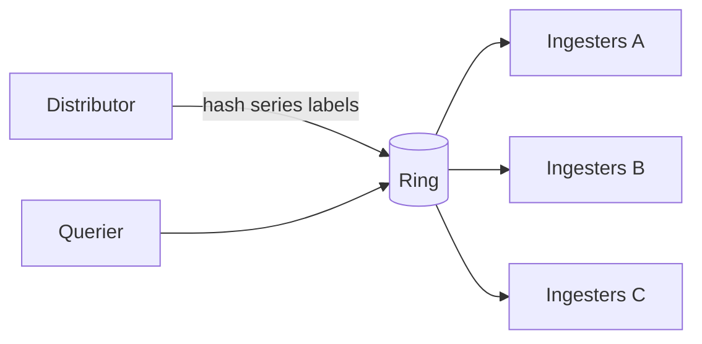

# Sharding Fundamentals: Sparse Table, Segment Tree, Elasticsearch, and Cortex

This document explains practical sharding design for distributed systems and connects theory to production systems:

- **Elasticsearch** for index/data sharding
- **Cortex** for time-series ingestion/query sharding with a hash ring
- **Sparse Table** and **Segment Tree** as supporting data structures for shard-aware query/load decisions

## Goal

By reading this guide, you should be able to:

1. Choose a sharding strategy (hash/range/tenant-aware) based on workload shape.
2. Understand where sparse tables and segment trees fit in a sharded control plane.
3. Map sharding concepts to Elasticsearch and Cortex.
4. Understand two Cortex PRs that optimize ring-related hot loops and why they matter operationally.

---

## Why Sharding Exists

A single node eventually hits limits in one or more dimensions:

- storage size
- write throughput
- query concurrency
- fault domain blast radius

Sharding splits data and traffic across nodes so the system can scale horizontally and recover from node loss without full outage.

---

## Common Sharding Strategies

### 1. Hash-based sharding

- Route by `hash(key) % N` (or consistent hashing ring).
- Usually best for write distribution.
- Risk: query fan-out when access patterns are not key-local.

### 2. Range-based sharding

- Route by key range (time range, lexicographic ID range, etc.).
- Efficient for range scans.
- Risk: hotspot shards when new writes cluster on one range.

### 3. Tenant-aware or domain-aware sharding

- Route by tenant, org, customer, or business domain.
- Useful for noisy-neighbor isolation and SLO boundaries.
- Risk: skew when tenants are very different in traffic volume.

---

## Sparse Table vs Segment Tree in Sharded Systems

These are not sharding methods themselves. They are **auxiliary data structures** for fast routing and balancing decisions.

### Sparse Table (static range query)

- Best when underlying values are mostly immutable between rebuilds.
- Precompute range answers (commonly RMQ/min/max/GCD style).
- Query in `O(1)` (for idempotent operations like min/max), build in `O(n log n)`, updates are expensive.

Practical sharding use:

- Query planner snapshots precomputed shard latency minima per fixed time bucket.
- Read-heavy routing decisions where data refresh can be batch/rebuild.

### Segment Tree (dynamic range query)

- Best when values change continuously.
- Query and point-update typically in `O(log n)`.
- Good for online balancing with frequent write-side metric updates.

Practical sharding use:

- Live shard load tracking (QPS, p99, queue depth) over ranges.
- Fast “least loaded shard in range/window” decisions during routing or rebalancing.

### Rule of thumb

- Use **Sparse Table** when your routing metadata is mostly static and query volume is high.
- Use **Segment Tree** when your routing metadata is dynamic and update frequency matters.

---

## Example 1: Elasticsearch

Elasticsearch shards an index into **primary shards** (plus replicas). Writes and queries are routed to shards, then merged.

### How it maps to sharding concepts

- Default routing uses a hash of routing value (by default, document `_id`) to choose a primary shard.
- Search typically fans out to relevant shards and merges per-shard results.
- Hotspot risk appears when routing keys or time-window writes are uneven.

### Operational patterns

- Use custom routing when tenant or domain locality is important.
- Watch for hot shards (high indexing pressure, uneven query load).
- Plan shard count/sizing early; changing primaries later requires operations like split/shrink/reindex.

---

## Example 2: Cortex

Cortex uses a **consistent-hash ring** for sharding and replication of time-series responsibilities across ingesters and other ring-based components.

### How it maps to sharding concepts

- Hash-based sharding: series are mapped to token ranges in the ring.
- Replication set: multiple ingesters can own each series for HA.
- Ring health/latency directly affects write availability and convergence behavior.

---

## Cortex PR Notes on Ring Watch Loop Optimization

### PR #7266

- URL: [cortexproject/cortex#7266](https://github.com/cortexproject/cortex/pull/7266)
- Title: `ring/kv/dynamodb: reuse timers in watch loops to avoid per-poll allocations`
- Status: **merged on February 16, 2026**
- Key changes:
  - Replaced repeated `time.After(...)` in DynamoDB watch loops with reusable `time.Timer`.
  - Added safe `resetTimer` behavior (stop + drain + reset).
  - Added benchmark file `pkg/ring/kv/dynamodb/client_timer_benchmark_test.go`.
- Reported benchmark result in PR:
  - `time.After`: about `248 B/op`, `3 allocs/op`
  - reusable timer: `0 B/op`, `0 allocs/op`

### PR #7270

- URL: [cortexproject/cortex#7270](https://github.com/cortexproject/cortex/pull/7270)
- Title: `[ENHANCEMENT] ring/backoff: reuse timers in lifecycler and backoff loops`
- Status: **open as of February 18, 2026**
- Key changes:
  - Extends timer reuse into `lifecycler`, `basic_lifecycler`, and `util/backoff`.
  - Introduces shared safe timer helpers in `pkg/ring/ticker.go`.
  - Includes a small DynamoDB CAS allocation improvement (`make(map..., len(buf))`).

### Why these matter for sharding

Ring watch/backoff/lifecycler loops run continuously in control-plane paths. Reducing per-iteration allocations lowers GC pressure and jitter, which helps keep shard ownership transitions and ring convergence stable under load.

---

## Practical Design Checklist

1. Pick shard key by access pattern first, not by schema aesthetics.
2. Define rebalancing strategy before production (split, migrate, throttle).
3. Add hotspot observability: per-shard QPS, p95/p99 latency, queue depth.
4. Separate control-plane stability from data-plane throughput budgets.
5. Use static vs dynamic metadata structures intentionally:
   - static-heavy: Sparse Table
   - update-heavy: Segment Tree

---

## References

- Elasticsearch routing and shards:
  - [Routing field](https://www.elastic.co/guide/en/elasticsearch/reference/current/mapping-routing-field.html)
  - [Clusters, nodes, and shards](https://www.elastic.co/docs/deploy-manage/distributed-architecture/clusters-nodes-shards)
- Cortex hash ring docs:
  - [Hash rings](https://cortexmetrics.io/docs/configuration/arguments/#hash-rings)
- Cortex PRs:
  - [PR #7266](https://github.com/cortexproject/cortex/pull/7266)
  - [PR #7270](https://github.com/cortexproject/cortex/pull/7270)
