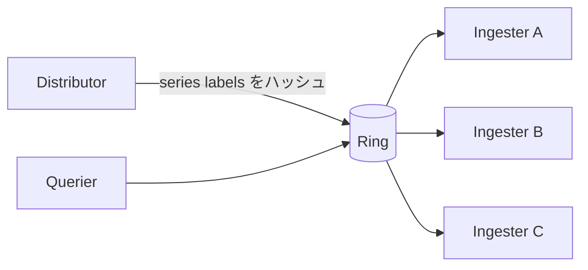

# シャーディング基礎: Sparse Table, Segment Tree, Elasticsearch, Cortex

このガイドは、分散システムにおける実践的なシャーディング設計を、次の実システムと結びつけて整理します。

- **Elasticsearch** におけるインデックス/データ分割
- **Cortex** におけるハッシュリングベースの時系列シャーディング
- シャード選択や負荷分散に使える補助データ構造としての **Sparse Table** と **Segment Tree**

## ゴール

この資料を読むことで、以下を判断できるようになることを目指します。

1. ワークロード形状に応じて戦略（hash/range/tenant-aware）を選べる。
2. スキューとクロスシャード fan-out を抑えるシャードキーを選べる。
3. シャーディング制御面で Sparse Table / Segment Tree の使い分けができる。
4. Elasticsearch と Cortex に概念を対応づけられる。
5. Cortex PR #7266 / #7270 がリング制御ループへ与える影響を説明できる。

---

## なぜシャーディングが必要か

単一ノードは、いずれ以下のどれかで限界に達します。

- 保存容量
- 書き込みスループット
- クエリ同時実行性
- 障害ドメインの広さ

シャーディングはデータとトラフィックを分割し、水平スケールと障害時の影響局所化を実現します。

---

## 代表的なシャーディング戦略

### 1. ハッシュベース

- `hash(key) % N`（または一貫性ハッシュリング）で振り分ける。
- 書き込み分散に強い。
- 主要アクセスがキー局所でないと fan-out が増えやすい。

### 2. レンジベース

- 時刻帯やID範囲など、キー範囲で振り分ける。
- 範囲検索に強い。
- 新規書き込みが一部レンジに集中するとホットシャード化しやすい。

### 3. テナント/ドメインベース

- tenant/org/customer などの境界で振り分ける。
- ノイジーネイバー対策やSLO分離に有効。
- テナント規模差が大きいと偏りやすい。

---

## シャードキー選定フレームワーク

シャードキー選定時は、まず以下を確認します。

1. 主体は write-heavy / point read / range scan のどれか。
2. ホットキーが生じるか（少数IDにアクセス集中するか）。
3. 代表クエリを単一シャードで完結できるか。
4. 将来の再分割でキー移動が頻繁に発生しないか。

よくある選択:

- 書き込み中心かつキー分布が均一: ハッシュ分割
- 時系列範囲検索中心: レンジ分割または time+hash のハイブリッド
- マルチテナントSaaS: テナント分割 + 必要に応じてテナント内ハッシュ

アンチパターン:

- 低カーディナリティ列をそのままシャードキー化
- 主要クエリ条件と無関係なキー選定
- 再シャーディング手順を設計せずに本番投入

---

## 一貫性ハッシュと再配置コスト

単純な `hash(key) % N` はノード数 `N` の変更時に大半キーが再配置されます。  
一貫性ハッシュは、スケール時の再配置量を抑えます。

実装パターン:

- 仮想ノード付きトークンリング
- Rendezvous (HRW) hashing
- 低メモリなクライアント側ルーティングに向く Jump Consistent Hash

運用上の要点:

- 仮想ノードは分布平滑化に有効
- レプリカ配置はトポロジ（ゾーン）を考慮
- スケールイベントはキャッシュミス急増を避けるため段階的に実行

---

## Sparse Table と Segment Tree の使い分け

これらはシャーディング方式そのものではなく、**シャード選択・負荷分散判断のための補助データ構造**です。

### Sparse Table（静的レンジクエリ向け）

- 値更新が少ないケースに向く。
- RMQ/min/max/GCD などを前計算して保持。
- min/max のような冪等演算ではクエリ `O(1)`。
- 構築 `O(n log n)`、更新は重い。

使いどころ:

- シャード遅延の最小値スナップショットを定期再構築
- 読み取り主体のルーティング判断

### Segment Tree（動的レンジクエリ向け）

- 値が継続的に変化するケースに向く。
- クエリ/一点更新ともに `O(log n)` が基本。
- メトリクス更新頻度が高いオンライン負荷分散に適する。

使いどころ:

- シャードごとのQPS / p95 / p99 / queue depth を動的管理
- 範囲内の低負荷シャード探索

### 実務上の目安

- ほぼ静的なメタデータ + 高クエリ頻度: **Sparse Table**
- 高頻度更新されるメタデータ: **Segment Tree**

---

## ホットスポット対策

### 書き込みホットスポット

- key salting（例: `user_id#bucket`）
- ホットレンジの自動分割
- バッファリングとバッチ書き込み

### 読み取りホットスポット

- リクエスト集約（singleflight）
- 許容遅延つきリードレプリカ
- キー特性に応じたTTL設計

### テナント偏り

- shuffle sharding によるテナント分離
- テナント別クォータと公平スケジューリング
- ノイジーネイバー用サーキットブレーカー

---

## リバランスと再シャーディング

再シャーディングは緊急対応ではなく、通常運用機能として設計します。

安全な移行パターン:

1. `dual-write + old read` を開始
2. 新配置へバックフィル
3. shadow read で整合性比較
4. read を新配置へ切替
5. 検証期間後に旧配置を廃止

移行時の監視項目:

- クロスシャード遅延と fan-out 数
- old/new 読み取り差分率
- エラーバジェット消費速度
- キュー深さとリトライ急増兆候

---

## クエリ fan-out 制御

シャーディングの隠れコストは fan-out です。

低減策:

- シャードキーを主要フィルタ条件に寄せる
- 事前集計インデックスを導入
- tenant/partition/time window などの routing hint を活用
- 二段階検索（候補シャード特定 -> 対象取得）

---

## レプリケーションと障害ドメイン

シャーディングのみでは可用性は十分ではありません。レプリケーション戦略を同時に設計します。

設計ポイント:

- データ重要度別レプリカ数
- ゾーン分散配置
- リーダー選出と書き込みクォーラム
- 部分障害時の読み取り整合性（strong / eventual）

---

## 例1: Elasticsearch

Elasticsearch はインデックスを **primary shards**（+ replica）へ分割し、書き込み/検索をシャード単位で処理して結果をマージします。

### 概念対応

- 既定ルーティングは（既定では `_id` の）ハッシュで primary shard を決定。
- 検索は多シャード fan-out + マージになりやすい。
- ルーティングキーや時系列偏りでホットシャードが発生しやすい。

### 実務上の設計ポイント

- テナント局所性が必要なら custom routing を検討
- シャードサイズとライフサイクルを早期に設計
- 時間範囲とインデックスパターンを絞って fan-out を抑制
- シャード偏りを定常的に監視し、先手で再配置

---

## 例2: Cortex

Cortex は **consistent hash ring** を使い、ingester などのリング対象コンポーネントへ時系列責務を分散します。

### 概念対応

- ハッシュ分割により series をトークン範囲へ割り当て
- 複数 ingester へのレプリケーションでHAを確保
- リング収束速度と健全性が ingestion/query 安定性へ直結

### Cortex運用の注意点

- ring backend の遅延は所有権伝播遅延に直結
- ロールアウト時のトークン移動量は制御が必要
- マルチテナントでは shuffle-sharding 的な隔離が有効

---

## Cortex PR（リング監視ループ最適化）

### PR #7266

- URL: [cortexproject/cortex#7266](https://github.com/cortexproject/cortex/pull/7266)
- タイトル: `ring/kv/dynamodb: reuse timers in watch loops to avoid per-poll allocations`
- 状態: **2026年2月16日にマージ済み**
- 変更点:
  - DynamoDB watch loop の `time.After(...)` を再利用可能 `time.Timer` に置換
  - 安全な `resetTimer`（stop + drain + reset）を導入
  - ベンチマーク `pkg/ring/kv/dynamodb/client_timer_benchmark_test.go` を追加
- PR記載のベンチ結果:
  - `time.After`: 約 `248 B/op`, `3 allocs/op`
  - reusable timer: `0 B/op`, `0 allocs/op`

### PR #7270

- URL: [cortexproject/cortex#7270](https://github.com/cortexproject/cortex/pull/7270)
- タイトル: `[ENHANCEMENT] ring/backoff: reuse timers in lifecycler and backoff loops`
- 状態: **2026年2月18日時点で open**
- 変更点:
  - `lifecycler`, `basic_lifecycler`, `util/backoff` へ timer 再利用を拡張
  - `pkg/ring/ticker.go` に安全な timer helper を共通化
  - DynamoDB CAS で `make(map..., len(buf))` による小さな割り当て最適化

### シャーディング観点での意義

ring watch/backoff/lifecycler は制御プレーンの常時ループです。  
反復ごとのメモリアロケーション削減は GC 圧とジッタを下げ、シャード所有権遷移とリング収束の安定化に寄与します。

---

## 実践チェックリスト

1. スキーマ都合ではなくアクセスパターンでシャードキーを決める。
2. 本番前に再分割手順（split/migrate/throttle）を定義する。
3. シャード単位のQPS/p95/p99/queue depthを監視する。
4. fan-out 指標に上限SLOを設定して追跡する。
5. 制御プレーン安定性とデータプレーン性能を分離して予算化する。
6. メタデータ更新特性で Sparse Table / Segment Tree を使い分ける。

---

## 参考リンク

- Elasticsearch routing / shard:
  - [Routing field](https://www.elastic.co/guide/en/elasticsearch/reference/current/mapping-routing-field.html)
  - [Clusters, nodes, and shards](https://www.elastic.co/docs/deploy-manage/distributed-architecture/clusters-nodes-shards)
- Cortex hash ring:
  - [Hash rings](https://cortexmetrics.io/docs/configuration/arguments/#hash-rings)
- Cortex PR:
  - [PR #7266](https://github.com/cortexproject/cortex/pull/7266)
  - [PR #7270](https://github.com/cortexproject/cortex/pull/7270)
