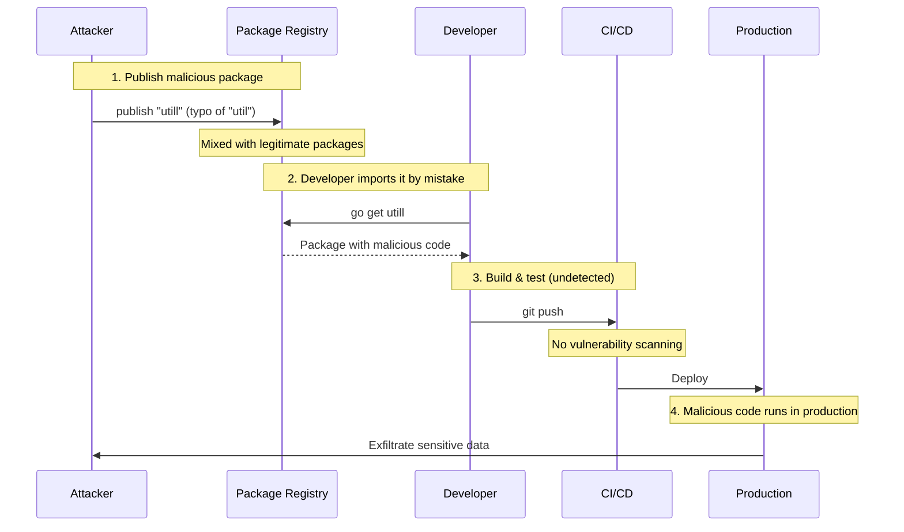
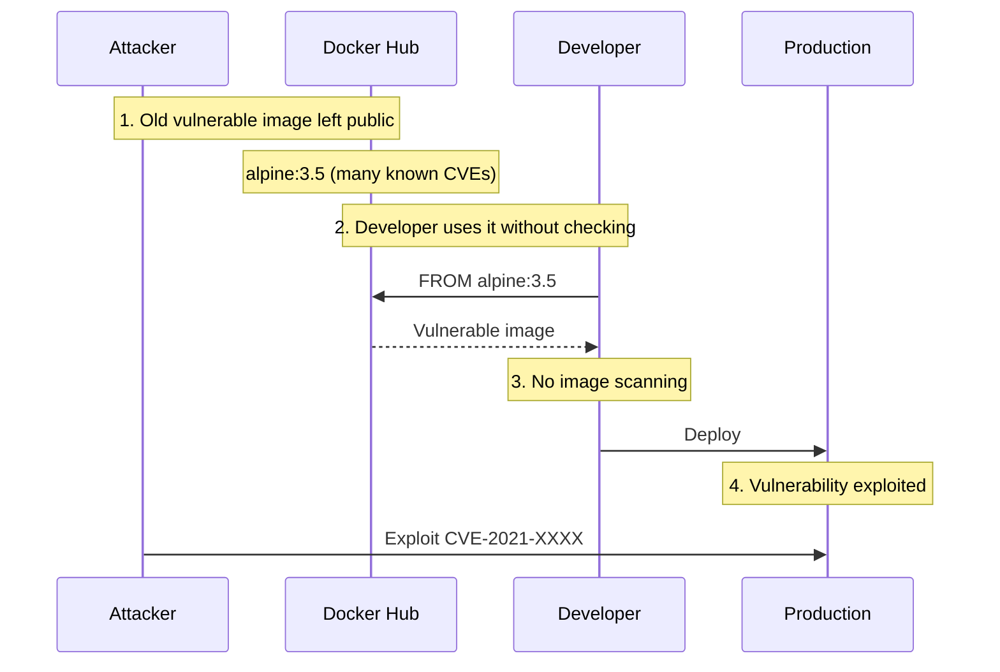
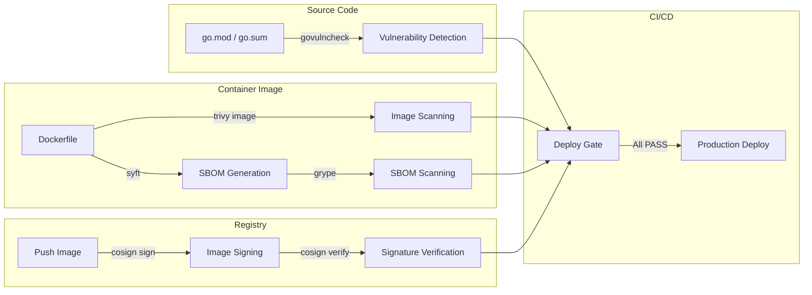

# Supply Chain Security Workshop: Dependency and Container Image Vulnerability Management

## Purpose

This workshop walks you through software supply chain attacks and teaches you to implement four layers of defense: dependency vulnerability detection, container image scanning, SBOM generation, and image signing/verification.

## Goals

- Understand how supply chain attacks work (dependency hijacking, base image poisoning).
- Detect known vulnerabilities in Go projects using `govulncheck`.
- Scan container images for vulnerabilities using `Trivy`.
- Generate and manage SBOMs (Software Bill of Materials).
- Sign and verify container images using `cosign`.
- Integrate these defenses into a CI/CD pipeline.

---

## Actors and Attack Flows

### Attack Pattern 1: Dependency Confusion / Typosquatting

An attacker publishes a malicious package with the same name or a similar name as a popular library. When developers accidentally import it, the supply chain is compromised.



### Attack Pattern 2: Base Image Poisoning

An attacker leverages an old, vulnerable base image that contains unpatched CVEs.



**Why is this dangerous?**

1. **Invisible dependencies**: Applications can have hundreds of transitive dependencies. Manually reviewing all of them is impossible.
2. **Chain of trust**: Base image → runtime → framework → library. One compromised link poisons the entire chain.
3. **Automated attacks**: Attackers can mass-publish malicious packages to registries automatically.

---

## Anti-Patterns and Solutions

| Vulnerability                       | ❌ Dangerous Practice                         | ✅ Safe Countermeasure                          |
| :---------------------------------- | :-------------------------------------------- | :---------------------------------------------- |
| **Dependency vulnerabilities**      | Importing libraries without checking          | Detect known vulnerabilities with `govulncheck` |
| **Container image vulnerabilities** | Using stale base images indefinitely          | Scan images with `Trivy` and keep them updated  |
| **Unknown components**              | No visibility into what an image contains     | Generate and manage SBOMs                       |
| **Image tampering**                 | Deploying images without verifying provenance | Sign and verify images with `cosign`            |
| **CI/CD blind spot**                | No security checks during build               | Integrate scanning into the CI pipeline         |

---

## Architecture

This workshop uses a deliberately vulnerable Go application and container image to practice defense at each stage of the supply chain.

### Directory Structure

```text
infra/assets/supply_chain/
├── main.go         # Go app using a deliberately vulnerable dependency
├── go.mod          # Contains a vulnerable version of x/crypto
├── go.sum
├── Dockerfile      # Uses a deliberately old base image
└── Makefile        # Scan commands
```

### Defense Layers Overview



---

## Setup

### 1. Install Tools

```bash
# macOS (Homebrew)
brew install trivy cosign syft grype

# govulncheck (Go extension)
go install golang.org/x/vuln/cmd/govulncheck@latest

# Verify installations
govulncheck -h
trivy --version
cosign version
syft version
grype version
```

### 2. Prepare Hands-On Files

```bash
cd infra/assets/supply_chain
go mod tidy
```

---

## Workshop Steps

### STEP 1: Dependency Vulnerability Detection (govulncheck)

Use Go's official `govulncheck` tool to detect known vulnerabilities (CVEs) in your project's dependencies.

**Instructions:**

1. Navigate to the `infra/assets/supply_chain/` directory.

2. Scan the source code.

   ```bash
   govulncheck ./...
   ```

3. Review the detected vulnerabilities.

   ```bash
   # Example output:
   # === Symbol Results ===
   #
   # Vulnerability #1: GO-2021-0113
   #     Vulnerable function is called in main.go:12
   #     Call chain: main → golang.org/x/crypto/ssh.Dial
   #
   # === Module Results ===
   #
   # Vulnerability #2: GO-2023-XXXX
   #     golang.org/x/crypto (version < 0.17.0)
   #     Upgrade to >= 0.17.0
   ```

**What is happening?**

```text
main.go:
  import "golang.org/x/crypto/ssh"
  ↓
go.mod:
  golang.org/x/crypto v0.13.0  ← vulnerable version
  ↓
govulncheck:
  Consults Go Vulnerability Database (https://vuln.go.dev)
  ↓
  GO-2023-XXXX: buffer overflow in x/crypto/ssh
  Impact: remote crash attack possible
  ↓
  Recommendation: upgrade to v0.17.0 or later
```

**Vulnerable code (main.go):**

```go
package main

import (
    "fmt"
    "golang.org/x/crypto/ssh"
)

func main() {
    // Deliberately uses a vulnerable version of x/crypto/ssh
    config := &ssh.ClientConfig{
        HostKeyCallback: ssh.InsecureIgnoreHostKey(), // ❌ Warning: no host key verification
    }
    fmt.Printf("SSH config: %+v\n", config)
}
```

**Vulnerable dependency (go.mod):**

```text
module example.com/vulnerable

go 1.21

require golang.org/x/crypto v0.13.0  // ❌ vulnerable version
```

**How to fix:**

```bash
# Update to a version that fixes the vulnerability
go get golang.org/x/crypto@latest
go mod tidy

# Re-scan to confirm no vulnerabilities detected
govulncheck ./...
```

---

### STEP 2: Container Image Scanning (Trivy)

Use `Trivy` to scan container images for vulnerabilities in OS packages and application libraries.

**Instructions:**

1. Build using a deliberately vulnerable base image.

   ```bash
   docker build -t vulnerable-app:latest .
   ```

2. Scan the image.

   ```bash
   trivy image vulnerable-app:latest
   ```

3. Review the results.

   ```bash
   # Example output:
   # vulnerable-app:latest (alpine 3.12.12)
   # ========================
   # Total: 15 (UNKNOWN: 0, LOW: 3, MEDIUM: 5, HIGH: 5, CRITICAL: 2)
   #
   # ┌──────────────┬───────────────┬──────────┬───────────────────┐
   # │   Library    │ Vulnerability  │ Severity │ Installed Version │
   # ├──────────────┼───────────────┼──────────┼───────────────────┤
   # │ musl         │ CVE-2020-XXXX │ CRITICAL │ 1.1.24-r2         │
   # │ libssl1.1    │ CVE-2021-XXXX │ HIGH     │ 1.1.1g-r0         │
   # └──────────────┴───────────────┴──────────┴───────────────────┘
   ```

4. Filter by severity.

   ```bash
   # Show only HIGH and CRITICAL
   trivy image --severity HIGH,CRITICAL vulnerable-app:latest

   # JSON output (for CI/CD integration)
   trivy image --format json --output results.json vulnerable-app:latest
   ```

**What is happening?**

```text
Dockerfile:
  FROM alpine:3.12  ← ❌ Released in 2020, many known CVEs
  ↓
docker build
  ↓
Trivy scan:
  1. Analyze image layers
  2. Extract OS package list (apk, dpkg, rpm)
  3. Detect language-specific dependencies (go.mod, package-lock.json, etc.)
  4. Match against vulnerability databases (GitHub Advisory, NVD, etc.)
  5. Report CVE / severity / fixed version
```

**Vulnerable Dockerfile:**

```dockerfile
# ❌ Vulnerable: Alpine 3.12 from 2020 (many known CVEs)
FROM alpine:3.12

# ❌ Vulnerable: no version pinning
RUN apk add --no-cache openssl

WORKDIR /app
COPY . .
RUN go build -o server main.go

CMD ["./server"]
```

**Secure Dockerfile:**

```dockerfile
# ✅ Secure: Pin to the latest stable version
FROM alpine:3.20

# ✅ Secure: Upgrade packages before installing
RUN apk add --no-cache --upgrade openssl

WORKDIR /app
COPY . .
RUN go build -o server main.go

CMD ["./server"]
```

**What Trivy scans:**

```text
Image layers
├── OS packages (apk, dpkg, rpm, apk)
├── Language dependencies (go.mod, package-lock.json, Pipfile, etc.)
├── Configuration files (IaC: Dockerfile, K8s manifests, CloudFormation)
└── Secrets (API keys, passwords, certificates)
```

---

### STEP 3: SBOM Generation and Inspection

An SBOM (Software Bill of Materials) is a complete inventory of all components in a container image. It enables rapid impact assessment when new vulnerabilities are disclosed.

**Instructions:**

1. Generate an SBOM from the image.

   ```bash
   # Generate SBOM with syft
   syft vulnerable-app:latest -o spdx-json > sbom.spdx.json

   # Human-readable format
   syft vulnerable-app:latest -o table
   ```

2. Review the SBOM contents.

   ```bash
   # Example output (table format):
   # [2024-01-15] ✔ Parsed image
   # [2024-01-15] ✔ Cataloged packages
   #
   # NAME         VERSION  TYPE
   # ca-certificates 20230506 apk
   # musl         1.1.24-r2 apk
   # openssl      1.1.1g-r0 apk
   # zlib         1.2.11-r3 apk
   ```

3. Scan the SBOM for vulnerabilities.

   ```bash
   # SBOM-based scanning with grype
   grype sbom:sbom.spdx.json

   # Fail on specific severity
   grype sbom:sbom.spdx.json --fail-on high
   ```

**What is happening?**

```text
Container image
  ↓ syft
SBOM (Software Bill of Materials)
  ├── Package name
  ├── Version
  ├── Type (apk, go-module, npm, etc.)
  ├── License
  └── CPE (Common Platform Enumeration)
  ↓ grype
Match against vulnerability database
  ↓
Report: vulnerable packages + CVE + severity + fix version
```

**Why SBOMs matter:**

```text
[Without SBOM]
New CVE announced: "libcurl has a vulnerability"
  ↓
Q: Which images are affected?
  → Must rebuild and scan every image
  → May take days

[With SBOM]
New CVE announced: "libcurl has a vulnerability"
  ↓
Q: Which images are affected?
  → Search SBOMs: grep "libcurl" sbom-*.json
  → Identify affected images in minutes
  → Rebuild only affected images
```

**SBOM formats:**

| Format     | Description               | Use Case           |
| :--------- | :------------------------ | :----------------- |
| SPDX       | Linux Foundation standard | Industry standard  |
| CycloneDX  | OWASP standard            | Security-focused   |
| syft-table | Human-readable format     | Development review |

**Using in Makefile:**

```makefile
.PHONY: sbom
sbom:
	syft $(IMAGE):$(TAG) -o spdx-json > sbom.spdx.json
	grype sbom:sbom.spdx.json --fail-on high
```

---

### STEP 4: Image Signing and Verification (cosign)

Use `cosign` to sign container images and verify their signatures before deployment, ensuring images have not been tampered with.

**Instructions:**

1. Tag the image locally (for demo purposes).

   ```bash
   docker tag vulnerable-app:latest demo-app:v1
   ```

2. Sign the image with cosign.

   ```bash
   # Generate a key pair (first time only)
   cosign generate-key-pair

   # Sign the image
   cosign sign --key cosign.key demo-app:v1
   ```

3. Verify the signature.

   ```bash
   cosign verify --key cosign.pub demo-app:v1
   ```

4. Confirm tampered image detection.

   ```bash
   # Replace with a different image
   docker tag alpine:latest demo-app:v1

   # Verification should fail
   cosign verify --key cosign.pub demo-app:v1
   # → Error: no matching signatures
   ```

**What is happening?**

```text
Developer:
  docker build -t registry.example.com/app:v1.2.3 .
  docker push registry.example.com/app:v1.2.3
  cosign sign --key cosign.key registry.example.com/app:v1.2.3
  ↓
Registry:
  Image:  registry.example.com/app:v1.2.3
  Signature: registry.example.com/app:sha256-xxx.sig  ← stored as a separate layer
  ↓
Production deploy:
  cosign verify --key cosign.pub registry.example.com/app:v1.2.3
  → Valid signature → Deploy allowed ✓
  → Invalid signature → Deploy rejected ✗ (possible tampering)
```

**Risk without signing:**

```text
Attacker:
  1. Compromises registry access
  2. Pushes malicious image under a legitimate tag
  docker push registry.example.com/app:v1.2.3  ← overwrite!
  ↓
Deploy:
  Production deploys the malicious image
```

**With signing:**

```text
Attacker:
  1. Compromises registry access
  2. Pushes malicious image under a legitimate tag
  ↓
Deploy:
  cosign verify → Signature mismatch → Deploy rejected ✓
  Attacker cannot create a valid signature without the private key
```

**Keyless Signing (Sigstore):**

```bash
# OIDC (GitHub, etc.) integrated keyless signing
cosign sign --keyless registry.example.com/app:v1.2.3

# Verify signer identity during verification
cosign verify \
  --certificate-identity developer@company.com \
  --certificate-oidc-issuer https://accounts.google.com \
  registry.example.com/app:v1.2.3
```

---

### STEP 5: Integrating into CI/CD Pipelines

Learn how to integrate the four defense layers into a CI/CD pipeline.

**Instructions:**

1. Review the Makefile scan targets.

   ```makefile
   # infra/assets/supply_chain/Makefile

   IMAGE ?= supply-chain-demo
   TAG  ?= latest

   .PHONY: vuln scan sbom sign verify all

   # Source code vulnerability scanning
   vuln:
   	govulncheck ./...

   # Container image scanning
   scan:
   	trivy image --severity HIGH,CRITICAL --exit-code 1 $(IMAGE):$(TAG)

   # SBOM generation and scanning
   sbom:
   	syft $(IMAGE):$(TAG) -o spdx-json > sbom.spdx.json
   	grype sbom:sbom.spdx.json --fail-on high

   # Image signing
   sign:
   	cosign sign --key cosign.key $(IMAGE):$(TAG)

   # Signature verification
   verify:
   	cosign verify --key cosign.pub $(IMAGE):$(TAG)

   # Run all checks
   all: vuln scan sbom verify
   	@echo "✓ All security checks passed"
   ```

2. Run all checks locally.

   ```bash
   make all
   ```

3. Review the CI/CD example (GitHub Actions).

   ```yaml
   # .github/workflows/security.yml
   name: Security Scan

   on: [push, pull_request]

   jobs:
     security:
       runs-on: ubuntu-latest
       steps:
         - uses: actions/checkout@v4

         - name: Go Vulnerability Check
           run: |
             go install golang.org/x/vuln/cmd/govulncheck@latest
             govulncheck ./...

         - name: Build Image
           run: docker build -t app:${{ github.sha }} .

         - name: Trivy Scan
           uses: aquasecurity/trivy-action@master
           with:
             image-ref: "app:${{ github.sha }}"
             severity: "HIGH,CRITICAL"
             exit-code: "1"

         - name: Generate SBOM
           run: |
             syft app:${{ github.sha }} -o spdx-json > sbom.spdx.json
             grype sbom:sbom.spdx.json --fail-on high
   ```

**CI/CD defense gates:**

```text
git push
  ↓
[Gate 1] govulncheck → vulnerabilities found → ✗ Stop
  ↓ pass
[Gate 2] docker build
  ↓
[Gate 3] trivy image → HIGH/CRITICAL found → ✗ Stop
  ↓ pass
[Gate 4] SBOM generation + grype → high risk found → ✗ Stop
  ↓ pass
[Gate 5] cosign sign (sign image)
  ↓
[Gate 6] cosign verify (verify signature)
  ↓ pass
Deploy to Production ✓
```

---

## Defense Checklist

| Item                                                          | Check |
| :------------------------------------------------------------ | :---- |
| Run `govulncheck` locally or in CI                            | □     |
| Scan container images with Trivy or similar tools             | □     |
| Pin base image versions (no `latest` tag)                     | □     |
| Generate and manage SBOMs                                     | □     |
| Sign and verify images with cosign                            | □     |
| Integrate security scanning into CI/CD pipelines              | □     |
| Enable automatic dependency updates (Dependabot/Renovate)     | □     |
| Define an incident response flow for detected vulnerabilities | □     |

---

## Advanced Topics

### Dependabot / Renovate for Automatic Updates

Automated dependency update tools create PRs when new versions are released.

```text
Dependabot (GitHub):
  1. Periodically checks for newer dependency versions
  2. Automatically creates a PR when a new version is found
  3. PR includes release notes and compatibility info
  4. Auto-merge possible when CI passes

Renovate (open source):
  - More advanced configuration than Dependabot
  - Supports grouping related updates together
  - Flexible auto-merge rules
```

### SLSA (Supply-chain Levels for Software Artifacts)

A framework for supply chain security proposed by Google.

```text
SLSA Levels:
  Level 1: Documented build process
  Level 2: Signed builds (provenance)
  Level 3: Hardened build platform (tamper resistance)
  Level 4: Hermetic, reproducible builds (two-party verification)
```

### in-toto for Supply Chain Verification

A framework to verify each step of the software supply chain.

```text
Source code → Build → Test → Package → Deploy
  ↓            ↓       ↓       ↓         ↓
  Signed       Signed  Signed  Signed    Signed
  ↓            ↓       ↓       ↓         ↓
  Layout ← ← ← ← ← ← ← ← ← ← ← ← ← ←
  (Records who did what, with what inputs/outputs, at each step)
```

---

## Post-Workshop Quiz

### Quiz

1. **What does `govulncheck` detect?**
   - <details><summary>Answer</summary>Known vulnerabilities (CVEs registered in the Go Vulnerability Database) in Go's standard library and third-party modules. It analyzes call chains and reports only the functions that are actually affected.</details>

2. **What is the problem with using `alpine:latest` in a Dockerfile?**
   - <details><summary>Answer</summary>The `latest` tag is mutable — different images may be used across builds. It may also pull in a version with unexpected breaking changes. Always pin a specific version (e.g., `alpine:3.20.0`).</details>

3. **In what scenario is an SBOM especially useful?**
   - <details><summary>Answer</summary>When a new CVE is announced, you can immediately identify which images and services are affected by searching the SBOM, instead of rebuilding and re-scanning every image.</details>

4. **What kind of attack does cosign image signing prevent?**
   - <details><summary>Answer</summary>It prevents image tampering or replacement via compromised registry access. Without the private key, an attacker cannot create a valid signature, so tampered images are detected during verification.</details>

5. **What are the benefits of integrating security scanning into CI/CD?**
   - <details><summary>Answer</summary>It eliminates human error (forgotten scans), automatically blocks vulnerable images from reaching production, and acts as an objective, independent security check separate from code review.</details>

---

## Troubleshooting

### Q: govulncheck detects nothing

**A:** Check the following:

- Run `go mod tidy` to ensure dependencies are up to date
- Verify that a vulnerable version is specified in go.mod
- Ensure you are using Go 1.21 or later

### Q: Trivy database update fails

**A:** Check the following:

- Verify internet connectivity
- If behind a proxy, set `TRIVY_DB_REPOSITORY`

  ```bash
  export TRIVY_DB_REPOSITORY=ghcr.io/aquasecurity/trivy-db
  ```

### Q: cosign sign errors

**A:** Check the following:

- Run `cosign generate-key-pair` first to create a key pair
- Ensure you have push access to the registry
- For local images, push to a registry before signing

---

## References

- [Go Vulnerability Database](https://vuln.go.dev/)
- [Trivy Documentation](https://aquasecurity.github.io/trivy/)
- [Sigstore / cosign](https://docs.sigstore.dev/)
- [SLSA Framework](https://slsa.dev/)
- [OWASP Supply Chain Security](https://owasp.org/www-project-software-supply-chain-maturity-model/)
- [Syft Documentation](https://github.com/anchore/syft)
- [Grype Documentation](https://github.com/anchore/grype)
