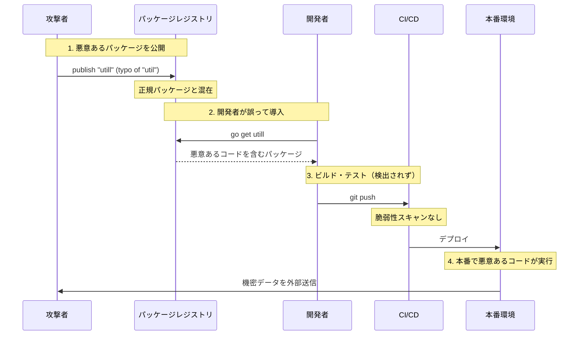
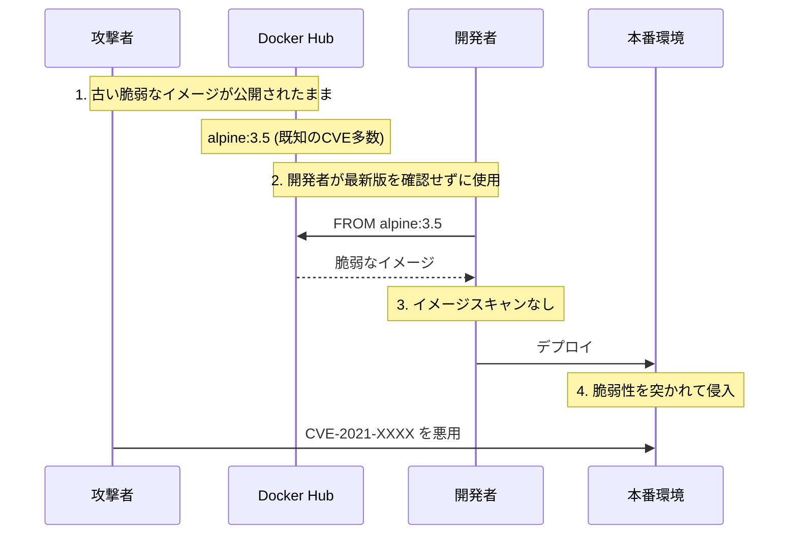
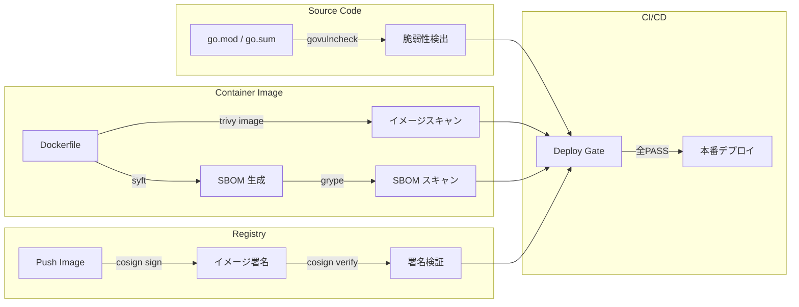

# サプライチェーンセキュリティ実習：依存ライブラリとコンテナイメージの脆弱性管理

## 目的

このワークショップでは、ソフトウェアサプライチェーンへの攻撃がどのように発生するかを体験し、依存ライブラリの脆弱性検出、コンテナイメージのスキャン、SBOM の生成、イメージ署名による信頼の検証という 4 つの防御レイヤーを実践的に学びます。

## ゴール

- ソフトウェアサプライチェーン攻撃の流れ（依存関係の乗っ取り、悪意あるイメージ混入）を理解する。
- `govulncheck` で Go プロジェクトの既知の脆弱性を検出する。
- `Trivy` でコンテナイメージの脆弱性をスキャンする。
- SBOM (Software Bill of Materials) を生成し、部品表の管理を体験する。
- `cosign` でコンテナイメージの署名と検証を行う。
- 各防御策を CI/CD パイプラインに組み込む方法を理解する。

---

## 登場人物と攻撃フロー

### 攻撃パターン 1: 依存ライブラリの乗っ取り (Dependency Confusion / Typosquatting)

攻撃者が人気ライブラリと同名または似た名前の悪意あるパッケージを公開し、開発者が誤って取り込むことでサプライチェーンが汚染されます。



### 攻撃パターン 2: ベースイメージの汚染 (Base Image Poisoning)

攻撃者が脆弱なまたは悪意あるコンテナイメージを公開し、それがベースイメージとして使われます。



**なぜこれが危険なのか？**

1. **見えない依存関係**: アプリケーションは数百の間接依存を持つことがあり、そのすべてを目視で確認することは不可能です。
2. **信頼の連鎖**: ベースイメージ → ランタイム → フレームワーク → ライブラリと信頼が連鎖し、一つの汚染が全体に波及します。
3. **自動化された攻撃**: 攻撃者はパッケージレジストリに自動的に悪意あるパッケージを大量公開できます。

---

## アンチパターンと解決策

|脆弱性|❌ 危険な実装|✅ 安全な対策|
|:---|:---|:---|
|**依存関係の脆弱性**|`go get` で確認せずライブラリを導入する|`govulncheck` で既知の脆弱性を検出する|
|**コンテナイメージの脆弱性**|古いベースイメージを使い続ける|`Trivy` でイメージをスキャンし、最新版を使う|
|**構成部品の不明**|イメージに何が含まれているか把握していない|SBOM を生成し、部品表を管理する|
|**イメージの改ざん**|イメージの出所を検証せずにデプロイする|`cosign` で署名・検証する|
|**CI/CD の盲点**|ビルド時にセキュリティチェックをしない|CI パイプラインにスキャンを組み込む|

---

## アーキテクチャ

この実習では、意図的に脆弱な Go アプリケーションとコンテナイメージを使用して、サプライチェーンの各段階での防御を体験します。

### ディレクトリ構造

```text
infra/assets/supply_chain/
├── main.go         # 意図的に脆弱な依存関係を使った Go アプリ
├── go.mod          # 脆弱なバージョンの依存関係を含む
├── go.sum
├── Dockerfile      # 意図的に古いベースイメージを使用
└── Makefile        # スキャン実行コマンド群
```

### 防御レイヤー全体図



---

## 準備

### 1. ツールのインストール

```bash
# macOS (Homebrew)
brew install trivy cosign syft grype

# govulncheck (Go 拡張)
go install golang.org/x/vuln/cmd/govulncheck@latest

# 動作確認
govulncheck -h
trivy --version
cosign version
syft version
grype version
```

### 2. ハンズオンファイルの準備

```bash
cd infra/assets/supply_chain
go mod tidy
```

---

## 実習ステップ

### STEP 1: 依存ライブラリの脆弱性検出 (govulncheck) ～ソースコードの検査～

Go の公式ツール `govulncheck` を使って、プロジェクトが依存するライブラリの既知の脆弱性（CVE）を検出します。

**実施手順:**

1. `infra/assets/supply_chain/` ディレクトリに移動します。

2. ソースコードをスキャンします。

   ```bash
   govulncheck ./...
   ```

3. 検出された脆弱性の一覧を確認します。

   ```bash
   # 出力例:
   # === Symbol Results ===
   #
   # Vulnerability #1: GO-2021-0113
   #     Vulnerable function is called in main.go:12
   #     Call chain: main → golang.org/x/crypto/ssh.Dial
   #
   # === Module Results ===
   #
   # Vulnerability #2: GO-2023-XXXX
   #     golang.org/x/crypto (version < 0.17.0)
   #     Upgrade to >= 0.17.0
   ```

**何が起きているのか？**

```text
main.go:
  import "golang.org/x/crypto/ssh"
  ↓
go.mod:
  golang.org/x/crypto v0.13.0  ← 脆弱なバージョン
  ↓
govulncheck:
  Go脆弱性データベース (https://vuln.go.dev) を参照
  ↓
  GO-2023-XXXX: x/crypto/ssh のバッファオーバーフロー
  影響: リモートからのクラッシュ攻撃が可能
  ↓
  推奨: v0.17.0 以上にアップグレード
```

**脆弱なコード (main.go):**

```go
package main

import (
    "fmt"
    "golang.org/x/crypto/ssh"
)

func main() {
    // 脆弱なバージョンの x/crypto/ssh を使用
    config := &ssh.ClientConfig{
        HostKeyCallback: ssh.InsecureIgnoreHostKey(), // ❌ 警告: ホスト鍵を検証しない
    }
    fmt.Printf("SSH config: %+v\n", config)
}
```

**脆弱な依存関係 (go.mod):**

```text
module example.com/vulnerable

go 1.21

require golang.org/x/crypto v0.13.0  // ❌ 脆弱なバージョン
```

**修正方法:**

```bash
# 脆弱性を修正したバージョンに更新
go get golang.org/x/crypto@latest
go mod tidy

# 再スキャンで検出されないことを確認
govulncheck ./...
```

---

### STEP 2: コンテナイメージのスキャン (Trivy) ～イメージの検査～

`Trivy` を使って、コンテナイメージに含まれる OS パッケージとアプリケーションライブラリの脆弱性をスキャンします。

**実施手順:**

1. 意図的に脆弱なベースイメージを使ってビルドします。

   ```bash
   # 古い Alpine イメージでビルド
   docker build -t vulnerable-app:latest .
   ```

2. イメージをスキャンします。

   ```bash
   trivy image vulnerable-app:latest
   ```

3. 検出結果を確認します。

   ```bash
   # 出力例:
   # vulnerable-app:latest (alpine 3.12.12)
   # ========================
   # Total: 15 (UNKNOWN: 0, LOW: 3, MEDIUM: 5, HIGH: 5, CRITICAL: 2)
   #
   # ┌──────────────┬───────────────┬──────────┬───────────────────┐
   # │   Library    │ Vulnerability  │ Severity │ Installed Version │
   # ├──────────────┼───────────────┼──────────┼───────────────────┤
   # │ musl         │ CVE-2020-XXXX │ CRITICAL │ 1.1.24-r2         │
   # │ libssl1.1    │ CVE-2021-XXXX │ HIGH     │ 1.1.1g-r0         │
   # └──────────────┴───────────────┴──────────┴───────────────────┘
   ```

4. 深刻度でフィルタします。

   ```bash
   # HIGH と CRITICAL のみ表示
   trivy image --severity HIGH,CRITICAL vulnerable-app:latest

   # JSON 形式で出力 (CI/CD で利用)
   trivy image --format json --output results.json vulnerable-app:latest
   ```

**何が起きているのか？**

```text
Dockerfile:
  FROM alpine:3.12  ← ❌ 2020 年リリース、既知の CVE 多数
  ↓
docker build
  ↓
Trivy スキャン:
  1. イメージのレイヤーを解析
  2. OS パッケージリストを取得 (apk, dpkg, rpm)
  3. 言語固有の依存関係を検出 (go.mod, package-lock.json 等)
  4. 脆弱性データベース (GitHub Advisory, NVD 等) と照合
  5. CVE / 深刻度 / 修正バージョン を報告
```

**脆弱な Dockerfile:**

```dockerfile
# ❌ 脆弱: 2020 年の Alpine 3.12 (既知の CVE が多数)
FROM alpine:3.12

# ❌ 脆弱: 最新版を指定していない
RUN apk add --no-cache openssl

WORKDIR /app
COPY . .
RUN go build -o server main.go

CMD ["./server"]
```

**安全な Dockerfile:**

```dockerfile
# ✅ 安全: 最新の安定版をピン留め
FROM alpine:3.20

# ✅ 安全: パッケージを最新版に更新してからインストール
RUN apk add --no-cache --upgrade openssl

WORKDIR /app
COPY . .
RUN go build -o server main.go

CMD ["./server"]
```

**Trivy のスキャン対象:**

```text
イメージレイヤー
├── OS パッケージ (apk, dpkg, rpm, apk)
├── 言語依存関係 (go.mod, package-lock.json, Pipfile, etc.)
├── 設定ファイル (IaC: Dockerfile, K8s manifest, CloudFormation)
└── 機密情報 (API キー, パスワード, 証明書)
```

---

### STEP 3: SBOM (Software Bill of Materials) の生成と検査 ～部品表の管理～

SBOM はコンテナイメージに含まれる全コンポーネントの「部品表」です。どのバージョンのどのライブラリが含まれているかを可視化し、新しい脆弱性が発見された際に迅速な影響調査を可能にします。

**実施手順:**

1. イメージから SBOM を生成します。

   ```bash
   # syft で SBOM を生成
   syft vulnerable-app:latest -o spdx-json > sbom.spdx.json

   # より読みやすい形式
   syft vulnerable-app:latest -o table
   ```

2. SBOM の内容を確認します。

   ```bash
   # 出力例 (table 形式):
   # [2024-01-15] ✔ Parsed image
   # [2024-01-15] ✔ Cataloged packages
   #
   # NAME         VERSION  TYPE
   # ca-certificates 20230506 apk
   # musl         1.1.24-r2 apk
   # openssl      1.1.1g-r0 apk
   # zlib         1.2.11-r3 apk
   ```

3. SBOM を使って脆弱性スキャンします。

   ```bash
   # grype で SBOM ベースのスキャン
   grype sbom:sbom.spdx.json

   # 特定の深刻度のみ
   grype sbom:sbom.spdx.json --fail-on high
   ```

**何が起きているのか？**

```text
コンテナイメージ
  ↓ syft
SBOM (Software Bill of Materials)
  ├── パッケージ名
  ├── バージョン
  ├── 種別 (apk, go-module, npm, etc.)
  ├── ライセンス
  └── CPE (Common Platform Enumeration)
  ↓ grype
脆弱性データベースと照合
  ↓
レポート: 脆弱なパッケージ + CVE + 深刻度 + 修正版
```

**SBOM がなぜ重要なのか？**

```text
[SBOM がない場合]
新規 CVE 発表: "libcurl に脆弱性"
  ↓
Q: どのイメージが影響を受ける？
  → 全イメージをビルドし直してスキャンする必要がある
  → 数日かかる場合も

[SBOM がある場合]
新規 CVE 發表: "libcurl に脆弱性"
  ↓
Q: どのイメージが影響を受ける？
  → SBOM を検索: grep "libcurl" sbom-*.json
  → 数分で影響範囲を特定
  → 該当イメージのみ再ビルド
```

**SBOM のフォーマット:**

|フォーマット|説明|用途|
|:---|:---|:---|
|SPDX|Linux Foundation 標準|業界標準|
|CycloneDX|OWASP 標準|セキュリティ重視|
|syft-table|人間が読みやすい形式|開発時の確認|

**Makefile での利用:**

```makefile
.PHONY: sbom
sbom:
	syft $(IMAGE):$(TAG) -o spdx-json > sbom.spdx.json
	grype sbom:sbom.spdx.json --fail-on high
```

---

### STEP 4: イメージの署名と検証 (cosign) ～出所の保証～

`cosign` でコンテナイメージに署名し、デプロイ前にその署名を検証することで、イメージが改ざんされていないことを確認します。

**実施手順:**

1. ローカルレジストリにイメージをタグ付けます（デモ用）。

   ```bash
   # デモ用のローカルタグ
   docker tag vulnerable-app:latest demo-app:v1
   ```

2. cosign でイメージを署名します。

   ```bash
   # 鍵ペアの生成 (初回のみ)
   cosign generate-key-pair

   # イメージの署名
   # ※ ローカルイメージの場合は COSIGN_FLAGS を調整
   cosign sign --key cosign.key demo-app:v1
   ```

3. 署名を検証します。

   ```bash
   cosign verify --key cosign.pub demo-app:v1
   ```

4. 改ざんされたイメージの検出を確認します。

   ```bash
   # イメージを変更（タグだけ変えて別イメージを用意）
   docker tag alpine:latest demo-app:v1

   # 署名検証が失敗することを確認
   cosign verify --key cosign.pub demo-app:v1
   # → Error: no matching signatures
   ```

**何が起きているのか？**

```text
開発者:
  docker build -t registry.example.com/app:v1.2.3 .
  docker push registry.example.com/app:v1.2.3
  cosign sign --key cosign.key registry.example.com/app:v1.2.3
  ↓
レジストリ:
  イメージ: registry.example.com/app:v1.2.3
  署名:     registry.example.com/app:sha256-xxx.sig  ← 別レイヤーとして保存
  ↓
本番デプロイ時:
  cosign verify --key cosign.pub registry.example.com/app:v1.2.3
  → 署名が有効 → デプロイ許可 ✓
  → 署名が無効 → デプロイ拒絶 ✗ (改ざんの可能性)
```

**署名がない場合のリスク:**

```text
攻撃者:
  1. レジストリへのアクセス権を奪取
  2. 悪意あるイメージを正規タグで push
  docker push registry.example.com/app:v1.2.3  ← 上書き!
  ↓
デプロイ:
  本番環境が悪意あるイメージをデプロイしてしまう
```

**署名がある場合:**

```text
攻撃者:
  1. レジストリへのアクセス権を奪取
  2. 悪意あるイメージを正規タグで push
  ↓
デプロイ:
  cosign verify → 署名が一致しない → デプロイ拒絶 ✓
  攻撃者は秘密鍵を持っていないため、署名を作れない
```

**Keyless 署名 (Sigstore):**

```bash
# OIDC (GitHub 等) と連携した鍵レス署名
cosign sign --keyless registry.example.com/app:v1.2.3

# 検証時に署名者の ID も確認
cosign verify \
  --certificate-identity developer@company.com \
  --certificate-oidc-issuer https://accounts.google.com \
  registry.example.com/app:v1.2.3
```

---

### STEP 5: CI/CD パイプラインへの組み込み ～自動化された防御～

これまでの 4 つの防御レイヤーを CI/CD パイプラインに組み込む方法を学びます。

**実施手順:**

1. Makefile にスキャンターゲットを定義します。

   ```makefile
   # infra/assets/supply_chain/Makefile

   IMAGE ?= supply-chain-demo
   TAG  ?= latest

   .PHONY: vuln scan sbom sign verify all

   # ソースコードの脆弱性スキャン
   vuln:
   	govulncheck ./...

   # コンテナイメージのスキャン
   scan:
   	trivy image --severity HIGH,CRITICAL --exit-code 1 $(IMAGE):$(TAG)

   # SBOM 生成とスキャン
   sbom:
   	syft $(IMAGE):$(TAG) -o spdx-json > sbom.spdx.json
   	grype sbom:sbom.spdx.json --fail-on high

   # イメージ署名
   sign:
   	cosign sign --key cosign.key $(IMAGE):$(TAG)

   # 署名検証
   verify:
   	cosign verify --key cosign.pub $(IMAGE):$(TAG)

   # 全チェック実行
   all: vuln scan sbom verify
   	@echo "✓ All security checks passed"
   ```

2. ローカルで全チェックを実行します。

   ```bash
   make all
   ```

3. CI/CD (GitHub Actions 例) を確認します。

   ```yaml
   # .github/workflows/security.yml
   name: Security Scan

   on: [push, pull_request]

   jobs:
     security:
       runs-on: ubuntu-latest
       steps:
         - uses: actions/checkout@v4

         - name: Go Vulnerability Check
           run: |
             go install golang.org/x/vuln/cmd/govulncheck@latest
             govulncheck ./...

         - name: Build Image
           run: docker build -t app:${{ github.sha }} .

         - name: Trivy Scan
           uses: aquasecurity/trivy-action@master
           with:
             image-ref: 'app:${{ github.sha }}'
             severity: 'HIGH,CRITICAL'
             exit-code: '1'

         - name: Generate SBOM
           run: |
             syft app:${{ github.sha }} -o spdx-json > sbom.spdx.json
             grype sbom:sbom.spdx.json --fail-on high
   ```

**CI/CD パイプラインでの防御ゲート:**

```text
git push
  ↓
[Gate 1] govulncheck → 脆弱性あり → ✗ Stop
  ↓ pass
[Gate 2] docker build
  ↓
[Gate 3] trivy image → HIGH/CRITICAL あり → ✗ Stop
  ↓ pass
[Gate 4] SBOM 生成 + grype → 高リスクあり → ✗ Stop
  ↓ pass
[Gate 5] cosign sign (署名)
  ↓
[Gate 6] cosign verify (検証)
  ↓ pass
Deploy to Production ✓
```

---

## 防御策チェックリスト

|項目|チェック|
|:---|:---|
|`govulncheck` をローカルまたは CI で実行しているか|□|
|コンテナイメージをスキャンしているか (Trivy 等のツール)|□|
|ベースイメージのバージョンをピン留めしているか|□|
|SBOM を生成・管理しているか|□|
|イメージの署名と検証を行っているか|□|
|CI/CD パイプラインにセキュリティスキャンを組み込んでいるか|□|
|依存関係の自動更新 (Dependabot/Renovate) を導入しているか|□|
|脆弱性が検出された際の対応フローが定義されているか|□|

---

## 発展的なトピック

### Dependabot / Renovate による自動更新

依存関係の自動更新ツールは、新しいバージョンがリリースされた際に自動的に PR を作成します。

```text
Dependabot (GitHub):
  1. 依存関係の最新版を定期的にチェック
  2. 新しいバージョンがある場合、自動的に PR を作成
  3. PR にはリリースノートと互換性情報を含む
  4. CI が pass すれば自動マージも可能

Renovate (オープンソース):
  - Dependabot より高度な設定が可能
  - グループ化 (関連する更新をまとめる) に対応
  - Auto-merge ルールの設定が柔軟
```

### SLSA (Supply-chain Levels for Software Artifacts)

Google が提唱するサプライチェーンセキュリティのフレームワークです。

```text
SLSA Levels:
  Level 1: ビルドプロセスの文書化
  Level 2: ビルドの署名 (出所の証明)
  Level 3: ビルド環境の保護 (改ざん防止)
  Level 4: ビルドの再現性 (二つの独立したプラットフォームで同一結果)
```

### in-toto によるサプライチェーン検証

ソフトウェアサプライチェーンの各ステップを検証するフレームワークです。

```text
ソースコード → ビルド → テスト → パッケージング → デプロイ
  ↓            ↓         ↓          ↓              ↓
  署名         署名      署名       署名            署名
  ↓            ↓         ↓          ↓              ↓
  部品表 ← ← ← ← ← ← ← ← ← ← ← ← ← ← ← ← ← ←
  (各ステップの実行者、入力、出力を記録)
```

---

## 演習後の理解度確認

### 確認クイズ

1. **govulncheck は何を検出しますか？**
   - <details><summary>解答</summary>Go の標準ライブラリとサードパーティモジュールの既知の脆弱性（Go Vulnerability Database に登録された CVE）を検出します。呼び出しチェーンを解析し、実際に影響を受ける関数のみを報告します。</details>

2. **コンテナイメージで `alpine:latest` を使うことの問題は何ですか？**
   - <details><summary>解答</summary>`latest` タグは可変であり、ビルドごとに異なるイメージが使われる可能性があります。また、意図せず破壊的変更が含まれるバージョンに更新されるリスクがあります。具体的なバージョン (例: `alpine:3.20.0`) をピン留めすべきです。</details>

3. **SBOM はどのような場面で特に有用ですか？**
   - <details><summary>解答</summary>新しい脆弱性 (CVE) が発表された際に、どのイメージ・サービスが影響を受けるかを SBOM から即座に特定できるためです。全イメージを再スキャンしなくても、SBOM の検索で影響範囲を数分で把握できます。</details>

4. **cosign によるイメージ署名は、どのような攻撃を防ぎますか？**
   - <details><summary>解答</summary>レジストリへの不正アクセスによるイメージの改ざん・差し替えを防ぎます。攻撃者が秘密鍵を持っていなければ、正規の署名を作成できないため、検証時に改ざんを検出できます。</details>

5. **CI/CD パイプラインにセキュリティスキャンを組み込むメリットは何ですか？**
   - <details><summary>解答</summary>人的ミス（スキャンのし忘れ）を防ぎ、脆弱性を含むイメージが本番環境にデプロイされることを自動的に阻止できるためです。また、コードレビューとは独立した客観的なチェックとして機能します。</details>

---

## トラブルシューティング

### Q: govulncheck が何も検出しない

**A:** 以下を確認してください：

- `go mod tidy` を実行して依存関係が最新の状態か
- 脆弱なバージョンを go.mod に指定しているか
- Go 1.21 以降を使用しているか

### Q: Trivy のデータベース更新に失敗する

**A:** 以下を確認してください：

- インターネット接続があるか
- プロキシ環境の場合は `TRIVY_DB_REPOSITORY` を設定

  ```bash
  export TRIVY_DB_REPOSITORY=ghcr.io/aquasecurity/trivy-db
  ```

### Q: cosign sign でエラーになる

**A:** 以下を確認してください：

- `cosign generate-key-pair` で鍵ペアを生成済みか
- レジストリへの push 権限があるか
- ローカルイメージの場合は、レジストリに push してから署名する必要がある

---

## 参考文献

- [Go Vulnerability Database](https://vuln.go.dev/)
- [Trivy Documentation](https://aquasecurity.github.io/trivy/)
- [Sigstore / cosign](https://docs.sigstore.dev/)
- [SLSA Framework](https://slsa.dev/)
- [OWASP Supply Chain Security](https://owasp.org/www-project-software-supply-chain-maturity-model/)
- [Syft Documentation](https://github.com/anchore/syft)
- [Grype Documentation](https://github.com/anchore/grype)
