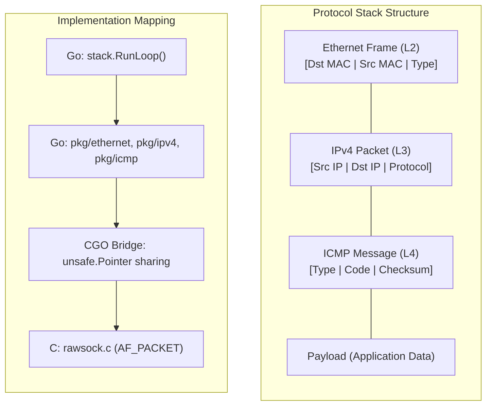

# TCP/IP Protocol Stack Workshop: Building the "Soul of Communication" from Scratch

In this workshop, you will combine Go and C to **build a TCP/IP protocol stack from the ground up**. By implementing the "packet generation and decomposition" that OS kernels usually hide, you will understand network principles not as abstract concepts, but as concrete data structures.

---

## 🏗 Architecture: Russian Doll (Encapsulation)

The essence of network communication is "Encapsulation." Higher-layer data is wrapped as the "payload" of lower layers.



---

## 🛠 Preparation

This workshop requires **Linux (Ubuntu 22.04/24.04 recommended)** as it involves low-level Raw Socket operations.

### 1. Required Tools
```bash
sudo apt update && sudo apt install -y golang-go gcc tcpdump wireshark iproute2
```

### 2. Creating a "Safe" Sandbox (Network Namespace)

**Mental Model for SWEs: "Network-specific isolation containers and virtual LAN cables"**

When developing with Raw Sockets, sending incorrect packets risks confusing the host OS routing table or cutting off existing communication. To avoid this, we use Linux **Network Namespaces (netns)** to build a "dedicated sandbox" logically isolated from the host OS.

- **veth (Virtual Ethernet)**: A "virtual LAN cable" with two endpoints. By plugging one end into the host and the other into the isolation space (Namespace), we can safely communicate.
- **ip netns**: A feature that isolates the network stack (Routing Table, ARP Table, Iptables, etc.) for each process.

```bash
# 1. Create an isolated "sandbox" (Namespace: workshop)
sudo ip netns add workshop

# 2. Create a virtual LAN cable (veth) with endpoints veth-host and veth-ns
sudo ip link add veth-host type veth peer name veth-ns

# 3. Move one end (veth-ns) to the isolation space
sudo ip link set veth-ns netns workshop

# 4. Bring both interfaces up (link up)
sudo ip link set veth-host up
sudo ip netns exec workshop ip link set veth-ns up

# 5. Assign IP addresses. Set .1 for host side and .2 for namespace side
sudo ip addr add 192.168.100.1/24 dev veth-host
sudo ip netns exec workshop ip addr add 192.168.100.2/24 dev veth-ns
```

> **Note:** In the subsequent exercises, you will start the stack on the `veth-host` interface. This allows you to experiment without affecting the communication of the host OS's primary interfaces like `eth0`.

---

## 🚀 Implementation Steps

The source code is located in `infra/assets/tcpip_stack`. Let's explore each layer's responsibility.

### STEP 1: Bypassing the Kernel (Raw Socket)
Normal applications use `TCP/UDP Sockets`, but the OS automatically generates L2/L3 headers for them. In our custom stack, we use **AF_PACKET** to read/write "raw data" directly from the NIC.

- **C Implementation**: `pkg/rawsock/rawsock.c`
  - Opens `socket(AF_PACKET, SOCK_RAW, ...)` and sets the NIC to promiscuous mode.
- **Go Bindings**: `pkg/rawsock/rawsock.go`
  - Uses `unsafe.Pointer` to pass packet data between C and Go with minimal memory copying.

### STEP 2: Ethernet Layer (L2)
Controls communication with physically adjacent devices based on MAC addresses.

- **Implementation File**: `pkg/ethernet/frame.go`
- **Key Concepts**: 
  - **Endianness**: Converting between Network Byte Order (Big Endian) and Host Byte Order.
  - **Padding**: Ethernet frames must be at least 60 bytes (including header). We pad with `0` if it's shorter.

### STEP 3: IPv4 Layer (L3)
Handles routing and packet integrity using IP addresses.

- **Implementation File**: `pkg/ipv4/packet.go`
- **Key Concepts**:
  - **Checksum Calculation**: 16-bit ones' complement sum to verify IP header integrity.
  - **IHL (Internet Header Length)**: Handling variable header lengths due to IP options.

### STEP 4: ICMP (L4) / Ping Implementation
Implement the protocol used for network diagnostics and make it respond to `ping`.

- **Implementation File**: `pkg/icmp/message.go`
- **Key Concepts**:
  - **Echo Request/Reply**: Logic to create a Reply while maintaining the Request's ID and Seq.

---

## 🧪 Testing: Interacting with Your Stack

### 1. Start the Stack
Specify the interface inside the Namespace.
```bash
cd infra/assets/tcpip_stack
go build -o tcpip_stack main.go
# Start the custom stack on the host side of the veth pair
sudo ./tcpip_stack -iface veth-host
```

### 2. Communicate from the "External" (Namespace)
From another terminal, ping the stack from inside the namespace.
```bash
sudo ip netns exec workshop ping 192.168.100.1
```

### 3. Observe Packets
Use `tcpdump` to verify your headers are correctly flowing through the network.
```bash
sudo tcpdump -i veth-host -nn -vv icmp
```

---

## 💡 Deep Dives for SWEs

1. **Pursuit of Zero-Copy**: Why should we avoid `make([]byte)` copies when passing data through CGO?
2. **State Machine Design**: We used ICMP (Stateless) here, but how would you manage Goroutines for retransmission timers and window control in a TCP (Stateful) implementation?
3. **Security**: What are the risks if a process opening a Raw Socket is compromised, and how can we minimize privileges using `CAP_NET_RAW`?

---

## 🧹 Cleanup

Delete the isolated environment used in the workshop.

```bash
# Delete the veth pair and Namespace
sudo ip link delete veth-host
sudo ip netns delete workshop
```

If using the Makefile:
```bash
make teardown-env
```

---

## 📚 References
- [RFC 791 (IPv4)](https://datatracker.ietf.org/doc/html/rfc791)
- [RFC 792 (ICMP)](https://datatracker.ietf.org/doc/html/rfc792)
- [TCP/IP Illustrated, Vol. 1](https://en.wikipedia.org/wiki/TCP/IP_Illustrated)
