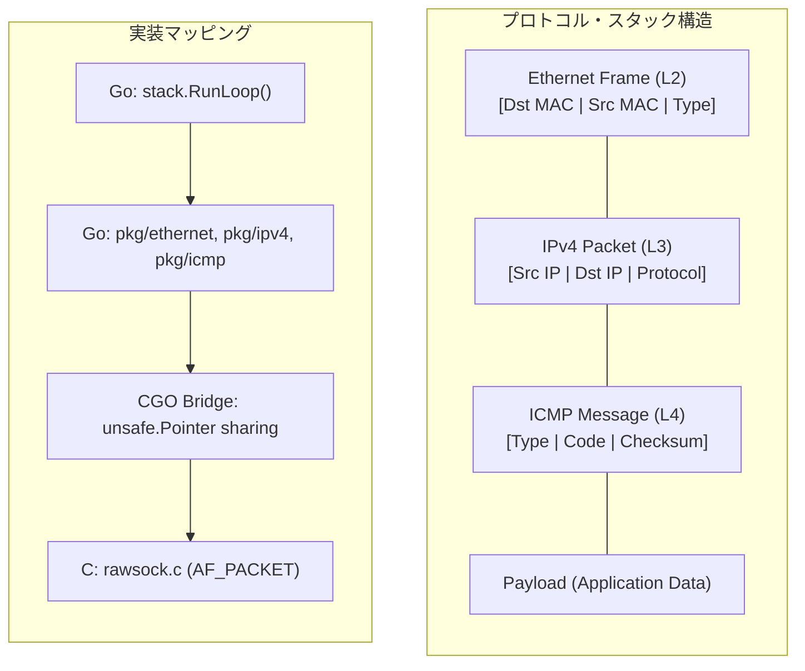

# TCP/IP プロトコルスタック実習：スクラッチから構築する「通信の正体」

この実習では、Go と C を組み合わせて **TCP/IP プロトコルスタックをゼロから構築** します。OS カーネルが隠蔽している「パケットの生成・分解」を自らの手で実装することで、ネットワークの動作原理を抽象概念ではなく、具体的なデータ構造として理解することを目標とします。

---

## 🏗 アーキテクチャ：ロシアの入れ子人形（カプセル化）

ネットワーク通信の本質は「カプセル化」です。上位レイヤーのデータが下位レイヤーの「ペイロード」として包まれていく構造を、Mermaid 図で視覚化します。



---

## 🛠 開発環境の準備

本実習は、低レベルな Raw Socket 操作を伴うため、**Linux (Ubuntu 22.04/24.04 推奨)** 環境が必須です。

### 1. 必要なツール
```bash
sudo apt update && sudo apt install -y golang-go gcc tcpdump wireshark iproute2
```

### 2. 「安全な」実験場の作成 (Network Namespace)

**SWEのためのメンタルモデル： 「ネットワーク専用の隔離コンテナと、仮想LANケーブル」**

Raw Socketを用いた開発では、誤ったパケットを送出するとホストOSのルーティングテーブルを混乱させたり、既存の通信を遮断してしまうリスクがあります。これを避けるため、Linuxの **Network Namespace (netns)** を利用して、ホストOSから論理的に隔離された「専用の砂場」を構築します。

- **veth (Virtual Ethernet)**: 2つの端点を持つ「仮想的なLANケーブル」です。片方をホストに、もう片方を隔離空間（Namespace）に差し込むことで、安全に通信を疎通させます。
- **ip netns**: ネットワークスタック（Routing Table, ARP Table, Iptablesなど）をプロセスごとに独立させる機能です。

```bash
# 1. 隔離された「砂場」 (Namespace: workshop) を作成
sudo ip netns add workshop

# 2. 仮想LANケーブル (veth) を作成。端点は veth-host と veth-ns
sudo ip link add veth-host type veth peer name veth-ns

# 3. 片方の端点 (veth-ns) を隔離空間に移動
sudo ip link set veth-ns netns workshop

# 4. 両端のインターフェースを起動（リンクアップ）
sudo ip link set veth-host up
sudo ip netns exec workshop ip link set veth-ns up

# 5. IPアドレスを割り当て。ホスト側を .1、隔離空間側を .2 に設定
sudo ip addr add 192.168.100.1/24 dev veth-host
sudo ip netns exec workshop ip addr add 192.168.100.2/24 dev veth-ns
```

> **Note:** 以降の実習では、`veth-host` インターフェースに対してスタックを起動します。これにより、ホストOS本体の `eth0` 等の通信を汚さずに実験が可能になります。

---

## 🚀 実装ステップ

ソースコードは `infra/assets/tcpip_stack` に配置されています。各レイヤーの責務を理解しながら進めましょう。

### STEP 1: カーネルをバイパスする (Raw Socket)
通常、アプリケーションは `TCP/UDP Socket` を使いますが、これでは OS が L2/L3 ヘッダを自動生成してしまいます。自作スタックでは **AF_PACKET** を使い、NIC から直接「生データ」を読み書きします。

- **C 実装**: `pkg/rawsock/rawsock.c`
  - `socket(AF_PACKET, SOCK_RAW, ...)` を開き、NIC をプロミスキャスモードに設定します。
- **Go バインディング**: `pkg/rawsock/rawsock.go`
  - `unsafe.Pointer` を使い、C と Go の間でメモリコピーを最小限に抑えてパケットを受け渡します。

### STEP 2: Ethernet レイヤー (L2)
MAC アドレスに基づき、物理的な隣接機器との通信を制御します。

- **実装ファイル**: `pkg/ethernet/frame.go`
- **学習ポイント**: 
  - **エンディアン変換**: ネットワークバイトオーダ (Big Endian) とホストバイトオーダの変換。
  - **パディング**: Ethernet フレームは最小 60 バイト（ヘッダ込）必要。足りない場合は `0` で埋める処理。

### STEP 3: IPv4 レイヤー (L3)
IP アドレスによるルーティングと、パケットの整合性を担保します。

- **実装ファイル**: `pkg/ipv4/packet.go`
- **学習ポイント**:
  - **チェックサム計算**: IP ヘッダの整合性を確認するための 16bit 反転和計算。
  - **IHL (Internet Header Length)**: オプションの有無でヘッダ長が変わる可変長データの扱い。

### STEP 4: ICMP (L4) / Ping の実装
ネットワークの診断に使われるプロトコルを実装し、実際に `ping` に応答させます。

- **実装ファイル**: `pkg/icmp/message.go`
- **学習ポイント**:
  - **Echo Request/Reply**: リクエストを受けた際、ID と Seq を維持したまま Reply を作成するロジック。

---

## 🧪 動作確認：自分のスタックと対話する

### 1. スタックの起動
作成した Namespace 内のインターフェースを指定して起動します。
```bash
cd infra/assets/tcpip_stack
go build -o tcpip_stack main.go
# Namespace 内で自作スタックを起動
sudo ./tcpip_stack -iface veth-host
```

### 2. 外部（ホスト）からの通信
別のターミナルから、自作スタックに向けて ping を打ちます。
```bash
ping 192.168.100.2
```

### 3. パケットの観察
`tcpdump` を使って、自分で構築したヘッダが正しくネットワークを流れているか確認します。
```bash
sudo tcpdump -i veth-host -nn -vv icmp
```

---

## 💡 SWE のための深掘りポイント

1. **Zero-Copy の追求**: CGO を介したデータ受け渡しで、なぜ `make([]byte)` のコピーを避けるべきか？ 
2. **ステートマシンの設計**: 今回は ICMP (Stateless) ですが、TCP (Stateful) を実装する場合、再送タイマーやウィンドウ制御の Goroutine をどう管理すべきか？
3. **セキュリティ**: Raw Socket を開くプロセスが乗っ取られた場合のリスクと、`CAP_NET_RAW` 権限の最小化。

---

## 🧹 後片付け

実習で使用した隔離環境を削除します。

```bash
# 作成した veth ペアと Namespace を削除
sudo ip link delete veth-host
sudo ip netns delete workshop
```

Makefile を使用している場合：
```bash
make teardown-env
```

---

## 📚 参考文献
- [RFC 791 (IPv4)](https://datatracker.ietf.org/doc/html/rfc791)
- [RFC 792 (ICMP)](https://datatracker.ietf.org/doc/html/rfc792)
- [TCP/IP Illustrated, Vol. 1](https://en.wikipedia.org/wiki/TCP/IP_Illustrated)
