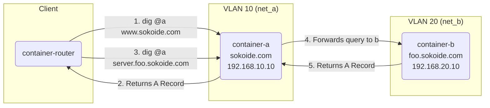

# Terraform Workshop: From Basics to Building a Practical DNS Server

This document is a workshop designed to teach the fundamentals of Terraform, an Infrastructure as Code (IaC) tool. You will ultimately build a practical DNS server environment using container technology (Podman/Docker).

## Part 1: Terraform Basics with the `local` Provider

In this part, you will learn the basic concepts and commands of Terraform by using the `local` provider to manipulate files on your local machine, without needing any cloud services.

### 1. Prerequisites

**Install Terraform**

Please follow the [official guide](https://learn.hashicorp.com/tutorials/terraform/install-cli) to install Terraform on your operating system.

**Create a Working Directory**

```bash
mkdir terraform-handson
cd terraform-handson
mkdir part1
cd part1
```

### 2. Your First Terraform File

1. Create a file named `main.tf` with the following content. This defines an infrastructure configuration that "creates a file named `hello.txt` with the content `hello-terraform`".

    ```terraform
    # main.tf
    resource "local_file" "hello" {
      content  = "hello-terraform"
      filename = "${path.module}/hello.txt"
    }
    ```

2. **Initialize (`init`)**: Terraform downloads the necessary providers (in this case, the `local` provider).

    ```bash
    terraform init
    ```

3. **Plan (`plan`)**: Review the changes that will be made.

    ```bash
    terraform plan
    ```

    You will see a `+ create` sign, indicating that the `local_file.hello` resource will be created.

4. **Apply (`apply`)**: Approve the plan and create the resources.

    ```bash
    terraform apply
    ```

    When prompted for confirmation, type `yes`. Verify that `hello.txt` has been created in the `part1` directory.

### 3. Variables and Outputs

To avoid hardcoding and make configurations more flexible, we use variables.

1. Create `variables.tf` to make the filename configurable.

    ```terraform
    # variables.tf
    variable "filename" {
      description = "The name of the file to create"
      type        = string
      default     = "hello_from_variable.txt"
    }
    ```

2. Modify `main.tf` to reference the variable.

    ```terraform
    # main.tf
    resource "local_file" "hello" {
      content  = "hello-terraform"
      filename = "${path.module}/${var.filename}" # Reference var.filename
    }
    ```

3. Create `outputs.tf` to display the name of the created file.

    ```terraform
    # outputs.tf
    output "created_filename" {
      value = local_file.hello.filename
    }
    ```

4. Run `terraform apply` again. Confirm that a file with the name specified in the `default` value is created and that the output (`Outputs`) is displayed after execution.

### 4. Multiple Resources (`for_each`)

`for_each` allows you to efficiently create multiple resources based on a list or map.

1. Modify `main.tf` as follows to create files for multiple usernames.

    ```terraform
    # main.tf
    locals {
      users = toset(["sato", "suzuki", "tanaka"])
    }

    resource "local_file" "user_files" {
      for_each = local.users

      content  = "hello, ${each.key}"
      filename = "${path.module}/${each.value}.txt"
    }
    ```

    * When you pass a set (a list of unique strings) to `for_each`, a resource is created for each element in the set.
    * `each.key` and `each.value` will contain the value of the element (in this case, the username).

2. Run `terraform plan` and `terraform apply` to confirm that three user files are created.

### 5. Destroying Resources

Delete all the resources you've created.

```bash
terraform destroy
```

After you type `yes`, all files managed by Terraform will be deleted.

---

## Part 2: Building a DNS Server with Terraform and Podman/Docker

In this part, you will apply what you've learned in Part 1 to build a DNS server environment with Podman/Docker containers, all managed by Terraform.

**Architecture Diagram:**

The overall architecture and name resolution flow of the DNS environment we will build in this part is as follows.



* `container-a`: Acts as the authoritative DNS server for `sokoide.com` and forwards queries for `foo.sokoide.com` to `container-b`.
* `container-b`: Acts as the authoritative DNS server for `foo.sokoide.com`.
* `container-router`: A client used to test name resolution with the `dig` command.

### 1. Preparation

**Create a Working Directory**

```bash
cd ../
mkdir part2
cd part2
```

**Create a CoreDNS Container Image**

1. Create a container image that includes CoreDNS (DNS server software). Create a `Dockerfile` with the following content.

    ```dockerfile
    # Dockerfile
    FROM alpine:3.17
    ARG COREDNS_VERSION=1.10.0
    RUN wget https://github.com/coredns/coredns/releases/download/v${COREDNS_VERSION}/coredns_${COREDNS_VERSION}_linux_amd64.tgz -O /tmp/coredns.tgz && \
        tar -xvzf /tmp/coredns.tgz -C /usr/local/bin/ && \
        rm /tmp/coredns.tgz
    CMD ["/usr/local/bin/coredns", "-conf", "/etc/coredns/Corefile"]
    ```

2. Build the image. (If you are using Podman, replace `docker` with `podman`).

    ```bash
    docker build -t coredns-handson .
    ```

### 2. Terraform Project Setup

1. Create `versions.tf` and specify the Docker provider. (This provider is compatible with Podman).

    ```terraform
    # versions.tf
    terraform {
      required_providers {
        docker = {
          source  = "kreuzwerker/docker"
          version = "3.0.2"
        }
      }
    }
    ```

2. Initialize the providers.

    ```bash
    terraform init
    ```

### 3. Building the DNS Environment with Terraform

1. In `main.tf`, define the networks, CoreDNS configuration files, zone files, and containers.

    ```terraform
    # main.tf

    # 1. Define Networks
    resource "docker_network" "net_a" {
      name = "net_a"
      ipam_config {
        subnet = "192.168.10.0/24"
      }
    }

    resource "docker_network" "net_b" {
      name = "net_b"
      ipam_config {
        subnet = "192.168.20.0/24"
      }
    }

    # 2. Generate CoreDNS Config and Zone Files
    # For Container A (sokoide.com)
    resource "local_file" "corefile_a" {
      content = <<-"EOF"
    . {
        log
        errors
        forward . 8.8.8.8
    }
    sokoide.com {
        file /etc/coredns/sokoide.com.db
    }
    foo.sokoide.com {
        forward . 192.168.20.10
    }
    EOF
      filename = "${path.module}/Corefile_a"
    }

    resource "local_file" "zonefile_a" {
      content = <<-"EOF"
    sokoide.com.   IN SOA sns.dns.icann.org. noc.dns.icann.org. 2015082541 7200 3600 1209600 3600
    www.sokoide.com. IN A 1.2.3.4
    EOF
      filename = "${path.module}/sokoide.com.db"
    }

    # For Container B (foo.sokoide.com)
    resource "local_file" "corefile_b" {
      content = <<-"EOF"
    . {
        log
        errors
        forward . 8.8.8.8
    }
    foo.sokoide.com {
        file /etc/coredns/foo.sokoide.com.db
    }
    EOF
      filename = "${path.module}/Corefile_b"
    }

    resource "local_file" "zonefile_b" {
      content = <<-"EOF"
    foo.sokoide.com.   IN SOA sns.dns.icann.org. noc.dns.icann.org. 2015082541 7200 3600 1209600 3600
    server.foo.sokoide.com. IN A 5.6.7.8
    EOF
      filename = "${path.module}/foo.sokoide.com.db"
    }

    # 3. Define Containers
    resource "docker_container" "container_a" {
      name  = "container-a"
      image = "coredns-handson"
      networks_advanced {
        name         = docker_network.net_a.name
        ipv4_address = "192.168.10.10"
      }
      # Connect to net_b to reach container-b for forwarding
      networks_advanced {
        name = docker_network.net_b.name
      }
      volumes {
        host_path      = local_file.corefile_a.filename
        container_path = "/etc/coredns/Corefile"
        read_only      = true
      }
      volumes {
        host_path      = local_file.zonefile_a.filename
        container_path = "/etc/coredns/sokoide.com.db"
        read_only      = true
      }
    }

    resource "docker_container" "container_b" {
      name  = "container-b"
      image = "coredns-handson"
      networks_advanced {
        name         = docker_network.net_b.name
        ipv4_address = "192.168.20.10"
      }
      volumes {
        host_path      = local_file.corefile_b.filename
        container_path = "/etc/coredns/Corefile"
        read_only      = true
      }
      volumes {
        host_path      = local_file.zonefile_b.filename
        container_path = "/etc/coredns/foo.sokoide.com.db"
        read_only      = true
      }
    }

    resource "docker_container" "router" {
      name  = "container-router"
      image = "alpine:3.17"
      command = ["sleep", "3600"]
      networks_advanced {
        name = docker_network.net_a.name
      }
      networks_advanced {
        name = docker_network.net_b.name
      }
    }
    ```

### 4. Execution and Verification

1. Run `terraform apply` to build all resources (networks, config files, containers). Type `yes` to confirm.

2. Verify that the containers are running.

    ```bash
    docker ps
    ```

3. Enter the `router` container, then install and run the `dig` command (a DNS query tool).

    ```bash
    docker exec -it container-router sh

    # Run the following inside the container
    apk update && apk add bind-tools
    ```

4. Test name resolution with `dig`.

    * Query `container-a` for `sokoide.com`:

    ```sh
    # dig @192.168.10.10 www.sokoide.com
    # ...
    # ;; ANSWER SECTION:
    # www.sokoide.com. 3600 IN A 1.2.3.4
    ```

    * Query `container-a` for `foo.sokoide.com` (will be forwarded to b):

    ```sh
    # dig @192.168.10.10 server.foo.sokoide.com
    # ...
    # ;; ANSWER SECTION:
    # server.foo.sokoide.com. 3600 IN A 5.6.7.8
    ```

    * Query `container-b` for `foo.sokoide.com`:

    ```sh
    # dig @192.168.20.10 server.foo.sokoide.com
    # ...
    # ;; ANSWER SECTION:
    # server.foo.sokoide.com. 3600 IN A 5.6.7.8
    ```

    Type `exit` to leave the container.

### 5. Clean Up

When you're finished with the workshop, use the `destroy` command to delete all the resources you created.

```bash
terraform destroy
```

You can also delete the locally created configuration files if they are no longer needed.

This concludes the workshop. Through this exercise, you've experienced everything from basic Terraform operations to managing a more practical, multi-component configuration.
